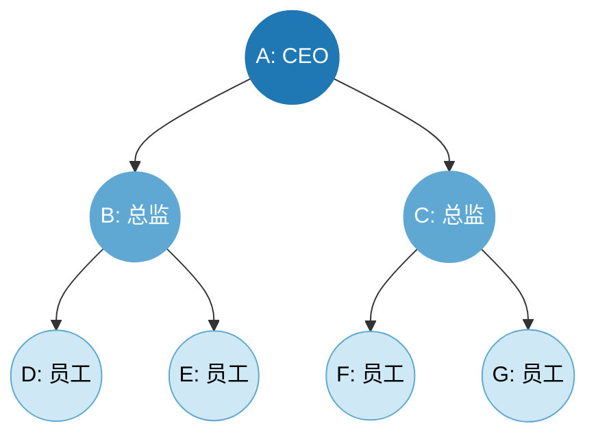
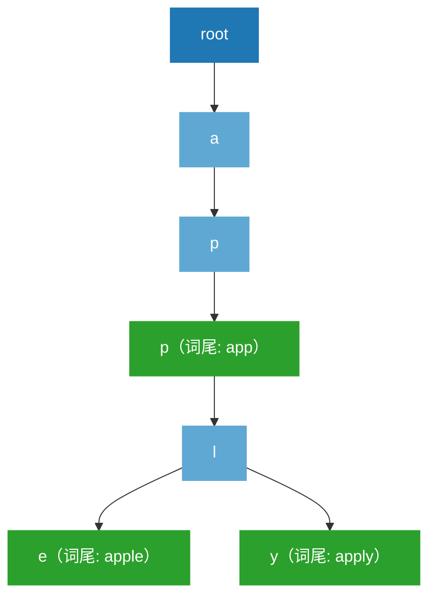
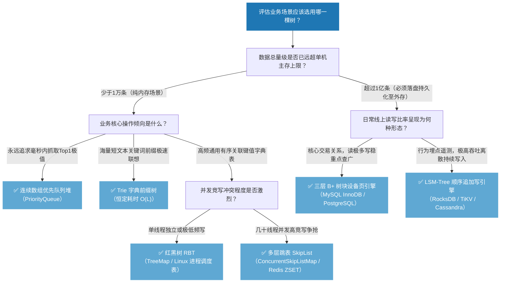

# 🌳 树形数据结构

> **写在最前面的承诺**
>
> 这不是一份"知识点罗列"的笔记，而是一部**工程侦探小说**。每一章都会先把你逼到上一代技术的墙角——让你亲眼看见它是怎么被现实的输入数据、CPU 硬件、磁盘物理特性一步步逼死的——然后再带你亲手发明下一代技术来破局。
>
> **全篇铁律（写作纪律自查）**：
> 1. **零默认前提**：Level 1 假设你完全不懂任何树的概念，所有术语从零建立。
> 2. **前置知识关卡**：从 Level 2 开始，每章开头都有「👶 前置知识关卡自检」，通不过就必须回头补课。
> 3. **因果闭环**：每一个数据结构出场前，必须先讲清楚"上一代死在哪儿"，出场后必须讲清楚"这一代的新账单是什么、逼出了下一代的哪个方向"。
> 4. **硬核验证三件套**：任何核心结论都配齐 **数字推导 + 生产级 Java 代码 + Step-by-Step 慢动作演示**，绝不空谈。
> 5. **禁止留白**：全文六个层级、二十余个数据结构，全部彻底写完，没有"后文详述""篇幅所限"这种糊弄话。

---

## 🗂️ 目录

> 以下目录为 GitHub 风格锚点链接，方便在 GitHub / VS Code 等支持 Markdown 大纲的工具中直接跳转。若发布到其他平台，锚点生成规则可能略有差异，建议发布前用目标平台预览一次确认。

- [📍 使用说明：六级工程师能力地图](#使用说明六级工程师能力地图)
- [🧭 一段话看懂全书主线：数据结构进化的因果链](#一段话看懂全书主线数据结构进化的因果链)
- [🟢 Level 1 · CS 大一新生篇：树的物理解构与认知起点（零前提大扫盲）](#level-1-cs-大一新生篇树的物理解构与认知起点零前提大扫盲)
  - [1.0 Why——为什么数组和链表统治不了整个世界？](#10-why为什么数组和链表统治不了整个世界)
  - [1.1 What——树的骨架长什么样？七大基础术语零死角图解](#11-what树的骨架长什么样七大基础术语零死角图解)
  - [1.2 What——深度（Depth）vs 高度（Height）终极辨析：一辈子不再搞混](#12-what深度depthvs-高度height终极辨析一辈子不再搞混)
  - [1.3 What——树的两种关键形态：满二叉树 vs 完全二叉树](#13-what树的两种关键形态满二叉树-vs-完全二叉树)
  - [1.4 How——新生必须练就的基本功一：四种遍历的递归实现](#14-how新生必须练就的基本功一四种遍历的递归实现)
  - [1.5 How——新生必须练就的基本功二：显式栈 / 队列非递归实现（Step-by-Step 慢动作演示）](#15-how新生必须练就的基本功二显式栈-队列非递归实现step-by-step-慢动作演示)
  - [🔴 Level 1 归纳与决胜口诀](#level-1-归纳与决胜口诀)
- [🟢 Level 2 · 初级研发工程师篇：在分叉处建立秩序（BST · 堆 · Trie）](#level-2-初级研发工程师篇在分叉处建立秩序bst-堆-trie)
  - [👶 前置知识关卡自检与预警](#前置知识关卡自检与预警)
  - [🔗 承上启下的物理契机](#承上启下的物理契机)
  - [2.1 二叉搜索树（BST）—— 解决"动态有序查找"的最直接方案](#21-二叉搜索树bst-解决动态有序查找的最直接方案)
  - [2.2 二叉堆（Heap）—— 解决"我只关心极值"的场景](#22-二叉堆heap-解决我只关心极值的场景)
  - [2.3 字典前缀树（Trie）—— 解决"海量字符串前缀匹配"的场景](#23-字典前缀树trie-解决海量字符串前缀匹配的场景)
  - [💣 Level 2 遗留的致命漏洞：一切矛盾的总爆发点](#level-2-遗留的致命漏洞一切矛盾的总爆发点)
  - [🔴 Level 2 归纳与决胜口诀](#level-2-归纳与决胜口诀)
- [🟢 Level 3 · 高级研发工程师篇：自适应平衡纠偏（AVL vs 红黑树）](#level-3-高级研发工程师篇自适应平衡纠偏avl-vs-红黑树)
  - [👶 前置知识关卡自检与预警](#前置知识关卡自检与预警-2)
  - [🔗 承上启下的物理契机](#承上启下的物理契机-2)
  - [3.1 AVL 树——最严苛的平衡纪律与它的沉重代价](#31-avl-树最严苛的平衡纪律与它的沉重代价)
  - [3.2 红黑树——工业界的折中艺术品](#32-红黑树工业界的折中艺术品)
  - [🔴 Level 3 归纳与决胜口诀](#level-3-归纳与决胜口诀)
- [🟢 Level 4 · 资深研发工程师篇：系统底层源码调参（HashMap · Linux 调度器 · 区间统计树）](#level-4-资深研发工程师篇系统底层源码调参hashmap-linux-调度器-区间统计树)
  - [👶 前置知识关卡自检与预警](#前置知识关卡自检与预警-3)
  - [🔗 承上启下的物理契机](#承上启下的物理契机-3)
  - [4.1 JDK 1.8 HashMap 树化机制：为什么冲突链表长度到 `8` 才转红黑树，降到 `6` 才退回？](#41-jdk-18-hashmap-树化机制为什么冲突链表长度到-8-才转红黑树降到-6-才退回)
  - [4.2 Linux 进程调度器：红黑树在操作系统内核中的实战（CFS 与 EEVDF）](#42-linux-进程调度器红黑树在操作系统内核中的实战cfs-与-eevdf)
  - [4.3 区间统计之王：树状数组（Fenwick Tree）与线段树（Segment Tree）](#43-区间统计之王树状数组fenwick-tree与线段树segment-tree)
  - [🔴 Level 4 归纳与决胜口诀](#level-4-归纳与决胜口诀)
- [🟢 Level 5 · 一线资深工程师篇：硬件物理层与高并发深水区（Cache Line · 无锁跳表）](#level-5-一线资深工程师篇硬件物理层与高并发深水区cache-line-无锁跳表)
  - [👶 前置知识关卡自检与预警](#前置知识关卡自检与预警-4)
  - [🔗 承上启下的物理契机](#承上启下的物理契机-4)
  - [5.1 反直觉硬件真相：指针追逐（Pointer Chasing）与 CPU Cache Line 失效](#51-反直觉硬件真相指针追逐pointer-chasing与-cpu-cache-line-失效)
  - [5.2 并发深水区：红黑树的排他大锁困境 vs 跳表的 CAS 无锁革命](#52-并发深水区红黑树的排他大锁困境-vs-跳表的-cas-无锁革命)
  - [🔴 Level 5 归纳与决胜口诀](#level-5-归纳与决胜口诀)
- [🟢 Level 6 · 资深一线架构师篇：海量外存存储引擎（B 树 → B+ 树 → LSM-Tree）](#level-6-资深一线架构师篇海量外存存储引擎b-树-b-树-lsm-tree)
  - [👶 前置知识关卡自检与预警](#前置知识关卡自检与预警-5)
  - [🔗 承上启下的物理契机](#承上启下的物理契机-5)
  - [6.1 操作系统的"数据页"：多路树诞生的物理地基](#61-操作系统的数据页多路树诞生的物理地基)
  - [6.2 B 树（B-Tree）：第一代多路平衡树与它未能根治的痛点](#62-b-树b-tree第一代多路平衡树与它未能根治的痛点)
  - [6.3 B+ 树：MySQL InnoDB 的核心引擎，两把手术刀根治 B 树顽疾](#63-b-树mysql-innodb-的核心引擎两把手术刀根治-b-树顽疾)
  - [6.4 InnoDB 16KB 数据页微观解剖：页目录、二分查找与页分裂](#64-innodb-16kb-数据页微观解剖页目录二分查找与页分裂)
  - [6.5 现代高并发写入时代的颠覆者：LSM-Tree](#65-现代高并发写入时代的颠覆者lsm-tree)
  - [🏆 终极选型决策一图流](#终极选型决策一图流)
  - [🔴 Level 6 归纳与决胜口诀](#level-6-归纳与决胜口诀)
- [✍️ 写在最后](#写在最后)
- [🏆 全书终极速查总表](#全书终极速查总表)

---

## 📍 使用说明：六级工程师能力地图

在正式出发前，请先找到自己现在所处的位置。这张地图，就是本书的骨架，也是你从新生走向架构师的完整路线。

| 层级 | 你现在的状态 | 本层要打穿的认知墙 | 通关后你能做到什么 |
| :--- | :--- | :--- | :--- |
| **L1 · CS 大一新生** | 学过变量、循环，但一看到"树"和"递归"就头晕 | 建立"立体分层空间"直觉，取代"线性表"的单向思维 | 手绘任意二叉树的四种遍历轨迹，永远不再混淆深度与高度 |
| **L2 · 初级研发工程师** | 会写代码，但刷题遇到树就懵，不知道该用哪种树 | 理解"在分叉处建立秩序"能把 $O(N)$ 砍成 $O(\log N)$，同时看清这秩序有多脆弱 | 手写 BST 增删查、数组堆、Trie 树的生产级代码 |
| **L3 · 高级研发工程师** | 业务代码写得溜，但被问到"为什么用红黑树不用 AVL"时说不出所以然 | 理解"绝对平衡"和"够用就好的平衡"之间惊人的工程智慧差距 | 手推红黑树"最长路径不超最短路径 2 倍"的完整证明，手写四种旋转 |
| **L4 · 资深研发工程师** | 想读懂 JDK、Linux、数据库的源码，而不是被动接受"这是规定" | 理解源码里每一个"魔数"（8、6、16KB……）背后的物理与概率账本 | 对照源码解释 HashMap 树化阈值、Linux 调度器（CFS/EEVDF）、区间统计树的设计动因 |
| **L5 · 一线资深工程师** | 疑惑"为什么理论最优的算法，实测反而更慢" | 理解 Big-O 之外还有一本隐藏账本：CPU 缓存行、指针追逐、并发锁粒度 | 诊断"红黑树跑不过数组""并发写入吞吐归零"这类反直觉线上问题 |
| **L6 · 资深一线架构师** | 面对千亿数据、数十万 QPS，选型时众说纷纭、拿不定主意 | 理解"内存无敌的树，放到磁盘上为什么会全军覆没"的物理鸿沟 | 在技术评审会上用精确数字压服全场，敲定 B+树还是 LSM-Tree |

> 💡 **建议**：即使你自认为基础扎实，也请务必完整读完 Level 1，因为后续所有章节的比喻体系（大厂组织架构、图书馆分类）都建立在这一章之上。

---

## 🧭 一段话看懂全书主线：数据结构进化的因果链

在正式展开六个层级之前，先用一条最精简的因果链，把全书的主线串起来（每一步的完整论证过程，会在对应章节逐一展开）：

> 数组、链表、哈希表各有短板 → 立体二叉树建立分层结构，但节点摆放没有秩序 → BST 靠"左小右大"建立秩序，却在顺序输入下退化成链表 → AVL 树靠严格平衡纠偏，却在删除时触发代价高昂的多级连环旋转 → 红黑树用"颜色标记 + 隐式2-3-4树"换取宽松却足够的平衡，把旋转次数锁死在 3 次以内 → JDK/Linux 等系统源码在红黑树基础上做精细的阈值调参（内存账、概率账） → Big-O 分析之外，CPU Cache Line 与指针追逐现象浮现，红黑树在遍历性能与高并发写入锁粒度上暴露短板 → 跳表凭借局部化修改与 CAS 无锁机制反超 → 数据落盘后，内存与磁盘之间十万倍的延迟鸿沟迫使二叉树压扁为多路 B 树 → B+ 树净化中间节点、叶子挂双向链表，3 层支撑千万级数据 → 高吞吐离散写入催生 LSM-Tree，用顺序追加写代替原地覆盖写，以读放大换取极致写入吞吐。

**没有任何一种树是"绝对最优"的，只有"最契合当前数据规模、读写负载特征与硬件物理约束"的选择**——这条主线会在接下来的六个层级里，被逐一拆解成完整的数字推导、生产级代码与逐步演示。

---

## 🟢 Level 1 · CS 大一新生篇：树的物理解构与认知起点（零前提大扫盲）
### 1.0 Why——为什么数组和链表统治不了整个世界？
在认识"树"这个概念之前，你手里其实只有两件趁手的基础武器，我们先把它们的账算清楚，因为**树的诞生，就是为了补上这两件武器共同的短板**。

设想你要管理一个存储 100 万个用户记录的系统，你面前摆着三种基础组织方式：

* **武器一：数组（连续内存）**
  * ✅ 优点：按下标查找是 $O(1)$——你知道地址就能直接跳过去拿。
  * ❌ 致命伤：如果要在数组中间插入一条新纪录，后面所有的记录都要被迫"挪位"，最坏情况下要搬动 100 万次，时间复杂度 $O(N)$。

* **武器二：链表（分散指针）**
  * ✅ 优点：插入和删除极快，只需要改一两个指针，$O(1)$。
  * ❌ 致命伤：链表没有下标的概念，想找到第 50 万个节点，只能从头指针开始一个一个往后问，$O(N)$。

* **武器三（进阶但依然有硬伤）：哈希表**
  * ✅ 优点：通过哈希函数直接计算出存放位置，等值查找、插入都是 $O(1)$。
  * ❌ 致命伤：**哈希表是彻底无序的**！哈希函数把 Key 打散存放，你根本没法问它"给我所有学号在 10000～20000 之间的学生"，因为这些学号在哈希表里可能被分散存放在完全不相邻的储物格中，压根没有"相邻"和"顺序"这两个概念。而且一旦触发扩容（Rehash），所有数据要重新计算位置搬家，会带来剧烈的延迟抖动。

#### 🏛️ 生活类比：一座百万藏书的图书馆
把这三种组织方式想象成管理一座拥有百万藏书的图书馆：

* **链表式管理**：所有书随手堆成一条队列。找一本书，最坏要从第一本翻到第一百万本。
* **哈希表式管理**：把每本书的书名做哈希运算，扔进编号对应的储物柜。找一本具体的书，瞬间命中；但你若想要"把所有 2010～2015 年出版的计算机书整片取出"，哈希表**直接瘫痪**——因为书是按名字的哈希值打散放的，跟出版年份毫无关系，你只能把上百万个储物柜全部翻一遍。
* **树形管理**：按照"总馆分类目录 → 具体分区书架 → 单本书"一层层组织。既可以靠目录做"折半式"快速定位，又能一次性把某个年份范围内的书整片取出。

**这就是树存在的终极意义：它是唯一能同时兼顾"折半式快速查找"、"灵活插入删除"、并且"天然保持全局有序、支持范围查询"的立体分层结构。** 这是数组、链表、哈希表三者都无法同时满足的组合技。

---

### 1.1 What——树的骨架长什么样？七大基础术语零死角图解
下面是一棵典型的、7 个节点的二叉树（每个节点最多分出 2 条岔路）。我们把它想象成一家科技公司的组织架构图——根在最上面（就像倒挂的自然界之树），叶子在最下面：

```text
=================== 树的基本术语物理映射图 ===================

                     (A: CEO)                      <--- 【根 Root】：全树唯一的顶层起点，没有任何"上级"
                    /        \
                  边(Edge)   边(Edge)               <--- 【边 Edge】：连接两个节点的上下级汇报线
                  /              \
            (B: 部门总监)      (C: 部门总监)          <--- 【内部节点 Node】：既有上级又有下级
            /         \         /        \
       (D: 一线员工) (E: 一线员工) (F: 一线员工) (G: 一线员工)  <--- 【叶子 Leaf】：没有任何下属的末端节点
```

现在，逐一把七个核心术语钉死在这张图上：

1. **节点（Node）**：树中的每一个圆圈（A、B、C、D……）都叫节点，它负责存放具体数据（比如员工姓名、用户 ID、金额）。
2. **根节点（Root）**：全树最顶端、唯一没有"父节点"的起点（图中的 `A: CEO`）。一棵树有且只有一个根。
3. **边（Edge）**：连接两个节点的连线，代表"上下级汇报关系"。**一个有 $N$ 个节点的树，必定恰好有 $N-1$ 条边**（因为除了根节点，每一个节点都有且仅有一条边连向它的父节点）。
4. **叶子节点（Leaf）**：树的末端，没有连接任何孩子的节点（图中的 D、E、F、G）。就像没有下属的一线员工。
5. **父节点 / 子节点（Parent / Child）**：直接相连的上下两层节点，上面的叫父节点，下面的叫子节点。比如 `A` 是 `B` 和 `C` 的父节点，`B`、`C` 是 `A` 的子节点。
6. **度（Degree）**：**一个节点直接拥有的孩子数量**。
   * `A` 连接了 `B` 和 `C`，所以 `A` 的度是 `2`。
   * `D` 没有任何孩子，所以 `D` 的度是 `0`（所有叶子节点的度必为 0）。
   * **二叉树（Binary Tree）的严格定义就是：树中任何一个节点的度绝不能超过 `2`！** 这也是为什么二叉树的节点被称为拥有"左孩子"和"右孩子"——因为最多只有两个岔路。
7. **子树（Subtree）**：任意一个节点和它所有的后代节点，可以看作是一棵独立的、更小的树。比如 `B、D、E` 三个节点合起来，就是 `A` 的"左子树"。

> 💡 **给新生的绝杀口诀**：**"根在顶，叶在底，连线叫边节点立；度数就是孩子数，子树套着子树立！"**

---

### 1.2 What——深度（Depth）vs 高度（Height）终极辨析：一辈子不再搞混
**这是全行业超过一半初学者、甚至部分工作多年的工程师都会混淆的概念。** 我们不去死记教材定义，而是用你未来天天要打交道的"大厂职级晋升体系"，把这两个概念砸进你的直觉里。

> ### 🏢 生活/工程实例：科技大厂的组织层级
>
> 想象一家庞大的互联网公司：
>
> * **深度（Depth）= "自顶向下看，你从 CEO 那里往下数，走了几步"**
>   * **参照点**：树的最顶端——根节点（CEO）。
>   * CEO（根节点）自己的深度是 `0`；直接向 CEO 汇报的部门 VP，深度是 `1`；向 VP 汇报的一线员工，深度是 `2`。
>   * **一句话记忆：深度衡量的是"从根节点走到你，历史上已经消耗掉的路程"，参照点永远是最顶层的根。**
>
> * **高度（Height）= "自底向上看，你往下面探底，你的团队最深能下探到第几层"**
>   * **参照点**：树的最底端——叶子节点（实习生）。
>   * 手底下没有任何下属的基层员工（叶子节点），高度是 `0`；带着实习生的组长，高度是 `1`；管理着多个组长的总监，高度是 `2`。
>   * **一句话记忆：高度衡量的是"从你这个节点出发，向下走到最远叶子节点，还剩下几步潜在的落差"，参照点永远是最底层的叶子。**

##### 📐 用一棵具体的树把数字彻底钉死
下面这棵 7 节点的满二叉树将贯穿本章所有的代码与推演：



逐个节点计算深度和高度：

| 节点标识 | 深度（从顶层 A 网下走了几步） | 高度（往下探底距离最深叶子几步） | 节点身份 |
| :--- | :--- | :--- | :--- |
| **A** | `0` | `2` | 根节点 (Root) |
| **B / C** | `1` | `1` | 中间分支节点 |
| **D / E / F / G** | `2` | `0` | 末端叶子节点 (Leaf) |

> ⚠️ **面试高频避坑点**：对整棵树而言，**"树的最大深度"恒等于"树的最大高度"**（本例都是 2，因为都是"根到最远叶子"的距离）。但对于树内部**任意一个具体节点**而言，它的深度和高度的测量方向截然相反、数值通常也不同！比如根节点 `A`，深度是 `0`（它自己就是参照点），但高度却是 `2`（它离最远的叶子有 2 步）。**混淆点全部出在"对整体成立的规律，不能随便套用到局部节点上"这一步。**

##### 📐 硬核数字推导：给定高度，节点数量的物理上下界
在上面这棵树中，高度 $h=2$，节点数恰好为 7。这不是巧合，而是精确的数学公理：

* **满二叉树（每一层都排满）在高度为 $h$ 时，最多能容纳 $2^{h+1}-1$ 个节点。**
  代入 $h=2$：$2^{2+1}-1 = 2^3-1 = 7$，与示例完全吻合。
* **退化为单链的树在高度为 $h$ 时，最少只需要 $h+1$ 个节点。**
  代入 $h=2$：最少 3 个节点（像 `A -> B -> D` 这样单链直下）。

这组上下界公式，会在 Level 3 证明红黑树高度上界、Level 6 推算 B+树容量时被反复使用，请牢记。

---

### 1.3 What——树的两种关键形态：满二叉树 vs 完全二叉树
新手看教程时最容易混淆这两个字面相近的词。它们的物理区别，直接决定了数据在内存里能不能被无缝塞进一维数组（这一点会在 Level 2 的"堆"里发挥决定性作用）。

```text
[ 满二叉树 Full/Perfect Binary Tree ]        [ 完全二叉树 Complete Binary Tree ]
  除叶子外，每个节点都必须有 2 个孩子             每一层全满，最后一层节点必须严格靠左排布！
                (A)                                       (A)
              /     \                                   /     \
            (B)     (C)                               (B)     (C)
           /   \   /   \                             /   \   /
         (D)   (E)(F)  (G)                         (D)   (E)(F)  <-- G 位置可以空，但 F 必须先靠左占满！
```

* **满二叉树（Full / Perfect Binary Tree）**：呈现完美的金字塔三角形。如果高度为 $h$，节点数恰好达到理论上限 $2^{h+1}-1$（就是我们上面那张 7 节点组织架构图）。
* **完全二叉树（Complete Binary Tree）——工程界最重要的树形态！** 它的规则是：除最后一层外必须全满，最后一层的节点必须**严格从左往右紧凑排列，中间绝对不能出现任何空洞**。
  * **为什么完全二叉树如此重要？** 因为它"没有内存空洞"，所以**它能够无缝地被塞进一个一维连续数组中，完全不需要任何指针**！根节点放在数组下标 `0`，任意节点 `i` 的左右孩子和父节点下标都可以用纯算术公式直接算出来。这个性质会在 Level 2 讲解"二叉堆"时，转化为惊人的工程收益（省掉所有指针内存，同时带来 100% 的 CPU 缓存命中率）。

---

### 1.4 How——新生必须练就的基本功一：四种遍历的递归实现
想要把一棵树里所有的数据一个一个取出来，有四条经典的行走路线。我们继续用上面 7 节点大厂组织树来做全程演示：

* **前序遍历（Pre-Order：根 → 左 → 右）**：进门瞬间做记录，好比"新人刚到岗就先自我介绍"。
  👉 本例序列：`A -> B -> D -> E -> C -> F -> G`
* **中序遍历（In-Order：左 → 根 → 右）**：把左边的房间都看完了，回来的路上做记录（在 BST 里，这个序列必然是严格升序！我们在 Level 2 会验证这一点）。
  👉 本例序列：`D -> B -> E -> A -> F -> C -> G`
* **后序遍历（Post-Order：左 → 右 → 根）**：左右两个房间都看完了，退门前才做记录（适合"先统计完子文件夹大小，再汇总到父文件夹"的场景）。
  👉 本例序列：`D -> E -> B -> F -> G -> C -> A`
* **层序遍历（Level-Order / BFS：按楼层从上到下、从左到右）**：借助一个队列，一层一层地扫描。
  👉 本例序列：`A -> B -> C -> D -> E -> F -> G`

**生产级 Java 代码（节点定义 + 建树 + 三种递归遍历）：**

```java
// 文件: TreeNode.java（包内可见类，与 TreeBuilder 同包，实际工程中通常各占一个独立文件）
package com.zhiya.tree.level1;

import java.util.ArrayList;
import java.util.List;

/**
 * 二叉树节点定义。为演示方便，val 类型为 char，实际生产中通常使用泛型。
 */
class TreeNode {
    char val;
    TreeNode left, right;
    TreeNode(char val) { this.val = val; }
}

// 文件: TreeBuilder.java
/**
 * 建立本章贯穿始终的 7 节点示例树（大厂组织架构图）。
 */
public class TreeBuilder {
    public static TreeNode buildSampleOrgTree() {
        TreeNode a = new TreeNode('A');
        TreeNode b = new TreeNode('B');
        TreeNode c = new TreeNode('C');
        TreeNode d = new TreeNode('D');
        TreeNode e = new TreeNode('E');
        TreeNode f = new TreeNode('F');
        TreeNode g = new TreeNode('G');
        a.left = b; a.right = c;
        b.left = d; b.right = e;
        c.left = f; c.right = g;
        return a;
    }
}

// 文件: RecursiveTraversal.java（与上面两个类分属三个文件，因为 Java 规定一个文件只能有一个 public 顶级类）
/**
 * 三种深度优先递归遍历的生产级实现。
 */
public class RecursiveTraversal {

    /** 前序遍历：根 -> 左 -> 右 */
    static void preOrder(TreeNode node, List<Character> out) {
        if (node == null) return;      // 递归终止条件：空节点直接返回
        out.add(node.val);             // ① 先访问根
        preOrder(node.left, out);      // ② 再递归访问左子树
        preOrder(node.right, out);     // ③ 最后递归访问右子树
    }

    /** 中序遍历：左 -> 根 -> 右 */
    static void inOrder(TreeNode node, List<Character> out) {
        if (node == null) return;
        inOrder(node.left, out);       // ① 先递归访问左子树
        out.add(node.val);             // ② 再访问根
        inOrder(node.right, out);      // ③ 最后递归访问右子树
    }

    /** 后序遍历：左 -> 右 -> 根 */
    static void postOrder(TreeNode node, List<Character> out) {
        if (node == null) return;
        postOrder(node.left, out);     // ① 先递归访问左子树
        postOrder(node.right, out);    // ② 再递归访问右子树
        out.add(node.val);             // ③ 最后访问根
    }

    public static void main(String[] args) {
        TreeNode root = TreeBuilder.buildSampleOrgTree();
        List<Character> pre = new ArrayList<>();
        List<Character> in = new ArrayList<>();
        List<Character> post = new ArrayList<>();
        preOrder(root, pre);
        inOrder(root, in);
        postOrder(root, post);
        System.out.println("前序: " + pre);   // [A, B, D, E, C, F, G]
        System.out.println("中序: " + in);    // [D, B, E, A, F, C, G]
        System.out.println("后序: " + post);  // [D, E, B, F, G, C, A]
    }
}
```

---

### 1.5 How——新生必须练就的基本功二：显式栈 / 队列非递归实现（Step-by-Step 慢动作演示）
面试官经常会追问："如果不让你用递归，树深到可能栈溢出（`StackOverflowError`），你该怎么办？" 这是新手最容易"知道结论、写不出代码"的地方。递归的本质，是系统在偷偷帮你维护一个"调用栈"——现在我们要亲手把这个隐藏的栈，变成一个看得见的 `Deque`。

#### 1.5.1 非递归前序遍历：显式栈完整代码 + 逐帧追踪
```java
// 文件: IterativeTraversal.java
package com.zhiya.tree.level1;

import java.util.ArrayDeque;
import java.util.ArrayList;
import java.util.Deque;
import java.util.List;

public class IterativeTraversal {

    /**
     * 非递归前序遍历（根 -> 左 -> 右）。
     * 核心技巧：栈是"后进先出"（LIFO）。想让左孩子先于右孩子被处理，
     * 就必须"先压入右孩子，再压入左孩子"——这样左孩子才会站在栈顶，被优先弹出。
     */
    public static List<Character> preOrderIterative(TreeNode root) {
        List<Character> res = new ArrayList<>();
        if (root == null) return res;
        Deque<TreeNode> stack = new ArrayDeque<>();
        stack.push(root);

        while (!stack.isEmpty()) {
            TreeNode curr = stack.pop();   // 弹出栈顶节点并访问
            res.add(curr.val);
            // ⚠️ 关键细节：必须先压右孩子，后压左孩子！
            if (curr.right != null) stack.push(curr.right);
            if (curr.left != null) stack.push(curr.left);
        }
        return res;
    }

    /**
     * 非递归中序遍历（左 -> 根 -> 右）。
     * 思路与前序完全不同：不是"先压右再压左"，而是"一路向左压到底，
     * 弹出后再转向右子树，重复这个过程"。
     */
    public static List<Character> inOrderIterative(TreeNode root) {
        List<Character> res = new ArrayList<>();
        Deque<TreeNode> stack = new ArrayDeque<>();
        TreeNode cur = root;
        while (cur != null || !stack.isEmpty()) {
            while (cur != null) {          // 一路向左，把沿途节点全部压栈
                stack.push(cur);
                cur = cur.left;
            }
            cur = stack.pop();             // 左边到底了，弹出并访问
            res.add(cur.val);
            cur = cur.right;               // 转向右子树，重复整个过程
        }
        return res;
    }

    /**
     * 非递归后序遍历（左 -> 右 -> 根）。
     * 思路：使用栈来模拟递归过程，通过一个prev指针记录上一个访问的节点，以此判断当前节点的右子树是否处理完毕。
     */
    private static List<Character> postOrder(TreeNode root) {
        List<Character> res = new ArrayList<>();
        if (root == null) return res;
        Deque<TreeNode> stack = new ArrayDeque<>();
        TreeNode prev = null;  // 上一个访问的节点
        TreeNode curr = root;
        while (curr != null || !stack.isEmpty()) {
            while (curr != null) {          // 一路向左，把沿途节点全部压栈
                stack.push(curr);
                curr = curr.left;
            }
            curr = stack.peek();            // 左边到底了，查看栈顶节点
            if (curr.right == null || curr.right == prev) { // 右子树为空或已访问过
                res.add(curr.val);          // 访问当前节点
                stack.pop();
                prev = curr;                // 更新上一个访问的节点
                curr = null;                // 避免再次进入左子树
            } else {
                curr = curr.right;          // 转向右子树，重复整个过程
            }
        }
        return res;
    }

    /**
     * 非递归后序遍历（左 -> 右 -> 根）。
     * 思路：使用两个栈来实现。第一个栈用于遍历节点，第二个栈用于存储后序遍历的节点。
     */
    private static List<Character> postOrderTwoStacks(TreeNode root) {
        List<Character> res = new ArrayList<>();
        if (root == null) return res;
        Deque<TreeNode> s1 = new ArrayDeque<>(), s2 = new ArrayDeque<>();
        s1.push(root);
        while (!s1.isEmpty()) {
            TreeNode tn = s1.pop();
            s2.push(tn);
            if (tn.left != null) s1.push(tn.left);
            if (tn.right != null) s1.push(tn.right);
        }
        while (!s2.isEmpty()) {
            res.add(s2.pop().val);
        }
        return res;
    }

    /**
     * 非递归层序遍历（BFS）：使用队列而不是栈。
     * 队列（先进先出）天然适合"一层处理完，再处理下一层"的广度优先思想；
     * 栈（后进先出）天然适合"一路走到底再折返"的深度优先思想——
     * 数据结构的选择本身，就是遍历方式差异的根本原因。这个直觉会在 Level 4
     * 讲 Linux 调度器时被再次验证。
     */
    public static List<Character> levelOrder(TreeNode root) {
        List<Character> res = new ArrayList<>();
        if (root == null) return res;
        java.util.Queue<TreeNode> queue = new java.util.ArrayDeque<>();
        queue.offer(root);
        while (!queue.isEmpty()) {
            TreeNode curr = queue.poll();
            res.add(curr.val);
            if (curr.left != null) queue.offer(curr.left);
            if (curr.right != null) queue.offer(curr.right);
        }
        return res;
    }
}
```

##### ⚙️ Step-by-Step 慢动作：针对 7 节点大厂组织树，逐条指令追踪显式栈
栈顶画在最左边。这是本文档"硬核验证三件套"中"逐步操作过程演示"的第一次亮相，请务必逐行对照理解：

| 步骤 | 当前弹出节点 | 输出序列累计 | 弹出后压入的新节点（先右后左） | 栈中当前状态（栈顶在左） |
| :--- | :--- | :--- | :--- | :--- |
| **0（初始）** | — | `[]` | — | `[A]` |
| **1** | **A** | `[A]` | 先压 `C`，再压 `B` | `[B, C]` |
| **2** | **B** | `[A, B]` | 先压 `E`，再压 `D` | `[D, E, C]` |
| **3** | **D** | `[A, B, D]` | D 是叶子，无子节点可压 | `[E, C]` |
| **4** | **E** | `[A, B, D, E]` | E 是叶子，无子节点可压 | `[C]` |
| **5** | **C** | `[A, B, D, E, C]` | 先压 `G`，再压 `F` | `[F, G]` |
| **6** | **F** | `[A, B, D, E, C, F]` | F 是叶子，无子节点可压 | `[G]` |
| **7** | **G** | `[A, B, D, E, C, F, G]` | G 是叶子，无子节点可压 | `[]`（循环终止） |

最终产出序列 `A, B, D, E, C, F, G`，与递归版本的结果**逐字符完全吻合**——这正是"完整操作过程演示"的意义：不是让你相信结论，而是亲眼看着栈是怎么一步步把递归的隐式调用栈，变成显式可控的数据结构的。

---

### 🔴 Level 1 归纳与决胜口诀
#### 📊 横向对比与选型对决矩阵表
| 物理结构 | 点查匹配 | 插入与删除 | 是否支持区间范围筛选 |
| :--- | :--- | :--- | :--- |
| **一维连续数组** | $O(1)$（基于下标） | 极慢 $O(N)$（需搬移） | 支持，但中间增删极大拖累性能 |
| **指针链表** | 极慢 $O(N)$（需从头遍历） | 极快 $O(1)$ | 支持，但需从头盲查起点 |
| **哈希散列表** | 秒级 $O(1)$ | 秒级 $O(1)$ | **坚决不支持**（数据打散无序） |
| **立体树形拓扑** | 折半 $O(\log N)$ | 折半 $O(\log N)$ | **完美支持天然有序检索** |

> 🌊 **决胜口诀**：**"深度往下数，高度往下探；整树深高恒相等，局部层级反向看。前中后序记根点，非递归遍历要用栈，前序先压右来后压左！"**

---

## 🟢 Level 2 · 初级研发工程师篇：在分叉处建立秩序（BST · 堆 · Trie）
### 👶 前置知识关卡自检与预警
在继续往下读之前，请诚实回答以下三个问题：

1. 你能不用看图，直接口算出一个节点的"深度"和"高度"分别是从哪个方向数的吗？
2. 你能手写出前序遍历的非递归版本，并解释"为什么必须先压右孩子再压左孩子"吗？
3. 你知道"完全二叉树"和"满二叉树"的区别，以及为什么完全二叉树能被塞进数组吗？

**如果以上任何一条回答不出来，请立刻回看 Level 1 的 1.2 节和 1.5 节。** 因为本章要讲的三种树（BST、堆、Trie），全部建立在"节点、深度、遍历"这套基础语言之上——如果这套语言没学会，你会发现自己"看得懂每一行代码，但完全不知道它在解决什么问题"。

### 🔗 承上启下的物理契机
Level 1 教会了你怎么"走遍"一棵树，但留下了一个致命的空白：**Level 1 中的树，节点里的数字是随便乱放的！** 如果我告诉你"树里某处藏着一个值为 500 的节点"，你除了把整棵树从头到尾扫一遍（$O(N)$），别无他法——这和直接扫描一个无序数组毫无区别，树的"折半查找潜力"完全没有被利用起来。

**要把折半查找的威力真正兑现，我们必须在每一次分叉的地方，人为规定一套摆放秩序。** 这就是本章三种经典树共同的出发点，但它们分别针对三种不同的业务诉求给出了三套不同的秩序规则。

---

### 2.1 二叉搜索树（BST）—— 解决"动态有序查找"的最直接方案
#### Why——为什么需要它
**业务场景**：你要维护一个可以动态插入、删除、且随时能做"折半查找"的有序数据集合（比如一个内存里的用户 ID 索引）。数组能折半查找，但插入删除是 $O(N)$；链表插入删除是 $O(1)$，但没法折半查找。**我们想要一个两者都要的结构。**

#### What——微观结构解密
BST 的核心规则极其简单：**针对树中任意一个节点，它左边子树的所有节点值都必须比它小，右边子树的所有节点值都必须比它大。**

```text
             (10)
            /    \
         (5)      (15)
        /  \      /   \
      (2)  (7)  (12)  (20)
```

任取一个节点验证：`15` 的左子树 `{12}` 都比 15 小，右子树 `{20}` 都比 15 大——秩序成立。这个规则递归地施加在每一个节点上，因此**中序遍历（左→根→右）这样一棵 BST，必然得到一个严格升序的序列**。这不是巧合，而是规则的直接推论：中序遍历永远先输出比当前节点小的所有值，再输出当前节点，再输出比它大的所有值。

#### How——生产级 Java 实现与 Step-by-Step 删除推演
BST 的插入和查找很直观，真正考验功力的是**删除一个拥有左右两个孩子的节点**。我们用具体案例做 Step-by-Step 推演：假设要从下面的树中删除根节点 `10`：

```text
       (10) <--- 要删掉这个既有左孩子又有右孩子的节点
      /    \
   (5)     (15)
           /  \
        (12)  (20)
```

* **Step 1（寻找合法接班人）**：谁能顶替 `10` 的位置，同时不破坏"左小右大"的秩序？答案只有一个——**右子树中最小的那个节点**（也就是从 `15` 出发，一路向左走到底找到的 `12`）。因为 `12` 比 `10` 的整个右子树里所有其他节点都小，又比 `10` 的整个左子树都大，它是唯一合法的替补。
* **Step 2（偷梁换柱）**：把 `12` 的值直接覆盖到 `10` 所在的节点上（不改变树的其他拓扑结构）。
* **Step 3（清理原位置）**：跑到右子树中，把原来位置上的 `12` 删掉。因为 `12` 是"一路向左走到底"找到的，它必然没有左孩子，所以删除它只属于"叶子节点"或"只有右孩子的单孩节点"这两种最简单的情况。

```java
// 文件: BSTNode.java（包内可见类，与 BST 同包但分属两个文件）
package com.zhiya.tree.level2;

/**
 * 二叉搜索树（BST）生产级实现：插入、查找、删除三大核心操作全覆盖。
 */
class BSTNode {
    int val;
    BSTNode left, right;
    BSTNode(int val) { this.val = val; }
}

// 文件: BST.java
public class BST {
    BSTNode root;

    /** 插入：递归地找到应该挂载的空位 */
    public void insert(int val) {
        root = insertHelper(root, val);
    }
    private BSTNode insertHelper(BSTNode node, int val) {
        if (node == null) return new BSTNode(val);
        if (val < node.val) node.left = insertHelper(node.left, val);
        else if (val > node.val) node.right = insertHelper(node.right, val);
        // 相等则视为已存在，不重复插入
        return node;
    }

    /** 查找：利用"左小右大"秩序做折半式路径选择 */
    public boolean search(int val) {
        BSTNode cur = root;
        while (cur != null) {
            if (val == cur.val) return true;
            cur = (val < cur.val) ? cur.left : cur.right;
        }
        return false;
    }

    /** 删除：分三种情况处理，核心难点是双孩节点的情况 */
    public void delete(int val) {
        root = deleteHelper(root, val);
    }
    private BSTNode deleteHelper(BSTNode node, int val) {
        if (node == null) return null;
        if (val < node.val) {
            node.left = deleteHelper(node.left, val);
        } else if (val > node.val) {
            node.right = deleteHelper(node.right, val);
        } else {
            // 找到了目标节点，开始分情境处理
            if (node.left == null) return node.right;  // 情境1：无左孩子，右分支直接提领上位
            if (node.right == null) return node.left;  // 情境2：无右孩子，左分支直接提领上位
            // 情境3：左右双孩齐全！寻找右子树最小值（中序后继）顶替
            BSTNode successor = findMin(node.right);
            node.val = successor.val;                              // Step 2: 偷梁换柱，盗用后继值
            node.right = deleteHelper(node.right, successor.val);  // Step 3: 去右子树抹除原后继节点
        }
        return node;
    }

    private BSTNode findMin(BSTNode node) {
        while (node.left != null) node = node.left;
        return node;
    }
}
```

#### 💣 硬核数字推导：BST 的致命死穴——顺序输入下的链表化崩溃
BST 的效率完全建立在"树是矮胖的"这个假设上。但这个假设极其脆弱：

如果业务插入的数据是自然递增序列（比如自增主键 `1, 2, 3, 4, 5, ...`）：
* 每一个新元素都比当前所有节点大，于是永远只会往右指针挂。
* **BST 瞬间退化为一条向右倾斜的单向斜链表！**

设 $N=1000$：
* **理想平衡状态**：树高约为 $\log_2(1000) \approx 10$ 层，查询一个节点最坏只需 **10 次比对**。
* **顺序插入退化状态**：树高变为 $999$ 层（近乎一条链），查询一个节点最坏需要 **999 次比对**。

$$\frac{999}{10} \approx 100 \text{ 倍性能差距！}$$

这就是为什么工业级系统**绝不敢直接拿裸 BST 去支撑数据库主键索引**——因为自增主键恰恰是最常见的业务模式，而它正好是 BST 的天敌。**这个致命弱点，正是 Level 3 要发明"自平衡树"的直接导火索。**

---

### 2.2 二叉堆（Heap）—— 解决"我只关心极值"的场景
#### Why——为什么需要它
**业务场景**：任务调度系统、排行榜系统，往往不需要把 10 万个任务/玩家全部排好序，**只需要在毫秒级时间内，随时抓出优先级最高的那一个（最大值或最小值）**。用 BST 当然可以做到（一直往左/右走到底），但 BST 需要额外的指针内存，还要应对"退化"风险。有没有更轻量、更稳定的方案？

#### What——微观结构解密：为什么堆放弃指针，直接用数组？
二叉堆规定：整体形状必须是**完全二叉树**（回忆 Level 1.3：最后一层必须从左向右紧凑排列，无空洞），并且**每个父节点的值都必须大于（大顶堆）或小于（小顶堆）它的所有孩子**。

因为完全二叉树"没有内存空洞"，我们可以把它直接摊平放进一个一维数组里，不需要任何 `left`/`right` 指针：

* 根节点放在数组下标 `0`
* 任意节点 `i` 的左孩子下标 = `2 * i + 1`
* 任意节点 `i` 的右孩子下标 = `2 * i + 2`
* 任意节点 `i` 的父节点下标 = `(i - 1) / 2`

这几个公式纯粹是算术运算，不需要任何指针查找，也不需要额外分配 `TreeNode` 对象——这就是"用完全二叉树的拓扑规律性，换取零指针开销"的经典工程智慧。

#### How——生产级 Java 实现与 Step-by-Step 插入/取出推演
以最大堆（大顶堆）为例，核心操作是"上浮"（插入新元素时）和"下沉"（取出堆顶元素时）：

```java
// 文件: MaxHeap.java
package com.zhiya.tree.level2;

import java.util.Arrays;

/**
 * 基于一维数组实现的最大堆（大顶堆）。
 * 核心设计：完全二叉树的拓扑关系通过纯算术下标计算，无需任何指针。
 */
public class MaxHeap {
    private int[] heap;
    private int size = 0;

    public MaxHeap(int capacity) { heap = new int[capacity]; }

    private void swap(int i, int j) {
        int t = heap[i]; heap[i] = heap[j]; heap[j] = t;
    }

    /** 插入新元素：放到数组末尾，然后不断与父节点比较、上浮 */
    public void insert(int val) {
        if (size == heap.length) heap = Arrays.copyOf(heap, size * 2);
        heap[size] = val;
        int i = size++;
        // 只要还没到根节点，且比父节点大，就持续上浮交换
        while (i > 0 && heap[(i - 1) / 2] < heap[i]) {
            swap(i, (i - 1) / 2);
            i = (i - 1) / 2;
        }
    }

    /** 弹出堆顶最大值：用数组末尾元素顶替堆顶，然后不断与较大的孩子比较、下沉 */
    public int extractMax() {
        if (size == 0) throw new IllegalStateException("堆为空");
        int max = heap[0];
        heap[0] = heap[--size];
        int i = 0;
        while (true) {
            int left = 2 * i + 1, right = 2 * i + 2, largest = i;
            if (left < size && heap[left] > heap[largest]) largest = left;
            if (right < size && heap[right] > heap[largest]) largest = right;
            if (largest == i) break;  // 已经比两个孩子都大，下沉结束
            swap(i, largest);
            i = largest;
        }
        return max;
    }
}
```

##### ⚙️ Step-by-Step 慢动作：依次插入 `[5, 3, 8, 1, 9]` 的完整上浮轨迹
| 步骤 | 插入值 | 插入前数组 | 放置位置 | 上浮比对与交换过程 | 插入后数组 |
| :--- | :--- | :--- | :--- | :--- | :--- |
| 1 | 5 | `[]` | 下标 0 | 是根节点，无需上浮 | `[5]` |
| 2 | 3 | `[5]` | 下标 1 | 父节点(0)=5 > 3，无需交换 | `[5, 3]` |
| 3 | 8 | `[5, 3]` | 下标 2 | 父节点(0)=5 < 8，交换！8 上浮到下标 0 | `[8, 3, 5]` |
| 4 | 1 | `[8, 3, 5]` | 下标 3 | 父节点((3-1)/2=1)=3 > 1，无需交换 | `[8, 3, 5, 1]` |
| 5 | 9 | `[8, 3, 5, 1]` | 下标 4 | 父节点((4-1)/2=1)=3 < 9，交换！9 到下标1；再比父节点(0)=8 < 9，交换！9 上浮到下标 0 | `[9, 8, 5, 1, 3]` |

最终数组 `[9, 8, 5, 1, 3]` 对应的堆结构：

```text
             9
           /   \
          8     5
         / \
        1   3
```

验证：每个父节点确实都大于它的孩子，`extractMax()` 一定会返回 `9`——恒定 $O(1)$ 时间拿到最大值。

---

### 2.3 字典前缀树（Trie）—— 解决"海量字符串前缀匹配"的场景
#### Why——为什么需要它
**业务场景**：搜索引擎的搜索框联想（用户输入 `app`，需要瞬间联想出 `apple`、`application`、`apply`）；IP 路由表的最长前缀匹配。如果用 BST 或 HashMap 存储 1 亿个字符串，每一次比较字符串本身就要花费 $O(L)$（$L$ 为字符串长度）的代价，总代价是 $O(L \log N)$，且 HashMap 完全无法支持"前缀"这种模糊匹配需求。

#### What——微观结构解密：把公共前缀压缩成共享路径
Trie 树的核心思想：**把字符串的公共前缀部分，抽取成树上物理共享的一条路径。** 每个节点不再存放完整字符串，而是存放"一个字符"，从根走到某个标记为"词尾"的节点，路径上依次拼接的字符就是一个完整单词。

#### How——生产级 Java 实现与 Step-by-Step 插入演示
```java
// 文件: TrieNode.java（包内可见类，与 Trie 同包但分属两个文件）
package com.zhiya.tree.level2;

/**
 * 前缀树（Trie）生产级实现，仅支持小写英文字母 a~z。
 */
class TrieNode {
    TrieNode[] children = new TrieNode[26];
    boolean isEnd = false;  // 标记：从根到本节点的路径，是否恰好构成一个完整单词
}

// 文件: Trie.java
public class Trie {
    private final TrieNode root = new TrieNode();

    /** 插入一个单词 */
    public void insert(String word) {
        TrieNode node = root;
        for (char c : word.toCharArray()) {
            int idx = c - 'a';
            if (node.children[idx] == null) {
                node.children[idx] = new TrieNode();
            }
            node = node.children[idx];
        }
        node.isEnd = true;  // 走到末尾，标记这是一个完整单词的终点
    }

    /** 精确查找：必须存在这条路径，且路径终点被标记为词尾 */
    public boolean search(String word) {
        TrieNode node = find(word);
        return node != null && node.isEnd;
    }

    /** 前缀查找：只要路径存在即可，不要求是完整单词 */
    public boolean startsWith(String prefix) {
        return find(prefix) != null;
    }

    private TrieNode find(String s) {
        TrieNode node = root;
        for (char c : s.toCharArray()) {
            int idx = c - 'a';
            if (node.children[idx] == null) return null;
            node = node.children[idx];
        }
        return node;
    }
}
```

`isEnd` 是新手最容易漏掉的细节——没有它，`search("app")` 和 `startsWith("app")` 会分不清"app 只是别的单词路过的前缀"还是"app 本身也是一个完整的单词"。

##### ⚙️ Step-by-Step 慢动作：依次插入 `"app"`、`"apple"`、`"apply"`
1. **插入 `"app"`**：从 root 出发，依次创建 `a → p → p` 三个新节点，最后一个 `p` 节点标记 `isEnd = true`。
2. **插入 `"apple"`**：前三步 `a → p → p` 发现节点已经存在（复用，不新建）；接着新建 `l → e`，最后 `e` 节点标记 `isEnd = true`。
3. **插入 `"apply"`**：前四步 `a → p → p → l` 全部复用已有节点；只有最后一步新建 `y` 节点，标记 `isEnd = true`。

三个单词插入完毕后的实际树形（注意 `"app"` 对应的第二个 `p` 节点，自己既是词尾，又是通往 `"apple"`/`"apply"` 的分支节点）：



此时验证：`search("app")` 返回 `true`（路径存在且 `isEnd=true`）；`search("appl")` 返回 `false`（路径存在但 `isEnd=false`，"appl" 不是任何完整单词）；`startsWith("appl")` 返回 `true`（路径存在，不要求词尾）。

#### 📐 硬核数字推导：为什么查询代价和词库大小 $N$ 完全无关？
在一个存了 $N$ 个字符串的有序数组中做二分查找，需要比较 $O(\log N)$ 次，而**每一次比较本身**又是逐字符比较字符串，最坏代价 $O(L)$，所以总代价是 $O(L \log N)$。

Trie 查找一个长度为 $L$ 的字符串，无论中途要经过多少次分支判断，总共只走 $L$ 步——**代价恒定为 $O(L)$，与 $N$（词库里存了多少个词）完全无关**。

假设 $N = 10$ 亿、$L = 10$：
* 数组二分查找约需 $10 \times \log_2(10^9) \approx 10 \times 30 = 300$ 次字符比较；
* Trie 只需要 **10 步**。

这就是搜索联想、IP 路由表这类"词库巨大但查询串很短"的场景钟爱 Trie 的根本原因。

**空间上的代价**：每个 `TrieNode` 都预留了 26 个指针（`TrieNode[26]`）。在 64 位 JVM 开启指针压缩（Compressed Oops）的情况下，每个指针占 4 字节，一个节点仅指针数组就要占用 `26 × 4 = 104` 字节，无论这个节点实际有几个孩子。如果字符集稀疏（比如存储中文词组或 URL），这种"定长数组"写法会浪费大量内存，工程上常见的优化是把 `TrieNode[26]` 换成 `HashMap<Character, TrieNode>`，用一点点查找性能换取空间效率——**这正是"查询更快"和"空间更省"之间永恒博弈的第一次登场，这个主题会贯穿全书。**

---

### 💣 Level 2 遗留的致命漏洞：一切矛盾的总爆发点
三种树各自解决了一个问题，但 BST 留下的死穴——**"顺序自增输入会让树退化成链表"**——没有被解决。二叉堆和 Trie 树因为拓扑结构是固定的（完全二叉树、字符集固定），不存在这个问题；但 BST 作为"通用有序动态查找结构"的代表，这个缺陷是致命的：

$$\text{一次业务上再正常不过的自增主键插入} \Longrightarrow \text{树退化为链表} \Longrightarrow O(\log N) \text{ 崩溃为 } O(N)$$

**这直接引出 Level 3 的核心命题：我们必须发明一种树，让它具备"实时监测倾斜、自动旋转纠偏"的能力，无论输入顺序多么刁钻，都能始终维持"矮胖"的形状。**

---

### 🔴 Level 2 归纳与决胜口诀
#### 📊 横向对比与选型对决矩阵表
| 树结构 | 核心秩序规则 | 最擅长的场景 | 点查复杂度 | 致命短板 |
| :--- | :--- | :--- | :--- | :--- |
| **二叉搜索树 (BST)** | 左小右大，全局有序 | 中小规模、输入较随机的有序查找 | 平均 $O(\log N)$，最坏 $O(N)$ | 顺序输入会退化成链表 |
| **二叉堆 (Heap)** | 完全二叉树 + 父子极值约束 | 只关心极值的调度/排行榜 | 取顶 $O(1)$，插入 $O(\log N)$ | 无法支持任意中间元素的快速查找 |
| **前缀树 (Trie)** | 公共前缀共享路径 | 海量字符串前缀匹配、联想 | 恒定 $O(L)$，与总数据量无关 | 指针数组导致空间开销较大 |

> ⚡ **决胜口诀**：**"搜索起点看 BST，自增输入易瘫痪；堆用连续数组建，父子相对靠乘二；前缀检索用字典，搜寻快慢仅看长！"**

---

## 🟢 Level 3 · 高级研发工程师篇：自适应平衡纠偏（AVL vs 红黑树）
### 👶 前置知识关卡自检与预警
进入本章前，请自检：

1. 你能清晰复述"BST 在顺序输入下退化为链表"这个致命缺陷的完整成因吗？
2. 你能说出退化后查询复杂度从 $O(\log N)$ 具体劣化到了多少倍吗（Level 2 的数字推导）？
3. 你还记得 Level 1 里"给定高度 $h$，节点数量的上下界公式"吗？（$2^{h+1}-1$ 与 $h+1$）

**如果记不清，请回看 Level 2 的 2.1 节末尾"硬核数字推导"部分。** 因为本章要解决的核心问题，正是"如何从物理层面杜绝退化"，而不解决这个问题的动机，你会觉得后面的旋转规则全是死记硬背的天书。

### 🔗 承上启下的物理契机
上一层工程师被死死卡在了一个物理约束上：**BST 的形状完全被动地由"数据插入的历史顺序"决定，它自身没有任何主动纠偏的能力**。只要输入序列稍微有一点规律性（这在真实业务中是常态，而非例外——自增 ID、时间戳、字典序都是规律输入），BST 就会朝着某个方向持续倾斜，最终塌陷成一条链表。

**要打破这个僵局，树必须在每一次插入或删除后，主动检测自己是否"倾斜"，如果倾斜就立刻通过局部的指针重构（旋转）把自己扳正。** 这就是"自平衡二叉搜索树"诞生的全部动机。历史上第一个给出完整解法的，是 AVL 树。

---

### 3.1 AVL 树——最严苛的平衡纪律与它的沉重代价
#### Why——为什么第一代自平衡方案选择了"绝对平衡"？
1962 年，苏联数学家 Adelson-Velsky 和 Landis 提出了一个直截了当的想法：**既然树倾斜是因为左右子树高度差距过大，那就干脆用一条硬性规则卡死这个差距。**

#### What——微观结构解密：平衡因子与铁律
AVL 树的规则：**对任意节点，其左子树高度与右子树高度之差（称为"平衡因子" Balance Factor，$BF = H_{left} - H_{right}$）的绝对值，绝对不能超过 1。**

$$\forall \text{ 节点} \ n: \quad |BF(n)| = |H(n.left) - H(n.right)| \le 1$$

一旦某次插入或删除让某个节点的平衡因子变成 `±2`，就必须立刻通过"旋转"操作修复。

#### How——四种旋转的完整 Step-by-Step 推演与生产级代码
失衡只有四种基本形态，分别对应四种旋转手术：

##### 情形一：LL 型（左子树的左边太重）—— 右旋修复
```text
        (30)                          (20)
        /                            /    \
      (20)          ===右旋===>   (10)    (30)
      /
    (10)
```
新节点插入在 `30` 的左孩子 `20` 的左边，导致 `30` 失衡（$BF=2$）。做一次**右旋**：让 `20` 顶替 `30` 的位置成为局部新根，`30` 变成 `20` 的右孩子。

##### 情形二：RR 型（右子树的右边太重）—— 左旋修复（与 LL 完全对称）
```text
    (10)                              (20)
       \                             /    \
       (20)      ===左旋===>      (10)    (30)
          \
          (30)
```

##### 情形三：LR 型（左子树的右边太重）—— 先左旋后右旋
```text
        (30)                    (30)                       (20)
        /                       /                          /   \
      (10)     ===先对10左旋===>  (20)   ===再对30右旋===>   (10)   (30)
         \                      /
         (20)                (10)
```
先对失衡节点的左孩子做一次左旋，把"内弯"拉直成 LL 型，再按情形一处理。

##### 情形四：RL 型（右子树的左边太重）—— 先右旋后左旋（与 LR 完全对称）
**生产级 Java 完整实现（插入 + 四种旋转 + 高度自动维护）：**

```java
// 文件: AVLTree.java
package com.zhiya.tree.level3;

/**
 * AVL 树生产级实现：插入、四种旋转、自动高度维护全覆盖。
 */
public class AVLTree {

    static class AVLNode {
        int val, height;   // height: 以该节点为根的子树高度，叶子节点高度记为 1
        AVLNode left, right;
        AVLNode(int val) { this.val = val; this.height = 1; }
    }

    private AVLNode root;

    private int height(AVLNode n) { return n == null ? 0 : n.height; }

    private int balanceFactor(AVLNode n) {
        return n == null ? 0 : height(n.left) - height(n.right);
    }

    private void updateHeight(AVLNode n) {
        n.height = 1 + Math.max(height(n.left), height(n.right));
    }

    /** 右旋：处理 LL 型失衡 */
    private AVLNode rotateRight(AVLNode y) {
        AVLNode x = y.left;
        AVLNode t2 = x.right;
        x.right = y;      // x 上位成为局部新根，y 变成 x 的右孩子
        y.left = t2;       // y 原本的左孩子 x 的右子树 t2，过继给 y 当新左孩子
        updateHeight(y);   // 注意：必须先更新 y（旧根，现在更低），再更新 x（新根）
        updateHeight(x);
        return x;
    }

    /** 左旋：处理 RR 型失衡（与右旋完全对称） */
    private AVLNode rotateLeft(AVLNode x) {
        AVLNode y = x.right;
        AVLNode t2 = y.left;
        y.left = x;
        x.right = t2;
        updateHeight(x);
        updateHeight(y);
        return y;
    }

    public void insert(int val) { root = insertHelper(root, val); }

    private AVLNode insertHelper(AVLNode node, int val) {
        // ① 正常执行 BST 的插入逻辑
        if (node == null) return new AVLNode(val);
        if (val < node.val) node.left = insertHelper(node.left, val);
        else if (val > node.val) node.right = insertHelper(node.right, val);
        else return node; // 重复值不插入

        // ② 更新当前节点的高度
        updateHeight(node);

        // ③ 计算平衡因子，判断是否失衡
        int bf = balanceFactor(node);

        // ④ 四种情形逐一判定并修复
        if (bf > 1 && val < node.left.val) {          // LL 型
            return rotateRight(node);
        }
        if (bf < -1 && val > node.right.val) {        // RR 型
            return rotateLeft(node);
        }
        if (bf > 1 && val > node.left.val) {           // LR 型：先左旋孩子，再右旋自己
            node.left = rotateLeft(node.left);
            return rotateRight(node);
        }
        if (bf < -1 && val < node.right.val) {         // RL 型：先右旋孩子，再左旋自己
            node.right = rotateRight(node.right);
            return rotateLeft(node);
        }
        return node; // 未失衡，直接返回
    }
}
```

##### ⚙️ Step-by-Step 慢动作：依次插入 `[10, 20, 30]` 触发 RR 型自动修复
| 步骤 | 插入值 | 插入后树形 | 失衡检测 | 修复动作 |
| :--- | :--- | :--- | :--- | :--- |
| 1 | 10 | `(10)` | 平衡 | 无 |
| 2 | 20 | `(10)->right(20)` | `10` 的 $BF = 0-1 = -1$，未失衡 | 无 |
| 3 | 30 | `(10)->right(20)->right(30)` | `10` 的 $BF = 0-2 = -2$，**失衡！属于 RR 型** | 对 `10` 做左旋：`20` 上位为根，`10` 变左孩子，`30` 仍是 `20` 右孩子 |

修复后最终树形：`(20)` 为根，左孩子 `(10)`，右孩子 `(30)`——完美的平衡三角。

#### 💣 硬核数字推导：AVL 树的致命代价——多级连环旋转灾难
AVL 的问题不在插入（插入最多只需 1 次旋转即可修复），而在**删除**。

假设一棵 AVL 树维护着 `1,000,000` 个节点，现在删除底层的某个叶子节点 `X`：
* `X` 的父节点 `P` 因此变矮了 1 层，这可能导致祖父节点 `G1` 的平衡因子从 1 变成 2（违规）。
* 系统对 `G1` 触发旋转修复。但修复完成后，**`G1` 这个子树的整体高度，相比修复前反而降低了 1 层**（这是旋转修复"高度差过大"时的副作用——旋转会把过高的一侧"削平"）。
* 这个"变矮 1 层"的效应像多米诺骨牌一样继续向上传导：`G1` 的高度变化，导致曾祖父 `G2` 也可能失衡，触发新一轮旋转……如此反复，最坏情况下会**一路回溯触发旋转，直到抵达整棵树的根节点**。

$$\text{最坏情况下的旋转次数} = O(\log N) \approx \log_2(1{,}000{,}000) \approx 20 \text{ 次连续旋转！}$$

> 💣 **生产影响**：在进程调度表、高频交易内存索引这类"频繁写入"的场景中，CPU 的大量时间将耗费在"为了死守差 1 的教条而无休止地扭转树枝"上，而不是处理真正的业务逻辑。**AVL 树"查询极快"的优点，代价是"删除极慢"，这正是催生红黑树的直接原因。**

---

### 3.2 红黑树——工业界的折中艺术品
#### Why——为什么要放弃"绝对平衡"？
红黑树的设计哲学是一次深刻的工程妥协：**我们不追求"最矮"，只追求"足够矮，同时维护代价足够低"。** 具体来说，红黑树放弃了"高度差绝对不超过 1"的严苛要求，换成一个宽松得多、但依然能保证 $O(\log N)$ 的规则——**"从根到任意叶子的最长路径，不超过最短路径的 2 倍"**。

#### What——微观结构解密：五大铁律与 2-3-4 树的等价同构
红黑树给每个节点染上红色或黑色，并规定五条铁律：

1. **节点只能是红色或黑色。**
2. **根节点永远是黑色。**
3. **所有叶子哨兵节点（NIL，代表空指针）永远是黑色。**
4. **红色节点不能相邻**（红色节点的父节点和子节点必须都是黑色）。
5. **从任意节点出发，到其所有可达的 NIL 叶子的路径上，包含的黑色节点数量必须完全相同**（这个数量称为该节点的"黑高度" Black-Height）。

> ### 🏢 生活类比：正式在编骨干 vs 弹性临时工
> * **黑色节点 = 正式在编核心骨干**，构成公司稳定的管理纵深。
> * **红色节点 = 弹性临时工**，起到缓冲扩展的作用，不计入"正式编制层级"。
> * **规则 4（红不相邻）** = 严禁让一个临时工直接汇报给另一个临时工，否则管理链条失控。
> * **规则 5（黑路同高）** = 无论从哪个部门往下走到基层，途经的"正式在编骨干"数量必须完全相等，保证组织的公平性。

**核心解密**：红黑树在数学本质上，是一棵**四阶 B 树（也叫 2-3-4 树）压平成二叉链表结构后的伪装形态**。2-3-4 树中每个节点可以容纳 1～3 个键值，红色节点正是用来"表达同一个 2-3-4 大节点内部并列的多个键"：

```text
[ 2-3-4 树与红黑树节点同构转化图示 ]

2-节点 [ A ]         ===>       ⚫ A (黑)  （单独一个黑节点）

3-节点 [ A | B ]      ===>          ⚫ B (黑)
                                    /
                                 🔴 A (红)

4-节点 [ A | B | C ]  ===>          ⚫ B (黑)
                                    /     \
                                 🔴 A(红)  🔴 C(红)
```

因为 2-3-4 树的所有叶子天然都在同一水平线上（这是多路 B 树的基本性质），所以每穿过一层 2-3-4 节点，无论这个节点是 2/3/4-节点中的哪一种，走过的黑色节点数量恰好都是 1——**这正是"黑高度守恒"规则的物理来源**。而"红色不相邻"规则，正是因为 2-3-4 树最多只有 4-节点（1 黑 + 2 红），如果允许红色相邻，就相当于凭空出现了一个"5-节点"，这在 2-3-4 树里是非法的。

#### 🧠 核心数学推演：为什么最长路径绝不会超过最短路径的 2 倍？
设红黑树中从根到某条路径末端 NIL 节点的**黑色节点数量（黑高度）为 $B$**（根据规则 5，这个数字对树上所有路径都相同）。

1. **最短可能路径**：一条全部由黑色节点组成的纯黑路径。根据规则 5，其长度恰好为 $B$。
2. **最长可能路径**：为了让路径尽可能长，我们要在黑色节点之间尽量多地插入红色节点。根据规则 4（红色节点不能相邻），最多只能做到"黑-红-黑-红-……"这样交替排列。既然黑色节点有 $B$ 个，能够插入的红色节点数量最多也只能是 $B$ 个（每个黑色节点后面插一个红色）。
3. **推导结论**：交替排列下的最长路径长度极值为：

$$\text{最长路径} = B(\text{黑}) + B(\text{红}) = 2B$$

$$\frac{\text{最长路径}}{\text{最短路径}} = \frac{2B}{B} = 2$$

> 🔥 **结案**：红黑树完全不需要像 AVL 树那样，在每个节点上精确记录并递归计算高度数字，仅靠一个轻量级的"颜色标记位"，就巧妙地把"全树最大失衡程度"锁死在了 2 倍以内！这使得它的任何插入操作最多只需要 **2 次旋转**，任何删除操作最多也只需要 **3 次旋转**（配合几乎零成本的变色操作）即可完成自我修复——**彻底摆脱了 AVL 树那种"多级连环回溯旋转"的噩梦。**

#### How——插入修复的三种情境与生产级代码
新插入的节点为什么一律先染成红色？因为如果插入黑色节点，会立即破坏规则 5（黑高度守恒），代价是必须重新计算并调整全树的黑高度；而插入红色节点，最坏情况只会引发"红色相邻"这个局部冲突，代价小得多，只需在插入点附近做局部修复。

设新插入的红色节点为 `X`，其父节点 `P` 恰好也是红色（否则不违规，无需修复），祖父节点为 `G`（必为黑色），叔叔节点为 `U`：

##### Step 1（叔叔 U 为红色）—— 内部能量泄放：直接变色，冲突上交给上一层
```text
        G (黑)                     G (红) <--- 祖父变红，把冲突交给上一层继续判断
       /      \                   /      \
    P (红)    U (红)   ===>    P (黑)    U (黑) <--- 父与叔均染黑，瞬间吸收新节点冲突
    /                          /
  X (红)                     X (红)
```
这一步对应 2-3-4 树中"4-节点分裂"——原本的 4-节点把中间元素推给父节点，自己分裂成两个 2-节点。**变色不涉及任何指针重构，耗时仅需几纳秒**，但修复完之后，`G` 变红了，如果 `G` 的父节点也是红色，冲突就继续向上传导，最坏情况下会一路传导到根节点（但根据规则 2，根节点最后必须强制染黑，所以修复过程一定会终止）。

##### Step 2（叔叔 U 为黑色/NIL，X 处于"外角" LL/RR 型）—— 单旋 + 变色
```text
        G(⚫黑)                     P(⚫黑) <--- 父亲染黑上位，稳稳坐镇局部根
       /      \                   /      \
    P(🔴红)   U(⚫黑)   ===>    X(🔴红)   G(🔴红) <--- 祖父转红，作为 P 的新右孩子
    /
  X(🔴红)
```

##### Step 3（叔叔 U 为黑色/NIL，X 处于"内角" LR/RL 型）—— 先拉直，再转化为 Step 2
```text
        G(⚫黑)        先对P左旋拉直       G(⚫黑)      再按Step2对G右旋       X(⚫黑)
       /      \       ==============>    /      \     ==================>   /      \
    P(🔴红)   U(⚫黑)                   X(🔴红)   U(⚫黑)                   P(🔴红)  G(🔴红)
       \                                /
     X(🔴红)                          P(🔴红)
```

**Java 工业标准红黑树完整实现（插入 + 修复 + 旋转）：**

```java
// 文件: RedBlackTree.java
package com.zhiya.tree.level3;

/**
 * 红黑树生产级实现：插入及插入后修复（fixAfterInsertion）全流程，
 * 代码结构参考 JDK java.util.TreeMap 的经典实现思路。
 */
public class RedBlackTree<K extends Comparable<K>, V> {
    private static final boolean RED = false, BLACK = true;

    private static class RBNode<K, V> {
        K key; V val;
        RBNode<K, V> left, right, parent;
        boolean color = RED;
        RBNode(K k, V v, RBNode<K, V> p) { key = k; val = v; parent = p; }
    }

    private RBNode<K, V> root;

    /** 工业规范左旋操作：p 的右孩子 r 上位，p 变成 r 的左孩子 */
    private void rotateLeft(RBNode<K, V> p) {
        if (p == null) return;
        RBNode<K, V> r = p.right;
        p.right = r.left;
        if (r.left != null) r.left.parent = p;
        r.parent = p.parent;
        if (p.parent == null) root = r;
        else if (p.parent.left == p) p.parent.left = r;
        else p.parent.right = r;
        r.left = p;
        p.parent = r;
    }

    /** 工业规范右旋操作：p 的左孩子 l 上位，p 变成 l 的右孩子（与左旋完全对称） */
    private void rotateRight(RBNode<K, V> p) {
        if (p == null) return;
        RBNode<K, V> l = p.left;
        p.left = l.right;
        if (l.right != null) l.right.parent = p;
        l.parent = p.parent;
        if (p.parent == null) root = l;
        else if (p.parent.right == p) p.parent.right = l;
        else p.parent.left = l;
        l.right = p;
        p.parent = l;
    }

    /** 插入并自动触发平衡修复 */
    public void put(K key, V val) {
        if (root == null) {
            root = new RBNode<>(key, val, null);
            root.color = BLACK;  // 规则2：根节点永远为黑
            return;
        }
        RBNode<K, V> t = root, parent;
        int cmp;
        do {
            parent = t;
            cmp = key.compareTo(t.key);
            if (cmp < 0) t = t.left;
            else if (cmp > 0) t = t.right;
            else { t.val = val; return; } // key 已存在，只更新值
        } while (t != null);

        RBNode<K, V> e = new RBNode<>(key, val, parent);
        if (cmp < 0) parent.left = e; else parent.right = e;
        fixAfterInsertion(e); // 新节点默认是红色，插入后立即检查是否违规
    }

    /** 插入后修复：对应上文 Step 1 / Step 2 / Step 3 三种情境 */
    private void fixAfterInsertion(RBNode<K, V> x) {
        x.color = RED;
        while (x != null && x != root && x.parent.color == RED) {
            if (parentOf(x) == leftOf(parentOf(parentOf(x)))) {
                RBNode<K, V> y = rightOf(parentOf(parentOf(x))); // 叔叔节点
                if (colorOf(y) == RED) {
                    // Step 1：叔叔为红，变色上交冲突
                    setColor(parentOf(x), BLACK);
                    setColor(y, BLACK);
                    setColor(parentOf(parentOf(x)), RED);
                    x = parentOf(parentOf(x));  // 继续向上层检查
                } else {
                    if (x == rightOf(parentOf(x))) {
                        // Step 3：内角型，先左旋自己拉直成外角型
                        x = parentOf(x);
                        rotateLeft(x);
                    }
                    // Step 2：外角型，父升黑，祖父转红，右旋祖父
                    setColor(parentOf(x), BLACK);
                    setColor(parentOf(parentOf(x)), RED);
                    rotateRight(parentOf(parentOf(x)));
                }
            } else {
                // 与上面完全对称的右侧处理逻辑
                RBNode<K, V> y = leftOf(parentOf(parentOf(x)));
                if (colorOf(y) == RED) {
                    setColor(parentOf(x), BLACK);
                    setColor(y, BLACK);
                    setColor(parentOf(parentOf(x)), RED);
                    x = parentOf(parentOf(x));
                } else {
                    if (x == leftOf(parentOf(x))) {
                        x = parentOf(x);
                        rotateRight(x);
                    }
                    setColor(parentOf(x), BLACK);
                    setColor(parentOf(parentOf(x)), RED);
                    rotateLeft(parentOf(parentOf(x)));
                }
            }
        }
        root.color = BLACK; // 规则2：无论如何，最终根节点必须强制染黑
    }

    private boolean colorOf(RBNode<K, V> p) { return p == null ? BLACK : p.color; }
    private void setColor(RBNode<K, V> p, boolean c) { if (p != null) p.color = c; }
    private RBNode<K, V> parentOf(RBNode<K, V> p) { return p == null ? null : p.parent; }
    private RBNode<K, V> leftOf(RBNode<K, V> p) { return p == null ? null : p.left; }
    private RBNode<K, V> rightOf(RBNode<K, V> p) { return p == null ? null : p.right; }
}
```

##### ⚙️ Step-by-Step 慢动作：依次插入 `[10, 20, 30]` 触发红黑树修复（对比 AVL 案例）
| 步骤 | 插入值 | 插入后颜色状态 | 是否违规 | 修复动作 |
| :--- | :--- | :--- | :--- | :--- |
| 1 | 10 | `10(黑)` | 无（根节点强制染黑） | 无 |
| 2 | 20 | `10(黑) -> right 20(红)` | 无违规（红色节点 20 的父节点是黑色） | 无 |
| 3 | 30 | `10(黑) -> right 20(红) -> right 30(红)` | **违规！20 和 30 两个红色节点相邻** | `30` 的叔叔为 NIL（黑），属于 RR 外角型（Step 2）：父节点 `20` 染黑上位，祖父 `10` 染红，对 `10` 做左旋 |

修复后最终树形：`20(黑)` 为根，左孩子 `10(红)`，右孩子 `30(红)`——与 AVL 树案例修复后的**拓扑形状完全一样**，但红黑树只用了"1 次旋转 + 局部染色"，AVL 树也是 1 次旋转（这个简单案例不足以体现差距，但删除场景下差距会被无限放大，正如上文数字推导所示）。

---

### 🔴 Level 3 归纳与决胜口诀
#### 📊 横向对比与选型对决矩阵表
| 平衡算法 | 高度差洁癖度 | 插入最坏旋转次数 | 删除最坏旋转次数 | 核心落地归属 |
| :--- | :--- | :--- | :--- | :--- |
| **AVL 树** | 左右严格差 $\le 1$ | 恒定 $\le 2$ 次 | **向上多级回溯，最坏 $O(\log N)$ 次** | 几乎终身读多写少的静态地理空间字典 |
| **红黑树 (RBT)** | 宽松：最长不超最短 2 倍 | 恒定 $\le 2$ 次 | **死死锁在极值 $\le 3$ 次** | **JDK TreeMap/HashMap、Linux 内核首选** |

> 🛡️ **决胜口诀**：**"AVL 严苛重旋转，红黑同构二三四；变色吸消冲突火，单双旋转稳全局！"**

---

## 🟢 Level 4 · 资深研发工程师篇：系统底层源码调参（HashMap · Linux 调度器 · 区间统计树）
### 👶 前置知识关卡自检与预警
进入本章前，请自检：

1. 你能完整推导出"红黑树最长路径不超过最短路径 2 倍"的证明过程吗？
2. 你能解释红黑树插入修复的三种情境（叔叔红/黑外角/黑内角）分别对应什么操作吗？
3. 你理解"红黑树本质是 2-3-4 树的二叉链表化伪装"这个核心洞察吗？

**如果记不清，请回看 Level 3 的 3.2 节。** 因为本章要解读的所有源码——无论是 JDK HashMap 的树化机制，还是 Linux 内核调度器——都是**直接调用红黑树作为底层引擎**，如果你不理解红黑树本身的旋转代价与黑高度性质，就完全看不懂源码作者为什么要设定那些"魔数"（如 8、6、16KB）。

### 🔗 承上启下的物理契机
Level 3 把红黑树的理论威力讲透了：$O(\log N)$ 的查改、最多 3 次旋转的修复代价。**但理论威力不等于无脑使用的许可证。** 资深工程师和高级工程师的分水岭在于：高级工程师知道"红黑树很好"，而资深工程师知道"红黑树好在哪、好到什么精确程度、以及在什么情况下反而不该用它"。

这一层的核心矛盾是：**红黑树的每一个节点，相比普通链表节点，都需要额外持有更多的指针字段（父指针、颜色位），这是有真实内存代价的。** 如果不分青红皂白地对所有数据结构都上红黑树，会造成大量不必要的内存浪费。**资深工程师必须学会算账——用具体的字节数、具体的概率分布，来决定"什么时候值得上红黑树、什么时候不值得"。** 这正是 JDK `HashMap` 源码里那些魔数的由来。

---

### 4.1 JDK 1.8 HashMap 树化机制：为什么冲突链表长度到 `8` 才转红黑树，降到 `6` 才退回？
#### Why——问题的提出
`HashMap` 的每个桶（bucket）本质上是一个链表，存放哈希值相同或冲突的多个键值对。链表查找是 $O(N)$，如果某个桶因为哈希碰撞堆积了大量元素，查询这个桶就会退化成线性扫描。理论上，把这个链表转换成红黑树，能把查找复杂度从 $O(N)$ 降到 $O(\log N)$。**但 JDK 源码为什么不是"一有冲突就立刻树化"，而是精确设定了 `8` 和 `6` 这两个数字？**

```java
// 摘自 JDK 1.8 HashMap.java 源码（java.util.HashMap 类内部字段，非独立文件）
static final int TREEIFY_THRESHOLD = 8;
static final int UNTREEIFY_THRESHOLD = 6;
```

#### What & How——三笔硬核账本
##### 账本一：JVM 对象内存布局账（空间代价）
普通链表节点 `HashMap.Node<K,V>` 只包含 4 个字段：`hash`（int）、`key`（引用）、`value`（引用）、`next`（引用）。在 64 位 JVM 开启指针压缩的情况下：

```text
Node<K,V> 对象内存布局（近似）：
├─ 对象头 (Mark Word + Klass Pointer)   ：12 Bytes
├─ hash (int)                            ：4  Bytes
├─ key (引用)                            ：4  Bytes
├─ value (引用)                          ：4  Bytes
├─ next (引用)                           ：4  Bytes
└─ 对齐填充 (8字节对齐)                    ：4  Bytes
──────────────────────────────────────
总计：约 32 Bytes
```

而树化后的 `TreeNode<K,V>` 继承自 `LinkedHashMap.Entry`，在此基础上额外新增了 `parent`、`left`、`right`、`prev` 四个指针字段，以及一个 `boolean red` 颜色标记：

```text
TreeNode<K,V> 对象内存布局（近似）：
├─ Node<K,V> 原有字段                    ：约 32 Bytes
├─ parent (引用)                         ：4  Bytes
├─ left (引用)                           ：4  Bytes
├─ right (引用)                          ：4  Bytes
├─ prev (引用)                           ：4  Bytes
├─ red (boolean)                         ：1  Byte（对齐填充后占4字节）
──────────────────────────────────────
总计：约 56 Bytes（对齐后可能到 64 Bytes）
```

$$\frac{56 \text{ Bytes}}{32 \text{ Bytes}} \approx 1.75 \sim 2 \text{ 倍！}$$

**如果链表长度只有 2、3 个元素就立刻树化，等于让每一个哈希桶都白白多背负近一倍的内存开销，而这些内存换来的查询加速在短链表上几乎可以忽略不计（因为 $O(3)$ 和 $O(\log 3)$ 差距很小）。** 这是资深工程师必须具备的"内存换性能是否划算"的量化直觉。

##### 账本二：泊松分布概率账（这个阈值到底该定多少才合理）
JDK 源码注释中明确指出，在哈希函数足够均匀的理想条件下，一个桶内元素个数的分布**服从参数 $\lambda = 0.5$ 的泊松分布**：

$$P(X = k) = \frac{e^{-\lambda}\lambda^k}{k!}, \quad \lambda = 0.5$$

代入 $k=8$：

$$P(X=8) = \frac{e^{-0.5} \times 0.5^8}{8!} \approx \frac{0.6065 \times 0.0039}{40320} \approx 0.00000006$$

也就是说，**在哈希函数工作正常的情况下，一个桶自然堆积到 8 个元素的概率仅为约 0.00000006，即"亿分之六"**（$6 \times 10^{-8} = 6/100{,}000{,}000$，请注意不要误算成"千万分之六"，两者相差整整 10 倍）！这是一个极端罕见的小概率事件。JDK 作者据此得出结论：如果链表真的长到了 8，说明大概率**不是随机碰撞，而是遭遇了刻意构造哈希碰撞的恶意攻击（HashDoS 攻击）**，或者哈希函数本身出了严重问题。此时系统必须"牺牲空间换取时间"，用红黑树的 $O(\log N)$ 兜底，防止系统被 $O(N)$ 的极端查询拖垮甚至瘫痪。

##### 账本三：滞回缓冲带账（为什么退化阈值是 6，不是 7？）
如果树化阈值是 8，退化阈值也设成 7（贴着 8 的下限），会出现什么问题？考虑一个元素数量恰好在 7～8 之间反复增删的桶：插入一个变成 8→树化；立刻删除一个变成 7→退化成链表；再插入一个变成 8→再次树化……**系统会在链表和红黑树两种数据结构之间频繁地整体重建，每次重建都要重新分配对象、重新排布指针，开销远超正常操作。**

JDK 特意在 `8` 和 `6` 之间预留出 `7` 作为**滞回缓冲带（Hysteresis Band）**——这是控制理论中防止"抖动"的经典设计手法（类似于家用空调设定"高于 26 度开启制冷、低于 24 度关闭"而不是都设成 25 度）。只有真正稳定地超过 8 才树化，只有真正稳定地降到 6 以下才退化，中间的缓冲区间保证了系统不会因为临界点的小幅波动而反复重建。

---

### 4.2 Linux 进程调度器：红黑树在操作系统内核中的实战（CFS 与 EEVDF）
#### Why——问题的提出
Linux 内核每隔几毫秒就要在成千上万个处于"可运行"状态的进程中，选出下一个应该被 CPU 执行的进程。**如何在 $O(\log N)$ 甚至更快的时间复杂度内，从海量候选进程中挑出"最应该被执行"的那一个？**

> ⚠️ **版本更新提醒**：自 2007 年 Linux 2.6.23 起，Linux 默认的进程调度算法一直是**完全公平调度器（CFS, Completely Fair Scheduler）**，本节最初也是围绕 CFS 展开讲解的。但请注意，**从 Linux 6.6 内核（2023 年 10 月发布）开始，CFS 已被新的 EEVDF（Earliest Eligible Virtual Deadline First，最早合格虚拟截止时间优先）调度器取代**，并在后续版本中持续完善。好消息是：**EEVDF 在底层结构上仍然沿用了红黑树，节点依然按虚拟运行时间 `vruntime` 排序**，因此下面关于"红黑树组织进程、按 vruntime 排序"的核心论证逻辑完全不受影响；唯一的区别在于，EEVDF 挑选下一个进程时，不再是单纯地"选择 vruntime 最小的最左节点"，而是在"当前已积累的服务量未超过应得配额"的合格（eligible）进程集合中，选择**虚拟截止时间（virtual deadline）最早**的那一个，以此进一步优化响应延迟。为了不割裂教学逻辑，下文先按 CFS 的"最左节点"模型完整讲解原理，最后再补充 EEVDF 在这个模型上做的增量修正。

#### What——微观结构解密：vruntime 与红黑树排序
CFS 调度器给每个进程维护一个叫 `vruntime`（虚拟运行时间）的指标——这个数值代表这个进程"已经消耗掉的、经过权重调整后的 CPU 时间"。`vruntime` 越小，说明这个进程近期被 CPU 照顾得越少，理应获得优先调度权。

内核把所有处于可运行状态的进程，按照 `vruntime` 作为排序键，组织成一棵红黑树。

#### How——最左节点缓存的 $O(1)$ 调度奇迹（CFS 模型）
因为红黑树是按 `vruntime` 排序的 BST（中序遍历天然升序），**`vruntime` 最小的那个进程，必然位于整棵红黑树的最左下角**（一路向左走到底）。

CFS 在调度器的数据结构 `cfs_rq` 中，专门用一个指针字段 `rb_leftmost` 实时缓存这个最左节点的内存地址。这样一来：

* **挑选下一个要调度的进程**：直接读取 `rb_leftmost` 指针，时间复杂度压缩到物理级的 **$O(1)$**！完全不需要遍历或查找。
* **进程运行完一个时间片后，重新计算它的新 `vruntime` 并插入回红黑树**：这一步需要正常的树插入操作，时间复杂度是 $O(\log N)$。

```text
[ CFS 红黑树调度示意：最左节点即下一个被调度的进程 ]

                    vruntime=500 (黑)
                   /                \
        vruntime=300(红)          vruntime=800(红)
           /                          \
   vruntime=100(黑) <--- rb_leftmost 指针直接缓存这里！  vruntime=900(黑)
```

**这正是"付出 $O(\log N)$ 的插入代价，换取 $O(1)$ 的高频查询代价"的经典工程权衡** —— 因为"选出下一个调度进程"这个操作，在内核态是极高频调用（每次上下文切换都要调用），而"插入回树中"的频率相对较低（只有进程被换出 CPU 时才需要），针对高频操作做专门优化是完全合理的架构决策。

#### EEVDF 的增量修正：从"纯最左"到"合格集合中最早截止时间"
EEVDF 保留了 CFS 的红黑树骨架和 `vruntime` 排序键，但引入了两个新概念：**"合格性"（Eligibility，判断一个进程当前积累的服务量是否未超过它按权重应得的配额）**和**"虚拟截止时间"（Virtual Deadline，等于合格时间加上它请求的服务量除以权重）**。调度器不再无条件选择最左节点，而是在合格的进程里挑选虚拟截止时间最早的那一个来运行。这个改动让内核可以通过新增的 `latency_nice` 属性，允许对延迟敏感的任务（如交互式应用）主动要求更短的响应延迟，而不会像 CFS 时代那样，对"谁该被优先照顾"缺乏精细的表达能力。**对本书的核心论证而言，这个演进丝毫没有削弱"红黑树 + 虚拟时间排序"这套底层数据结构选型的正确性——它再次印证了一个道理：数据结构选对了，上层的调度策略可以持续迭代优化，而不需要推倒重来。**

---

### 4.3 区间统计之王：树状数组（Fenwick Tree）与线段树（Segment Tree）
#### Why——问题的提出
考虑一个高频金融或电商业务场景：**需要在秒级时间内，反复执行"把下标区间 `[L, R]` 内的所有元素集体加上某个数值"和"实时查询任意区间 `[L, R]` 的元素总和"这两种操作**，且数据规模高达百万级。如果每次"区间修改"都真的去循环修改区间内的每一个元素，单次操作最坏要耗费 $O(N)$，在高频调用下系统会直接超时崩溃。

#### What & How——树状数组：位运算的极致优雅
树状数组利用二进制的 `lowbit` 运算（`lowbit(x) = x & -x`，取出 `x` 最低位的 1 所对应的值）建立一种巧妙的"倍增管辖"关系：数组下标 `i` 上存储的，不是原始数据本身，而是"管辖着从 `i - lowbit(i) + 1` 到 `i` 这一段区间"的聚合和。

```java
// 文件: FenwickTree.java
package com.zhiya.tree.level4;

/**
 * 树状数组（Fenwick Tree）生产级实现：支持单点更新与前缀和查询。
 * 通过 lowbit 运算，将"区间求和"与"单点更新"都压缩到 O(log N)。
 */
public class FenwickTree {
    private final int[] tree; // 下标从 1 开始，tree[i] 管辖一段特定长度的区间和
    private final int n;

    public FenwickTree(int size) {
        this.n = size;
        this.tree = new int[size + 1];
    }

    private int lowbit(int x) { return x & (-x); }

    /** 单点更新：给下标 i（1-based）处的值增加 delta */
    public void update(int i, int delta) {
        for (; i <= n; i += lowbit(i)) {
            tree[i] += delta;
        }
    }

    /** 前缀和查询：返回 [1, i] 区间的总和 */
    public int prefixSum(int i) {
        int sum = 0;
        for (; i > 0; i -= lowbit(i)) {
            sum += tree[i];
        }
        return sum;
    }

    /** 区间和查询：利用前缀和之差得到 [l, r] 区间和 */
    public int rangeSum(int l, int r) {
        return prefixSum(r) - prefixSum(l - 1);
    }
}
```

树状数组极其省内存（仅需分配 $N+1$ 大小的数组），单点更新与前缀和查询都稳定在 $O(\log N)$，但它的短板是**不支持直接的"区间批量修改"**（比如把 `[200, 50000]` 整体加 50，需要用差分技巧转换成两次单点更新，属于进阶技巧，不再本节展开的批量区间修改+区间查询双重需求范围内）。

#### What & How——线段树配合 Lazy Tag：真正的"批量区间修改 + 区间查询"双料冠军
线段树把数组区间通过二分递归建成一棵二叉树，每个节点管辖一段连续区间，并存储该区间的聚合值（如区间和）。核心黑科技是 **Lazy Tag（懒惰标记）**：当一次操作要把某个大区间整体加上某个值时，**不去逐一更新这个区间下面的每一个子节点，而是把这个"待加的值"作为一个标记，直接挂在恰好完整覆盖该区间的公共祖先节点上，先不下推**。只有当后续的查询或修改操作，需要真正深入到这个节点的子树内部时，才把标记"下推"给左右孩子，然后清空当前节点的标记。

```java
// 文件: SegmentTree.java
package com.zhiya.tree.level4;

/**
 * 线段树生产级实现：支持区间批量加法与区间求和查询，均为 O(log N)。
 * 核心机制：Lazy Tag 懒惰下推，避免不必要的逐层更新。
 */
public class SegmentTree {
    private final long[] sum;   // 每个节点管辖区间的聚合和
    private final long[] lazy;  // 懒惰标记：该节点下方"待下推但还未真正应用"的增量
    private final int n;

    public SegmentTree(int[] data) {
        this.n = data.length;
        this.sum = new long[4 * n];
        this.lazy = new long[4 * n];
        build(data, 1, 0, n - 1);
    }

    private void build(int[] data, int node, int l, int r) {
        if (l == r) { sum[node] = data[l]; return; }
        int mid = (l + r) / 2;
        build(data, 2 * node, l, mid);
        build(data, 2 * node + 1, mid + 1, r);
        sum[node] = sum[2 * node] + sum[2 * node + 1];
    }

    /** 下推标记：把当前节点的懒惰标记真正下发给左右孩子 */
    private void pushDown(int node, int leftLen, int rightLen) {
        if (lazy[node] != 0) {
            lazy[2 * node] += lazy[node];
            lazy[2 * node + 1] += lazy[node];
            sum[2 * node] += lazy[node] * leftLen;
            sum[2 * node + 1] += lazy[node] * rightLen;
            lazy[node] = 0; // 清空当前节点标记，已完成下发
        }
    }

    /** 区间批量加法：把 [ql, qr] 区间整体加上 val */
    public void update(int node, int l, int r, int ql, int qr, int val) {
        if (qr < l || r < ql) return;               // 完全不相交，直接返回
        if (ql <= l && r <= qr) {                    // 完全覆盖，打上懒惰标记即可，不再深入
            sum[node] += (long) val * (r - l + 1);
            lazy[node] += val;
            return;
        }
        int mid = (l + r) / 2;
        pushDown(node, mid - l + 1, r - mid);         // 需要深入子节点前，先下推标记
        update(2 * node, l, mid, ql, qr, val);
        update(2 * node + 1, mid + 1, r, ql, qr, val);
        sum[node] = sum[2 * node] + sum[2 * node + 1];
    }

    /** 区间求和查询 */
    public long query(int node, int l, int r, int ql, int qr) {
        if (qr < l || r < ql) return 0;
        if (ql <= l && r <= qr) return sum[node];
        int mid = (l + r) / 2;
        pushDown(node, mid - l + 1, r - mid);
        return query(2 * node, l, mid, ql, qr) + query(2 * node + 1, mid + 1, r, ql, qr);
    }
}
```

##### ⚙️ Step-by-Step 慢动作：对 `[1,2,3,4,5]` 执行 `update([2,4], +10)` 再查询 `query([1,5])`
初始建树后 `sum` 数组（区间和）状态（节点 1 管辖 `[0,4]`，节点 2 管辖 `[0,2]`，节点 3 管辖 `[3,4]`……）：
1. 调用 `update(1, 0, 4, 1, 3, 10)`（把下标 1~3 即数值 `2,3,4` 整体加 10）。
2. 递归进入节点 1 管辖的 `[0,4]`，发现不完全被 `[1,3]` 覆盖，先 `pushDown`（此时 `lazy[1]=0`，无需真实下推），再递归左右孩子。
3. 递归进入左孩子节点管辖的 `[0,2]`，同样不完全被 `[1,3]` 覆盖，继续下钻。
4. 最终会精确定位到几个"恰好被 `[1,3]` 完全覆盖"的子区间节点，只在这些节点上打上 `lazy += 10` 的标记并直接更新其 `sum`，**不会往更深层继续下钻**。
5. 之后调用 `query(1, 0, 4, 0, 4)` 查询整体和时，会在下钻路径上依次调用 `pushDown`，把之前暂存的标记真正下发给孩子节点，从而得到正确的最终结果 `1+12+13+14+5=45`。

这就是"批量修改一个大区间"和"精确查询一个小区间"都能稳定保持在 $O(\log N)$ 的秘密——**懒惰标记把本该是 $O(区间长度)$ 的更新操作，压缩成了只需触达 $O(\log N)$ 个"恰好完整覆盖"的节点**。

---

### 🔴 Level 4 归纳与决胜口诀
#### 📊 横向对比与选型对决矩阵表
| 底层技术场景 | 核心设计难题 | 破局的量化依据 | 落地技术 |
| :--- | :--- | :--- | :--- |
| **JDK HashMap 冲突处理** | 何时值得用红黑树替换链表？ | 泊松分布亿分之六 + 对象头翻倍成本 + 滞回防抖 | `TREEIFY_THRESHOLD=8` / `UNTREEIFY_THRESHOLD=6` |
| **Linux 进程调度** | 如何在海量进程中做 $O(1)$ 极速选取？ | 红黑树中序有序性 + 最左节点缓存指针（EEVDF 时代改为最早截止时间优先） | CFS 的 `rb_leftmost` / EEVDF 的合格集合截止时间比较 |
| **区间批量修改 + 单点/前缀查询** | 避免逐元素修改导致 $O(N)$ | 二进制 lowbit 倍增管辖关系 | 树状数组 (Fenwick Tree) |
| **区间批量修改 + 区间查询** | 避免逐层强制下推导致 $O(N)$ | Lazy Tag 延迟下推 | 线段树 (Segment Tree) |

> 🎯 **决胜口诀**：**"HashMap 树化阈值八，泊松防攻二倍开销；Linux 进程选红黑树，缓存最左极速调度；区间修改怕循环，lowbit 懒标来解锁！"**

---

## 🟢 Level 5 · 一线资深工程师篇：硬件物理层与高并发深水区（Cache Line · 无锁跳表）
### 👶 前置知识关卡自检与预警
进入本章前，请自检：

1. 你能解释红黑树插入/删除触发旋转时，为什么会牵涉到父节点甚至祖父节点吗？（Level 3）
2. 你理解红黑树节点在内存中是通过 `new` 出来的独立对象、彼此地址并不相邻吗？（Level 2/3 代码中 `TreeNode` 的定义）
3. 你知道 JDK `HashMap` 为什么给 `TreeNode` 分配了 `parent`、`left`、`right`、`prev` 四个指针字段吗？（Level 4.1）

**如果记不清，请回看 Level 3 的旋转代码与 Level 4.1 的对象内存布局分析。** 因为本章要揭示一个反直觉的真相：**Level 3、4 中反复夸赞的红黑树，在某些真实硬件与并发场景下，性能反而会输给理论复杂度更差的结构。** 这个反转，恰恰建立在"红黑树节点是散落在堆内存中的独立对象、彼此靠指针连接"这个物理事实之上。

### 🔗 承上启下的物理契机
Level 4 的资深工程师已经能读懂源码里的"魔数"，理解了空间与时间的权衡。但当他们把这些理论应用到真实的高并发生产环境时，遇到了两个极其打脸的反直觉现象：

**现象一**：压测十万级数据的顺序遍历，理论复杂度 $O(N)$ 的连续数组，居然比理论复杂度更优的 $O(\log N)$ 红黑树查找还要跑得快。

**现象二**：把红黑树部署到几十个线程高并发写入的场景下，随着线程数增加，系统吞吐量不但没有提升，反而急剧下降，甚至接近于单线程串行的水平。

**这两个现象共同指向了一个 Big-O 复杂度分析完全忽略的维度——硬件的物理特性。** Big-O 分析假设"每一次比较操作耗时相同"，但在真实的 CPU 中，这个假设是彻底错误的：访问一块刚刚被访问过的相邻内存，和访问一块散落在堆内存远方的内存，耗时可以相差上百倍。**要真正驾驭高并发系统，工程师必须打开"复杂度分析"这层抽象，直视底层的缓存行为和锁机制。**

---

### 5.1 反直觉硬件真相：指针追逐（Pointer Chasing）与 CPU Cache Line 失效
#### Why——问题的提出
现代 CPU 的主频动辄 3~4 GHz，但访问主存（DRAM）的延迟却高达 60~100 纳秒。如果 CPU 每次要用的数据都得等主存慢悠悠地传过来，CPU 的绝大部分时间都会被浪费在"空等"上。为了弥补这个鸿沟，CPU 设计了多级高速缓存（L1/L2/L3 Cache）。

#### What——微观结构解密：缓存行是硬件的最小搬运单位
CPU 从内存加载数据时，**从来不是按单个字节读取的，而是以"缓存行"（Cache Line，绝大多数现代 CPU 架构下固定为 64 字节）为单位整块搬运的**。这意味着：只要你访问了地址 `X`，硬件会自动把 `X` 所在的整个 64 字节区间，一次性从内存搬进 CPU 高速缓存里。如果接下来你访问的数据恰好也落在这 64 字节以内，就能直接从飞快的缓存中拿到（耗时约 1 纳秒），这叫"缓存命中"；如果访问的数据不在已加载的缓存行内，就必须重新向主存发起一次代价高昂的加载请求（耗时 60~100 纳秒），这叫"缓存未命中"（Cache Miss）。

$$\text{缓存命中耗时} \approx 1\text{ns} \quad \text{vs} \quad \text{缓存未命中耗时} \approx 60\sim 100\text{ns}$$

$$\text{速度差距高达 } 60 \sim 100 \text{ 倍！}$$

#### How——数组与红黑树在硬件层面的真实表现差异
* **连续数组（如二叉堆底层数组）**：内存物理上紧密排列。当 CPU 读取 `arr[0]` 时，硬件会顺带把紧跟其后的十几个 `int` 元素（假设是 `int[]`，64 字节可以装 16 个 int）一次性载入缓存。接下来遍历 `arr[1]`、`arr[2]`……几乎全部命中缓存，吞吐如丝般顺滑。这正是 Level 2 中反复强调"二叉堆放弃指针、直接用数组"能带来"100% Cache Line 命中率"的物理根源。

* **红黑树等指针结构**：每一个节点都是通过 `new` 单独分配出来的对象，散落在 JVM 堆内存的各个角落，彼此的地址毫无规律可言。当代码执行 `node = node.left`（沿着指针跳到左孩子）时，`node.left` 所指向的内存地址，大概率和当前节点的地址相隔十万八千里，**几乎每一次指针跳转都会引发一次 Cache Miss**！这种"沿着指针一路追逐、屡屡踏空缓存"的现象，业内称为 **指针追逐（Pointer Chasing）**。CPU 在等待数据从主存加载回来的这几十纳秒里，流水线常常处于停滞状态（尽管有乱序执行和预取机制缓解，但对于依赖前一次结果才能决定下一步地址的指针追逐场景，缓解效果有限）。

**这就是"理论 $O(\log N)$ 的红黑树，实测反而跑不过理论 $O(N)$ 的数组"这一反直觉现象的完整物理根源**：假设树高 20 层，每一层都触发一次 Cache Miss（约 80ns），总耗时 `20 × 80ns = 1600ns`；而遍历一个几千元素的连续数组，即便要访问几千次，因为绝大多数访问都命中缓存（约 1ns 每次），总耗时可能只有几百纳秒。**Big-O 分析只数"操作次数"，却完全没有计入"每次操作背后真实的物理硬件代价"这个维度。**

---

### 5.2 并发深水区：红黑树的排他大锁困境 vs 跳表的 CAS 无锁革命
#### Why——问题的提出
在高并发场景下（比如 Java 并发容器、Redis 内存数据结构），如果多个线程同时对同一个红黑树进行写入操作，会发生什么？

#### What——红黑树并发写入的致命死穴
回忆 Level 3 中红黑树的插入修复逻辑：一次插入触发的"变色 + 旋转"操作，很可能会**一路向上传导，波及父节点、祖父节点，乃至一直反弹到根节点**。这意味着：

1. 一个写线程要修改树的局部结构时，它无法保证自己的改动只影响"局部"——它随时可能需要修改一直到根节点路径上的所有指针关系。
2. 为了保证多线程环境下这棵树的拓扑结构不被读写交织破坏（比如线程 A 正在旋转，线程 B 同时在遍历，可能读到一个"处于中间态、指针错乱"的树），**唯一安全的做法是给整棵树（或者至少一大片相关子树）加上一把排他性的互斥锁（Mutex / ReadWriteLock）**。

$$\text{结果：} N \text{ 个 CPU 核心并发写入，实际上被迫串行排队执行，多核并行的优势荡然无存！}$$

这正是 Java 并发包中，`ConcurrentHashMap` 虽然内部在链表过长时会树化，但树化操作本身依然需要持有该桶对应的锁；以及为什么**没有一个官方的、支持细粒度并发写入的红黑树容器**的根本原因——红黑树的"全局拓扑一致性"要求，与"细粒度并发"这两个目标存在根本性冲突。

#### What——跳表（SkipList）：放弃整树平衡，换取局部化的并发友好性
跳表用一种完全不同的思路解决"有序动态数据结构"的问题：它不追求严格的树形平衡，而是构建**多层概率性的链表**。

```text
[ 跳表结构：不同层是"跳跃捷径"，层数越高，跳过的节点越多 ]

Level 3:   [head] -------------------------------> [50] -----------------> [NIL]
Level 2:   [head] --------------> [20] ----------> [50] ----------> [80] -> [NIL]
Level 1:   [head] -> [10] -> [20] -> [30] -> [50] -> [60] -> [80] -> [NIL]
```

跳表的核心构造规则：每插入一个新节点时，通过"抛硬币"式的随机数决定这个节点应该出现在几层链表中（比如 50% 概率出现在第 2 层，再 50% 概率出现在第 3 层，依此类推，层数越高节点越稀疏）。查找时从最高层开始，尽量往右走，走不动了再往下一层继续走，这样可以实现和平衡树相近的 $O(\log N)$ 期望复杂度。

**跳表相比红黑树最关键的并发优势在于：插入一个新节点时，只需要修改这个新节点"周围紧邻的几个节点"的 `next` 指针，完全不涉及任何全局的旋转或树形重构！** 这意味着两个线程只要操作的是链表中相隔较远的两个区域，它们的写入操作在物理上根本不会互相干扰。

#### How——基于 CAS 的无锁跳表核心实现
正因为跳表的每次修改都只涉及局部相邻节点的指针，工程上可以利用 CPU 提供的原子指令 **CAS（Compare-And-Swap，比较并交换）**，实现完全不需要加锁的并发写入：

```java
// 文件: LockFreeSkipList.java
package com.zhiya.tree.level5;

import java.util.concurrent.ThreadLocalRandom;
import java.util.concurrent.atomic.AtomicReferenceArray;

/**
 * 简化版无锁并发跳表核心实现。
 * 核心机制：每个节点的 next 指针数组用 AtomicReference 包装，
 * 插入时通过 CAS 原子操作完成局部指针替换，无需任何显式加锁（synchronized/Lock）。
 */
public class LockFreeSkipList<E extends Comparable<E>> {

    private static final int MAX_LEVEL = 16;

    static class Node<E> {
        final E val;
        // 每一层都有一个原子引用指向下一个节点，CAS 操作的目标正是这些引用
        final java.util.concurrent.atomic.AtomicReference<Node<E>>[] next;

        @SuppressWarnings("unchecked")
        Node(E val, int level) {
            this.val = val;
            this.next = new java.util.concurrent.atomic.AtomicReference[level + 1];
            for (int i = 0; i <= level; i++) {
                this.next[i] = new java.util.concurrent.atomic.AtomicReference<>(null);
            }
        }
    }

    @SuppressWarnings("unchecked")
    private final Node<E> head = new Node<>(null, MAX_LEVEL);

    /** 随机生成新节点应该出现的层数：每晋升一层概率减半（50%），模拟"抛硬币"过程 */
    private int randomLevel() {
        int level = 0;
        while (level < MAX_LEVEL && ThreadLocalRandom.current().nextBoolean()) {
            level++;
        }
        return level;
    }

    /**
     * 无锁插入：核心是在最底层（Level 0）用 CAS 原子地完成指针替换。
     * 如果 CAS 失败（说明其他线程并发修改了同一个位置），则重试，绝不阻塞等待锁。
     */
    public void insert(E val) {
        int topLevel = randomLevel();
        Node<E> newNode = new Node<>(val, topLevel);

        // 从最高层开始，逐层找到每一层"待插入位置前驱"的节点
        Node<E>[] predecessors = findPredecessors(val);

        for (int level = 0; level <= topLevel; level++) {
            Node<E> pred = (level < predecessors.length) ? predecessors[level] : head;
            while (true) {
                Node<E> successor = pred.next[level].get();
                newNode.next[level].set(successor);
                // 关键：CAS 原子替换 —— 只有当 pred.next[level] 仍然等于预期的 successor 时才替换成功
                if (pred.next[level].compareAndSet(successor, newNode)) {
                    break; // 插入成功，进入下一层继续挂载
                }
                // CAS 失败说明有并发线程抢先修改了这个位置，重新读取最新的 successor 后重试
            }
        }
    }

    @SuppressWarnings("unchecked")
    private Node<E>[] findPredecessors(E val) {
        Node<E>[] result = new Node[MAX_LEVEL + 1];
        Node<E> cur = head;
        for (int level = MAX_LEVEL; level >= 0; level--) {
            while (cur.next[level].get() != null && cur.next[level].get().val.compareTo(val) < 0) {
                cur = cur.next[level].get();
            }
            result[level] = cur;
        }
        return result;
    }
}
```

> ⚠️ **重要免责声明：这是一份"原理演示代码"，请勿直接用于生产环境。** 上面的 `insert` 方法有一个刻意简化、但读者需要清楚意识到的局限：`predecessors` 数组是在进入多层循环**之前一次性计算好的**；如果某一层的 CAS 因为并发冲突而失败重试，代码并没有为那一层重新定位前驱节点，而是直接复用了循环开始前算好的旧 `predecessors[level]`。在真正的高并发场景下，这可能导致高层索引的指针关系逐渐变得不精确（不会破坏底层 Level 0 的数据正确性，因为最底层始终是权威数据源，但会让跳表的"多层捷径"逐渐失衡，从而在统计意义上退化，失去理论上的 $O(\log N)$ 保证）。真正生产级的无锁跳表实现（例如 JDK 的 `java.util.concurrent.ConcurrentSkipListMap`）还需要处理逻辑删除标记（Marker Node）、协助其他线程完成中断的操作（Helping机制）等大量细节，复杂度远高于本例。**本节代码的目的仅仅是让你直观理解"局部化修改 + CAS"这个核心原理，实际生产需求请直接使用 `ConcurrentSkipListMap`，不要自己造轮子。**

##### ⚙️ Step-by-Step 慢动作：两个线程并发插入不同区域的元素，为何互不阻塞？
假设跳表当前 Level 0 层状态为 `head -> 10 -> 50 -> 80 -> NIL`。线程 A 要插入 `30`，线程 B 同时要插入 `65`：

| 步骤 | 线程 A（插入 30） | 线程 B（插入 65） | 是否冲突 |
| :--- | :--- | :--- | :--- |
| 1 | 定位到前驱节点 `10`（因为 `30` 应插在 `10` 和 `50` 之间） | 定位到前驱节点 `50`（因为 `65` 应插在 `50` 和 `80` 之间） | 前驱节点不同，无冲突 |
| 2 | 执行 `CAS(10.next, 50, 30)`，把 `10` 的 next 指针从指向 `50` 改为指向新节点 `30` | 执行 `CAS(50.next, 80, 65)`，把 `50` 的 next 指针从指向 `80` 改为指向新节点 `65` | 两次 CAS 操作作用在完全不同的内存地址上，硬件层面天然并行，互不阻塞！ |
| 3 | CAS 成功，`10 -> 30 -> 50` | CAS 成功，`50 -> 65 -> 80` | 最终链表：`head -> 10 -> 30 -> 50 -> 65 -> 80 -> NIL`，两个线程的修改完美共存 |

**这正是"局部化并发"的精髓**：只要两个线程操作的区域不重叠，它们各自的 CAS 操作就完全不会相互干扰，可以真正在多核 CPU 上并行执行——而红黑树因为旋转可能波及全树任意范围，从原理上就无法做到这种"区域隔离"。这也正是 Java 的 `ConcurrentSkipListMap`（而非并发红黑树）和 Redis 的 `ZSET`（底层用跳表实现）会不约而同选择跳表作为高并发有序结构底座的根本原因。

---

### 🔴 Level 5 归纳与决胜口诀
#### 📊 横向对比与选型对决矩阵表
| 评测维度 | 红黑树 (RBT) | 跳表 (SkipList) |
| :--- | :--- | :--- |
| **内存布局** | 分散指针对象，Cache Line 亲和性差 | 同样是分散指针，但每次修改的局部性更强 |
| **单线程查改性能** | 优异，$O(\log N)$ 且理论上限最紧 | 略逊，$O(\log N)$ 期望值，存在概率波动 |
| **多线程并发写入扩展性** | **极差**：旋转可能波及全树，必须加大范围锁 | **优异**：修改局部化，可用 CAS 实现无锁扩展 |
| **典型工业落地** | JDK `HashMap` 树化桶、Linux 进程调度器 CFS/EEVDF（低并发写场景） | Redis `ZSET`、Java `ConcurrentSkipListMap`（高并发写场景） |

> 🚀 **决胜口诀**：**"理论对数不如缓存命中，离散指针易失效；并发写入怕红黑大锁，无锁跳表 CAS 定全局！"**

---

## 🟢 Level 6 · 资深一线架构师篇：海量外存存储引擎（B 树 → B+ 树 → LSM-Tree）
### 👶 前置知识关卡自检与预警
进入本章前，请自检：

1. 你能解释红黑树节点是通过指针散落在内存各处的，以及这会导致什么硬件层面的代价吗？（Level 5.1）
2. 你能解释为什么红黑树在高并发写入下会遭遇"整树大锁"困境吗？（Level 5.2）
3. 你还记得 Level 1 中"给定高度 $h$，满二叉树最多能容纳 $2^{h+1}-1$ 个节点"这个公式吗？

**如果记不清，请回看 Level 5 全篇与 Level 1.2 节。** 因为本章要解决的问题，是把 Level 5 揭示的"内存物理局限"，进一步放大到一个全新的量级——从"内存 vs CPU 缓存"的纳秒级鸿沟，跃迁到"内存 vs 磁盘"的**十万倍**级鸿沟。如果你没有建立起 Level 5 那种"硬件物理真实代价"的直觉，你会觉得本章"为什么 3 层就能装下 2000 万条数据"的推导像变魔术一样不可思议。

### 🔗 承上启下的物理契机
Level 5 的一线资深工程师已经把红黑树和跳表在**内存内**（in-memory）场景下的物理特性摸得一清二楚。但当业务规模膨胀到必须把数据**持久化到磁盘**时，无论是红黑树还是跳表，都会遭遇一个此前从未讨论过的、更加致命的物理鸿沟：

**内存的随机访问延迟约为 100 纳秒，而机械磁盘的一次随机寻道延迟约为 10 毫秒（即使是 SSD 固态硬盘，随机读延迟通常也在几十到上百微秒级别，仍比内存慢上百倍到千倍）。**

$$\frac{10\text{ms}}{100\text{ns}} = \frac{10 \times 10^{-3}\text{s}}{100 \times 10^{-9}\text{s}} = 100{,}000 \text{ 倍！}$$

**假设我们直接把一棵内存中的红黑树原样搬到磁盘上，会发生什么灾难？** 设数据总量为 1 亿条：

$$\text{红黑树高度} \approx \log_2(10^8) \approx 26.6 \approx 27 \text{ 层}$$

如果每往下走一层就要触发一次磁盘随机寻道（因为每个节点在磁盘上的物理位置都不相邻，正如 Level 5 中内存版的"指针追逐"，只是这次追逐的目标是磁盘扇区）：

$$\text{最坏单次查询耗时} = 27 \times 10\text{ms} \approx 300\text{ms}$$

**一次简单的主键查询要等待近 0.3 秒，这样的数据库在真实生产环境中会被瞬间压垮。** 这个物理鸿沟逼迫架构师必须做出一个根本性的抉择：**放弃"二叉"这个执念，把树从"又高又瘦"彻底改造成"又矮又胖"，让每一层节点尽可能多地容纳分支，从而用最少的层数（最少的磁盘寻道次数）覆盖海量数据。** 这就是多路平衡查找树——B 树家族——诞生的全部物理动因。

---

### 6.1 操作系统的"数据页"：多路树诞生的物理地基
#### What——为什么必须以"页"为单位思考，而不是以"字节"为单位？
操作系统与磁盘交互的最小物理单元，从来不是字节，而是**数据页（Page / Block）**，通常大小为 4KB、8KB 或 16KB（MySQL InnoDB 默认使用 16KB）。无论你只想读取磁盘上的 1 个字节，操作系统和磁盘控制器都会**强制把这个字节所在的整个数据页（比如完整的 16KB）一次性加载进内存**——这背后的物理原理和 Level 5 讲的"CPU 缓存行"如出一辙，都是"局部性原理"（Locality of Reference）在不同硬件层级上的体现，只是这次的"缓存行"从 64 字节放大到了 16KB。

#### 破局的核心洞察
**既然一次磁盘 I/O 无论如何都要加载完整的一页（16KB），那我们为什么不干脆把树的每一个节点，都设计得刚好能装满一整页？** 这样，"下降一层树"和"发起一次磁盘 I/O"就变成了同一件事情，而每一页能装的分支数量（称为**扇出率 Fan-out**），直接决定了树的层高。**扇出率越大，树越矮，需要的磁盘 I/O 次数就越少。** 这正是 B 树家族全部设计哲学的起点。

---

### 6.2 B 树（B-Tree）：第一代多路平衡树与它未能根治的痛点
#### Why & What——B 树的基本结构
B 树把二叉树的"最多两个孩子"限制彻底打破，允许一个节点拥有多达数百甚至上千个孩子。它的核心规则：**每一个节点（无论是根节点、中间节点还是叶子节点），都同时存放索引键（Key）和对应的完整数据记录（Row Data），节点内部的键按大小有序排列，相邻键之间的"间隙"指向一个子树，这个子树里所有键的值都落在这个"间隙"对应的范围内。**

```text
[ B 树结构示意：注意——每一层的每一个节点都混合存放 Key 和完整数据 Data ]

              [ Key=50, Data ]
             /                \
   [ Key=20, Data ]         [ Key=80, Data ]
       /        \               /        \
   [叶子页]    [叶子页]      [叶子页]    [叶子页]
```

#### 💣 硬核数字推导：B 树的两大致命痛点
假设数据库每次加载一页 $16\text{KB} = 16384\text{ Bytes}$，一条完整的用户业务行记录（包含姓名、地址、订单详情等字段）约重 $1\text{KB} = 1024\text{ Bytes}$。

##### 痛点一：非叶节点被真实数据撑爆，扇出率暴跌，树高再次高耸
因为 B 树的每一个中间节点都必须携带完整的行数据一起存放，一个 16KB 的页，**最多只能塞进大约 $16384 / 1024 \approx 15\sim16$ 个索引分支**（扇出率 $F \approx 16$）。

假设表中有 `20,000,000`（2000 万）条记录，B 树的层高为：

$$H_{B\text{树}} = \log_{16}(20{,}000{,}000) = \frac{\ln(20{,}000{,}000)}{\ln(16)} \approx \frac{16.8}{2.77} \approx 6.1 \Rightarrow \mathbf{7 \text{ 层}}$$

**这意味着精准查找一条记录，最坏情况下要发起 6～7 次磁盘随机寻道 I/O！** 每次寻道按 $10\text{ms}$ 计算，一次点查竟然要等待 **$60\sim70\text{ms}$**——这个延迟对于要求毫秒级响应的在线交易系统而言是完全不可接受的。

##### 痛点二：跨范围查询（Range Query）必须在层间反复回溯，顺序读被切成随机读
如果执行一条极其常见的 SQL：`SELECT * FROM orders WHERE id BETWEEN 1000 AND 2000;`

在 B 树中，因为真实的行数据分散存放在从根节点到叶子节点的**各个层级**（并不是所有数据都沉在最底层），执行范围扫描时，磁头必须在磁盘的不同扇区、不同层级的离散页之间反复跳跃，**把原本应该一气呵成的连续顺序读取，硬生生切割成了大量效率低下的随机读取**。

**这两大痛点共同催生了 B 树的进化版——B+ 树。**

---

### 6.3 B+ 树：MySQL InnoDB 的核心引擎，两把手术刀根治 B 树顽疾
#### Why——问题的提出
既然 B 树的病根在于"中间节点被真实数据撑爆，扇出率上不去"，那么最直接的破局思路就是：**彻底把"索引导航"和"数据存储"这两个职责拆分开！**

#### What & How——手术一：非叶子节点彻底"净化"，只放路标，不放数据
B+ 树规定：**所有的中间节点（非叶子节点）绝对不允许存放任何一行真实的用户数据，它们只纯粹地存放"索引键 Key"和"指向下一层子页的物理地址指针"。所有的真实数据行，统一下沉、集中存放在最底层的叶子节点中。**

#### 📐 硬核数字推导：为什么 3 层 B+ 树能装下 2000 万数据？
假设主键类型为 `BIGINT`，占用 $8$ 字节；指向下一页的物理地址指针占用 $6$ 字节。那么一条"纯路标"记录仅占：

$$8 + 6 = 14 \text{ Bytes}$$

一个 16KB 的中间节点页，能够容纳的分支数量（扇出率）暴涨为：

$$F_{B+\text{树}} = \frac{16384}{14} \approx \mathbf{1170 \text{ 路分支！}}$$

相比 B 树的扇出率 $16$，B+ 树把单页扇出能力**扩大了约 70～100 倍**！

现在重新计算 2000 万数据下的层高。假设叶子节点专门存放真实行数据，单条 $1\text{KB}$，一页能装 $16384/1024 = 16$ 条完整记录：

$$\text{根页可分支} \times \text{第二层每页可分支} \times \text{叶子页记录数} = 1170 \times 1170 \times 16$$

$$= 1{,}368{,}900 \times 16 \approx \mathbf{21{,}902{,}400 \text{ 条记录！}}$$

> 🔥 **关键结论**：仅需 **恒定 3 层** 的 B+ 树结构，就能索引超过 **2190 万条** 真实业务记录。而且在实际运行的 MySQL InnoDB 中，第 1 层根节点几乎永远常驻内存缓冲池（Buffer Pool），第 2 层的绝大部分热点页也会被缓存命中。**这意味着对一个千万级数据表执行任意一次主键精准点查，底层真正触发的物理磁盘 I/O 次数，通常只有 1 次。** 查询耗时从 B 树的 $60\sim70\text{ms}$ 降至 **约 $10\text{ms}$ 甚至更低**。

#### What & How——手术二：叶子节点前后串联成双向链表，范围查询一气呵成
B+ 树的第二把手术刀，是把最底层所有的叶子节点，用**双向链表**串联起来。

```text
[ B+ 树 3 层结构与叶子双向链表示意 ]

                [ 根页：仅存 Key + 下一页指针，常驻内存 Buffer Pool ]
                     /              |               \
        [中间路标页1]         [中间路标页2]         ...  (约 1170 个分支)
           /       \
  [叶子数据页1] <==> [叶子数据页2] <==> [叶子数据页3] <==> ... (真实行数据，双向链表相连)
```

当执行范围查询 `WHERE id BETWEEN 1000 AND 2000` 时，引擎只需先用 $O(\log N)$ 的树查找，定位到第一个满足 `id >= 1000` 的叶子页，之后**完全不需要再回到树的上层结构**，直接沿着叶子层的双向链表向右做**物理连续的顺序扫描（Sequential Read）**，一路读到 `id > 2000` 为止。磁盘的顺序读吞吐量通常是随机读的几十到上百倍，这正是 B+ 树能够高效支撑范围查询的物理根源。

#### ⚔️ 硬核对比：B 树 vs B+ 树 横向对决表
| 评测对决维度 | B 树 (B-Tree) | B+ 树 (B+ Tree) |
| :--- | :--- | :--- |
| **中间非叶节点存储内容** | 混合存放：索引 Key + 完整业务行数据 | **纯净**：只放主键 Key + 下一页地址指针 |
| **单页扇出率** | 约 16 路 | **约 1170 路（扩大 70～100 倍）** |
| **2000 万数据层高** | 高达 **6～7 层** | 恒定 **3 层** |
| **点查耗时** | 波动大（数据可能在任意层被命中） | **稳定**：数据全在叶子层，路径长度恒定 |
| **范围查询能力** | 差：需在层间反复回溯，顺序读被切碎 | **强**：叶子双向链表支持一气呵成的顺序扫描 |

---

### 6.4 InnoDB 16KB 数据页微观解剖：页目录、二分查找与页分裂
#### What——推开黑盒：一页 16KB 内部到底长什么样？
InnoDB 落盘的每一个 16KB 数据页，内部并不是简单地把行记录从头到尾堆叠存放，而是划分为多个功能区块，其中对查询性能起决定性作用的是**页目录（Page Directory）**。

InnoDB 把页内的几百条记录，按主键顺序划分成若干个小组（通常每组 4～8 条记录），然后把每一组中"最大主键"所在记录的地址偏移量，提取出来存放在页面尾部的一个**槽位数组（Slot Array）**中。

#### How——Step-by-Step：在一页内查找 `id=18` 的完整过程
假设一页内的记录按主键分组为：`[1-4] [5-9] [10-15] [16-20] [21-25]`，对应槽位数组 `Slot[0]=4, Slot[1]=9, Slot[2]=15, Slot[3]=20, Slot[4]=25`（每个槽位记录该组最大主键值及对应的物理偏移地址）。

* **Step 1**：对槽位数组 `Slot[]` 执行**纯内存二分查找**（因为槽位数组本身很小，通常一页只有几十到一百多个槽位，完全可以放入 CPU 缓存），寻找第一个"大于等于 18"的槽位。
* **Step 2**：二分查找命中 `Slot[3]=20`（因为 `18 <= 20` 且前一个槽位 `Slot[2]=15 < 18`），说明目标记录必然落在 `[16-20]` 这个分组内。
* **Step 3**：只需要在这个仅有 4～8 条记录的小分组内，顺着记录间的单向链表做一次极短的线性扫描，即可精确定位到 `id=18` 的记录。

$$\text{页内查找总代价} = O(\log M)（M \text{ 为槽位数量，通常远小于页内总记录数}）$$

**这就是为什么"一页 16KB 内部"的查找几乎可以忽略不计的原因——它是纯内存操作，代价与真正的磁盘 I/O 完全不在一个量级。真正的性能瓶颈，永远是从"层与层之间"发生的磁盘 I/O 次数决定的，而不是"页内部"的查找代价。**

#### 💣 为什么强烈建议使用自增主键，严禁使用无序 UUID 做主键？—— 页分裂的代价
如果主键是自增的（如 `AUTO_INCREMENT`），每一条新记录的主键值都比之前所有记录大，新数据永远追加在当前最后一个叶子页的末尾。**一旦当前页写满，直接开辟一个全新的页存放后续数据即可**，不需要移动任何已有数据，页面利用率能逼近 100%。

但如果主键是离散无序的（如随机生成的 UUID），新插入的记录可能会落在任意一个已经写满的中间叶子页上。这时候 InnoDB 必须执行**页分裂（Page Split）**：

* **Step 1**：申请一个全新的空页。
* **Step 2**：把原本已经写满的页中大约一半（50%）的记录，物理搬移到新页中。
* **Step 3**：调整父节点中的路标指针，让它同时指向这两个新旧页。

**页分裂不仅带来了大量额外的数据搬移开销，还会导致大量存储碎片**（分裂后的两个页各自只用了约 50% 的空间，磁盘利用率骤降），并且频繁的页分裂会打乱原本连续的物理存储顺序，进一步损害范围查询时"顺序读"的效率。这正是数据库设计中"强烈建议使用自增主键"这条最佳实践背后的物理原理。

---

### 6.5 现代高并发写入时代的颠覆者：LSM-Tree
#### Why——问题的提出
进入物联网、日志监控、大数据埋点时代，业务写入吞吐要求从传统数据库的每秒几千笔，暴涨到每秒数十万甚至上百万笔，且写入的主键（如时间戳、随机生成的追踪 ID）往往是离散无序的。**在这种超高并发离散写入场景下，B+ 树的页分裂问题会被无限放大**——几乎每一次写入都可能撞上一个已经写满的页，触发频繁的页分裂，导致磁盘 I/O 严重饱和，系统写入吞吐迅速触顶。

#### What——LSM-Tree 的核心哲学：永远不做原地覆盖修改
**LSM-Tree（Log-Structured Merge Tree）的设计哲学只有一句话：彻底放弃磁盘上的原地覆盖式修改（In-Place Update），把所有的离散随机写，统统转化为物理磁盘上的连续顺序追加写（Sequential Append）。**

```text
[ LSM-Tree 完整读写流水线解构 ]

① 写入请求 -> 追加写入内存中的跳表 (MemTable，保持有序，写入极快)
                     |
                     | 同步顺序追加写入磁盘 WAL 日志（Write-Ahead Log，防止掉电数据丢失）
                     v
② 当 MemTable 达到阈值（如 64MB）时，冻结为不可变的 Immutable MemTable
                     |
                     v
③ 后台线程将其 100% 物理顺序 Dump 落盘，生成一个新的 SSTable 文件（完全顺序写，无任何随机寻道！）
                     |
                     v
④ 后台 Compaction（压实）线程，定期把多个 Level 的 SSTable 文件合并、去除重复与过期版本
```

#### How——为什么顺序追加写能大幅提升写入吞吐？
无论是机械磁盘还是固态硬盘，**顺序写的吞吐量都远高于随机写**（机械磁盘尤为明显：省去了磁头反复寻道的机械运动时间；固态硬盘则因为顺序写更契合闪存内部的擦写块管理机制，能减少写放大）。LSM-Tree 把原本 B+ 树中"随机命中任意页"的写入模式，彻底改造成了"永远只在文件末尾追加"的模式，从物理层面消灭了随机写。

#### 💣 硬核权衡：写放大、读放大、空间放大——三者不可能同时最优
LSM-Tree 用超高的写入吞吐能力，换来的代价体现在三个维度：

1. **读放大（Read Amplification）**：因为数据可能分散在内存的 MemTable，以及磁盘上多个 Level 的 SSTable 文件中，一次读取可能需要**逐层查找**（即便有布隆过滤器 Bloom Filter 加速排除明显不存在的文件，依然存在额外的查找开销），读取代价高于 B+ 树的"最多 1～3 次页 I/O"。
2. **写放大（Write Amplification）**：后台 Compaction 过程会反复读取、合并、重写多个 SSTable 文件，同一条数据在其生命周期内，可能会被物理地重写多次。
3. **空间放大（Space Amplification）**：在 Compaction 尚未执行完毕之前，同一条数据的多个历史版本（包括已经被逻辑删除或更新的旧版本）可能会同时占用磁盘空间。

**架构师的核心洞察在于：没有一种存储引擎能同时把这三种放大都压到最低，LSM-Tree 是"用读放大和空间放大，换取了极致的写入吞吐"，这与 B+ 树"用页分裂代价，维持了稳定优异的读性能"，是两种截然不同、但同样自洽的工程哲学。**

#### ⚔️ 硬核对比：B+ 树 引擎 vs LSM-Tree 引擎 架构师终极对决表
| 底座引擎 | 代表系统 | 强项偏向 | 物理核心优势 | 难以克制的短板 |
| :--- | :--- | :--- | :--- | :--- |
| **B+ 树 Engine** | MySQL InnoDB, Oracle, PostgreSQL | **高频读写稳定点查，极强范围扫描** | 3 层稳撑千万级数据，页内二分快查，双向叶链顺畅翻页 | 离散写入引发高频页分裂，遗留约 50% 碎片空间 |
| **LSM-Tree Engine** | RocksDB, TiKV, Cassandra, HBase | **极致写入 IOPS 吞吐**，写多读少场景 | 100% 连续顺序落盘写入，写入峰值吞吐极高，紧凑不留碎片 | 读取需要逐层穿透多个文件；后台 Compaction 会抢占系统 I/O 资源 |

---

### 🏆 终极选型决策一图流


---

### 🔴 Level 6 归纳与决胜口诀
#### 📊 横向对比与选型对决矩阵表
| 存储引擎 | 核心突破点 | 承载数据量级示例 | 磁盘 I/O 特征 | 决胜落地场景 |
| :--- | :--- | :--- | :--- | :--- |
| **内存红黑树/跳表** | 全内存 $O(\log N)$ | 千万级（受限于主存容量） | 无磁盘 I/O | 内存内有序关联表 |
| **B 树 (B-Tree)** | 多路化压平树高 | 千万级（层高 6～7 层） | 6～7 次随机 I/O | ❌ 已被 B+ 树全面淘汰 |
| **B+ 树 (B+ Tree)** | 中间页净化 + 叶子双链 | 千万至数亿级（恒定3层） | 1～2 次随机 I/O | 关系型数据库核心索引 |
| **LSM-Tree** | 原地写改为顺序追加写 | 千亿级（写入导向） | 写入0随机I/O，读取需多层查找 | 高吞吐写日志/时序/分布式KV |

> 👑 **决胜口诀**：**"三层 B+ 破千万，叶子挂链好扫范围；高并发写怕分裂，LSM 顺序写不停歇；架构没有完美解，只看负载与硬件！"**

---

## ✍️ 写在最后

数据结构的进化史，从来不是一部"背诵定义"的历史，而是一部在连续与散列之间、在主存 Cache Line 与外存机械寻道之间、在多核排他锁与无锁 CAS 之间，不断寻求最恰如其分的物理妥协的工程史。希望这本书，能陪你在未来的每一次技术评审会上，都拿出精确到字节和纳秒的底气。全书主线因果链可回顾开篇的「一段话看懂全书主线」，这里不再重复叙述，直接给出最终的速查总表：

## 🏆 全书终极速查总表

| 树结构名称 | 核心突破 | 查询复杂度 | 增删复杂度 | 决胜落地场景 |
| :--- | :--- | :--- | :--- | :--- |
| **BST** | 左小右大的分叉秩序 | 平均 $O(\log N)$，最坏 $O(N)$ | 平均 $O(\log N)$，最坏 $O(N)$ | 教学原型，工业慎用 |
| **二叉堆 (Heap)** | 完全二叉树 + 一维数组映射 | 取顶 $O(1)$ | $O(\log N)$ | 任务调度、TopK、优先队列 |
| **前缀树 (Trie)** | 公共前缀共享路径 | 恒定 $O(L)$，与数据总量无关 | $O(L)$ | 搜索联想、IP路由匹配 |
| **AVL 树** | 严格高度差 $\le 1$ | 稳定 $O(\log N)$，最矮 | $O(\log N)$，旋转频繁昂贵 | 读多写极少的静态字典 |
| **红黑树 (RBT)** | 隐式2-3-4树 + 颜色标记 | $O(\log N)$ | $O(\log N)$，最多3次旋转 | JDK HashMap/TreeMap、Linux 调度器(CFS/EEVDF) |
| **树状数组/线段树** | lowbit倍增 / Lazy下推 | 区间操作 $O(\log N)$ | $O(\log N)$ | 区间统计、批量群改 |
| **跳表 (SkipList)** | 多层概率链表，局部化修改 | 期望 $O(\log N)$ | $O(\log N)$，可无锁CAS | Redis ZSET、并发有序表 |
| **B+ 树** | 中间页净化 + 叶子双向链表 | 1~3次磁盘I/O | 1~3次页操作 | MySQL InnoDB 等关系型数据库 |
| **LSM-Tree** | 顺序追加写代替原地覆盖写 | 需多层查找（有读放大） | 极致顺序写吞吐 | RocksDB、TiKV、Cassandra |

