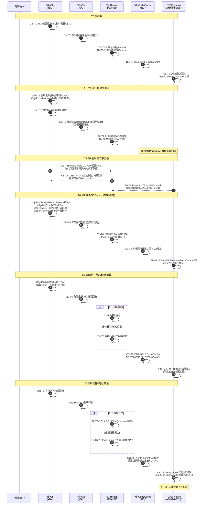

# ☕ JVM 运行时机制深度解析

> 🏷️ **知识图谱标签**`JVM` `运行时数据区` `类加载` `GC` `JIT` `JMM` `并发` `云原生诊断`

> 🌱 **项目开源协作状态**：🤝 **Issues / PR Welcome，欢迎社区校对与共同勘误**

> 📄 **文档专属许可证**：[CC BY-SA 4.0](https://creativecommons.org/licenses/by-sa/4.0/)（允许传播与演绎，需标明出处并采用相同协议）

> **写在最前面**：本书 90%+ 篇幅聚焦 JVM **运行时机制**（内存、类加载、GC、JIT、并发），最后一章落到容器感知、GC 选型与生产诊断。六章是**一条因果链**，不是六个并列专题。若你冲着「架构实战案例集」来，请先看 Level 6 与附录急查表；若你冲着「底层机理」来，请从 Level 1 顺序读完。

> ⚠️ **关于数字与代码的定位**（诚实免责）：
> - **性能数字**（对齐、时延量级、阈值次数等）均为基于 **OpenJDK 21 LTS** 的**理论量级估算**，用来建立数量级直觉，**不是**特定硬件实测基准。真实数值随 CPU、内核、负载浮动；容量规划请以本环境实测为准。
> - **代码示例**为教学级参考，旨在揭示机制，**不具备**生产级并发安全、异常处理与工程加固，请勿直接用于生产。
> - **百分比阈值**（如 Old 区 80% 告警）均为经验起点，需按业务监控数据校准。

> **🧭 阅读导航**：每章章首有主线进度条（上一环留下 / 本环只合 / 合不上会怎样）；章末「❌ 缺口」与下一章「上一环留下」字面对齐。暗线用 `new User()` / 一次「下单」作探针。值班请先看 [附录 · 生产症状急查](#appendix)。

---

## 📖 如何阅读本书（请先读这半页）

### 本书在讲什么

把 JVM 当成一座会自己运转的工厂。六章**不是六个并列专题**，而是同一条因果链上的六环：

```text
① 图纸进厂（类加载 / 运行时分区）
② 零件下线（对象分配与内存布局）
③ 废品回收（GC：不停产怎么清）
④ 产线提速（JIT：热点怎么变机器码）
⑤ 多产线协同（JMM / 锁 / Futex）
⑥ 搬进集装箱（cgroup / 选型 / 诊断）
```

### 贯穿主线（先记住这三句，再进正文）

> 🧵 **总问题**（全书只答这一句）
> 一次业务如何在 JVM 里：**诞生对象 → 正确回收 → 跑得够快 → 多线程不幻觉 → 容器不翻车**？
>
> 🧵 **导航怎么用**
> 每章章首只有一行进度 + 三句缺口（上一环留下 / 本环只合 / 合不上会怎样）。
> **章末「❌ 缺口」与下一章「上一环留下」字面对齐**——跨章时对一下这两句即可，不必重读全章。
>
> 🧵 **暗线**
> `new User()` / 一次「下单」。卡住时只问：**对象或请求现在在第几环？**（暗线每章最多章首、章末各一次，正文深潜不再插播。）

### 阅读节奏

| 段落 | 建议 |
|---|---|
| L1–3 前半 | 可快读；盯章首一行进度 |
| L3 后半–L5 | 见“减速提示”；迷路只回章首三句缺口 |
| L6 + 附录 | 当手册翻 |

**风格**：前三章工厂比喻建直觉；后半机制直述、比喻淡出。**进度条六章不断**——比喻可淡，因果链不断。

### 编号与知识图谱

书末 **三轴五轨道** 是二刷坐标，不是前置悬念。正文不提前抛 `Obj-T4[G1]` 一类符号；第一次顺序读只跟 **进度条 + 章末缺口**。

### 建议路径

1. **顺序 L1→L6**（每章先看章首三句再进正文；因果最顺）
2. **值班主入口**：**[附录 · 生产症状急查](#appendix)**（先分流）+ **[竖切总表 T0–T9](#vertical-table)**（一页对照）
3. **二刷**：跨层接缝 4 点、知识图谱；竖切全文可按需读，不必每次从头

---

## 🗂️ 目录

> 六章 = 总问题的六环（①图纸 → ②分配 → ③回收 → ④提速 → ⑤协同 → ⑥容器），不是六个并列选修课。
> Level 3 子目录按「第③环第 N 刀」排列——扫目录就是因果链。

- [🟢 Level 1 · 运行时数据区与类加载](#level-1) · ①
- [🟢 Level 2 · 对象分配与内存布局](#level-2) · ②
- [🟢 Level 3 · 垃圾回收：从基线到亚毫秒](#level-3) · ③
  - [对照尺 · 算法/基线/固定维度表](#l3-baseline)
  - [三色/写屏障 · 第一刀](#l3-tricolor)
  - [CMS · 第二刀](#l3-cms)
  - [G1 · 第三刀](#l3-g1)
  - [ZGC · 近终局](#l3-zgc)
  - [分代 ZGC · 吞吐补丁](#l3-zgenerational)
  - [Shenandoah · 同终局另一路](#l3-shenandoah)
  - [收集器家谱收束](#l3-family)
  - [Safepoint · ③→④ 桥（轮询演进 + STW 四阶段）](#l3-safepoint)
  - [暗线对象漂流串线](#l3-drift)
- [🟢 Level 4 · JIT 即时编译](#level-4) · ④
- [🟢 Level 5 · 并发与内存模型](#level-5) · ⑤
- [🟢 Level 6 · 云原生与生产诊断](#level-6) · ⑥
- [🏆 附录 · 生产症状急查（值班主入口）](#appendix) · **先看这**
  - 含 P99 分流、症状表、死亡红线、**GC 选型决策视图**
- [🧵 一条请求竖切：一次「下单」从入口到内核](#vertical-cut) · 复盘（可选通读）
  - [竖切总表 T0–T9（含主线环）](#vertical-table) · **一页对照**
- [🔗 跨层接缝：四个事故焊点](#cross-layer) · 二刷
- [全书知识图谱](#lifecycle-master) · 二刷坐标
- [🏆 附录 · 对比矩阵与口诀](#appendix-b) · 面试/二刷
- [📚 延伸阅读](#extended-reading)
- [💡 一句话总结](#one-liner)

---

<a id="level-1"></a>

## 🟢 Level 1 · 运行时数据区与类加载

> 🧵 **主线 · ①/6 · 图纸进厂、厂区怎么分区**
> `【①】 ② ③ ④ ⑤ ⑥`
>
> - **上一环留下**：（起点）代码要跑，还没有任何物理落脚点。
> - **本环只合**：东西放哪；`.class` 怎么进厂；`<clinit>` 如何只跑一次；OOM 如何按区分诊。
> - **合不上会**：后面对象 / GC / JIT / 锁都悬空——堆、Metaspace、栈会被混成一锅“内存不够”。

**徒弟**：老陈，我刚进厂，听大家说 JVM 跑起来像个小操作系统，堆、栈、方法区一堆词。这些术语太虚，能不能用咱们厂里的东西讲一遍？

**老陈**：可以。把 JVM 想成一座“智能制造厂”：代码是生产指令，对象是产品。要转起来，得有**图纸（类加载）**、**车间（运行时数据区）**和**启动规程（初始化）**。先把厂区分区与图纸进厂讲清——**总问题第 ① 环**。

### 第一幕：运行时数据区 —— 厂区功能分区

**徒弟**：为什么不能全堆一个大仓库？

**老陈**：因为生命周期和访问权限完全不同。还没打印的图纸、正在加工的零件、已经完工的成品混在一起，找东西要翻全厂；有的东西用一秒，有的要活整个进程。

#### 1. 直觉层：厂区功能映射

- **程序计数器 (PC)** → **当前工序记录卡**：每个工人（线程）干到哪一步；中断回来看一眼卡片接着干。
- **虚拟机栈 (JVM Stack)** → **个人工作台**：线程私有；局部变量、操作数栈；方法结束就清空。
- **本地方法栈 (Native Stack)** → **外聘专家室**：请 C/C++ 等 native 能力处理的任务。
- **方法区 (Method Area / Metaspace)** → **图纸档案室**：类结构、常量池等元数据，全局共享。
- **堆 (Heap)** → **中央成品仓库**：所有 `new` 出来的对象，线程共享。

#### 2. 机制层：分区隔离解决的三类矛盾

- **生命周期**：局部变量（纳秒级） vs 实例对象（秒～小时） vs 类元数据（进程级）。
- **并发**：工作台线程私有、天然无锁；仓库/档案室共享，需要并发控制。
- **回收**：工作台弹栈 \(O(1)\)；堆要做 GC；档案室要靠 ClassLoader 卸载整块释放。

#### 3. 实现层：HotSpot 物理布局（OpenJDK 21 基线）

**3.1 五区在进程地址空间里的真实落点**

```text
┌──────────────────────────────────────────────────────┐
│ Java 堆  (-Xms / -Xmx)                               │
│   Eden / Survivor / Old（G1、ZGC 则为 Region）       │
├──────────────────────────────────────────────────────┤
│ Metaspace (Native)  ← 类元数据 InstanceKlass 等      │
│ Code Cache (Native) ← JIT 机器码（见 Level 4）       │
│ 线程栈 × N (Native) ← 每 OS 线程一根（-Xss）         │
│ Direct / FFM / JNI  ← 不进 -Xmx，进 cgroup 记账      │
└──────────────────────────────────────────────────────┘
```

> **架构师要点**：`-Xmx` 只盖住**堆**。Metaspace、栈、Direct、Code Cache、JIT 线程开销都在外面——容器里“堆很健康却 OOMKilled”的根多半在这条线上（Level 6 收完）。

**3.2 各区实现要点**

| 区 | 物理落点 | 关键实现细节（OpenJDK 21 心智） |
|---|---|---|
| **PC** | 线程私有 | 解释期：当前 bytecode 索引；编译期：对应本地指令位置。线程切换后靠它恢复“干到哪”。 |
| **JVM 栈** | 通常与 native 同属一根 **OS 栈** | 栈上是一串 **Frame**：局部变量表 + 操作数栈 + 帧附加信息。方法 return / 异常弹栈即释放，**不做堆式 GC**。`-Xss` 过大 → 线程数上限下降；过小 → 深递归 `StackOverflowError`。 |
| **Native 栈** | 同上或 JNI 相关栈段 | `native` 方法、JNI、部分运行时进入 C++ 时使用。Java 栈与 native 栈在 HotSpot 上常**统一调度**，用帧类型区分。 |
| **堆** | 进程内连续/分区虚拟内存 | 所有 `new` 实例与数组。线程共享 → 分配要 TLAB/CAS（L2），回收要 GC（L3）。 |
| **方法区 / Metaspace** | **堆外 Native** | 按 ClassLoader 划 **Arena/Chunk**；类卸载时整加载器元数据可释放。历史上 PermGen 在堆内、难伸缩；Metaspace 用本地内存，需 `-XX:MaxMetaspaceSize` 防止撑爆容器。 |

**3.3 运行时常量池放哪？**

- `.class` 里的 **Constant Pool** 经加载后，成为 **`InstanceKlass` 上的运行时常量池**（在 Metaspace 一侧的元数据里）。
- 池中可以有 **符号引用**（尚未解析）与 **直接引用**（已解析到内存指针/偏移）。
- **字符串字面量** 等会与堆上 `String` / 字符串表交互（细节随版本演化，读者先记住：**元数据在 Metaspace，Java 对象实体仍在堆**）。

**3.4 和后文的接口（只点名，不展开）**

- 堆怎么切、对象怎么躺 → **Level 2**
- 堆怎么收 → **Level 3**
- 栈帧如何被 JIT 换成机器码帧 → **Level 4**
- 多线程如何看见彼此的堆写入 → **Level 5**

---

### 第二幕：类加载 —— 从蓝图到生产线

**徒弟**：图纸怎么进档案室？

**老陈**：`.class` 只是死的二进制流，要变成 JVM 能识别的 `InstanceKlass`，得走加载、链接、初始化。先讲**谁有资格加载**，再讲**存成什么**，最后讲**怎么做**。

#### 1. 双亲委派 —— 谁来加载

**徒弟**：双亲委派是不是像申请经费：组长 → 课长 → 厂长？

**老陈**：差不多。子加载器收到请求，**先问父加载器**，一直到 Bootstrap；父加载不了再自己加载。目的是保证 `java.lang.String` 这类核心类只能由顶层安全加载器处理，防止被替换。

```text
Application ClassLoader
        ↑ 委派
Platform ClassLoader
        ↑ 委派
Bootstrap ClassLoader  （核心类库）
```

#### 2. InstanceKlass 与 Class 镜像 —— 激活后的两张脸

JVM 用 C++ 写，业务用 Java 写，同一份类信息要在两套世界里可见：

| | **InstanceKlass（C++ 真身）** | **java.lang.Class（Java 镜像）** |
|---|---|---|
| 位置 | **Metaspace** | **Java 堆** |
| 内容 | 方法元数据、vtable/itable、常量池、字段布局、**oop map 相关信息**… | 反射 API、注解数据入口、作为 `synchronized(X.class)` 的锁对象等 |
| 谁用 | 解释器、JIT、GC、运行时内部 | 业务代码、`Class.forName`、框架扫描 |
| 关系 | 双向挂钩：镜像持有 klass，klass 持有 mirror | 同一类型一张脸对内、一张脸对外 |

**类的唯一性**：不是“同名即同一类”，而是 **同一个 ClassLoader + 同一个全限定名** 才是同一个运行时类。两个 WebApp 加载器各载一份 `com.foo.Bar` → 两个 `Class` 对象，强转可能 `ClassCastException`。

#### 3. 加载 · 链接 · 初始化（加深）

**3.1 加载 (Loading)**

```text
触发（主动使用：new / 访问静态 / 反射 / 主类启动…）
  → ClassLoader.loadClass / 双亲委派
  → 找到字节流（文件、jar、网络、加密解密、agent…）
  → defineClass：字节流 → InstanceKlass + Class 镜像
  → 该类进入“已加载”，但未必已链接/初始化
```

- Bootstrap 加载器在 Java 里常为 `null`（特殊）；Platform / Application 是平台与应用类路径。
- 自定义加载器常见套路：改 **委派顺序** 或改 **findClass 资源来源**（见下节三种扩展）。

**3.2 链接 (Linking)**——三步，可部分懒做

| 步骤 | 做什么 | 失败时 |
|---|---|---|
| **验证 Verify** | 魔数、版本、字节码栈图、符号合法… | `VerifyError` 等 |
| **准备 Prepare** | 为**静态字段**分配内存并设 **零值**（0 / null / false），**不是**执行 `static int x = 3` 的 3 | 极少直接暴露给业务 |
| **解析 Resolve** | 常量池 **符号引用 → 直接引用**（类、字段、方法指针/偏移） | `NoClassDefFoundError` / `NoSuchMethodError`… |

> **准备 vs 初始化**：`static int a = 1` 在准备阶段是 `0`，到 `<clinit>` 才变成 `1`。看静态字段“什么时候变有值”，要分清这两步。
> **解析可延迟**：第一次真正执行到某条引用型字节码时才解析（lazy），也可能在链接期 eager——实现策略问题，语义上以规范为准。

**3.3 初始化 (Initialization)**

- 执行编译器生成的 **`<clinit>`**（静态赋值 + `static {}` 合并）。
- **超类先于子类**初始化；接口在特定访问路径下初始化（细节以 JLS 为准，排障时记住“别假设接口 static 从不跑”）。
- **全局只做一次**，并发下有启动锁（下一幕）。

**3.4 主动使用（什么会触发初始化）——心智清单**

常见触发：`new`、调用静态方法、访问静态字段（compile-time constant 除外）、反射、`Class.forName` 默认初始化、创建子类导致父类初始化、主类启动等。
**不会**单靠“被加载”就初始化——可以 loaded 但尚未 initialized。

#### 4. 双亲委派不是铁律 —— 三种合法扩展

**老陈**：默认规则不是物理铁律。生产上有三类“合法扩展”，搞清它们，面试和排障都少踩坑。

##### 4.1 SPI：爸爸需要儿子（线程上下文类加载器）

典型：`DriverManager` 要加载 MySQL 驱动。`DriverManager` 在核心库（Bootstrap 可见范围），驱动在应用 classpath。严格单向下委派时，Bootstrap 看不见应用类。

**解法**：`Thread.currentThread().getContextClassLoader()`（通常是 Application ClassLoader）反向加载 SPI 实现。JDBC、JNDI、JAXP、`ServiceLoader` 等生态都依赖这条路。

##### 4.2 Tomcat：委托顺序反转，做版本隔离

两个 webapp 各要不同版本 Guava。严格双亲委派会把共享层先加载的版本“焊死”。Tomcat 的 WebappClassLoader 对**非核心类**先查自己 `WEB-INF`，再问父亲；`java.*` / 部分 `javax.*` 仍严格委派。每个 webapp 独立 ClassLoader，也才能热部署。

##### 4.3 Spring Boot Fat Jar：扩展字节码来源，不反转委托

常见误读：“Spring Boot 也打破双亲委派”。更准确的说法是：**委托顺序仍先问父亲**，但用自定义 URL / NestedJarFile 读 `BOOT-INF/lib` 里的嵌套 jar——解决的是“字节码从哪读”，不是“先问谁”。

| 角度 | Tomcat | Spring Boot Fat Jar |
|---|---|---|
| 委托顺序 | 非核心类先自己后父亲 | 仍先问父亲 |
| 解决的问题 | 多 webapp 版本隔离 | jar-in-jar 读取 |
| 机制本质 | 改写 `loadClass` 顺序 | 自定义资源协议 |

**判断标准**：只要不破坏“核心类不被替换”和“同一加载器下同名类唯一”，委托顺序与字节码源都可以扩展——这叫**协议的合法扩展**，不是“双亲委派作废”。

#### 5. 类卸载 —— 档案室什么时候能扔图纸

一个类要卸载，**三个条件同时满足**（缺一不可）：

1. 该类的所有实例都已被 GC；
2. 加载它的 **ClassLoader 实例**已不可达；
3. 对应的 **`java.lang.Class` 镜像**无其它强引用（反射、静态字段、JNI 全局引用等）。

**生产经典**：Tomcat 热部署后 Metaspace 只涨不回——往往卡在条件 2：旧 WebappClassLoader 被 ThreadLocal、静态缓存、监听器等挂住。

> **排障含义（接条件 2 / 3）**：反射或框架若长期抱住 `Class` 镜像不放 → **条件 3** 不满足 → 类卸不掉 → Metaspace 涨。热部署泄漏常**同时**卡在 ClassLoader（条件 2）与 `Class` 镜像（条件 3）两条线上——镜像节只说明“有两张脸”，**卸不掉的账在本节三条件上结**。

```bash
jcmd <pid> VM.classloader_stats
# 诊断类卸载可用日志：-Xlog:class+unload=info （具体 tag 随 JDK 版本略有差异）
```

**Metaspace OOM 两种根因**不要混：

| 现象 | 可能根因 | 方向 |
|---|---|---|
| Metaspace 持续涨 | 动态类生成过多（代理/脚本） | 查反射、CGLIB、脚本引擎 |
| Metaspace 涨且热部署后不回落 | ClassLoader 泄漏 | 查 ThreadLocal / static / 监听器 |
| 最终 OOM | 二者之一耗尽 native | `jcmd VM.native_memory`；生产加 `-XX:MaxMetaspaceSize` |

---

### 第三幕：`<clinit>` 启动锁 —— 初始化只发生一次

**徒弟**：两个线程同时初始化同一个类，会不会打架？静态块里若再触发别的类加载呢？

**老陈**：语义上两句话钉死：

1. **同一个类的 `<clinit>` 全局只执行一次**；
2. 执行期间其它线程要等；**成功结束后**，静态字段写入对其它线程 **可见**（无需你再手写 volatile 去“修静态初始化”）。

可以想成生产线启动只有一把钥匙：抢到的人跑完 `static {}` 与静态赋值，其它人排队；完成后状态变为“已初始化”，后续直接用。

**并发与重入心智**（仍不展开锁实现）：

```text
线程 A 初始化 Foo
  → Foo.<clinit> 里触碰 Bar
    → 可能递归触发 Bar 初始化
  → 若设计成 Foo↔Bar 循环初始化，可能死锁或错误
```

> 生产上：巨型 `static {}`、在静态里拉远程配置 / 起线程，是启动毛刺与隐蔽死锁的重灾区。能懒加载就别堆在 `<clinit>`。

> 📌 **实现演进（先记结论，细节到 Level 5）**
> - **JDK 8～19**：类初始化锁与 Java 层 `synchronized` / ObjectMonitor 路径耦合更紧。
> - **JDK 20+（[JDK-8288064](https://bugs.openjdk.org/browse/JDK-8288064)）**：改为更贴近 JVM 内部原生 Monitor，减少与对象锁状态机、虚拟线程挂载纠缠。
> 本书基线 **OpenJDK 21**：先记住语义——**只一次 + 完成后可见**。锁升级、屏障到 Level 5。

---

### 第四幕：OOM 分诊 —— 厂区容量危机

**徒弟**：内存满了，怎么知道是哪个区爆了？

**老陈**：不同 OOM 对应不同物理结构，不要一上来就加 `-Xmx`。

| 故障现象 | 物理根因 | 诊断方向 |
|---|---|---|
| `OutOfMemoryError: Java heap space` | 堆装不下 | 泄漏 / 分配过快 → `GC.class_histogram`、JFR OldObjectSample（生产慎用 `jmap -dump:live`） |
| `OutOfMemoryError: Metaspace` | 元数据过多或卸不掉 | `VM.classloader_stats`；`-XX:MaxMetaspaceSize`；查动态代理/热部署泄漏 |
| `OutOfMemoryError: Direct buffer memory` | 堆外 Direct 达上限 | `-XX:MaxDirectMemorySize`；查 Netty/NIO 未 release（L2/L6） |
| `unable to create new native thread` | 线程/栈/OS/cgroup 限额 | `ulimit -u`、`pids.max`、`-Xss`、线程池是否失控（L2 深潜补机制） |
| `StackOverflowError` | 栈帧过深或 `-Xss` 过小 | 查递归/巨型栈帧；调大 `-Xss` 只是权宜，治本改代码 |
| 进程被杀、无 Java OOM 文案 | **cgroup OOM Killer** | 堆外+元数据+栈总和超限；`dmesg` / 容器 exit 137（L6） |

**机制回环**（表不是五条孤立事实）：

| 症状 | 回到本环哪块物理结构 |
|---|---|
| 堆爆 | 共享仓库 + 分配/回收失衡 |
| Metaspace 爆 | Arena 随 ClassLoader 释放 + 泄漏或动态类失控 |
| Direct 爆 | 堆外通道，**不在** `-Xmx` |
| native thread 失败 | 每线程栈 + OS/cgroup 限额 |
| 栈溢出 | 虚拟机栈 LIFO / 帧过大 |
| 被内核杀掉 | 进程 RSS 视角，JVM 分区之和 |

**第一刀分诊顺序（架构师习惯）**：

```text
1. 看异常文案 / 容器 exit code（Java OOM vs 137）
2. 堆？Metaspace？Direct？线程？
3. 再决定：加 -Xmx / MaxMetaspaceSize / 查泄漏 / 缩线程
   ——禁止不看分区就“先把堆加到 16G”
```

> 生产提示：容器里“堆很健康却 OOMKilled”极常见。Level 2 讲堆外，Level 6 收 cgroup。

---

### 第五幕：把 Level 1 串起来 —— 一次 `new User()` 在类加载视角发生了什么

> 减速提示：前面偏直觉，这一幕开始把链路焊死。放慢一点读即可，不必一次记全后续 GC/JIT。

**徒弟**：前面像散点。我写 `new User()` 时，在类加载这一层到底发生了什么？

**老陈**：只走“**类从图纸到可以分配实例**”这一段。TLAB、对象头细节、GC、锁升级，后面各章会自然接上——这里不预支符号编号，也不把全书对象一生讲三遍。

```text
1. 触发（主动使用）
   new User() / 访问静态 / 反射…（见第二幕清单）
        ↓
2. 加载检查
   若未加载：双亲委派 → 读字节流 → defineClass
        ↓
3. 定义与镜像
   InstanceKlass（Metaspace：布局、常量池、方法、oop map 元数据）
   + java.lang.Class 镜像（Heap）
        ↓
4. 链接
   验证 → 准备（静态字段零值）→ 解析（符号→直接引用，可懒）
        ↓
5. 初始化
   超类先初始化 → 抢 clinit 锁 → <clinit> → 已初始化（对其它线程可见）
        ↓
6. 放行实例分配
   解释器/JIT 才进入“按 InstanceKlass.size 在堆上施工”
   （TLAB、对象头、字段、<init> → Level 2）
```

**此时内存里已有什么、还没有什么**：

| 已有 | 还没有 |
|---|---|
| `User` 的元数据在 Metaspace | `new` 出来的 `User` 实例 |
| `User.class` 镜像可能已在堆上 | 实例字段的业务值（要等 L2 的 `<init>`） |
| 静态字段已过 `<clinit>` | TLAB 里那块实例空地 |

**类卸载与 OOM**：
- 若 ClassLoader 泄漏 → 图纸卸不掉 → Metaspace 压力（本幕第 5 节 + 第四幕）。
- 若堆分配失败 → `Java heap space`（第四幕）。
GC 如何判定对象生死 → Level 3。

#### 自检（可选）

- [ ] 能说出 `InstanceKlass` 与 `Class` 镜像各在哪块内存、谁给反射用、谁给 GC/JIT 用吗？
- [ ] 加载 / 链接（验证·准备·解析）/ 初始化 各改变什么？准备阶段静态字段是何值？
- [ ] 双亲委派解决什么安全问题？Tomcat / SPI / Spring Boot 各动了哪一刀？
- [ ] 类卸载三条件缺一会怎样？热部署 Metaspace 不降常见卡在哪条？
- [ ] 堆 OOM、Metaspace OOM、Direct OOM、线程创建失败、cgroup 137 如何第一刀分诊？

#### 主线回扣 · ①→②

```text
✅ 合上：厂区五分区；双亲委派 → InstanceKlass/Class 镜像 → 链接/<clinit>；OOM 四区分诊
❌ 缺口：类已允许分配，实例如何在堆上落地？栈帧如何驱动 new？TLAB 如何避免堆门口堵死？
🧵 暗线：User 类已初始化，实例尚未诞生
```
→ **Level 2** 专合这条缺口（分配期）；GC / JIT 先按住。

---

<a id="level-2"></a>

## 🟢 Level 2 · 对象分配与内存布局

> 🧵 **主线 · ②/6 · 零件如何下线（对象分配）**
> `①已合 【②】 ③ ④ ⑤ ⑥`
>
> - **上一环留下**：类已允许分配，实例如何在堆上落地？栈帧如何驱动 new？TLAB 如何避免堆门口堵死？
> - **本环只合**：栈帧与字节码；对象体布局与 OopMap；`new` 六步落地（含 TLAB）；堆外 Direct/FFM。
> - **合不上会**：只会背“堆分代”，说不清对象从哪来、头为何既有年龄又有锁、容器 OOM 时堆为何仍显健康。

**徒弟**：厂区布局懂了。一个产品（对象）到底怎么在生产线上造出来？字节码指令在 CPU 里怎么跑？

**老陈**：镜头拉近进车间——**仍是同一条因果链**：L1 放行「可以 new」，本环才真正 **new 出来并贴标签**。核心是执行引擎 + 对象内存模型。

### 第一幕：执行引擎的“工作台” —— 栈 vs 局部变量表

**徒弟**：我看字节码里总有 `aload_0`, `istore_1` 这种指令，它们在物理上是怎么操作的？

**老陈**：你要把一个方法的执行想象成工人在工作台上干活。

#### 1. 直觉层：工作台与工具架

- **局部变量表 (Local Variable Table)** → **【工具架】**：这里放着方法参数和局部变量。每个变量有固定的槽位（Slot），像抽屉一样，编号 0, 1, 2...。
- **操作数栈 (Operand Stack)** → **【工作台中心区域】**：所有的计算必须在这里完成。你想把两个数相加？得先把它们从工具架（局部变量表）搬到工作台（操作数栈），加完后再把结果搬回工具架。

#### 2. 机制层：字节码指令的物理流动

以 `int c = a + b;` 为例：
1. `iload_1` → 从工具架 1 号槽位取出 a → 压入工作台。
2. `iload_2` → 从工具架 2 号槽位取出 b → 压入工作台。
3. `iadd` → 从工作台弹出两个数，相加 → 结果压回工作台。
4. `istore_3` → 从工作台弹出结果 → 存入工具架 3 号槽位 c。

#### 3. 实现层：Frame 的内存布局与执行模式

在 HotSpot 中，解释执行时一个 **Java Frame** 概念上包含：

```text
[ 返回地址 / 链路信息 ]
[ 局部变量表 Local Variable Table —— 槽位 0..n ]
[ 操作数栈 Operand Stack —— 深度在编译期由 StackMap 确定上限 ]
[ 帧附加：动态链接、异常相关… ]
```

| 概念 | 细节 |
|---|---|
| **Slot** | 通常 32-bit 宽；`long`/`double` 占 **2** 槽；槽位 0 在实例方法里常是 `this` |
| **操作数栈深度** | class 文件里写死上限；验证器保证不会溢出栈 |
| **iadd 为何慢** | 解释器：取指→译码→弹两槽→加→压回，几十条本地指令模拟一条字节码 |
| **JIT 之后** | 槽位与栈位置被 **寄存器 / 栈槽分配** 吃掉，不再有“显式搬运”；逃逸分析还可能砍掉分配（L4） |

**和 `new` 的衔接（预告第三幕）**：

```text
new User
  → 运行时按 size 在堆上分配对象体，得到 oop
  → dup / invokespecial <init>  // 栈上：…, oop, oop
  → <init> 里 putfield 写的是**堆上对象体**，不是“栈上临时 User”
  → 最后 astore / putfield / areturn 把 oop 存起来
```

**解释帧 vs 编译帧（心智）**：同一线程栈上可混有解释帧与 C1/C2 帧；GC 在 safepoint 扫栈时靠 **帧 OopMap** 区分哪些槽是引用（第二幕接口，L3/L4 用）。

---

### 第二幕：对象在堆上长什么样 —— `oop`、对象头、字段布局与 OopMap

> 🧵 **本幕只合三件事**：① 引用（`oop`）和堆上对象体不是一回事；② 对象体字节怎么铺、`size` 从哪来；③ **OopMap：GC 凭什么敢扫字段里的引用**。
> Mark Word 的 **age/GC 标记 → ③**，**锁状态机细节 → ⑤**（同一载体、不同因果，此处不展开成锁章）。

**徒弟**：产品造出来后，堆上到底是一串什么字节？我后面听 GC“跟着引用走”，它怎么知道哪几个字是引用、哪几个是 `int`？

**老陈**：先把两个词劈开，再看布局，最后接上 OopMap——这根线不接上，Level 3 会像魔法。

#### 1. 先劈清：`oop`（引用）≠ 堆上对象体

| 词 | 它是什么 | 在哪 |
|---|---|---|
| **`oop`（Ordinary Object Pointer）** | **指向** Java 堆上某个对象的引用/句柄（HotSpot C++ 侧的说法） | 常在栈槽、寄存器、别的对象的引用字段、静态字段里 |
| **对象体（object body）** | 被指向的那一块连续内存 | **Java 堆**（Eden/TLAB 切出来的那段） |

```text
栈 / 字段里的一个引用值          堆上的对象体
      oop  ──────────────────►  [ 对象头 + 字段 + padding ]
```

后文说“分配出一个对象”，指的是：**在堆上铺好对象体，再把指向它的 `oop` 交回给字节码**（压操作数栈、存局部变量等）。

#### 2. 堆上对象体：完整布局（普通实例）

开启指针压缩时（64 位 JDK 常见默认，`-XX:+UseCompressedOops`），普通实例大致是：

```text
低地址
┌─────────────────────────────┐
│ Mark Word          8B       │  状态：hash / age / 锁信息等（随 tag 变义）
├─────────────────────────────┤
│ Klass Pointer      4B*      │  指向 Metaspace 里的 InstanceKlass（L1 图纸真身）
├─────────────────────────────┤
│ 字段区 Instance Data        │  实例字段按 JVM 布局规则排列（见下）
├─────────────────────────────┤
│ Padding                     │  补齐到 8B 对齐（常见）
└─────────────────────────────┘
高地址
* 关闭压缩时 Klass* 多为 8B；数组对象在 Klass* 后多 4B length。
```

**字段区怎么排（HotSpot 心智，不必背源码常量）**：

1. **不是**严格按 Java 源码声明顺序；实现会按类型宽度等规则重排，减少内部 padding。
2. **父类实例字段在前，子类在后**（继承链往下铺）。
3. 引用在压缩开启时常见 **4B**；`long`/`double` 等常需 **8B 对齐**。
4. **对象整体**常对齐到 **8B**（或实现规定的对齐）；对齐字节计入 `size`。
5. `@Contended` / 伪共享填充会**故意**加大对象（L5）——布局服务于缓存行时会“变胖”。

**迷你例子（量级感，非某次实测绝对值）**：

```text
class User {
  int id;        // 4B
  String name;   // 引用 4B（压缩 oops）
}
// 头 12B（Mark 8 + Klass* 4）+ id 4 + name 4 = 20
// → padding 到 24B（8B 对齐）
// TLAB: _top += 24
```

**再扩一点：字段类型混排时为何要重排**

```text
// 若死板按源码：byte + ref + byte 可能插入大量对齐空洞
// HotSpot 倾向把同宽度字段扎堆，减少“洞”
```

**数组对象**：

```text
[ Mark Word | Klass* | length 4B | 元素区… | padding ]
```

- `length` 让运行时/GC 知道元素跨度，从而知道**下一个对象从哪开始**（与 TLAB filler 用 `int[0]` 的原因一致）。
- 元素是引用时，同样有 oop map / 按 length 扫描引用的逻辑。

**怎么在机器上“看”布局（可选）**：

```bash
# JOL（Java Object Layout）等工具可打印字段偏移与对象大小
# 生产排障也可用：JFR 对象统计 + 直方图，不必先上 dump
```

> 分配用的 **`size` 必须来自这份布局**——乱切长度会破坏 Eden“对象一个接一个”的可遍历性。

#### 3. Klass*：接到 Level 1 的图纸

- **Klass Pointer** 指向档案室（Metaspace）里的 **`InstanceKlass`**（L1 已讲）。
- 运行时靠它知道：方法在哪、对象**多大**、字段偏移是多少。
- 所以 L1“放行分配”和 L2“按图纸施工”是同一条因果：没有 `InstanceKlass`，算不出合法的 `size` 和字段布局。

#### 4. OopMap：GC 凭什么敢扫（本幕必须钉死的线）

**问题**：对象体里 `int` 和引用混排。GC 若把某个 `int` 位型数据当指针去跟 → 随机崩溃或静默损坏。

**答案**：类型元数据里带着 **“哪些偏移是 oop”** 的地图。业界口头常统称 **OopMap**（HotSpot 里对象侧还有 oop map / nonstatic oop maps 等实现名；**抓住语义即可**）。

```text
扫堆上某个 User：
  oop → 读 Mark / Klass*
      → 查该 InstanceKlass 的“引用字段偏移列表”
      → 只加载 name 所在偏移，得到下一个 oop
      → id 所在偏移当普通标量，绝不当指针
```

**和 L1 的焊点**：这张图在 **类链接/布局确定时** 就随 `InstanceKlass` 准备好了——所以 L1 放行的不只是“能 new”，还有 **“GC 以后认识这个类型”**。

**两层地图（接口先立住）**：

| 层 | 描述什么 | 何时用 |
|---|---|---|
| **对象内 oop map** | 堆对象体哪些字段偏移是引用 | 标记阶段扫堆、复制后 fixup 引用（L3） |
| **帧 oop map** | 某 PC/本地指令处，栈槽与寄存器哪些是 oop | 扫 GC Roots；**safepoint** 上栈必须可解析（L3 插页 / L4 OSR·去优化） |

**为何 JIT 也必须懂 OopMap**：编译帧没有“局部变量表”的解释器形态，存活引用可能在寄存器里；编译器为每个 safepoint 留下地图，GC 才敢在停顿时读寄存器。
→ **去优化 / OSR** 也依赖同一套“此时栈长什么样”的描述（L4）。

> 一句话：**没有 OopMap（及等价元数据），就没有正确的可达性分析。**
> L3 说“从 Roots 出发跟引用”，默认你已具备：根上的是 oop，对象内按 map 找下一跳。

#### 5. Mark Word：同一载体，多种因果（点到为止）

Mark Word 是对象头里 **8B 状态字**，用低位 tag 决定当前释义（无锁时常见 hash、age 等；竞争后会变成锁记录/Monitor 指针——**升级路径见 Level 5**）。

无锁初始态读者先记住：

```text
无锁：可含 identity hash、分代 age 等 → age 在 Young GC 晋升时用（Level 3）
锁相关 bit/指针 → 并发章再展开（Level 5）
GC 标记相关态 → 回收过程中使用（Level 3）
```

**不要在本幕背完整锁状态机**；只要知道：**同一 64 位，GC 与锁共用载体、因果独立**。

#### 6. 指针压缩（Compressed Oops）—— 为何布局里常是 4B 引用

64 位机器上默认常把堆内引用存成 **32 位压缩偏移**，解码近似：

\[
真实地址 ≈ 基址 + 压缩值 × 8
\]

效果：对象更瘦、缓存更好；也解释了上面 `User` 例子里引用字段按 4B 估的原因。堆很大或显式关闭压缩时，布局与 `size` 会变——排障时用 `jol` / 对象大小工具对照即可。

#### 7. 本幕收束：给下一幕的三块砖

```text
① size   = 对齐后的对象体长度（头 + 字段 + padding）
② 施工图 = Klass* → InstanceKlass 布局
③ oop map = 哪些偏移是引用（GC 扫描许可证）
```

下一幕 TLAB 只负责 **按 `size` 切出空地并填成合法对象**；**不是**另起一套“初始化后放到别的地方”。

---

### 第三幕：TLAB 与 `new` 落地 —— 空地怎么切、房子怎么盖

**徒弟**：布局懂了。可初始化之后对象到底怎么“放进”堆里？是先在栈上做好再搬进堆吗？全厂抢 Eden 门口不堵死吗？

**老陈**：两个问题一起答。**对象从一开始就在堆上盖**——没有“栈上成品再搬运”的主路径；TLAB 是盖房前的**私人地皮**。先走完一次 `new` 主线，再讲为什么用 TLAB；退役、线程绑定仍是深潜。

#### 0. 主线：一次 `new User()` 在堆上的六步（先建立豁然，再深潜）

> 类已初始化（Level 1 放行）之后：

```text
① 算 size
   InstanceKlass 布局 → 头 + 字段 + padding → 对齐后的字节数
        ↓
② 在 TLAB 里切空地（指针碰撞）
   小对象：_top += size（线程私有，无全局锁）
   切不下：退役当前 TLAB（深潜）或走共享 Eden / 大对象路径
        ↓
③ 把 raw memory 写成“合法对象头”
   Mark Word（初始无锁等）+ Klass*（指向 User 的 InstanceKlass）
        ↓
④ 字段区默认值
   清零/置默认：引用为 null，数值为 0……（尚未执行你写的构造体逻辑）
        ↓
⑤ 执行 <init>（实例构造）
   字节码在**已切好的这块堆内存上** putfield
   ——初始化 = 在堆对象体上写字段，不是把对象从别处“放进”堆
        ↓
⑥ 发布引用（oop）
   指向该对象体的 oop 压回操作数栈 / 存入局部变量或字段
   → 进入引用图；GC 以后按 OopMap 从这些 oop 出发扫描（Level 3）
```

**焊死三句，防懵**：

1. **空地在堆上（通常在线程的 TLAB 里）**，不是先在栈上 new 完再拷进堆。
2. **第二幕的 `size` / 布局 / OopMap** 是施工图；本幕是施工队。
3. **`<init>` 只改字段内容**；对象体地址在 ②③ 已固定，`oop` 在 ⑥ 交给调用方。

#### 1. 直觉层：私人零件盒（TLAB）

- 每个工人（线程）在 Eden 预留一小块私有空间 → **TLAB (Thread Local Allocation Buffer)**。
- 小对象 `new`：在自己 TLAB 里切 `size` 字节 → **无全局锁，极快**。
- TLAB 不够：退役（深潜）后再申一块，或走共享分配；**大对象**常绕过 TLAB，走堆上共享分配路径（避免私人盒被单次分配掏空）。

**为何需要 TLAB**：若每个 `new` 都在全共享 Eden 上 CAS/加锁，多线程分配会在“仓库门口”排队——私人盒把热路径变成线程本地指针加法。

#### 2. 机制层：指针碰撞（Bump-the-pointer）

TLAB 内三指针：

| 字段 | 含义 |
|---|---|
| `_start` | 本段 TLAB 起点 |
| `_top` | 下一次分配位置（bump 指针） |
| `_end` | 本段终点（再往上要退役或慢路径） |

```text
分配 size 字节：
  if (top + size <= end) {
      obj = top;
      top += size;     // 指针碰撞 O(1)
      return obj;      // 对象体起始地址
  } else {
      // 慢路径：尝试 refill TLAB / 共享堆分配 / 触发 GC 等
  }
```
`size` **必须**来自第二幕布局（含对齐）。乱切会破坏 Eden“对象首尾相接、可顺序解析”的不变量——filler 深潜正是在退役时**补上合法对象头**，不留不可解析空洞。

#### 3. 实现层：写头、零值、`<init>`、慢路径

切出 `obj` 地址后的**热路径心智**（与第 0 步六步对齐）：

```text
1) 写入 Mark Word（无锁初始等）
2) 写入 Klass*（压缩时写压缩 klass）
3) 字段区清零/默认值（引用 null，数值 0）
4) 返回 oop 给解释器/JIT
5) 字节码 invokespecial <init> 在同一地址上 putfield
```

| 路径 | 何时 | 行为 |
|---|---|---|
| **TLAB 快路径** | 小对象、盒内剩余 ≥ size | 无全局锁 bump |
| **TLAB refill** | 盒满 | 退役填 filler（深潜）→ 从 Eden 申新盒（常 CAS） |
| **共享堆分配** | 大对象 / TLAB 关闭 / 特殊情况 | 在共享空间竞争分配，更贵 |
| **分配失败** | 堆压力大 | 触发 GC 后再试；仍失败 → `Java heap space` |

**归属**：TLAB 只是 Eden 上的**分配加速器**，不是“另一块堆”。对象生死仍走 GC 引用图；Young GC 时存活对象可进 Survivor，与是否曾在 TLAB 出生无关。

> **落地 = 在堆内存上施工**，没有“栈上 new 完再搬进堆”的主路径。

---

#### 4. 【深潜可选】TLAB 退役（Retirement）——TLAB 不是"分完就完"

> ⏱ **深潜可选**：主线（上面 0～3 节 + 第五幕串线）已够建立“`new` 如何落地”。
> 本节解决排障向问题：剩余空间不够时如何退役、为何填 filler；可先跳过。

**徒弟**：老师傅，TLAB 分配那么快(O(1) 指针碰撞)，但 TLAB 用完了怎么办？直接扔掉吗？

**老陈**：不，TLAB 有完整的"退役机制"——这是把 TLAB 讲透的关键。**TLAB 这块内存本身**的回收，和 TLAB 内**对象**的回收，是两套机制。

##### 4.1 触发条件：TLAB 剩余空间不足

```text
线程 T 的 TLAB 状态:
  _start ━━━━━━━━━━━━ _top ━━━━━━━━━━ _end
  [   已用 65KB  ]    [ 剩 50B  ]   [  _end 后属于 Eden 其他位置  ]

下一个要分配的对象大小: 64B
剩余 50B 不够 → TLAB 退役触发
```

**为什么不能直接"扩容 TLAB"或"用剩余 50B 分配"？**

```text
GC 扫描时,要能顺序遍历 Eden 区所有对象
  → 要求 Eden 在 GC 眼里是"连续可遍历的对象序列"
  → 如果 TLAB 末尾留一段"没初始化的死角"
  → GC 遍历到这里就出错(它不知道这块空间算不算对象)

所以 JVM 的策略:宁愿"浪费"剩余空间,也要保持 Eden 区的"对象连续性"
```

##### 4.2 退役过程：填一个 "filler object"

```text
剩余 50B 退役流程:
  TLAB._top 当前在 65KB+50B 位置

  Step 1: 把这 50B 填充为一个 dummy 对象(int[0] 数组)
          数组对象总大小 = 16B（已是 8B 对齐）:
            [ Mark Word 8B | Klass Pointer 4B（假设开启指针压缩 `-XX:+UseCompressedOops`，JDK 8+ 64位默认开启；关闭时 Klass Pointer 为 8B） ]  ← 对象头 12B
            [ length = 0 ]                        ← 4B
            总计 16B，无需额外填充

  Step 2: 整个 50B 变成一个合法的"零长度数组对象"
          TLAB._top 推进到 65KB+50B(实际推进了,但没对象占用)

  Step 3: TLAB 退役完成,线程去申请一块新 TLAB
          新 TLAB._start = 旧 TLAB._end(在 Eden 区的下一个空闲段)
```

**为什么用 int[0] 数组而不是 Object？**
- 数组有显式的 `length` 字段，GC 扫描时**只需读 length 就能知道下一个对象在哪**——无需复杂解析
- length=0 表示"无元素"，占用空间固定为 **16B**（12B 对象头[Mark Word 8B + Klass Pointer 4B] + 4B length 字段），16B 已是 8B 对齐
- `int[]` 类型在 JVM 内部处理最廉价

##### 4.3 动态大小调整：TLAB 不会"越用越大"或"永远那么小"

```text
JVM 维护一个全局统计:
  每个线程在 TLAB 内分配了多少字节 / TLAB 总大小 = 利用率
  上一轮 TLAB 的实际利用率 → 决定下一轮 TLAB 的大小

自适应逻辑:
  上一轮利用率 < 目标(如 80%)
  → 下一轮 TLAB 缩小  → 节省 Eden 空间给其他线程

  上一轮利用率 > 目标
  → 下一轮 TLAB 增大  → 减少频繁退役(填 filler object)的浪费
```

**关键 JVM 参数**:

```text
-XX:TLABWasteTargetPercent=1
  默认 1% → Eden 区的 1% 可以被 TLAB 退役浪费
  调大:更激进的 TLAB 复用,可能导致 STW 时 GC 扫描对象更多
  调小:更激进的 TLAB 大小匹配,可能增加退役次数

-XX:ResizeTLAB=true  (JDK 8u 默认 true)
  启用动态大小调整
  关闭:TLAB 大小固定为 -XX:TLABSize=N
```

**生产实操**:

```bash
# 查看每个线程 TLAB 实际大小(零 STW 风险)

jcmd <pid> VM.native_memory | grep -A 5 "Thread"

# 详细看 TLAB 统计

java -XX:+PrintTLAB -XX:+PrintFlagsFinal -version 2>&1 | grep -i tlab

# 监控 TLAB 退役频率(看 GC 日志里的 "filler" 关键字)

java -Xlog:gc+tlab=trace -jar app.jar
```

##### 4.4 线程死亡时的 TLAB 退役

```text
线程 t 终止:
  Step 1: JVM 检测到 t 不再活跃
  Step 2: 回收 t 的 Java 栈帧
  Step 3: 把 t 当前 TLAB 剩余空间也填一个 filler object
  Step 4: 整块 TLAB 归还给 Eden
  Step 5: 后续其他线程的 TLAB 申请可能复用这块空间

关键:线程死亡时,TLAB 不需要等 GC 才释放
     → 显式退役避免"已死线程的 TLAB 占着 Eden 不让其他线程用"
```

##### 4.5 TLAB 与"内存碎片"的关系

**TLAB 内的碎片**:TLAB 自己不产生碎片(指针对齐，顺序分配)

**TLAB 之间的碎片**:filler object 浪费 0~50B/次 × 每秒 N 次分配 = 累计 0~N×50B/s

```text
每秒 10000 次分配 × 平均浪费 25B/次 = 250KB/s = ~22GB/天
如果 TLAB 利用率总是 < 80%,这个浪费会很大
```

**TLAB 与 Survivor 区的关系**(埋下 L3 伏笔):

```text
Young GC 发生时:
  存活对象从 Eden 复制到 Survivor 区
  TLAB 内的 filler object 是"死对象"→ 直接被 GC 跳过
  Eden 区的扫描范围 = 所有活跃 TLAB + 退役 TLAB(已归 filler)
  → 这就是为什么"filler object"机制不浪费 GC 时间
```

**回到主线**:TLAB 分配快(指针碰撞 O(1))是表象，**完整的 TLAB 生命周期** = 申请 → 分配 → 退役(填 filler) → 动态大小调整 → 线程死亡归还。这 5 步缺一不可，缺任何一步都会让 Eden 区"对象连续性"被破坏，导致 GC 扫描失败。

---

#### 5. 【深潜可选】线程绑定的三层含义

> ⏱ **深潜可选**：第一层（TLAB 与线程绑定）建议扫一眼；第二层（Java↔OS 1:1 与虚拟线程）、第三层（NUMA）可留第二遍。

**徒弟**：老师傅，TLAB 是"线程私有"，但"私有"具体是什么含义？线程死了 TLAB 怎么办？线程数有上限吗？

**老陈**：好问题。"线程绑定"这个概念有 3 层含义，每一层都对应一个具体的物理机制。

##### 5.1 第一层：TLAB 与线程的绑定关系

```text
JVM 内部表示:
  JavaThread 实例(堆)
    ├─ _tlab 字段: TLAB*  ← 指向"当前 TLAB"(可以为 NULL)
    └─ _thread 字段: OSThread*  ← 指向对应 OS 线程

绑定生命周期:
  T=0:  线程创建,JavaThread._tlab = NULL
  T=1:  第一次 new 对象时,申请 TLAB,绑定
  T=2:  持续分配,可能多次退役/重新申请(每次退役时 _tlab 短暂为 NULL)
  T=3:  线程死亡,JavaThread 实例被 GC 回收
        → TLAB 也跟着 GC 回收
        → 退役 filler object 已经在 4.4 节讲过
```

##### 5.2 第二层：Java 线程与 OS 线程的 1:1 绑定 —— 这直接补上 Level 1 的 OOM 悬案

**Level 1 OOM 诊断表**有一行：
> `unable to create new native thread` → 工人名额用尽 → 线程创建过多 / OS 限制

**"OS 限制"四个字背后的物理机制**:

```text
HotSpot 传统线程模型(Thread-Per-Message 模型):
  每调用一次 new Thread().start()
  → JVM 内部调用 pthread_create(3)
  → 内核创建一个对应的 task_struct
  → 1:1 严格绑定(JVM Thread #N <-> OS Thread ID #M)

3 个硬约束(任一耗尽就报 unable to create new native thread):
  1. ulimit -u(单进程最大线程数)
     Linux 默认:无限制 / 某些发行版 = 32768 / 65535
     查看: ulimit -u

  2. /proc/sys/kernel/pid_max(系统全局进程/线程数上限)
     Linux 5.x 默认:4194304
     但实际可用数受其他因素限制

  3. 物理内存:每个线程默认 -Xss=512KB 栈
     8GB 物理内存 / 512KB = 理论上限 16384 个线程
     实际受其他进程占用影响

  4. cgroup 限制(见容器与诊断章)
     K8s 默认每 Pod 没有 pids limit
     容器可设置 --pids-limit
```

**为什么这个 OOM 在 K8s 时代特别常见**:

```text
K8s Pod 实际可用内存可能只有 4GB
默认 -Xss=512KB
理论上限 4GB/512KB = 8192 个线程
但业务实际使用:
  Tomcat connector(200) + HikariCP(50) + Dubbo(100) + ...
  = 可能 500~1000 个线程是常态
  任何"长生命周期任务"(批量处理、异步回调)都可能创建额外线程

一旦总线程数超过 cgroup 限制的 80%
→ 系统调用 pthread_create() 失败
→ JVM 抛 OutOfMemoryError: unable to create new native thread
```

**JDK 21 的范式转移：虚拟线程（Virtual Threads）打破 1:1 绑定**

```text
虚拟线程模型(M:N 动态绑定):
  Java Thread #1 ⇄  载体线程(Carrier Thread) #A
                   ↕ 临时解绑
  Java Thread #2 ⇄  载体线程 #B

  阻塞的虚拟线程:
    1. 虚拟线程 T1 在 carrier A 上阻塞(I/O 等待)
    2. carrier A 临时"解绑" T1,T1 状态存进堆上的 StackChunk 对象
    3. carrier A 立刻去执行另一个虚拟线程 T2(无 OS 线程切换)
    4. T1 I/O 完成时,从 StackChunk 恢复执行
    5. 任意 carrier 都可以"接回" T1
```

**关键收益**:
- 1M 个虚拟线程 ≈ 几十个载体线程(具体看阻塞率)
- 不再受 1:1 绑定的"4GB/512KB = 8192 线程"限制
- 但虚拟线程的"根"是 GC Roots(StackChunk 在堆上，见垃圾回收章 第四幕)

**生产实操**:

```bash
# 启用虚拟线程(JDK 21+,preview 在 19/20,正式在 21)

java -Djdk.virtualThreadScheduler.parallelism=8 \
     -Djdk.virtualThreadScheduler.maxPoolSize=256 \
     -jar app.jar

# 监控虚拟线程

jcmd <pid> Thread.dump_to_file -format=plain vc.dump
# 看 dump 里 "VirtualThread" 开头的行
```

##### 5.3 第三层：CPU 亲和性 / NUMA 绑定(更深层)

```text
多核 / 多 NUMA 服务器:
  Socket 0 (CPU 0~7,本地内存 Node 0)
  Socket 1 (CPU 8~15,本地内存 Node 1)

GC 线程的 NUMA 绑定(OpenJDK 21):
  -XX:+UseNUMA  (默认 false,需显式开启)
  GC 线程优先在分配对象的 NUMA 节点上工作
  避免跨 NUMA 节点访问(延迟 +30~50ns/次)

CPU 亲和性(affinity):
  taskset -c 0-7 java -jar app.jar  ← 把进程绑到 CPU 0~7
  让进程的 GC 线程、JIT 线程、用户线程都在这些核上调度
  避免 CPU 缓存跨核失效
```

**这些深一层绑定不在本书主线展开**(Level 6 提到 cgroup 时会略过)，但读者应知道：**"线程绑定"是一个三层金字塔**，从 TLAB 的轻量级(同线程栈内指针)，到 Java-OS 1:1 的重绑定，到 CPU-NUMA 的硬约束，每一层都直接影响 GC 和内存分配行为。

### 第四幕：堆外通道 —— DirectByteBuffer 与 FFM

**老陈**：上面 TLAB / Eden / 指针碰撞，全是 **Java 堆内部**。现实很骨感——映射 10GB 文件、网卡大包缓冲，若先拷进堆再处理，既吃 `-Xmx` 又吃 GC。所以必须有 **堆外通道**。

**徒弟**：堆外和堆上对象是什么关系？会不会 GC 扫到？忘了释放会怎样？

**老陈**：分清两条历史路径：**DirectByteBuffer（半交叉）** 与 **FFM Arena（确定性释放）**。

#### 1. 对照：两条堆外路径

| | **DirectByteBuffer** | **FFM（Foreign Function & Memory）** |
|---|---|---|
| 典型 API | `ByteBuffer.allocateDirect` | `Arena` + `MemorySegment`（JDK 21 正式） |
| 内存位置 | Native | Native |
| 生命周期 | Java 对象 + **Cleaner/Phantom 引用** 间接触发 free | **`Arena.close()` 确定性**释放 |
| GC 角色 | 管 Java 壳；native 释放**时机不保证** | 基本不管 Arena 内块；你 close 才放 |
| 上限 | `-XX:MaxDirectMemorySize`（常默认同堆量级） | 仍占进程 RSS / cgroup，需运维限额 |
| 风险 | 泄漏难查、依赖 GC 压力才回收 | 忘记 close → 泄漏（显式） |

```text
堆内：  oop ──► [ Mark|Klass*|字段 ]     ← GC 按 OopMap 扫
堆外：  long address / MemorySegment ──► native pages  ← GC 不按对象图回收这块
```

#### 2. DirectByteBuffer：为什么叫“半交叉”

- 堆上有个很小的 Java 对象（壳），字段里记着 native 地址与容量。
- native 页不在 `-Xmx` 里，但在 **进程 RSS / 容器 memory** 里。
- 回收常走 **PhantomReference + Cleaner**：壳不可达后，**某次 GC 之后**才 free——
  **不是** `= null` 立刻归还 OS。
- 高分配速率下可能 **堆还很空，Direct 已 OOM**（`Direct buffer memory`）。

#### 3. FFM：Arena 与确定性释放

- **Arena**：一段 native 生命周期作用域（ confined / shared 等模型）。
- **MemorySegment**：对那段内存的安全视图（边界检查，相对裸 `Unsafe` 可控）。
- **`try (Arena a = Arena.ofConfined()) { ... }`** → 离开作用域 **立刻**释放。

> 相对 DirectBB：**你不 close，就一定不放**——泄漏更“诚实”，也更要求纪律。

#### 4. 和主线的关系

- 对象图、OopMap、TLAB：**管堆内**。
- 堆外：另一本账；容器里必须和 Metaspace、栈一起算进 cgroup（L6 缝合点）。
- 零拷贝路径：`Socket/File → Direct/FFM → 业务`，减少堆内中间 `byte[]` 与 GC 压力。

---

### 第五幕：把 Level 2 串起来 —— 分配期发生了什么

> 减速提示：第四幕 FFM、第三幕深潜（退役/线程绑定）可按需回看。本节用**一条时序**把第一～三幕焊死。

**徒弟**：栈帧、对象布局、TLAB、FFM 还是像几条线。一次 `new User()` 到底怎么合成一条？

**老陈**：不重复类加载。只看**分配期**，并标明每步回看哪一幕：

```text
类已初始化（Level 1 放行）
        ↓
① 算 size：头 + 字段 + padding（第二幕布局）
        ↓
② TLAB 指针碰撞切空地（第三幕；满则退役填 filler 再申）
        ↓
③ 写对象头：Mark Word + Klass*（第二幕）
        ↓
④ 字段默认值；⑤ 执行 <init> 在**同一块堆内存**上赋值（第三幕主线）
        ↓
⑥ 发布 oop → 局部变量表 / 字段（第一幕栈槽；进入引用图）
        ↓
业务再读写字段（写屏障“税” → Level 3）
GC 扫对象时按 OopMap 只跟引用字段（第二幕埋线 → Level 3）
        ↓
可选分支：
  · 堆外：DirectByteBuffer / FFM Arena（Arena 必须 close）（第四幕）
  · 热点方法稍后 JIT（Level 4；帧 OopMap / Safepoint）
  · 对象生死由 GC 判定（Level 3）
```

**焊死六点（读完应豁然，而不是只背名词）**：

1. **`oop` 是引用，对象体在堆上**——二者不是同一个东西。
2. **`size` 与字段布局来自 Klass**；TLAB 只按 `size` 施工。
3. **OopMap** 标出哪些偏移是引用——没有它 GC 不敢扫对象体。
4. **初始化 = 在已分配的堆对象上写字段**，不是别处做好再“放进”堆。
5. **TLAB** 让小对象分配接近无锁 \(O(1)\)；它是加速器，不改变 GC 归属。
6. **FFM Arena** 确定性释放、GC 不管；**DirectByteBuffer** 半交叉，容器须限额。

### 自检（可选）

- [ ] 能画出：栈上 oop → 堆上「Mark | Klass* | 字段 | padding」吗？`size` 如何从布局算出？
- [ ] 对象内 OopMap 与帧 OopMap 各解决什么问题？和 safepoint 有何关系？
- [ ] `new` 六步里，哪一步第一次出现合法对象头？`<init>` 写的是堆还是栈？
- [ ] TLAB 快路径 vs refill vs 大对象路径如何分工？
- [ ] DirectByteBuffer 与 FFM Arena 在“谁负责 free、是否进 -Xmx”上有何不同？
- [ ] `iadd` 时局部变量表和操作数栈如何配合？JIT 后为何不再显式搬运？

### 主线回扣 · ②→③

```text
✅ 合上：对象体布局 + OopMap 接口；new 六步在堆上落地；TLAB 切空地；引用(oop)进入 Roots 图；可选堆外
❌ 缺口：对象会越来越多——不停产时如何清废品、如何不误杀？（GC 将真用 OopMap 跟引用）
🧵 暗线：User 已在 Eden/TLAB 诞生，字段经 <init> 写在堆上，oop 可被引用图持有
```
→ **Level 3** 专合这条缺口。收集器编年史 = 同一缺口的多代答案；扫描时会接上本环的 OopMap。

---

<a id="level-3"></a>

## 🟢 Level 3 · 垃圾回收：从基线到亚毫秒

> 🧵 **主线 · ③/6 · 废品如何回收（GC）**
> `①已合 ②已合 【③】 ④ ⑤ ⑥`
>
> - **上一环留下**：对象会越来越多——不停产时如何清废品、如何不误杀？
> - **本环只合**：mutator 仍在改引用时，如何正确回收，并把停顿压到可接受（扫对象时接上 L2 的 **OopMap**）。
> - **合不上会**：大堆一次 STW 打爆 P99；或并发标记误杀活对象。
>
> **读法（先建尺，再看各刀改哪一格）**：
> 1. **对照尺**：三算法 + 基线画像 + 固定维度表（没有这把尺，G1/ZGC 的“优势”只是口号）；
> 2. **第一刀**三色/写屏障（正确性许可）；
> 3. **CMS → G1 → ZGC** 每一刀只改表上的格子，并写清退路；
> 迷路时只问——**相对基线，它优化了哪一格？牺牲了哪一格？退路掉回哪一格？**

**徒弟**：对象会诞生了。可要是堆到几十 GB，简单“扫一遍再删”停太久，集群心跳都可能超时。后面凭什么说 G1、ZGC 更好？没有参照物，我怎么横向比？

**老陈**：问到点子上了。**没有基线对照，就谈不清 G1/ZGC 的优势**——优势永远是“相对谁、在哪一维”。
所以本环**先建一把对照尺**（算法刻度 + Serial/Parallel 心智 + 固定维度表），再讲后文每一刀改了表上的哪一格。
L2 结束时 `User` 已在仓库里、产线还在 `new`；总问题仍是**不停产如何清废品、如何把停顿压到可接受**——不是另开一门收集器百科。

> 减速：尺建好之前，先别陷入“又一个收集器传记”。数字当量级；扫对象记得 L2 的 OopMap。

<a id="l3-baseline"></a>

### 第一幕：对照尺 —— 算法刻度、基线画像、固定维度表

> 🎯 **本幕交付物（读完应能带走）**
> ① 三种基础算法各换什么；② Serial / Parallel 两条基线心智（+ ParNew 一句话定位）；
> ③ 一张**固定维度对照表**——后文 CMS/G1/ZGC **只填格子、反复回扣**，而不是另起炉灶。
> **基线不是“过时资料”，是理解后文优势的参照系；本幕压缩的是传记，不是对比。**

#### 1. 刻度：Mark-Sweep / Mark-Compact / Copying

> 先有算法刻度，再谈收集器产品名——否则“CMS 用 Mark-Sweep”只是标签。

| 算法 | 核心动作 | 优点 | 代价 | 典型落点 |
|---|---|---|---|---|
| **Copying** | 活对象 From→To，整区回收 From | 无碎片；分配可指针碰撞；易并行 | 预留 To 区；存活率高时复制贵 | 新生代（Serial/ParNew/PS/G1 Young…） |
| **Mark-Compact** | 标记 → 活对象滑移到一端 | 无碎片；老年代可再近 O(1) 分配 | 滑移 STW 重；难与 mutator 深度并发 | Serial Old / Parallel Old |
| **Mark-Sweep** | 标记 → 回收死空间（不滑移） | 可并发清扫；实现相对直接 | **碎片**；分配走 FreeList，大对象易失败 | **CMS 老年代** |

```text
        停顿要短
           ↑
     Copying（新生代友好）
          ／ ＼
  可并发扫    彻底无碎片
        ＼  ／
     Mark-Sweep    Mark-Compact
     （CMS 路径）   （Parallel Old 路径）
```

**没有银弹**：后文每个收集器都是在这三角里挪权重，而不是发明第四种物理学。

#### 2. 基线画像（参照系，不是博物馆长传）

**共同结构**：回收时 **整段 STW**——先停 mutator，扫完再跑。堆小还可接受；堆到数 GB～数十 GB，单次停顿即可打爆 P99。

| 画像 | 一句话定位 | 算法组合（心智） | 目标函数 | 今天还要它吗 |
|---|---|---|---|---|
| **Serial** | 单线程、先做对 | Young: Copy；Old: Mark-Compact | 正确、实现简单 | 小堆/客户端；**更重要的是：并发收集器失败时的 Full GC 退路底色** |
| **Parallel（PS+PO）** | 多线程、吞吐优先 | Young: 并行 Copy；Old: 并行 Compact | **最大化吞吐**（应用时间占比） | JDK 8 时代默认心智；批处理/离线仍常见 |
| **ParNew** | Serial Young 的多线程版 | 与 Serial Young 同算法 | 为 **CMS 配套** Young | **不是第三条主路线**；CMS 移除后基本退场——记住“曾为 CMS 服务”即可 |

**Parallel 相对 Serial（横向，建尺用）**：

- 同属 **全 STW**，但 Parallel 用多线程换 **更高吞吐**；
- 单次停顿仍可能很长（量级：大堆上数百 ms～数秒，视存活集与堆而定）——**这不是“慢实现”，是模型就绑在工作量上**；
- Old 侧 Compact → 碎片少，分配仍友好——后文 CMS 的 FreeList 税，要拿这个当对照。

**关键事实（避免常识错误）**：

- JDK 6/7/8 服务端默认常是 **Parallel**，不是 CMS，也不是 G1。
- CMS 是显式低延迟选项；G1 自 JDK 9 起成默认叙事中心。
- **“G1/ZGC 更好”必须说清：相对 Parallel 的哪一维（停顿？吞吐？复杂度？），而不是绝对正确。**

#### 3. 名词尺：Young / Old / Mixed / Full

| 类型 | 回收范围 | STW | 备注 |
|---|---|---|---|
| **Young / Minor** | 基本只新生代 | 全 STW（各收集器实现不同） | Eden 满触发常见 |
| **Old / Major** | 老年代为主 | 基线全 STW；CMS 等可部分并发 | 与 Young 配对因收集器而异 |
| **Mixed** | 新生代 + **部分**老年代 Region | G1 等 | 按“垃圾密度”挑房间 |
| **Full GC** | 整堆（常含元数据相关工作） | **最重**；经典退路常落到 **Serial Old 单线程** | 生产要极力避免主动触发（如 `jmap -dump:live`） |

> Full GC 在日志里的恐怖，来自“整堆 + 往往单线程”的组合。后文 CMS CMF、G1 Evacuation Failure，都是 **掉回这把尺上的底**。

#### 4. ⭐ 固定维度对照表（后文每一刀只改格子）

> 先把 **基线列** 填死。读 CMS/G1/ZGC 时，只看它相对基线 **改了哪几格**。
> L6 / 附录的选型表应是这张表的**决策视图**，不宜再发明第三套互相打架的史诗表。

| 维度 | 基线心智（Serial / Parallel） | CMS（后文填） | G1（后文填） | ZGC（后文填） |
|---|---|---|---|---|
| **停顿模型** | 整段 STW；时长大致随工作量/存活集涨 | （并发标记+清扫，仍有短 STW） | （分区回收，仍≈f(存活集+RSet)） | （目标 ≈O(Roots)，与堆大小解耦） |
| **目标函数** | Parallel：**吞吐**；Serial：简单正确 | **低延迟**（付吞吐/碎片税） | **可预测停顿** + 平衡 | **硬延迟** + 大堆 |
| **老年代空间** | Compact → 少碎片，分配友好 | Mark-Sweep → **碎片 + FreeList** | Region 复制/整理思路 | 着色指针 + 并发重定位 |
| **并发标记** | 无（或可忽略）→ 无三色危机 | 有（IU） | 有（SATB） | 有（读屏障/着色） |
| **写/读屏障税** | 基线路径轻 | 写屏障（IU） | 写屏障 + RSet | 读屏障（自愈）等 |
| **失败退路** | 本身是“底” | → **Serial Old Full GC** | → **Serial Old Full GC**（如 EF） | 不靠 Serial Old 擦屁股；着色/屏障路径兜底 |
| **典型代价** | 大堆 P99 尖刺 | 浮动垃圾、碎片、CMF | RSet/预测失败、混收停顿 | 内存/屏障/运维复杂度 |
| **日志关键字（心智）** | Pause Young / Full | Concurrent Mode Failure 等 | To-space exhausted / Evacuation 等 | 极短 Pause + Concurrent 阶段 |

**使用方式**：

```text
听到“ZGC 亚毫秒”
  → 打开本表“停顿模型”行
  → 对照基线“随存活集/工作量涨的整段 STW”
  → 再看 ZGC 列如何改写这一格、以及付了哪一格的税
```

#### 5. 时间线（只当导航，不当正文）

```text
Serial → Parallel（吞吐默认）→ CMS（并发低延迟前辈）
      → G1（分区+可预测，JDK9+ 默认叙事）
      → ZGC / Shenandoah（亚毫秒路线）→ 分代 ZGC（吞吐补丁）
```

细节版本号见本章家谱幕；**选型决策**以对照表维度 + L6/附录为准。

#### 6. 因果桥：尺上的结构性缺口

基线共同约束：**回收正确性靠整段 STW 换**。
堆一大，停顿与工作量绑定 → P99 先炸。

```text
下一刀要动的格子：停顿模型（从“必须整段停”改为“尽量并发”）
但会打开新危机：mutator 仍在改引用 → 可能漏标/误杀
→ 第二幕：三色 + 写屏障（正确性许可）
→ 之后 CMS/G1/ZGC：在许可之上改写对照表的其余格子
```
---

<a id="l3-tricolor"></a>

### 第二幕：三色与写屏障 —— 第③环第一刀（并发标记如何不误杀）

> 🧵 **③ 内锚点**：对照尺上基线用**整段 STW**换正确；本幕起要改的是**停顿模型**那一格——
> **业务不停改引用时，如何仍正确标记并缩短停顿？**（先拿正确性许可，再谈 CMS/G1/ZGC 填表）

**徒弟**：并发标记时 GC 在扫、业务还在改指针。我总听“三色”“写屏障”，但一直懵：颜色到底涂在谁身上？什么叫丢对象？屏障挡的是哪一刀？

**老陈**：这一幕只建立**正确性许可证**，不讲具体收集器产品。读完你应能自己推一遍误杀路径，并说出 IU 与 SATB 各堵哪一步。

---

#### 1. 为什么需要三色：并发标记在干什么

基线收集器：**先停全世界 → 从 GC Roots 把活对象图走完 → 再恢复**。
正确，但停顿随工作量涨。

并发标记想做的是：

```text
GC 线程：从 Roots 出发，慢慢给对象涂色 / 记“到过”
业务线程（Mutator）：同时 new、改字段、断引用
```

问题立刻出现：**图在扫描过程中还在变**。需要一套记账法描述“扫到哪了”——这就是 **三色抽象**（不是 JVM 里真有三个颜色字段，而是分析模型）。

---

#### 2. 三色是什么（涂在对象上的“进度标签”）

把堆上每个对象想成一张工单，GC 标记时只关心引用关系：

| 颜色 | 含义（标记进度） | 直觉 |
|---|---|---|
| **白 White** | **还没被 GC 访问过**（或最终仍未被证明存活） | 灰名单：可能是垃圾，也可能只是还没扫到 |
| **灰 Grey** | **自己已被碰到，但“它指出去的引用”还没扫完** | 待办：口袋里还有子节点没展开 |
| **黑 Black** | **自己和（按当前算法）需要看的出边都处理完了** | 结案：GC 认为“从它往外该看的都看过了” |

**标记开始前**：除了要从 Roots 入手的，其它常视为白。
**标记理想结束时**：

```text
仍白 → 从 Roots 不可达 → 可回收
灰应被掏空（没有未处理的灰）
黑 → 存活
```

**和 L2 的焊点**：GC 从某个对象“往外走”，靠的是 **对象内 OopMap**（哪些字段是引用）；从线程栈出发靠 **帧 OopMap**。三色描述的是**遍历进度**，OopMap 描述的是**边在哪**。

**极简推进规则（心智）**：

```text
1. 从 GC Roots 直接碰到的对象 → 先变灰（放进“待展开”集合）
2. 取出一个灰对象 G：
     按 OopMap 看它的每个引用字段
     若指向白对象 W → W 变灰（将来要展开）
     G 的出边都处理完 → G 变黑
3. 灰集合为空 → 标记阶段结束
```

**工厂直觉（可对号）**：

- 白 = 还没安检的包裹
- 灰 = 安检员拿到了，但箱里清单还没勾完
- 黑 = 箱和清单都勾完，贴“已检”

---

#### 3. 全程推演：没有 mutator 时（安全）

```text
Roots → A → B → C

初始：A,B,C 白
Roots 扫到 A → A 灰
展开 A：发现 B 白 → B 灰；A 变黑
展开 B：发现 C 白 → C 灰；B 变黑
展开 C：无孩子 → C 变黑
结束：A,B,C 全黑，无白存活对象被漏 → 正确
```

业务若在**整段 STW**里冻结，图不变，上面算法永远安全。
**一允许 mutator 并发改引用，就会破功。**

---

#### 4. 丢失对象危机：两步合谋才能误杀

##### 4.1 只改引用，不一定死

并发时 mutator 做 `x.field = y`，可能出现“黑对象突然指向白对象”。
**仅此一步**还不构成误杀——只要将来还有某条路径让 GC 再看见这个白对象即可。

##### 4.2 经典危险条件（务必两步一起发生）

并发标记进行到一半时，若**同时**满足：

```text
条件 α（插入新边）：一个【黑】对象 B 新指向了一个【白】对象 W
条件 β（删除老路）：原先指向 W 的【灰】对象 G，断开了对 W 的引用
```

则可能：

```text
W 已经没有任何“还愿意带 GC 去看它”的灰节点
标记结束时 W 仍白
→ GC 当垃圾回收
→ 其实业务还通过 B 用着 W
→ 损坏 / 诡异 NPE / 堆腐蚀
```

##### 4.3 逐步漫画（请对着字母走一遍）

**起始**（标记中途）：

```text
        Roots
          │
          ▼
        [G 灰] ──ref──► [W 白]     // G 还在待展开队列里，本会扫到 W
                          ▲
        [B 黑]            │        // B 已结案，GC 不会再回头扫 B 的字段
        （已扫完）          │
```

**Mutator 动作 1（条件 α）**：`B.child = W`
黑 B 挂上了白 W。但 B 已是黑，**朴素算法不会再扫 B**。

```text
        [G 灰] ──ref──► [W 白]
                          ▲
        [B 黑] ──NEW──────┘
```

**Mutator 动作 2（条件 β）**：`G.ref = null`
唯一“还计划带 GC 去 W”的灰路径断了。

```text
        [G 灰] ──X──     [W 白]   // 没人再把 W 涂灰了
                          ▲
        [B 黑] ───────────┘      // B 不回头
```

**标记结束**：W 仍白 → **被回收**，但 B 还指着它 → **丢失对象（lost object）**。

> **记忆口诀**：
> **黑指向白（插入）+ 灰不再通向白（删除）= 可能误杀。**
> 只发生其中一个，往往还有补救窗口；两个合谋才致命。

##### 4.4 强三色不变式（一句话理论）

并发标记要维持的不变量（弱/强三色有多种表述，这里用工程上最好记的）：

```text
不存在「黑 → 白」这种边
（或者说：任何白对象若仍存活，必须还能从某个灰对象走到）
```

Mutator 一旦制造「黑→白」，就必须用 **写屏障** 记账，把不变量修回去。

---

#### 5. 写屏障：在 `putfield` 上收税，换正确性

**写屏障（Write Barrier）**：每次**引用型字段赋值**（`obj.field = ref`）时，JVM 插入的一小段额外逻辑——不是 Java 里的 `volatile` 内存屏障（那个是 L5 可见性），这里是 **GC 的记账探针**。

```text
业务：b.child = w;
底层近似：
  WriteBarrier(b, old_value, w);  // 先记账 / 染色
  b.child = w;                    // 再真正写入
```

两种主流记法，堵的是危险条件的**不同侧面**：

---

##### 5.1 增量更新 IU（Incremental Update）—— CMS 路线

**思想**：盯住 **条件 α（黑→白的新边）**。
一旦黑对象写入一个白引用，就认为“这黑对象结案结早了”：

```text
写屏障发现：B 是黑，W 是白
  → 把 B 重新涂灰（或把 W 直接涂灰，视实现）
  → 强迫 GC 再扫一遍 B 的出边
```

**对应上面漫画**：

```text
B.child = W 时：
  屏障：B 黑→再变灰
  之后 GC 会再次展开 B，看到 W，把 W 涂灰
  即使稍后 G 断开，W 也已被抓住
```

**代价直觉**：

- 并发期可能反复“打回”已黑节点 → Remark 阶段要收拾脏活；
- CMS 的 **Remark STW** 与这类增量有关（后文 CMS 幕会落到四色剧）。

**一句话**：IU = **“你黑了还敢接白？给我重回灰名单。”**

---

##### 5.2 SATB（Snapshot-At-The-Beginning）—— G1 / ZGC 路线

**思想**：标记开始时拍一张 **逻辑快照**——“开始那一刻从 Roots 可达的，本轮都算活”（实现上靠删除屏障记账，不是真拷贝全堆）。
盯住 **条件 β（删除边）**：在**冲掉旧引用之前**，先把旧指向的对象记进日志。

```text
写屏障（删除侧）大致：
  old = b.child;          // 即将被覆盖的旧值
  if (old != null) satb_queue.push(old);  // 先记账
  b.child = w;            // 再写入新值
```

**对应上面漫画**：

```text
G.ref = null 时：
  屏障先把旧的 W 推进 SATB 队列
  → W 至少被当作“快照时存活”保住
  即使 B 后来才接上 W，或路径变复杂，本轮不误杀快照存活集
```

**浮动垃圾（Floating Garbage）**：
快照后死去的对象，本轮可能仍被当活 → **多占一会儿堆**，留给下一轮收。
这是 SATB 用“宁可错留、不可错杀”换来的。

**一句话**：SATB = **“你要撕掉旧指针？先把旧目标的名字抄下来。”**

---

##### 5.3 一张表对比（读完应不再懵）

| | **增量更新 IU** | **SATB** |
|---|---|---|
| 主要堵 | 条件 α：黑写入白 | 条件 β：删除/覆盖旧引用 |
| 典型收集器 | **CMS** | **G1、ZGC**（及同类） |
| 活对象判定偏 | 更“当前图” | 更“标记开始时的快照” |
| 典型副作用 | Remark 负担、实现复杂 | **浮动垃圾**更多 |
| 适合 | 老一代并发清扫叙事 | 大堆、分区、要稳标记吞吐 |

两者都是：**用每次引用写入的一点税，换“并发 mutator 下不误杀”。**
没有这种税，对照尺上的“停顿模型”格就不敢从整段 STW 改成并发。

---

#### 6. 和后文收集器怎么接（只点名，不展开产品）

```text
本幕交付：三色进度模型 + 丢失对象两条件 + IU/SATB 两种修法
    ↓
CMS：并发标记 + IU + 再标记 STW + Mark-Sweep 碎片（下一幕）
G1：SATB + 分区 + RSet（写屏障还要维护跨 Region 记忆集）
ZGC：着色指针 + 读屏障自愈（正确性负担部分从“写时记账”挪到“读时自愈”）
```

> 读 CMS/G1 时若又懵，回到本节漫画：
> **它到底在防“黑→白”，还是在防“删掉通往白的最后一条灰路”？**

---

#### 7. 本幕自检（过了再往下）

- [ ] 白/灰/黑分别表示标记的什么进度？结束时仍白意味着什么？
- [ ] 能不看笔记画出：B 黑接 W 白、G 灰断开，导致 W 误杀的两步吗？
- [ ] IU 与 SATB 各打断哪一个条件？谁更容易产生浮动垃圾？
- [ ] 写屏障和 `volatile` 内存屏障是一回事吗？（答案：不是；问题域分别是 GC 正确性 vs 线程可见性）

---

<a id="l3-cms"></a>

### 第三幕：CMS —— 第③环第二刀（边产边扫，付碎片/退路税）

> 🧵 **③ 内锚点 · CMS**：有了三色/写屏障许可 → 第一代 concurrent 老年代。
> **回扣上一幕**：标记正确性靠 **IU（黑接白 → 打回灰）**；四幕剧里的 **Remark** 就是收拾并发期 IU 记下来的脏活。
> **回扣对照尺**：相对基线 Parallel——**停顿模型**改为并发标记/清扫（仍有短 STW）；**目标**从吞吐偏向低延迟；**老年代空间**改为 Mark-Sweep（碎片+FreeList）；**退路**掉回表上的底：Serial Old Full GC。
> 付的税：浮动垃圾、碎片、吞吐与 CPU、CMF 风险——**不是“全面碾压基线”**。

**徒弟**：在 G1 出现之前，最常用的"低停顿"收集器是 CMS。我看网上说它"边生产边清扫"，这是怎么做到的？

**老陈**：要理解 CMS，先回到刚才的基线：Serial / ParNew / Parallel 都是**"全厂停工再大扫除"**（Stop-The-World, STW）。对于一个交易系统来说，STW 超过 200ms 就可能引发上游超时。

#### 1. 痛点：为什么必须"边产边扫"？

在 JDK 7 时代，互联网交易系统开始爆发。一个 JVM 老年代往往是 8GB~16GB。Parallel Old 收集器清理这 16GB 老年代，STW 可能长达 **数秒**——这在金融交易场景是不可接受的。

**核心矛盾**：堆越大 → 存活对象越多 → 单次 STW 标记+清扫的时间越长 → 业务延迟 P99 飙升。

#### 2. 直觉层：CMS 的"四幕剧"

老陈在工厂里给 CMS 画了一张"清扫流程图"：
```text
┌──────────┐    ┌──────────┐    ┌──────────┐    ┌──────────┐
│ 初始标记 │ -> │ 并发标记 │ -> │ 重新标记 │ -> │ 并发清除 │
│  (STW)   │    │ (并发)   │    │  (STW)   │    │ (并发)   │
└──────────┘    └──────────┘    └──────────┘    └──────────┘
   ~10ms           ~数百ms          ~数十ms          ~数百ms
```

- **初始标记 (Initial Mark, STW)**：找出所有 **GC Roots** 直接引用的对象。耗时极短，因为 GC Roots 数量级是 O(线程数+堆外引用)，不随堆大小增长。
- **并发标记 (Concurrent Mark)**：从 GC Roots 开始遍历整个对象图，**用户线程和 GC 线程同时跑**。这一步耗时最长但不 STW。
- **重新标记 (Remark, STW)**：修正并发标记期间用户线程修改的引用。CMS 用的是**增量更新 (Incremental Update)**（写屏障机制见上一幕）：在写屏障里发现"黑→白"引用就把黑色变灰，强制 GC 重新扫描。这里 STW 时间通常数十毫秒。
- **并发清除 (Concurrent Sweep)**：清理掉所有未被引用的对象。

**体感**：CMS 把原本一次性的"全厂停工一天"，拆成了"停工 10 分钟 + 并行打扫 8 小时 + 停工 30 分钟"。总打扫时间可能变长，但业务停顿从 1 秒压到了几十毫秒。

#### 3. 实现层：浮动垃圾与内存碎片

老陈提醒徒弟，**"边产边扫"有两个致命代价**：

**① 浮动垃圾 (Floating Garbage)**
- 并发清除阶段，用户线程还在 `new` 对象，但这些新生对象在本次 GC 中**会被当作"垃圾"误判**。
- 只能等下一次 GC 才能回收。
- **数学推演**：设老年代 16GB，用户线程分配速率 1GB/s，GC 周期 1s，则浮动垃圾可能累积 $\approx 1 \text{GB}$。这就是为什么 CMS 需要预留约 **12.5%~20%** 的老年代空间（`-XX:CMSInitiatingOccupancyFraction` 默认 92%），防止"清扫跟不上生产"导致 **Concurrent Mode Failure**。

**② 内存碎片 (Memory Fragmentation)**
- CMS 用的是 **Mark-Sweep（标记-清除）** 算法，只标记不整理。多次 GC 后会产生大量不连续的小碎片。
- 当一个大对象（比如 4MB 的缓存数组）需要分配时，明明老年代剩余空间有 2GB，却找不到连续的 4MB 空间 → 触发 **Full GC** → 反而比 Parallel Old 慢得多。

#### 3.1 机制层（深入）：CMS 老年代的 FreeList 分配机制

**"碎片"是表面现象，"FreeList 分配"才是根本代价**。

**上一章已学**：Eden 区的 TLAB 用 **指针碰撞 (Bump-the-Pointer)**——`_top += size`，**O(1) 时间**完成分配。

**CMS 老年代则完全不同**：回收后空闲内存**不是连续的**，JVM 维护**按大小分桶的空闲链表（segregated free list）**：
- 类似 C 标准库 `malloc` 的实现：链表按块大小分桶（通常按 8B/16B/32B/64B/.../2KB/4KB/... 指数分布）。
- 分配时**先按对象大小选桶**，再在桶内做 **first-fit**（找到第一个足够大的块）或 **best-fit**（找最小的合适块）查找。
- 找到后还要**从链表摘除节点**，可能需要**切割**大块（产生更小的剩余块）。

**关键性能对比**：

| 分配场景 | Eden 区（TLAB 指针碰撞） | CMS 老年代（FreeList 查找） |
|---|---|---|
| **时间复杂度** | **O(1)** 永远常数 | **O(n)** n 是该桶的链表长度（**最坏 O(总空闲块数)**） |
| **缓存友好** | 极好（顺序写） | 差（链表节点随机分布） |
| **碎片影响** | 无（连续空间） | 严重（链表越长 = 碎片越多） |
| **大对象分配** | 直接在 Eden 找大连续区 | 必须 first-fit 扫整个大块桶，常失败 |

**为什么大对象容易失败？**
- 4MB 缓存数组需要 4MB 连续空间。
- 但 FreeList 中很少有 4MB 级别的块（因为 4MB 块太"浪费"，分配器倾向拆成小块）。
- 即使总剩余空间 2GB，连续 4MB 可能根本不存在 → **分配失败** → 触发 Full GC。

**数学推演**：
- 设老年代 16GB，CMS 回收后产生 1000 个空闲块。
- 块大小分布：90% 在 0~1KB（"小块"，多但小），9% 在 1KB~1MB（"中块"），1% > 1MB（"大块"，极少）。
- 分配 4MB 对象 → 进入"大块"桶 → 桶内只有约 10 个候选 → first-fit 扫描 ~5 个 → 失败。
- 即使中块能拼成 4MB，也**不能跨块合并**（CMS 不做压缩）。

**核心洞察**：CMS 老年代分配比 Eden 区**慢 10~100 倍**（取决于碎片程度），**这才是"为什么 CMS 在大对象场景下会退化为 Full GC"的根本机制**——不仅仅是"有碎片"这个表面结论。

**与 Parallel Old 的对比**：
- **Parallel Old (Mark-Compact)**：回收时**整理碎片**，老年代分配重新变回接近 O(1) 指针碰撞。
- **CMS (Mark-Sweep)**：不整理碎片，分配变 O(n) 链表查找 → **吞吐量降低 5~15%**。
- 这就是"没有免费午餐"——CMS 用**吞吐换延迟**，代价是分配性能下降。

#### 3.2 关键退化路径：CMS → Serial Old Full GC

> 💡 **本节是 CMS 章的关键收束**：前面所有"碎片"、"浮动垃圾"、"FreeList 慢"都只是铺垫，**这一节才揭示"CMS 真正可怕的地方"——它会退化为最慢的 Full GC**。

**触发条件**（任一即触发）：
- **Concurrent Mode Failure**：浮动垃圾耗尽预留空间（详见 3 节推演）。
- **碎片导致大对象分配失败**（详见 3.1 节推演）。
- **晋升失败**：Young GC 时 Survivor 放不下，Old 区没空间接收。

**触发后的实际行为**：
- CMS 放弃并发标记，**整体退化为 Serial Old 单线程 Full GC**。
- 停顿时间 = 整堆大小 / 单线程回收速度。
- 数值样例：16GB 堆，STW **30~120 秒**。
- **32GB 堆**，STW 可能 **数分钟**。

**核心洞察**：
- **CMS 的"低延迟"承诺在此时被彻底打破**——它承诺"几十毫秒的 STW"，但失败时是"几十秒甚至几分钟"。
- 生产诊断章的“死亡红线”（严禁 `jmap -dump:live`）就是为了**避免主动触发这种 Full GC**。
- **Serial Old 是所有并发收集器的"最后退路"**——CMS/G1 失败时都由它来"擦屁股"。

**为什么这种退路"代价极高"？**
- 单线程回收 = 无法利用多核。
- 整堆 STW = 业务完全停止。
- **且每次失败都是"恶性循环"**：Full GC 期间用户线程无法分配 → 再次分配失败 → 再次 Full GC → 雪崩。

**对比基线收集器的"安全退路"**：
- Parallel GC 不会退化为更差的收集器（它本身就是基线）。
- CMS/G1 的"高风险"是**为了低延迟支付的代价**——理解这点，才能理解为什么"没有免费午餐"（详见下一小节）。

#### 4. 数字验证：CMS 的 STW 时间分布

老陈给了一个实测样例（基于 OpenJDK 8，理论量级估算）：

| 阶段 | STW 耗时 | 并发耗时 | 备注 |
|---|---|---|---|
| 初始标记 | 5~20ms | - | 取决于 GC Roots 数量 |
| 并发标记 | - | 200~800ms | 取决于堆大小与对象图复杂度 |
| 重新标记 | 30~100ms | - | 取决于写屏障触发的脏卡数量 |
| 并发清除 | - | 100~500ms | 取决于垃圾对象数量 |
| **业务感知 STW** | **35~120ms** | - | 相比 Parallel Old 的 1~5 秒降低 **90%+** |

**结论**：CMS 用"分阶段 STW"换取了低延迟，但代价是更复杂的并发控制和浮动垃圾问题。

#### 横向对比：CMS vs Parallel GC ——"没有免费午餐"

> ⚠️ **关键事实**：CMS **从来不是 JDK 默认收集器**！必须显式加 `-XX:+UseConcMarkSweepGC` 才启用。

**JDK 各版本默认收集器时间线**：

| JDK 版本 | 默认收集器 | 启动参数 |
|---|---|---|
| JDK 6/7/8 | **Parallel GC**（吞吐量优先） | `-XX:+UseParallelGC` |
| JDK 9 起 | **G1**（平衡延迟与吞吐） | `-XX:+UseG1GC` |
| JDK 21（生产推荐） | **G1**（未启用分代 ZGC 时） | `-XX:+UseG1GC` |

**这说明什么？** 在长达 12 年（2006~2018）的 JDK 6/7/8 时代，**业界默认选 Parallel GC 而非 CMS**——因为 Parallel GC 在"**大多数服务端应用**"场景下**吞吐量更高**（关键路径 STW 短，回收效率高）。

**Parallel GC vs CMS 的核心矛盾**：

| 维度 | Parallel GC（默认） | CMS（可选） |
|---|---|---|
| **设计目标** | **最大化吞吐**（应用时间 / 总时间 > 95%） | **最小化延迟**（P99 STW < 100ms） |
| **回收全程 STW** | ✅ 是（单次 STW 200ms~2s） | ❌ 否（多数阶段并发） |
| **吞吐量** | **高**（回收算法紧凑，CPU 利用率高） | **中**（并发占用 20~30% CPU） |
| **延迟** | **高**（大堆时 STW 数秒） | **低**（典型 STW 50~100ms） |
| **内存碎片** | 无（Mark-Compact 整理） | **有**（Mark-Sweep 不整理） |
| **分配性能** | **O(1) 指针碰撞**（见 Level 2 TLAB） | **O(n) FreeList 查找**（见 3.1 节） |
| **触发 Full GC 风险** | 低（碎片少，分配快） | **高**（碎片+浮动垃圾，参见 3.1） |
| **适用场景** | **批处理、离线计算、吞吐优先服务** | **交易系统、低延迟服务** |

**"没有免费午餐"的工程权衡**：
- **Parallel GC** 用**单次长 STW** 换**高吞吐**——回收算法紧凑，CPU 利用率高，但延迟不友好。
- **CMS** 用**并发回收（吃 CPU）** 换**低延迟**——回收时占用 20~30% CPU 跑 GC 线程，业务线程拿不到这些 CPU 时间片 → **吞吐量下降 5~15%**。
- **CMS 额外代价**：碎片导致分配变慢（见 3.1）、浮动垃圾导致 GC 频率升高（见 3 节）→ 雪上加霜。

**为什么业界默认选 Parallel GC？**
- **服务端应用多数是吞吐敏感**：批处理（每晚跑报表）、离线计算（MapReduce）、长跑服务（每天 24 小时运行）—— 1~2 秒的 STW 在凌晨低峰期无关紧要。
- **延迟敏感场景是少数**：交易系统（每秒数千笔订单）、实时推荐（毫秒级响应）—— 这些场景才会选 CMS。
- **JDK 9 起 G1 统一二者**：G1 用**可预测停顿模型**（`MaxGCPauseMillis=200`）同时满足两类需求，**CMS 失去存在意义**。

**核心洞察**：选 GC 不是"哪个更好"，而是"**你的业务约束是什么**"。这与 Level 6 选型决策的哲学一脉相承。

> 📌 **结构说明**：三种基础算法（Mark-Sweep / Mark-Compact / Copying）已在本章基线节对比过：CMS 选 Mark-Sweep，换的是可并发，付的是碎片与 FreeList 分配代价。

<a id="l3-g1"></a>

### 第四幕：G1 —— 第③环第三刀（分区控量，停顿仍跟存活集）

> 🧵 **③ 内锚点 · G1**：下一刀控**单次**工作量（Region + 先收脏房）。
> **回扣上一幕**：标记正确性主路径是 **SATB（删边前先抄旧引用）**；写屏障还额外养 **RSet**（跨 Region 记忆集）——同是写时收税，账本多一本。
> **回扣对照尺**：相对 CMS——用分区整理缓解**碎片/FreeList**；用“先收垃圾多的 Region”改写**停顿可控性**；相对基线仍不是“不停顿”。
> **停顿模型**仍≈f(存活集+RSet)，**尚未**改到 ZGC 那一格的“与堆大小解耦”；**退路**仍可能掉回 Serial Old（如 Evacuation Failure）。

**徒弟**：CMS 碎片和 Full GC 退路太吓人。G1 切 Region、挂 RSet，是不是停顿问题就解决了？Young / Mixed / 并发标记到底怎么串？

**老陈**：G1 先回应 CMS 的历史问题：用 **Region + 复制整理** 躲开老年代碎片与 FreeList；用 **只回收垃圾多的房间** 控制单次 STW 工作量。
但它解决的是“**去哪扫、扫多少**”；**搬迁存活对象、改指针**时，用户线程往往仍要停——所以停顿仍与**本次 CSet 里的存活集 + RSet 扫描量**相关。下面把布局、写屏障双账本、完整周期、疏散失败一次讲透。

---

#### 1. 直觉层：从“全厂清场”到“按性价比分区打扫”

```text
CMS 叙事：老年代偏“一整片连续堆” + Mark-Sweep
  → 碎片 / FreeList 慢 / CMF → Serial Old

G1 叙事：整堆切成等大 Region（房间）
  → 每个房间可动态扮演 Eden / Survivor / Old / Humongous
  → 每次 STW 只挑一批“垃圾多、性价比高”的房间进 Collection Set（CSet）
  → 把存活对象复制到空房间（整理），整间旧房可回收
```

**Garbage-First**：优先收“垃圾占比高”的 Region——同样停顿预算下，尽量多释放空间。

---

#### 2. Region 与角色（布局心智）

| 角色 | 含义 | 备注 |
|---|---|---|
| **Eden Region** | 新对象（经 TLAB）主要出生地 | Eden 耗尽 → 常触发 Young GC |
| **Survivor** | 经历过 Young 仍存活 | 年龄晋升逻辑仍在 |
| **Old** | 长期存活 / 晋升对象 | Mixed GC 时**部分** Old 可进 CSet |
| **Humongous** | 大对象（跨多个 Region） | 分配与回收都“重”，易搅乱预测 |
| **Free** | 空房间 | 疏散目标、新 Eden 来源 |

- Region 大小随堆自动选（常见量级 1～32MB 档，具体由 JVM 决定）。
- **逻辑分代还在**，但是“哪几个 Region 算年轻代”可调，不是 CMS 那种固定两坨连续空间。

**Collection Set（CSet）**：本轮 STW **要清空并疏散**的 Region 集合。
- **Young GC**：CSet ≈ 当前年轻代 Regions。
- **Mixed GC**：CSet ≈ 年轻代 + **精选的一部分 Old**（垃圾多的优先）。

---

#### 3. 写屏障的双账本：SATB + RSet

G1 的引用写入往往要付**两笔税**（心智上；实现会合并优化）：

```text
putfield 引用赋值
  ├─ 账本 A：SATB（正确性）—— 覆盖旧引用前，把旧 oop 记入队列
  │         → 并发标记不误杀（上一幕）
  └─ 账本 B：Card / RSet（局部性）—— 若跨 Region 引用
            → 记“谁指向我”，回收时不必扫全堆找根
```

##### 3.1 Card Table（粗粒度脏记）

- 堆按 **512B** 切 Card。
- 写屏障发现跨 Region 引用 → 目标侧 Card 标 **dirty**。
- 堆 8GB → Card Table 约 `8GB/512 ≈ 16MB` 量级（理论估算）。

##### 3.2 RSet（Remembered Set，按 Region 的“谁引用我”）

- 每个 Region 挂一份 **RSet**：记录**外部哪些 Region/Card 可能指向我**。
- 回收 Region A 时：扫 A 的 RSet → 只检查这些外部脏卡里的引用 → **不必全堆找“谁指向 A”**。

```text
回收 Region A：
  Roots 中直接指向 A 的 +
  RSet(A) 指出的外部 Card 里指向 A 的引用
  → 得到 A 内存活对象的“入口”
  → 再按对象 OopMap 在 A 内/跨 Region 跟引用图（疏散时处理）
```

**RSet 精度可自适应**（实现名 G1CardSet 等）：稀疏时粗记，热区细记——**内存 vs 扫描时间**权衡。

**极端**：

| 跨 Region 引用 | RSet 行为 | 停顿体感 |
|---|---|---|
| 很少 | RSet 瘦，扫描快 | 接近“只付存活复制” |
| 极多（全局大图） | RSet 胖，扫描≈扫很多卡 | **退化得像在为全堆关系买单** |

##### 3.3 数字量级（OpenJDK 21 理论感）

- 堆 8GB，Region 4MB → 约 2048 个 Region。
- Card Table ~16MB；全堆 RSet 总和常与之同量级或更高（视应用引用形态）。
→ G1 的“税”不只在 STW，也在**写屏障 CPU + RSet 本地内存**。

---

#### 4. 完整周期：并发标记 + Young + Mixed（串起来）

G1 不是“只有一种 GC”，而是多条节奏咬合：

```text
应用分配 → Eden Regions 逐渐填满
    ↓
【Young GC · STW】
  CSet = 年轻代 Regions
  存活对象复制到 Survivor/Old
  清空年轻代房间 → 变 Free
    ↓
堆占用升高 / 策略触发
    ↓
【并发周期 · 大部分不停业务】
  初始标记（常很短，可与 Young 搭车）—— 点亮 Roots
  并发标记 —— SATB + 三色进度（业务仍在跑）
  重新标记（短 STW）—— 收 SATB 队列等尾巴
  清理（Cleanup）—— 统计各 Region 垃圾率，识别可直接释放的全垃圾区等
    ↓
【Mixed GC · STW · 可多轮】
  CSet = 年轻代 + 若干“垃圾多”的 Old Region
  继续按 MaxGCPauseMillis 预算挑活
    ↓
若一切顺利：老年代垃圾被分批掏空，避免一次 Full
若失败：Evacuation Failure → 见 §6
```

**`MaxGCPauseMillis`（默认常 200ms 量级）**：
G1 **尽量**把单次 STW 压在目标附近——是**目标不是硬担保**。它通过 **选多少 Region 进 CSet** 来逼近，而不是像 ZGC 那样把停顿模型改成 O(Roots)。

**IHOP（Initiating Heap Occupancy Percent）**：
老年代占用到阈值 → 更早启动并发标记，给“赶在满堆前标完”留时间。调太晚 → 标记跟不上分配 → 压力传到 Mixed/Full。

---

#### 5. 一次 STW 疏散（Evacuation）在干什么

结合 Safepoint 插页四阶段，G1 Young/Mixed 的**阶段三**大致是：

```text
1. 已在 safepoint，CSet 选定
2. 并行 GC 线程：
     从 Roots + RSet 入口找到 CSet 内存活对象
     复制到 To Region（空房间）
     安装转发信息
3. 修正指向旧地址的引用（STW 内保证 mutator 看不到半新半旧）
4. CSet 整区回收为 Free；重置 TLAB 等
```

**为何必须闭馆（STW）复制**：
对象地址变了；若 mutator 同时读，可能读到**未完成的复制**或**旧地址**。G1 选择在 STW 内做完“搬+改指针”的关键部分。
→ 数学心智：

\[
T_pause ≈ f(|CSet 内存活对象|) + f(RSet 扫描量) + 其它固定开销
\]

**存活集大**（缓存堆业务、晋升风暴）→ 复制多 → 停顿长。
这就是对照尺上：**G1 仍未与堆大小解耦，只是“单次工作量可选”。**

---

#### 6. 退化路径：Evacuation Failure → Serial Old Full GC

**触发**：疏散时 **To-space / 空 Region 不够**（预测失败、大对象、分配尖刺、碎片化的空房不够用等）。

```text
日志关键字（告警级）：
  To-space exhausted
  Evacuation Failure
  随后可能出现漫长 Pause Full …
```

**之后**：放弃潇洒的并发/混收叙事 → **Serial Old 式整堆 Full GC**（对照尺“退路”格）→ 大堆上可达数十秒级。

**应对心智（生产）**：

| 方向 | 动作 |
|---|---|
| 留出疏散余量 | `-XX:G1ReservePercent` 适当提高 |
| 更早并发标记 | 调 IHOP / 相关启发式，避免“标不完就满” |
| 减存活集 | 缓存策略、对象生命周期、分配速率 |
| 堆与延迟目标匹配 | 堆过小会逼 GC 频发；目标过小会逼 CSet 过碎、频率飙 |
| 硬延迟 + 大堆 | 评估 **ZGC**（下一幕） |

与 CMS **CMF** 同一类故事：**并发低延迟承诺失败 → 掉回最重底牌。**

---

#### 7. G1 参数与日志（够用的最小集）

```bash
-XX:+UseG1GC
-XX:MaxGCPauseMillis=200          # 目标，不是合同
-XX:InitiatingHeapOccupancyPercent=45
-XX:G1ReservePercent=10
-Xlog:gc*,gc+heap=info
```

| 日志/现象 | 读法 |
|---|---|
| `Pause Young (Normal)` | 常规年轻代疏散 |
| `Pause Young (Concurrent Start)` | 搭车启动并发标记 |
| `Pause Young (Mixed)` | 混收，CSet 含 Old |
| `To-space exhausted` | **P0 级**疏散失败信号 |
| 单次 pause 持续变长 | 存活集↑ 或 RSet 扫描↑ |

---

#### 8. 本幕收束：G1 到底赢在哪、输在哪

| 相对 CMS | 相对将登场的 ZGC |
|---|---|
| Region 复制 → **整理**，分配友好 | 停顿仍 **f(存活集)**，大堆硬 P99 吃力 |
| 可预测停顿**目标** + Mixed 分批清 Old | 疏散失败仍可能 **Full GC 核弹** |
| JDK 9+ 默认叙事中心 | 写屏障 + RSet **持续税** |

```text
G1 改写的对照尺格子：
  停顿模型：整段工作量 → “可选 CSet 的 STW 工作量”
  老年代空间：碎片 FreeList → Region 复制整理
  仍未改写：与堆大小完全解耦；退路仍可能是 Serial Old
```

下一幕 ZGC：把 **阶段三（搬迁+改指针）** 挪出长 STW，停顿只剩 **O(Roots)** 量级。

---

<a id="l3-zgc"></a>

### 第五幕：ZGC —— 第③环近终局（停顿与堆大小解耦）

> 🧵 **③ 内锚点 · ZGC**：近终局。
> **回扣对照尺**：把**停顿模型**从 G1 的 f(存活集+RSet) 改写为 **≈O(GC Roots)**（与堆大小解耦）——这才是相对基线/G1 的核心优势表述。
> 付的税在表上的**屏障/内存/复杂度**格；**退路**不再靠 Serial Old 擦屁股，而是着色指针 + 读屏障路径兜底。分代 ZGC / Shenandoah = 同终局变体，不是换课本。

**徒弟**：G1 还是会因存活集卡停顿。ZGC 号称亚毫秒，难道不搬对象？不 STW？和三色/写屏障什么关系？

**老陈**：ZGC **依然搬迁对象**，也 **仍有 safepoint**（见插页）。它改的是：
**“统一在 STW 里改完所有指针” → “读到过期指针时自己修复（自愈）”**。
于是长 STW 的阶段三被拆进并发 + 读屏障，停顿主要只剩 **根上的极短工作**。

---

#### 1. 直觉层：搬家不闭馆，运单自带“颜色芯片”

```text
G1 疏散：闭馆 → 把货搬到新库位 → 把所有单据上的地址改完 → 开馆

ZGC：
  GC 在后台把货搬到新库位，旧库位留下“转发说明”
  每张单据（指针）自带颜色芯片，表示“这张单是否仍是本轮的好单”
  工人取货时刷芯片：
    颜色对 → 直接用
    颜色不对 → 查转发说明去新库位，并顺手把单据改成新地址+好颜色（自愈）
  管理员只在极短时间核对花名册（GC Roots），不必为改全体单据闭馆一天
```
---

#### 2. 核心机制：着色指针（Colored Pointers）

在 **64 位引用**里腾出若干 **元数据位**（颜色/状态），与地址位共存。
非分代 ZGC 教材里常见叙事（**示意**，位布局随版本变）：

```text
[ 地址相关位 ... | 颜色/状态位：Marked0 / Marked1 / Remapped / ... ]
```

**颜色在标什么（心智）**：

| 状态概念 | 含义 |
|---|---|
| **Marked**（多世代 bit 翻转） | 本轮标记看见过我 / 属于哪一代标记视图 |
| **Remapped** | 指针已指向本轮重定位后的正确地址视图 |
| 其它 | Finalizable 等（了解即可） |

全局有一组 **Good / Bad Mask**（名字以实现为准）：
“当前什么样的颜色组合算健康指针”。GC 推进阶段时翻转“健康定义”，于是**旧颜色自动变坏**——无需立刻改全世界每一个指针。

> 📌 **版本警告**：
> - **非分代 ZGC** 曾广泛使用“着色指针 + **多重映射 Multi-Mapping**”（同一物理页映射到多个虚拟视图，颜色不同仍落到同一物理页）。
> - **分代 ZGC（JEP 439，JDK 21；JDK 23+ 在 UseZGC 时默认分代，JEP 474）** 调整元数据布局与屏障，并 **放弃多重映射**（缓解 RSS 重复计量等问题）。
> 下面以 **“颜色表达阶段 + 读屏障自愈”** 为主线；不要死记某一版 bit 图当永恒规格。

**和三色的关系**：
三色描述“标记遍历进度”；着色指针把**对象/指针处于标记-重定位流水线的哪一站**编码进引用本身，方便 **load 时**快速判断“这指针过不过期”。

---

#### 3. 读屏障与自愈（Load Barrier / Self-Healing）

G1/CMS 重 **写屏障**（赋值时记账）。
ZGC 的独特税更多在 **读引用**时：

```text
oop x = obj.field;   // 伪代码
// 读屏障：
if (color(x) 不符合当前 Good Mask) {
    x = slow_path_heal(x);  // 查转发表 / 修正
    obj.field = x;          // 尽量 CAS 写回，下次走快路径（自愈）
}
use(x);
```

**慢路径在干什么（心智）**：

1. 发现颜色是“过期视图”；
2. 若对象已并发搬迁 → 在 **Forwarding / 转发表** 找到新地址；
3. 把指针改为 **新地址 + 正确颜色**；
4. **写回原字段**（自愈），其它线程后续少进慢路径；
5. 返回可用指针。

**逐步例子**：

```text
时刻 T0：字段 p 指向对象 @0x1000，颜色=Good
时刻 T1：GC 并发把对象搬到 @0x2000，@0x1000 处留下转发信息
        全局 Good Mask 已推进，旧颜色变 Bad
时刻 T2：业务读 p
        读屏障见 Bad → 查转发 → 得到 0x2000
        CAS 把 p 修成 0x2000+Good → 返回
时刻 T3：再读 p → Good → 快路径，几乎无税
```

**代价**：

- 每次引用加载多一次颜色检查（快路径很短，但仍是税）；
- 慢路径在“刚搬完、大批指针未自愈”时会抖一下 CPU；
- 换来的是 **STW 不再跟存活集线性绑死**。

**写屏障**：ZGC 并非零写屏障（尤其分代后有记忆集/存储屏障需求），但**正确性+重定位**叙事的C位是 **读屏障自愈**。与 L5 的 `volatile` 屏障仍是不同问题域。

---

#### 4. 并发阶段流水线（相对 G1 四阶段）

把 Safepoint 插页的“标本四阶段”映射过来：

| 阶段 | G1 Young/Mixed 标本 | ZGC（心智） |
|---|---|---|
| ① 触发 | 分配/策略 → VM_Operation | 启发式/周期触发并发 GC |
| ② 根 | STW 扫根 | **短 STW：Roots**（标记开始 / 重定位开始等） |
| ③ 搬迁与改指针 | **STW 内大头** | **并发标记 + 并发重定位**；改指针靠读时自愈 |
| ④ 尾处理 | STW 内收尾 | 大部分在并发期；停顿极短 |

**更细的 ZGC 周期（逻辑阶段名随版本）**：

```text
短 STW：Pause Mark Start  —— 给 Roots 打标记起点
    ↓
并发：Concurrent Mark   —— 遍历对象图（着色/标记元数据）
    ↓
短 STW：Pause Mark End   —— 收尾标记（若有）
    ↓
并发：准备重定位集、并发 Compact/Relocate
    ↓
短 STW：Pause Relocate Start —— Roots 进入“重定位视图”
    ↓
并发：搬迁对象 + 应用线程读屏障自愈改指针
    ↓
逐渐所有指针 Remapped/Good → 本轮结束
```

**停顿数学**：

T_ZGC pause ≈ O(GC Roots) ≪ O(Heap) 或 O(Live set)

Roots ≈ 线程栈、寄存器、全局引用、JNI、**虚拟线程 StackChunk** 等——随**线程与栈深度**涨，不随 1TB 堆线性涨。
→ 对照尺上 **停顿模型** 格被真正改写。

---

#### 5. 退路：为什么说“不靠 Serial Old 擦屁股”

| | CMS / G1 | ZGC |
|---|---|---|
| 并发失败经典结局 | CMF / EF → **Serial Old Full GC** | 设计目标是 **不掉进这种核弹** |
| 地址正确性 | STW 内改完或失败 | **读屏障保证读到的是合法视图** |
| 运维体感 | 偶发 45s Full | 压力大时更多是 **CPU/吞吐/分配停滞**，而非数分钟 STW |

不是“ZGC 永不失败”，而是失败模式与调优旋钮不同（堆占用、并发 GC 线程、分配速率、内存多映射/元数据开销等）。
大堆硬延迟场景：优先保证 **不出现人类不可接受的 STW**，再谈吞吐。

---

#### 6. 相对 G1 的对照总表（决策用）

| 维度 | G1 | ZGC |
|---|---|---|
| 停顿模型 | f(CSet 存活 + RSet) | ≈O(Roots) |
| 整理 | Region 复制（STW 疏散） | 并发重定位 |
| 主要屏障税 | 写：SATB + RSet | 读：颜色检查 + 偶发自愈 |
| 大堆 P99 | 存活集大时易抖 | 稳得多（仍看 Roots/TTSP） |
| 退路 | 可能 Full GC | 不以 Serial Old 为设计退路 |
| 吞吐/CPU | 通常更“省心” | 并发 GC + 屏障可能吃更多 CPU |
| 默认叙事 | JDK 9+ 通用默认 | 大堆/硬延迟首选之一（JDK 15+ 生产，21/23 分代） |

---

#### 7. 最小启用与观察

```bash
# JDK 21 示例：启用 ZGC；分代在 21 常需显式，23+ 默认分代（以你 JDK 为准）

java -XX:+UseZGC -XX:+ZGenerational -Xmx32g -Xlog:gc* -jar app.jar
```

| 观察点 | 含义 |
|---|---|
| `Pause` 是否长期亚毫秒～数 ms | 是否仍在 O(Roots) 叙事里 |
| Concurrent 阶段 CPU | 屏障+并发标记是否挤占业务 |
| 堆占用/分配速率 | 并发跟不上时先抖吞吐再抖延迟 |
| 与 safepoint 日志对照 | 排除非 GC 的 ttsp |

---

#### 8. 本幕收束

```text
ZGC 改写的对照尺格子：
  停顿模型：f(存活集) → O(Roots)
  正确性：写时记账为主 → 读时颜色检查 + 自愈（+ 必要写侧）
  退路：Serial Old 核弹 → 着色/屏障路径兜底
付税：读屏障、并发 CPU、实现与运维复杂度、内存相关开销
```

下一幕：分代 ZGC 用弱分代假说把**并发 CPU**打下来；并与虚拟线程 StackChunk 扫描放在一起看。

---

<a id="l3-zgenerational"></a>

### 第六幕：分代 ZGC · 同终局的吞吐补丁（+ StackChunk）

**徒弟**：ZGC 已经 O(Roots) 了，为什么 JDK 21 还要分代？和虚拟线程一起出现是巧合吗？

**老陈**：停顿模型解决后，下一瓶颈常是 **并发标记/重定位吃 CPU、吞吐下降**。弱分代假说：大多数对象朝生夕死——**高频只扫年轻代**比每次全堆并发更省。
虚拟线程把栈挪到堆上的 **StackChunk**，Roots 形态变了，必须和 GC 一起看。

#### 1. 非分代 ZGC 的“常识性代价”

```text
每次循环都试图处理整堆可达图
  → 短命对象本可便宜收掉，却和老对象绑在同一套节奏里
  → 并发阶段 CPU 偏高，吞吐不如“分代勤奋收年轻代”
```

#### 2. 分代 ZGC（JEP 439）改什么

| 点 | 内容 |
|---|---|
| **逻辑年轻/老年代** | 年轻代高频小回收；老年代低频 |
| **屏障与记忆集** | 代际引用要用更精细的屏障 / Remembered Set（实现演进） |
| **多重映射** | 分代路径上 **放弃 multi-mapping** 等旧方案，改显式快慢路径等（缓解 RSS 等问题） |
| **版本** | JDK 21：`-XX:+ZGenerational`；**JDK 23+**：UseZGC 时分代默认（JEP 474）。**G1 仍是未选 ZGC 时的常见默认。** |

```bash
# JDK 21

java -XX:+UseZGC -XX:+ZGenerational ...
# JDK 23+ 通常 -XX:+UseZGC 即分代（以 java -XX:+PrintFlagsFinal 为准）
```

**回扣对照尺**：停顿模型仍是 ZGC 的 O(Roots) 叙事；主要优化 **吞吐/CPU 那一格**，不是再发明第四种停顿物理学。

#### 3. 虚拟线程 StackChunk：Roots 变胖的新形态

```text
经典：Roots ⊂ 每 OS 线程的栈帧 + 寄存器
Loom：虚拟线程阻塞时，帧可变成堆上 StackChunk 对象
  → GC 扫根 / 扫堆时必须认识 StackChunk 里的 oop
  → “线程数百万”不再等于“百万根 OS 栈”，但堆上根对象变多
```

与分代 ZGC 同期出现在 JDK 21 生态里：
**低停顿堆** + **海量轻线程** 要一起设计；排障时 Old 上涨要区分“真泄漏”还是 “StackChunk / 缓存正常涨”。

#### 4. 本幕收束

```text
分代 ZGC：同终局（O(Roots)），补吞吐
StackChunk：Roots/堆扫描的新顾客
下一幕 Shenandoah：另一条亚毫秒实现（Brooks 指针等），横向对照即可
```
---

<a id="l3-shenandoah"></a>

### 第七幕：Shenandoah —— 同终局的另一条实现（横向对照）

**徒弟**：还有 Shenandoah，和 ZGC 啥关系？

**老陈**：目标都是把停顿压到亚毫秒量级，但**状态放哪**不同：

| 维度 | ZGC | Shenandoah |
|---|---|---|
| 状态存储 | 着色指针（引用里的元数据位） | 对象头 / Brooks 转发指针 |
| 并发重定位 | 读屏障 + 自愈 | 转发指针 + 读屏障 |
| 平台 | 主流 Linux 架构覆盖好 | 历史上跨平台叙事更常见（以你使用的 OpenJDK 构建为准） |
| 发行版 | OpenJDK 常见构建包含 | **注意发行版差异**：部分商业发行版/构建可能不默认带齐，需查清你的 JDK 构建 |

- 引入与就绪：实验到生产就绪跨 JDK 12～15 一带（JEP 189 / JEP 379 等）。
- 选型时记住：**亚毫秒不是口号，要看构建是否包含、运维是否熟悉、负载是否吃得消屏障开销**。

<a id="l3-family"></a>

### 第八幕：收集器家谱收束（第③环版本地图）

**徒弟**：机制都过了一遍，能给一张总表收束吗？

**老陈**：可以。下面只做版本与定位家谱，不再展开机制。生产选型决策表在 Level 6 / 附录。

| 收集器 | 引入版本 | 移除版本 | 核心定位 | STW 时间 | 推荐堆规模 | 并发机制 | 适用场景 | 关键参数 |
|---|---|---|---|---|---|---|---|---|
| **Serial** | JDK 1.0 | - | 单线程 STW | 长 | < 100MB | 无并发 | 客户端工具 | `-XX:+UseSerialGC` |
| **ParNew** | JDK 1.4 | - | Serial 的多线程版 | 中 | < 4GB | 无并发 | 配合 CMS | `-XX:+UseParNewGC` |
| **Parallel Scavenge** | JDK 1.4 | - | 吞吐量优先 | 中 | < 32GB | 无并发 | 批处理、离线计算 | `-XX:+UseParallelGC` |
| **Parallel Old** | JDK 6 | - | 吞吐量优先 + 老年代 | 中~长 | < 32GB | 无并发 | 配合 PS | `-XX:+UseParallelOldGC` |
| **CMS** | JDK 5 | **JDK 14** | 延迟优先 | 短 | < 32GB | 并发标记+清除 | 交易系统（已淘汰） | `-XX:+UseConcMarkSweepGC` |
| **G1** | JDK 6 (实验) / **JDK 9 (默认)** | - | 可预测停顿 | 中~短 | 4GB~数十GB | 并发标记 + 并发整理 | **通用服务器（默认）** | `-XX:+UseG1GC` |
| **ZGC (非分代)** | JDK 11 (实验) / **JDK 15 (生产)** | - | 亚毫秒延迟 | **< 1ms** | GB~16TB | 染色指针 + 读屏障 | 超大堆低延迟 | `-XX:+UseZGC` |
| **ZGC (分代)** | **JDK 21** / **JDK 23 起为 UseZGC 默认模式**（JEP 474；G1 仍是 JVM 默认收集器） | - | 亚毫秒 + 更好吞吐 | **< 1ms** | GB~16TB | 分代 + 屏障/RSet 演进 | 大堆低延迟首选之一 | `-XX:+UseZGC`（23+ 默认分代） |
| **Shenandoah** | JDK 12 (实验) / **JDK 15 (生产)** | - | 亚毫秒延迟 | **< 1ms** | GB~TB | Brooks 指针 + 读屏障 | Red Hat 生态 | `-XX:+UseShenandoahGC` |
| **Epsilon** | JDK 11 | - | 无操作 GC | 0 | 任意 | 不回收 | 短生命周期测试 | `-XX:+UseEpsilonGC` |

**关键节点解读**：
- **JDK 9 ([JEP 248](https://openjdk.org/jeps/248))**：G1 成为服务端默认收集器。
- **JDK 14 ([JEP 363](https://openjdk.org/jeps/363))**：CMS 彻底移除。
- **JDK 15**：ZGC 生产就绪（[JEP 377](https://openjdk.org/jeps/377)）。
- **JDK 21**：分代 ZGC 引入（[JEP 439](https://openjdk.org/jeps/439)）。
- **JDK 23**：在启用 ZGC 时，分代模式成为默认（JEP 474）；**G1 仍是 JVM 默认收集器**。

---

<a id="l3-safepoint"></a>

### 插页：Safepoint —— 第③→④环的桥（GC / JIT / 诊断共用）

> 🧵 **③→④ 桥**：Safepoint = 全局协作点。GC 的 STW、JIT 的 OSR/去优化、线程 dump 等都要先让线程停在**状态一致、OopMap 可解析**的位置。
> 读 L4 若问“怎么又讲编译器”——**换挡发生在这里**。
> 本插页加深三块：**轮询机制的 JDK 演进**、**一次 GC STW 的四阶段**、**和 ZGC「短停顿」的关系**。

#### 0. 一句话 + 和 STW 的差别

**Safepoint**：JVM 能安全地“看清并改动”运行时结构的**全局协作状态**——此时应用线程停在一致点（栈/寄存器里的 oop 可按 **帧 OopMap** 解析，对象头可解析）。

```text
Safepoint = 机制（线程如何协作到达“可操作”状态）
STW       = 效果（业务线程在某段时间内不推进）
```

- 并非所有 safepoint 停顿都来自 GC（偏向锁撤销、deopt、线程 dump、部分 VM 操作也会）。
- 并非所有卡顿都该先骂 GC（先看 safepoint 日志是否“干净 GC、脏 stop”）。

| 场景 | 为何需要 Safepoint |
|---|---|
| GC 的 STW 阶段 | 搬迁对象、扫根、切标记状态前，线程必须停在可解析点 |
| OSR / 去优化 | 替换或拆掉编译栈帧时，必须在安全点交接（L4） |
| 线程转储、部分 VM 操作 | 要稳定走完 Java 栈 |
| 历史上偏向锁批量撤销等 | 批量修正对象头状态 |

---

#### 1. 线程如何“被叫停”：轮询机制的 JDK 演进

Safepoint **不是** OS 强行 `kill -STOP` 所有线程那么简单，而是：
**VM 发出“请到安全点报到” → 各 Java 线程在自己的轮询点检测到请求 → 主动挂起/握手 → 齐活后 VM 做事 → 解除。**

##### 1.1 轮询点插在哪

| 执行形态 | 典型轮询位置 |
|---|---|
| **解释执行** | 字节码分派循环、方法调用/返回、回边等 |
| **JIT 编译代码** | 方法入口/出口、**循环回边**、部分调用点——编译器插入 **safepoint poll** |
| **阻塞在 native / 锁 / IO** | 另有“已在安全状态 / 离开 Java 时登记”的协议；回到 Java 前仍要遵守 |
| **虚拟线程（JDK 21）** | 载体线程（carrier）与堆上 **StackChunk** 参与握手；不能再假设“一线程一根 OS 栈扫完就完事”（见下） |

##### 1.2 JDK 8：Polling Page（读保护页）

```text
思路：
  编译代码里插入「对某页做一次内存读」作为 poll
  普通时：该页可读 → 读成功，几乎空操作
  请求 safepoint 时：把该页权限改为不可读
  → 下一次 poll 触发 page fault / SEGV 类信号
  → 信号处理器里线程进入 safepoint 逻辑
```

- **优点**：热路径上是一次普通 load，工程上用过很久。
- **代价**：依赖信号/页权限；与 OS、信号掩码、部分 native 代码交互复杂；故障难查。
- 口头常称 **PollingPage / safepoint polling page**（实现名随版本略有出入，抓住“用页权限翻转当门铃”即可）。

##### 1.3 JDK 11 前后：`thread->_polling_word`（线程本地轮询字）

```text
思路（心智模型）：
  每个 JavaThread 有一个轮询字 / 轮询地址（常讨论为 _polling_word 一类字段）
  编译代码 poll：加载该字并检测“是否被设成请求态”
  请求 safepoint：VM 改写各线程轮询字（或使其指向“会出锅”的状态）
  → 线程下一次 poll 发现请求 → 走进入 safepoint 的慢路径
```

- 相对纯 Polling Page：**更线程化、路径更可控**，减少“全局一页权限打所有人”的粗粒度感。
- 与 **handshake / 分线程操作** 等后续演进同一方向：能不全局停的就不全局停（视具体 VM 操作）。

##### 1.4 JDK 17：轮询优化 + 自适应频率

热循环若**每个回边都 poll**，吞吐会被“门铃”拖死；若**很少 poll**，则 safepoint 同步时间（Time to safepoint）会拉长——P99 脏、GC 日志却可能还不脏。

```text
张力：
  poll 太勤 → 单线程吞吐↓
  poll 太疏 → “召集所有人到齐”的时间↑（ttsp）
```

**JDK 17 一带**的方向（心智，不必背补丁号）：

- **减少热路径无意义 poll**（回边/计数策略优化）；
- **自适应 / 更聪明的 poll 频率**——在吞吐与“叫得拢”之间找平衡；
- 与 **线程本地握手、更细的 VM 操作** 一起，让“不是所有活都要全球 STW”成为常态。

> 架构师读日志：`Initial Mark` 只有 2ms，但 **Reaching safepoint / threads were stopped** 里“等人”很久 → 先查 **ttsp**（长循环无 poll、JNI 不归、禁用 safepoint 的极端参数等），别只调堆。

##### 1.5 JDK 21：虚拟线程与 Safepoint

虚拟线程 **M:N** 后：

- 大量 vthread 的帧在堆上 **StackChunk**，不在传统“一 OS 线程一栈”模型里扫完；
- Safepoint / GC 必须把 **StackChunk 当堆对象 + 特殊栈地图** 处理（L2/L3 已埋）；
- **carrier** 阻塞、卸载、续跑时，与经典 “thread in Java / in native” 状态机叠加；
- 诊断上：线程 dump、JFR 要会认 VirtualThread；停顿归因更不能只看“OS 线程数”。

---

#### 2. 一次“会 STW 的 GC”在 Safepoint 上的四阶段（以 Young/拷贝类停顿为标本）

> 下面用 **G1 Young / 类似拷贝停顿** 当标本讲清 **Safepoint 上发生什么**。
> **ZGC 的亚毫秒停顿**只保留“阶段一的极短子集 + 根快照”，重活用并发 + 读屏障，见 §3。

以 **分配失败 / Eden 耗尽 → 需要 Young GC** 为例（其它 STW 的 VM 操作可类比“换掉阶段二～四的活”）。

##### 阶段一 — 触发：分配失败 → `VM_Operation`

```text
业务线程 new
  → TLAB/堆分配失败或阈值策略要求回收
  → 请求一次 GC 相关的 VM_Operation（如 Young GC）
  → 进入“需要全局安全点才能做”的路径
  → 设置 safepoint 请求（改 polling page / polling_word 等）
```

- **VM_Operation**：跑在 **VMThread**（或指定 VM 线程）上的“内部任务单”——GC、部分 dump、部分服务性操作等。
- 不是所有 GC 工作都在 STW 里做完（CMS/G1/ZGC 大量工作在并发阶段）；**但凡要动全体线程可见的一致性结构，往往先过 safepoint**。

##### 阶段二 — STW 进入与根扫描

```text
1) 等待所有线程到达 safepoint（Time To SafePoint, TTSP）
2) 世界暂停：mutator 不再推进 Java 代码
3) 根扫描（GC Roots）：
     - 线程栈 + 寄存器  → 靠 帧 OopMap
     - 静态字段 / 全局引用 / JNI handles …
     - 虚拟线程：StackChunk 等堆上根
4) 得到“灰色”起点集合，准备标记或直接进入拷贝集合
```

- **TTSP 长** = 有人迟迟不 poll（巨型无 poll 循环、错误 JNI、线程卡在无法握手的状态）。
- 根扫描复杂度大致 **O(根数量)**，不直接等于堆大小——这是 ZGC “停顿与堆解耦”的数学入口。

##### 阶段三 — 对象复制与闭包遍历（标本：拷贝/疏散）

```text
对存活对象：
  From 区/Region → 复制到 To
  维护转发信息
  通过闭包遍历引用图（对象内 OopMap 找下一跳 oop）
  更新需要在 STW 内完成的指针（视收集器）
```

- **G1/Parallel 等**：这一大段常在 STW 内完成 → 停顿 ≈ f(存活集 + RSet 等)。
- **ZGC**：对象搬迁与大量指针修正 **并发**；STW 里不做“整堆复制”。

##### 阶段四 — 引用处理与尾处理

```text
软/弱/虚引用、finalizer 相关队列处理（策略随 JDK/收集器）
字符串表 / 符号表等弱引用结构清理（若在本暂停职责内）
交换 From/To、更新 top 指针、重置 TLAB
解除 safepoint：恢复 polling 字/页，放行 mutator
写 GC 日志：pause 时间、堆占用、原因（Allocation Failure 等）
```

- 尾处理过重也会拉长 pause；日志里要会拆 **GC 工作本身 vs 等人到齐**。
- 退出后：线程从 safepoint 返回，继续解释/编译代码；若期间发生 **deopt**，则按 DebugInfo 重建解释帧（L4）。

**四阶段总图**：

```text
分配失败/策略触发
    ↓
① VM_Operation + 请求 safepoint
    ↓
② 齐活 STW + 根扫描（帧 OopMap）
    ↓
③ 复制/标记闭包（对象 OopMap）—— 收集器差异最大
    ↓
④ 引用与尾处理 + 解除 safepoint
    ↓
业务继续；TLAB 重新申领
```
---

#### 3. 对照：G1 式“长 STW” vs ZGC 式“短 Safepoint”

| | **G1 Young / 经典拷贝停顿** | **ZGC 停顿** |
|---|---|---|
| 阶段① 触发 | 有 | 有（周期/启发式） |
| 阶段② 根 | STW 扫根 | **STW 主要就做根相关极短工作** |
| 阶段③ 搬迁/大量标记 | **STW 内完成大头** | **并发** + 读屏障自愈 |
| 阶段④ 尾处理 | STW 内 | 大部分不堆在长 STW |
| 停顿尺度 | f(存活集+RSet…) | ≈ O(Roots) |

→ 第一幕对照尺上的 **停顿模型** 格，在这里和 Safepoint **机制**接上了：
**ZGC 不是“没有 safepoint”**，而是 **safepoint 里不再塞整段复制**。

---

#### 4. 生产读法（和 L6 场景 D 同一套语言）

```bash
# 统一日志（版本 tag 略有差异）

java -Xlog:safepoint=info,gc*=info:file=gc.log:time,uptime,level,tags

# 关注：
# - “Entering safepoint region: …” 原因（GC / Deoptimize / ThreadDump / RevokeBias…）
# - “Total time for which application threads were stopped”
# - 停顿前后是否有长 “Reaching safepoint” / 线程迟迟不到
```

| 现象 | 优先怀疑 |
|---|---|
| GC 日志 pause 短，但 P99 高 | 非 GC safepoint；或 **ttsp**；或 cgroup throttling（L6） |
| 频繁 `ThreadDump` / 狂 `jstack` | 诊断工具自己制造 safepoint |
| 发布后毛刺 + deoptimization 日志 | JIT 去优化风暴（L4/L6 红线） |
| 长循环数值计算线程拖 ttsp | 回边 poll 过疏 / 编译策略；查 safepoint 日志而非只加堆 |

> 工具纪律：线程 dump、部分诊断本身要等 safepoint——**生产控制频率**；优先 **JFR / async-profiler**。

---

#### 5. 本插页收束：交给 Level 4 的接口

```text
Safepoint 提供：
  · 全局一致的“可解析栈/寄存器”（帧 OopMap）
  · GC 四阶段里 STW 的舞台
  · OSR：在回边 safepoint 换栈上执行形态
  · 去优化：在 safepoint 拆 C2 帧、重建解释帧
```

下一章 JIT **不再重讲“什么是 safepoint”**，只讲热路径如何升档、假设失败如何在这座桥上退回。

<a id="l3-drift"></a>

### 第九幕：串起来 —— 暗线对象在第③环的一生（分代 ZGC）

**徒弟**：我想把这些串起来。如果我在一个运行分代 ZGC 的系统里 `new` 一个 `User` 对象，它的一生是怎么走的？

**老陈**：走，我们跟踪这个对象的物理坐标：

1.  **诞生 → TLAB 分配**：`new User()` → 在年轻代 TLAB 中指针碰撞 → 写入 Mark Word → 初始颜色为 `Marked0`。
2.  **第一次 Minor GC**：`User` 仍被引用 → 触发读屏障自愈 → 搬迁至年轻代另一个 Region → 更新指针颜色。
3.  **晋升 (Promotion)**：经过多次回收，年龄达到阈值 → 搬迁至 **Old Generation (老年代)**。
4.  **并发标记**：老年代触发回收 → 染色指针变为 `Marked1` → ZGC 在后台并发标记，用户线程无感知。
5.  **并发重定位**：ZGC 决定搬迁此对象 → 将其从地址 $A$ 搬到 $B$ → 在 $A$ 处写入**转发指针**。
6.  **读屏障自愈**：此时有线程访问该对象 → 读屏障发现颜色失效 → 根据转发指针跳转到 $B$ → **原地修正指针颜色为 `Remapped`** → 以后再访问就直接走快路径。
7.  **终局**：对象不再被引用 → 下次回收周期标记为白色 → 物理内存被回收 → 周期结束。

---

### 🔴 硬核验证三件套

#### 1. 硬核数字推导 (Numerical Proof)

**结论**：分析 G1 与 ZGC 的停顿量级差异。
**假设**：堆大小 1TB，存活对象 100GB，GC Roots 10,000 个。
- **G1 (L1 → L3)**：STW 需处理 $\text{100GB 存活对象搬迁} + \text{大规模 RSet 更新}$ → 停顿时间 $\approx \text{数百 ms}$。
- **ZGC (L4 → L5)**：STW 仅处理 $\text{10,000 个 GC Roots}$ → 停顿时间 $\approx \text{亚毫秒 ( < 1ms)}$。
**结论**：停顿时间从 O(存活集) 降维到了 O(Roots)，实现了与堆大小的物理脱钩。

#### 2. 生产级可运行代码 (Runnable Code)

对比分代 ZGC 的启动参数：

```bash
# 运行非分代 ZGC (JDK 15+)

java -XX:+UseZGC -Xmx32g -Xlog:gc* -jar app.jar

# 运行分代 ZGC (JDK 21+)

java -XX:+UseZGC -XX:+ZGenerational -Xmx32g -Xlog:gc* -jar app.jar
```

**观察点**：对比两者的 `Concurrent GC` 频率和 CPU 占用。分代 ZGC 在处理短生命周期对象时 CPU 效率显著更高。

#### 3. 逐步操作过程演示 (Step-by-Step Walkthrough)

**一次 ZGC 的并发搬迁物理链路**：
`读取指针` → `检查颜色位` → `发现非 Remapped 颜色` → `进入慢路径` → `查转发表定位新地址` → `CAS 更新原指针地址及颜色` → `返回新地址`。

---

### 自检（可选）

- [ ] 能不看笔记画出三色进度，并推演“黑→白 + 灰断开”误杀两步吗？IU 与 SATB 各堵哪一步？
- [ ] CMS 为何用 Mark-Sweep？代价与 Full GC 退路是什么？
- [ ] G1 的 CSet / RSet / SATB 双账本各干什么？停顿为何仍≈f(存活集+RSet)？
- [ ] Evacuation Failure 日志长什么样？退到哪？
- [ ] ZGC 着色指针 + 读屏障自愈如何把“改指针”挪出长 STW？停顿为何≈O(Roots)？
- [ ] 分代 ZGC 主要优化对照尺上哪一格？StackChunk 如何改变 Roots？
- [ ] Safepoint 和 STW 差在哪？Polling Page 与 polling_word 思路差在哪？
- [ ] 以 Young GC 为例，STW 四阶段各做什么？ZGC 为什么说“不是没有 safepoint”？
- [ ] 为何 JIT/诊断也要碰 safepoint？ttsp 长时先查什么？
- [ ] Shenandoah 与 ZGC 的关键差异是“状态放哪”吗？

### 主线回扣 · ③→④

```text
✅ 合上：对照尺已建；CMS/G1/ZGC 相对基线改写了停顿/碎片/退路等格；Safepoint 桥已钉
❌ 缺口：堆可以正确回收了；解释执行仍可能先把 CPU 吃光
🧵 暗线：User 或已回收/晋升；热点方法可能仍在解释器里爬
```
→ **Level 4** 专合这条缺口（解释→C1→C2→OSR；失败去优化）。交接台 = 上节 **Safepoint**。
→ 选型时回到第一幕**固定维度表**，L6/附录只做决策视图，不另起一套史诗。

---

<a id="level-4"></a>

## 🟢 Level 4 · JIT 即时编译

> 🧵 **主线 · ④/6 · 产线如何提速（JIT）**
> `①已合 ②已合 ③已合 【④】 ⑤ ⑥`
>
> - **上一环留下**：堆可以正确回收了；解释执行仍可能先把 CPU 吃光。
> - **本环只合**：分层编译；OSR；去优化（交接在 Safepoint）；**生产上如何与 GC 分流归因**。
> - **合不上会**：发布后预热期 P99 像另一个服务；乱改编译阈值可触发去优化风暴。

**徒弟**：GC 讲清楚了。可一个热点方法每秒被调用上百万次，解释器岂不是一直在“翻译”？JIT 怎么边跑边把字节码变成机器码，还在循环中途切换？

**老陈**：**总问题还没答完**——GC 清废品，JIT 定产线速度。清扫再快，工序若仍靠学徒逐字翻译，产能上不去。本环只讲 C1/C2、分层、OSR、去优化，**不再重讲收集器**。

> 减速：抓住 **解释+profile → C1 → C2 → 假设失败去优化**；参数后抠。

### 第一幕：为什么需要 JIT · 分层编译

**徒弟**：HotSpot 有 C1、C2，分层编译又是怎么回事？

**老陈**：先看痛点，再看分工。

#### 1. 痛点：解释执行的性能灾难

在 Level 2 我们讲了字节码执行。解释执行的物理代价：
- 每条字节码都要经过：**取出指令 → 解析指令 → 模拟执行 → 写回结果**。
- 一条 `iadd` 指令，CPU 实际只做一次加法，**但解释器要执行几十条微码**。
- **数量级估算**：纯解释执行 vs 机器码直接执行，性能差距约 **10x~50x**。

**核心矛盾**：如果一个方法每秒被调用 100 万次，每秒解释器白白浪费 99% 的 CPU 周期在"翻译"上。

#### 2. 直觉层：C1 vs C2 的工人分工

老陈在工厂里设计了两个工人：

- **C1 (Client Compiler)**：**学徒工**。编译速度极快（毫秒级），但生成的机器码保守稳重。优化保守 → 启动快、峰值性能一般。
- **C2 (Server Compiler)**：**老师傅**。编译慢（秒级~分钟级），但会用激进的优化（内联、逃逸分析、循环展开、向量化），生成极致性能的机器码。

#### 3. 机制层：分层编译的五个层级

从 **JDK 7 开始引入**（`-XX:+TieredCompilation`），**JDK 8+ 默认为开启**。
```text
┌──────────┐ 解释执行  →  收集 profile (分支/类型)
│ Level 0  │
└────┬─────┘
     │ 阈值触发
     ▼
┌──────────┐ C1 简单编译，无 profile
│ Level 1  │
└────┬─────┘
     │ 阈值触发
     ▼
┌──────────┐ C1 + 轻量 profile（调用计数器 + 回边计数器）
│ Level 2  │
└────┬─────┘
     │ 阈值触发
     ▼
┌──────────┐ C1 + 完整 profile（分支 profile + 类型 profile）
│ Level 3  │  ← 终止状态
└────┬─────┘
     │ 阈值触发
     ▼
┌──────────┐ C2 终极优化编译
│ Level 4  │  ← 终止状态
└──────────┘
```

**关键参数**（理论默认值，OpenJDK 21）：

| 参数 | 默认值 | 含义 |
|---|---|---|
| `-XX:Tier3InvocationThreshold` | 200 | Level 3 触发：方法调用次数 |
| `-XX:Tier3CompileThreshold` | 2000 | Level 3 触发：调用+回边次数 |
| `-XX:Tier4InvocationThreshold` | 5000 | Level 4 触发 |
| `-XX:Tier4BackEdgeThreshold` | 100000 | Level 4 触发：回边次数 |
| `-XX:CompileThreshold` (非分层) | C1=1500, C2=10000 | 非分层模式下的固定阈值 |

#### 4. 实现层：C2 的核心优化

**① 方法内联 (Method Inlining)**

```java
// 原始代码
public int add(int a, int b) { return a + b; }
public int compute() { return add(1, 2); }

// C2 内联后等价于
public int compute() { return 1 + 2; }
```

内联是其他优化的基础。`-XX:MaxInlineSize=35`（字节），`-XX:FreqInlineSize=325`（热点方法字节）。

**② 逃逸分析 (Escape Analysis)**
C2 会分析对象的"作用域"：
- **不逃逸**：对象只在方法内使用 → **栈上分配**（Stack Allocation）。
- **不逃逸且无外部引用**：对象可被拆解 → **标量替换 (Scalar Replacement)**。
- **不逃逸且无需同步**：去掉锁 → **锁消除 (Lock Elision)**。

**③ 循环展开 (Loop Unrolling)**

```java
// 原始
for (int i = 0; i < 4; i++) sum += arr[i];

// 展开后
sum += arr[0]; sum += arr[1]; sum += arr[2]; sum += arr[3];
```

减少循环控制指令开销，启用 SIMD。

**④ 自动向量化 (Auto-Vectorization)**
C2 能把标量循环编译为 SIMD 指令（如 AVX-512），单条指令处理 8/16/32 个数据。**性能提升 8x~16x**（数值计算场景）。

#### 5. 数字验证：分层编译的性能收益

某 SPECjbb2015 基准测试（理论估算值）：

| 编译模式 | 启动时间 | 峰值吞吐量 | 适用场景 |
|---|---|---|---|
| 纯解释 (-Xint) | 极快 | 1x 基线 | 短生命周期脚本 |
| C1 only (Level 1) | 快 | ~3x | GUI 工具 |
| 分层编译 (Level 0→4) | 中 | ~10x~30x | **通用服务器**（默认） |
| C2 only (Level 4) | 慢 | ~12x~35x | 长跑批处理 |

> 💡 **伏笔（容器与云原生章会展开 AOT）**：以上所有机制（解释执行阶段~T6）都是**运行时 JIT**——程序跑起来之后再编译。还存在另一种范式——**构建期 AOT 编译**（GraalVM Native Image），它在云原生 Serverless 场景下是另一条路。我们留到云原生章展开，此处只需知道"JIT 不是唯一选项"。

#### 6. 验证代码：观察分层编译

```bash
# 开启分层编译日志

java -XX:+TieredCompilation -XX:+PrintCompilation -version

# 典型输出

@ 1   java.lang.Object::<init> (1 bytes)   C1
@ 10  java.lang.String::hashCode (88 bytes) C2
```

- `@ 1` 表示编译完成的时刻（毫秒）。
- `C1` / `C2` 表示使用的编译器。
- `(88 bytes)` 是字节码大小。

```bash
# 观察方法内联

java -XX:+UnlockDiagnosticVMOptions -XX:+PrintInlining MyApp

# 典型输出

@ 10  MyApp::compute (20 bytes)
   @ 2   MyApp::add (5 bytes)   inline
```
---

### 第二幕：OSR 与去优化

**徒弟**：C2 编译慢，如果一个方法只被调用一次却有一个超长循环，JIT 难道要等循环跑完才能优化？这就是 OSR 吗？

**老陈**：对。OSR（On-Stack Replacement，栈上替换）解决的就是"**循环跑到一半，编译才完成**"的问题。

#### 1. 痛点：循环方法的"漏网之鱼"

- 假设方法 `hotLoop()` 只被调用 1 次，但内部循环 100 万次。
- 调用计数器不会增长（只调用 1 次），**永远触发不了 JIT**。
- 但循环回边计数器（backedge counter）会增长，触发 **OSR 编译**。

**回边计数器 (BackEdge Counter)**：
- 每次循环跳回开头时 +1。
- 阈值默认 10000（C2，非分层）。
- 分层模式下：`-XX:Tier4BackEdgeThreshold=100000`。

#### 2. 机制层：OSR 的栈帧替换

JVM 在后台完成 OSR 编译后：
1. 找到循环回边的 safepoint（安全点）。
2. 把当前解释执行的栈帧"挂起"。
3. 把 C2 编译生成的机器码"挂上"当前栈帧。
4. 程序从循环开头继续跑，但执行的是机器码。

**关键约束**：safepoint 必须在每个方法入口、每个循环回边、每个长直跳之后。OSR 只能在 safepoint 完成（交接台 = Level 3 插页：**轮询报到 → 一致栈 → 换帧**；详见该插页轮询演进与四阶段）。

#### 3. 去优化 (Deoptimization)：C2 的"逃生门"

**徒弟**：C2 用激进假设做优化，万一假设错了怎么办？

**老陈**：这就是**去优化 (Deoptimization)**。C2 做了一系列**乐观假设**：
- 假设某方法的多态调用点类型稳定。
- 假设某对象不会逃逸出方法。
- 假设某循环不会抛异常（用于分支优化）。

**假设失败时**：
1. C2 生成的机器码触发"uncommon trap"（罕见陷阱）。
2. JVM 暂停当前线程，从栈帧里提取**调试信息 (DebugInfo)**。
3. 重建解释执行的栈帧，把所有局部变量、监控对象状态还原。
4. 程序回退到 Level 0/3 继续解释执行，重新收集 profile。

**典型触发场景**：
- **类加载**：优化后突然加载了新类，导致多态类型变化。
- **类型 profile 失效**：原以为某接口只有一个实现类，结果动态加载了第二个。
- **逃逸分析失效**：原以为对象不逃逸，结果通过回调传出去了。

**物理实现**：JVM 在 C2 编译时为每个 safepoint 生成 **DebugInfo**（栈帧的"快照"），去优化时通过 DebugInfo 重建解释栈帧。DebugInfo 占用 Code Cache 约 **5%~15%**。

#### 4. 验证代码：触发 OSR 与去优化

```java
public class OSRDemo {
    // 触发 OSR：循环超过 Tier4BackEdgeThreshold
    public static long osrTrigger() {
        long sum = 0;
        for (int i = 0; i < 200_000; i++) {
            sum += i;
        }
        return sum;
    }

    // 触发去优化：多态调用点
    static abstract class Animal { void speak() {} }
    static class Dog extends Animal { void speak() { System.out.println("Woof"); } }
    static class Cat extends Animal { void speak() { System.out.println("Meow"); } }

    public static void deoptTrigger(Animal a) {
        // 1. 先调用 Dog 10000 次，C2 会假设"这里总是 Dog"
        // 2. 突然传入 Cat，触发去优化
        a.speak();
    }

    public static void main(String[] args) {
        // OSR 验证
        osrTrigger();

        // 去优化验证
        for (int i = 0; i < 10000; i++) deoptTrigger(new Dog());
        deoptTrigger(new Cat());  // 触发 deopt
    }
}
```
```bash
# 观察 OSR

java -XX:+PrintCompilation OSRDemo
# 输出示例

@ 50  OSRDemo::osrTrigger (8 bytes)   C2 OSR

# 观察去优化

java -XX:+PrintCompilation -XX:+UnlockDiagnosticVMOptions \
     -XX:+TraceDeoptimization OSRDemo
# 输出示例

DEOPT METHOD: deoptTrigger
```
---

### 第三幕：生产归因 —— 怎么证明是 JIT / 去优化，而不是 GC

> 架构师值班时，P99 毛刺**不能**默认先骂 GC。下面给一条可执行的分流，把本环机制接到事故现场。

#### 1. 先二分：GC 脏不脏？

```text
看 GC / safepoint 日志时间轴是否与 P99 尖刺对齐
  ├─ 对齐且有 To-space exhausted / Full / 长 Pause
  │    → 回 L3 对照尺与退路（先别动编译阈值）
  └─ GC 很干净，或 stop 原因是非 GC
       → 继续本幕：预热 / 去优化 / CodeCache / 编译线程
```

#### 2. 常见 JIT 侧根因（心智）

| 现象 | 优先怀疑 | 怎么证 |
|---|---|---|
| 发布后 5～15 分钟 P99 差，之后自己好 | **分层预热未完成**（仍在解释/C1） | JFR 编译事件；`-XX:+PrintCompilation` 采样；对比预热前后吞吐 |
| 某次发布/加载新类后突然变慢 | **去优化风暴**（多态点失效、类层次变化） | `-XX:+TraceDeoptimization` / JFR Deoptimization；看是否成片 uncommon trap |
| 运行久了偶发卡顿，编译相关计数异常 | **CodeCache 压力**（满则编译受限/刷冷代码） | `jcmd VM.native_memory` / CodeCache 段；JFR CodeCache 相关 |
| CPU 高、业务逻辑不重 | **编译线程 / 分析与业务抢核**（容器小核尤甚） | 线程名 `C2 CompilerThread` 等 CPU；cgroup 是否 throttling（L6） |
| 有人 `jinfo` 改了 CompileThreshold 之类 | **人为触发再编译/去优化** | 禁止运行时乱改（L6 死亡红线）；重启恢复 |

#### 3. 最小命令集（生产优先低风险）

```bash
# 编译与分层（开发/预发先用；生产优先 JFR）

jcmd <pid> VM.compiler_directives   # 视版本
# 或启动加：-XX:+UnlockDiagnosticVMOptions 配合 JFR profile

# 统一日志（示例）

-Xlog:safepoint=info,gc*=info,jit*=off

# 推荐：JFR 录 60s 看 Compilation / Deoptimization / CPU 样本

jcmd <pid> JFR.start name=jit duration=60s filename=jit.jfr settings=profile
```

**时间对齐三件套**（同一分钟刻度）：

1. 业务 P99 曲线
2. GC pause / safepoint stopped 时间
3. 编译完成 / deopt 事件

三者重叠在 GC → 回 L3；重叠在 deopt/编译洪峰 → 留在本环；三者都不脏 → 查锁/限流（L5/L6）。

#### 4. 和本环机制的焊点

```text
OSR / 去优化 必须在 Safepoint 交接（L3 插页）
逃逸分析失败 → 重新出现分配与锁 → 像“突然更慢”且可能连带 GC 更勤
乱调阈值 → 批量作废 C2 码 → 吞吐雪崩（不是多加两台机器能立刻好的）
```

### 自检（可选）

- [ ] 分层编译从解释到 C2 大致几层？各层在优化什么？
- [ ] 单次调用但超长循环，为何需要 OSR？
- [ ] 去优化在什么假设失败时触发？为何生产上忌讳乱改编译阈值？
- [ ] P99 毛刺时，如何用「GC 日志 × safepoint × 编译/deopt」证明或排除 JIT？

### 主线回扣 · ④→⑤

```text
✅ 合上：热路径可升到 C2；OSR/去优化在 Safepoint 交接
❌ 缺口：单线程热路径可以很快；多线程共享同一堆对象时，Cache 与重排序会制造“内存幻觉”
🧵 暗线：User 可能已在 C2 路径上；两线程改共享 Map 时幻觉/锁是下一环
```

| | L3「并发」 | L5「并发」 |
|---|---|---|
| 谁 | GC ↔ mutator | mutator ↔ mutator |
| 怕 | 误杀/漏标/错搬 | 可见性/有序/互斥 |
| 手段 | 读/写屏障、着色指针 | volatile / sync / CAS / fence |

→ **Level 5** 专合这条缺口（同词不同题，勿混）。

---

<a id="level-5"></a>

## 🟢 Level 5 · 并发与内存模型

> 🧵 **主线 · ⑤/6 · 多产线如何协同（并发）**
> `①已合 ②已合 ③已合 ④已合 【⑤】 ⑥`
>
> - **上一环留下**：单线程热路径可以很快；多线程共享同一堆对象时，Cache 与重排序会制造“内存幻觉”。
> - **本环只合**：JMM；volatile；锁升级（L2 Mark Word）；CAS；Futex。（伪共享为可选性能专项）
> - **合不上会**：偶现旧值/乱序；或锁路径沉到内核后 P99 毛刺，却先被误诊成 GC。

**徒弟**：现在不止一条产线了。产线 A 把零件放上传送带，产线 B 有时却拿到旧版本；A 明明先放零件再按完成，B 却先看到完成、零件还没到。这是见鬼了吗？

**老陈**：多核**内存幻觉**——总问题第 ⑤ 环。主线：JMM → volatile → 锁升级 → CAS → Futex；伪共享作可选旁路。

> 减速提示：
> 1. **问题域边界（勿与 L3 混）**：GC 写/读屏障管**回收正确性**；本章内存屏障 / `volatile` / 锁管**线程间可见性与有序性**——都可能落到 CPU fence，但不是同一种“屏障课”。
> 2. **硬核区读法**：Mark Word 状态机与 ObjectMonitor 队列看不懂时，先抓住 **无锁 → 轻量 CAS → 膨胀进内核** 三步，再回看细节。

---

### 第一幕：JMM —— 多条产线协同的"宇宙宪法"

**徒弟**：您说"工作记忆和传送带没有实时同步"，这是物理事实吗？CPU 不是会自动同步 Cache 吗？

**老陈**：问得好！CPU 当然会自动同步——MESI 协议（Modified/Exclusive/Shared/Invalid）保证**Cache Line（64B）** 的一致性。但问题在于：

- **MESI 同步的是"Cache Line"，不是"Java 变量"**。
- **CPU 还会"自作聪明"地重排序**（Out-of-Order Execution），只要单线程语义不破坏就行。
- **Store Buffer 还没刷回主存**，其他核就读不到最新值。

这就引出了 JMM（Java Memory Model，Java 内存模型）的存在意义。

#### 1. 第一性原理：JMM 到底是什么？

**核心矛盾**：CPU 想通过重排序提高性能，程序需要顺序保证正确性。**JMM 就是解决这个矛盾的统一协议**。

```text
单线程：重排序无害（As-If-Serial 原则保证）
多线程：重排序可能破坏程序语义
```

**JMM 的本质定义**（注意：不是"内存管理"模型，而是"**重排序约束协议**"）：
> JMM 定义了**哪些重排序允许、哪些禁止**，最终形成 **happens-before（先行发生）** 规则体系。

#### 2. 直觉层：JMM 的工厂映射

| JMM 概念 | 工厂场景映射 |
|---|---|
| 主内存 | **中央仓库货架**（所有产线共享的零件存放地） |
| 工作内存 | **每条产线的"私人工具箱"**（L1/L2 Cache + 寄存器） |
| happens-before | **"传送带上的交接单"**（一份单据意味着前序所有动作已落定） |
| 可见性问题 | **A 产线把零件放回中央仓库，B 产线去拿却拿到旧版本** |
| 原子性问题 | **A 产线正在数零件，B 产线中途拿走了一半** |
| 有序性问题 | **A 产线先放 B-7 零件再按"完成"，B 看到的却是反的** |

#### 3. 机制层：happens-before 八大规则

**happens-before（HB）** 是 JMM 的核心抽象，不是"时间先后"，而是"**可见性 + 顺序性**"的承诺。

| 编号 | 规则名称 | 工厂映射 | 说明 |
|---|---|---|---|
| 1 | **程序顺序规则** | 同一条产线内：先切钢板，再焊接 | 同一线程内，前面的操作 HB 后面的操作 |
| 2 | **监视器锁规则** | A 产线解锁 → B 产线加锁 | `synchronized` unlock HB 后续的 lock |
| 3 | **volatile 规则** | A 产线写"产品完成牌" → B 产线读牌 | `volatile` 写 HB `volatile` 读 |
| 4 | **线程启动规则** | 主管发"开工令" → 工人开始干活 | `thread.start()` HB 线程中的所有动作 |
| 5 | **线程终止规则** | 工人完成所有工序 → 主管确认"已收工" | 线程中的所有动作 HB `join()` 返回 |
| 6 | **传递性规则** | A → B → C 等价于 A → C | 如果 A HB B 且 B HB C，则 A HB C |
| 7 | **final 字段规则** | 质检员盖章出厂 → 客户拿到的肯定是盖过章的 | 构造函数写 `final` HB 读取该字段 |
| 8 | **线程中断规则** | 主管喊"停" → 工人听到 | `interrupt()` HB 检测到中断状态 |

> ⚠️ **JDK 版本适用说明**：早期资料常列"七大规则"，JDK 5 后增加 **final 字段规则**（[JSR 133](https://www.cs.umd.edu/~pugh/java/memoryModel/jsr133.html)），JDK 8 后明确**线程中断规则**独立。八大规则是当前主流面试与生产的共识表述。

#### 4. 实现层：从 JMM 到 MemBarNode 的完整链路

JMM 是**规范**（JVM 必须遵守的合同），HotSpot 是**实现**（如何把 JMM 落到 CPU 指令上）。

```text
JMM 规范（HB 规则）
  ↓
MemBarNode（C2 IR 中的内存屏障节点）
  ↓
Matcher（匹配 CPU 指令）
  ↓
CPU Fence 指令（x86: lock addl / mfence；ARM64: dmb ish）
  ↓
硬件有序性保证
```

**示例：volatile 写的完整调用链**

```text
volatile 写（Java）
  → putfield（Bytecode）
  → Parse::do_put_xxx()（C2 IR 生成）
  → MemBarVolatile（MemBarNode 节点）
  → Matcher::match()（平台匹配）
  → membar_volatile（x86 MachNode）
  → Assembler::StoreLoad
  → lock addl $0, 0(%rsp)（x86 指令）
  → Flush Store Buffer
```

#### 5. 数字验证：内存屏障的真实成本

| 屏障类型 | x86 (TSO) | ARM64 | 典型成本 |
|---|---|---|---|
| **LoadLoad** | CPU 天然保证 | `dmb ishld` | x86: 0 cycle；ARM64: ~10ns |
| **LoadStore** | CPU 天然保证 | `dmb ish` | x86: 0 cycle；ARM64: ~10ns |
| **StoreStore** | CPU 天然保证 | `dmb ishst` | x86: 0 cycle；ARM64: ~10ns |
| **StoreLoad** | `lock addl` / `mfence` | `dmb ish` | x86: **~50~100ns**；ARM64: ~10ns |

**关键洞察**：x86 是 Total Store Order（TSO）强内存模型，前三种屏障在 x86 上是**空实现**（指令长度为 0），只有 **StoreLoad 是真屏障**（用 `lock addl $0, 0(%rsp)` 强制刷新 Store Buffer）。这也是为什么 **volatile 写比 volatile 读贵**：写需要插入 StoreLoad 屏障。

#### 6. 生产级代码：DCL 单例为什么必须加 volatile？

```java
// ❌ 错误：没有 volatile，可能读到未完全构造的对象
private static Singleton INSTANCE;

public static Singleton getInstance() {
    if (INSTANCE == null) {
        synchronized (Singleton.class) {
            if (INSTANCE == null) {
                INSTANCE = new Singleton();  // 步骤分解：
                // 1. 分配对象内存（半初始化）
                // 2. 调用构造函数初始化字段
                // 3. 将引用赋值给 INSTANCE
                // 步骤 2 和 3 可能被重排序！
            }
        }
    }
    return INSTANCE;
}

// ✅ 正确：利用 volatile 的 StoreLoad 屏障
private static volatile Singleton INSTANCE;
```

**物理原因**：`volatile` 形成 **Allocate → Initialize → StoreLoad → Publish INSTANCE** 的顺序，建立 **Safe Publication（安全发布）** 保证。线程 B 看到 `INSTANCE != null` 时，对象一定已经完全构造。

---

### 第二幕：volatile 与内存屏障 —— 对抗"内存幻觉"的武器

**徒弟**：明白了 JMM 是"宪法"，但 volatile 是怎么实现"可见性 + 禁止重排序"的？

**老陈**：核心武器就是**内存屏障（Memory Barrier / Fence）**。一句话：**volatile 读 = 插入 LoadLoad + LoadStore 屏障；volatile 写 = 插入 StoreStore + StoreLoad 屏障**。

#### 1. 直觉层：volatile 在工厂中的映射

老陈在每条产线装了**两样东西**：

1. **强制门 (StoreLoad Barrier)**：每次按"产品完成"按钮（volatile 写）时，强制把"私人工具箱"里的所有零件**立即搬回中央仓库**，不能等。
2. **强制检查门 (LoadLoad Barrier)**：每次读"产品完成"按钮（volatile 读）时，强制**先去中央仓库核对最新状态**，不能用自己工具箱里的缓存版本。

#### 2. 机制层：volatile 四大语义

| 语义 | 工厂场景 | 物理实现 |
|---|---|---|
| **可见性** | A 产线按下"完成"按钮，B 产线立刻看到 | StoreLoad 屏障强制刷新 Store Buffer 到主存 |
| **原子性**（针对单次读写） | "按按钮"是不可分割的动作 | 64 位 JVM 上 volatile long/double 的读写是原子的 |
| **禁止指令重排序** | "先放零件 → 再按按钮"顺序不能乱 | 编译器屏障 + CPU 屏障双重保障 |
| **不保证原子性**（针对复合操作） | `count++` 不是原子的（读、改、写三步） | volatile 仅保证单次读写的可见性 |

#### 3. 实现层：x86 vs ARM64 屏障成本差异

**x86 TSO（强内存模型）**：

```cpp
// x86 上 StoreStore 屏障是空实现
instruct membar_release() {
    size(0);  // x86 天然保证 StoreStore 顺序
}
```

**结论**：在 x86 上，**volatile 写只需要一条 `lock addl` 指令**，开销约 50~100ns；但 ARM64 上需要 `dmb ish`，开销约 10ns。

#### 4. 数字验证：volatile 性能基准

**JMH 实测（理论估算值，4 核机器）**：

| 操作 | 吞吐量（ops/ms） | 相对开销 |
|---|---|---|
| 普通 int 读写 | ~500,000 | 1x 基线 |
| volatile int 读写 | ~200,000 | ~2.5x |
| AtomicInteger CAS | ~150,000 | ~3.3x |
| synchronized 单次 | ~50,000 | ~10x |

**关键洞察**：volatile 比 synchronized 快约 4 倍，但比普通变量慢约 2.5x。**能用 volatile 就别用 synchronized**。

---

### 第三幕：synchronized 锁升级 —— 万能工牌的进化史

**徒弟**：JMM 解决了"可见性"，synchronized 是怎么同时解决"可见性 + 原子性 + 有序性"的？

**老陈**：靠的就是 **Mark Word 状态机 + ObjectMonitor**。一行 `synchronized(obj)` 背后，Mark Word 经历了多次状态变迁。我们按 **OpenJDK 21 基线（偏向锁默认关闭）** 展开。

> ⚠️ **JDK 版本适用说明（重要）**：
> **偏向锁版本演进精确时间线**：
> - **JDK 8 及之前**：四态（无锁 → 偏向锁 → 轻量级锁 → 重量级锁），偏向锁**默认开启**。
> - **JDK 15 起**（[JEP 374](https://openjdk.org/jeps/374)）：偏向锁**默认关闭**，状态机简化为三态（无锁 → 轻量 → 重量）。相关参数标记为 deprecated。
> - **JDK 18 起**：偏向锁标记为"deprecate for removal"（待移除），但**直到 OpenJDK 21 LTS 仍可通过 `-XX:+UseBiasedLocking` 显式启用**。官方尚未给出完全移除的具体 JEP 编号，因 `-XX:+UseBiasedLocking` 在生产环境仍是可用选项（尽管不推荐）。
> - **JDK 21 基线（本书采用）**：偏向锁默认禁用 + 待移除，状态机实际为三态。本级所有内容按此基线展开。
>
> **注意**：网络资料中常见的 "JEP 425/426" 引用是错误的——JEP 425 是 Virtual Threads (Preview)，JEP 426 是 Vector API (Fourth Incubator)，与偏向锁**完全无关**。

#### 1. 直觉层：Mark Word 是什么？

Mark Word 是 HotSpot 对象头中的 **64 位状态机**（载体布局见 Level 2；本环讲锁因果）。在 JDK 21 中，它的位域结构为：

```text
┌──────────────────────────────────────────────────────────────┐
│  bits [63:8]  │ age:4 │ biased_lock:1 │   lock:2  │  共64 bits │
│  (根据状态不同)  │ (分代) │   (JDK 21 默认关闭偏向锁，此位通常为 0)   │  (状态编码)  │
└──────────────────────────────────────────────────────────────┘
```

**lock 位编码**：

| lock bits | 状态 | 工厂场景 |
|---|---|---|
| `01` | **无锁 (Unlocked)** | 工位空闲，谁都能用 |
| `00` | **轻量级锁 (Lightweight Locked)** | 工位上挂了"我先用"的牌子（Lock Record） |
| `10` | **重量级锁 (Monitor/Inflated)** | 工位被"保安"（ObjectMonitor）接管 |
| `11` | **GC 标记 (Marked for GC)** | 工厂整体停工，标"待回收" |

#### 2. 状态机全貌：无锁 → 轻量 → 重量（JDK 21 基线）
```text
              Object Allocation
                     │
                     ▼
            Unlocked (01)
                     │
       ┌─────────────┼─────────────┐
       │             │             │
   synchronized()  hashCode()     GC
       │             │             │
       ▼             ▼             ▼
 Lightweight    Hash Installed   Forwarding
   (00)        (still 01)        (借用对象头)
       │
   contention / wait() / hashCode on locked obj
       │
       ▼
  ObjectMonitor (10)
       │
       ▼
  Monitor Deflation (回到 01)
```

**关键转换点详解**：

1. **Unlocked → Lightweight**：线程进入 `synchronized` 块，CAS 写入 Lock Record 指针。
2. **Lightweight → ObjectMonitor**：CAS 失败 + 自旋无果 → **锁膨胀 (Inflation)**。
3. **ObjectMonitor → Unlocked**：锁释放时，**JVM 后台线程定期扫描**，无竞争后自动降级（**Deflation**）。

#### 3. 第一阶段：轻量级锁（CAS + Lock Record）

**核心思想**：用 **CAS（Compare-And-Swap）** 代替互斥，**避免陷入内核态**。

**加锁过程**：

```cpp
// 伪代码
LockRecord* lr = allocateLockRecord();
lr->displaced_header = obj->mark_word;     // 1. 保存原始 Mark Word
if (CAS(&obj->mark_word, lr->displaced_header, lr) == true) {
    // 2. CAS 成功，获取轻量级锁
    // obj->mark_word = ptr_to_lock_record | lock=00
}
```

**关键数据结构：Lock Record**
- 每个线程的栈帧中有一个 **Lock Record**（轻量级锁记录）。
- 包含 `_displaced_header`（保存原始 Mark Word）和 `_obj`（指向锁对象）。

**轻量级锁的物理优势**：
- 整个加锁/解锁过程**全在用户态完成**，**无系统调用**。
- 一条 `lock cmpxchg` 指令完成 CAS。
- 适合**锁持有时间短、竞争不激烈**的场景。

#### 4. 第二阶段：锁膨胀（CAS 失败 → ObjectMonitor）

**什么时候会膨胀？**
- 多个线程同时竞争同一锁（CAS 失败）。
- 线程在 synchronized 块中调用 `wait()`/`notify()`（需要 Monitor 的完整功能）。
- 线程在已锁对象上调用 `System.identityHashCode()`（需要 ObjectMonitor 保存 HashCode）。

**膨胀过程的关键洞察**：从 `000 → 010` 不能一步完成，因为 JVM 需要：
1. 读取轻量级锁记录
2. 复制 Displaced Header
3. 构造 ObjectMonitor
4. 修改对象头指针

这些都不是原子操作。因此引入**过渡态 `INFLATING`**：

```text
Lightweight (00) → INFLATING (特殊值) → ObjectMonitor (10)
```

任何线程看到 INFLATING 都必须 `yield` 或 `retry`，等待膨胀完成。

#### 5. 第三阶段：ObjectMonitor 状态机

**ObjectMonitor 是 C++ 对象**（在堆中分配），核心字段如下：

```cpp
struct ObjectMonitor {
    volatile markWord   _header;       // 原始 Mark Word（保存 HashCode 等）
    void*               _object;       // 锁对象引用
    void*               _owner;        // 当前持有锁的线程
    ObjectWaiter*       _cxq;          // 竞争队列（LIFO）
    ObjectWaiter*       _EntryList;    // 等待队列
    ObjectWaiter*       _WaitSet;      // 调用 wait() 的线程队列
    volatile intptr_t   _recursions;   // 重入计数
    // ...
};
```

#### 6. 三大队列的精密分工

| 队列 | 存放内容 | 插入位置 | 工厂场景 |
|---|---|---|---|
| **`_cxq` (Contention Queue)** | 刚 CAS 失败的线程 | 头部（LIFO） | 竞争失败的工人先进"快速等候区" |
| **`_EntryList` (Entry List)** | 等待获取锁的线程 | 头部或尾部（QMode 决定） | 准备叫号的工人区 |
| **`_WaitSet` (Wait Set)** | 调用 `wait()` 的线程 | 尾部（FIFO） | "叫到我再回来"的休息室 |

**为什么需要两个队列（`_cxq` + `_EntryList`）？**
- **`_cxq`**：用 **CAS 无锁**在头部插入，适合高并发竞争场景，**减少 CAS 冲突**。
- **`_EntryList`**：锁释放时**批量处理**，避免每次唤醒都在 `_cxq` 上 CAS 竞争。
- 这是 **QMode 策略**施展公平性控制的舞台。

#### 7. QMode：默认即可，生产勿调

锁释放时如何把 `_cxq` 转到 `_EntryList`，HotSpot 用 **QMode** 控制（默认 **0**）。
**架构师结论**：默认值经过长期生产验证——**不要改 QMode**。改了可能换来“看似更公平、实际微抖动/饥饿”的难查问题。

心智一句即可：竞争线程先入 **`_cxq`（CAS 友好）**，释放时再按默认策略喂给 **`_EntryList`** 唤醒。细节实现随版本微调，不影响“膨胀后走 Monitor + 最终可能 Futex”的主链。

#### 8. 锁竞争完整状态迁移图

```text
线程尝试获取锁
  ↓
CAS 设置 _owner？
  ├─ 成功 → 获取锁
  └─ 失败 → 自旋
              ├─ 成功 → 获取锁
              └─ 失败 → 进入 _cxq（LIFO）
                            ↓
                       锁释放时
                            ↓
                  QMode 策略转移 _cxq → _EntryList
                            ↓
              从 _EntryList 头部取出一个线程
                            ↓
                       unpark 唤醒
                            ↓
                       重复竞争 CPU
```
---

#### 9. 回看 L1：`<clinit>` 锁（补丁，勿当主线）

L1 只保证语义：**同一类 `<clinit>` 全局一次 + 完成后可见**。
底层用哪把锁，随 JDK 变过：

| 基线 | 心智 |
|---|---|
| **JDK 8～19** | 更贴近 Java 对象 Monitor / `synchronized` 路径（会与对象锁状态机纠缠） |
| **JDK 20+ / 本书 21**（[JDK-8288064](https://bugs.openjdk.org/browse/JDK-8288064)） | 更贴近 **JVM 内部原生 Monitor**，与业务 `synchronized` 状态机解耦 |

排障：旧版上“类初始化死锁”要想到可能和对象锁膨胀/路径耦合有关；**21 基线不必把 clinit 当成 Mark Word 锁升级的主剧情**。本幕主线仍是业务锁：无锁 → 轻量 → Monitor → Futex。

### 第四幕：CAS 与 ABA 问题 —— 无锁并发的高级武器

**徒弟**：轻量级锁用 CAS，但 CAS 不是"Compare-And-Swap"吗？失败了会怎样？

**老陈**：CAS 是**整章的核心硬件原语**。一句话：**CAS = CPU 提供的一条原子指令（`lock cmpxchg`）**，它比较内存值与期望值，相同则修改，否则失败。

#### 1. 直觉层：CAS 在工厂中的映射

老陈把"工位状态"做成了一个**可以原子修改的标签**：
- 标签上写"工位空闲" → 工人 A 想用，就 CAS 改成"工位 A 用"。
- 如果标签上已经是"工位 A 用"（别人改了），CAS 失败，A 自旋重试。
- **全程不需要保安**（内核）介入。

#### 2. 机制层：CAS 的物理实现

```text
Java AtomicInteger.incrementAndGet()
  → Unsafe.getAndAddInt()
  → Atomic::cmpxchg()  // C++ 原子库
  → x86 lock cmpxchg  // 硬件原子指令
```

**x86 `lock cmpxchg` 的物理行为**：
1. **锁定 Cache Line**：阻止其他 CPU 同时修改。
2. **比较** eax（期望值）与内存值。
3. **相同**：将 ecx（新值）写入内存，返回成功。
4. **不同**：将内存值加载到 eax，返回失败。
5. **解锁 Cache Line**。

#### 3. CAS 的三大问题

| 问题 | 工厂场景 | 解决方案 |
|---|---|---|
| **自旋开销** | A 自旋 1000 次才抢到 | **自适应自旋**（根据历史成功率动态调整） |
| **ABA 问题** | 工位先被 A 用 → 被 B 用 → 又被 A 腾出；C 看来好像 A 一直没用 | **版本号（Version Stamp）** |
| **多变量原子性** | 一次要原子修改"产品+数量" | **对象引用**（AtomicReference） |

#### 4. ABA 问题详解

**场景**：

```java
// 初始状态：栈顶 A → B
// 线程 1：CAS 替换 A → C
// 线程 2：CAS 替换 A → B，再 CAS 替换 B → A
// 线程 1 重新读 A，仍是 A，CAS 成功！
// 但栈已经被线程 2 修改过 → 出现数据不一致
```

**解决方案：AtomicStampedReference**

```java
AtomicStampedReference<Node> ref = new AtomicStampedReference<>(head, 0);
int[] stampHolder = new int[1];
Node oldHead = ref.get(stampHolder);
int oldStamp = stampHolder[0];
Node newHead = oldHead.next;
ref.compareAndSet(oldHead, newHead, oldStamp, oldStamp + 1);
// 版本号 + 1，即使对象引用相同，版本号不同也会失败
```

#### 5. AQS（AbstractQueuedSynchronizer）

**AQS 是 Java 并发包的基石**，ReentrantLock、Semaphore、CountDownLatch 都基于它。

**核心思想**：用 **volatile int state** 表示资源状态，**CLH 队列**管理等待线程。

```text
AQS 核心结构：
  - volatile int state  // 资源状态（0=空闲，1=占用）
  - CLH Node head       // 队列头（已唤醒节点）
  - CLH Node tail       // 队列尾（新加入节点）
  - Thread exclusiveOwnerThread  // 当前持有者

获取锁流程：
  1. CAS 设置 state (0 → 1)
     成功 → 获取锁
     失败 → 加入 CLH 队列尾部，park 阻塞
  2. 释放锁时，唤醒 head.next
```

#### 6. 数字验证：CAS vs synchronized

| 操作 | 吞吐量（4 线程竞争） | 锁等待延迟 P99 |
|---|---|---|
| synchronized | ~50,000 ops/ms | ~5ms（涉及内核切换） |
| AtomicInteger CAS | ~150,000 ops/ms | ~1μs（纯用户态自旋） |
| LongAdder（分段） | ~350,000 ops/ms | ~500ns |

**关键洞察**：**LongAdder 比 AtomicLong 快 2~3 倍**——因为它把"单点 CAS 竞争"分散到"多点 CAS 分片"，**减少了 CAS 自旋重试次数**。

---

### 第五幕：伪共享与缓存行填充 —— CPU Cache 层的隐形干扰

> ⏱ **可跳过（性能专项）**：主线是 JMM → 锁 → Futex。本节解决“无锁竞争却缩放很差 / 加核对不齐”时再读；与互斥正确性无关。

**徒弟**：CAS 是用户态的，为什么有时 `volatile long` 比想象中还慢、加核还不涨？

**老陈**：**伪共享（False Sharing）**——逻辑无关的变量落在**同一 Cache Line（常见 64B）**，MESI 下互相 Invalidate，Cache Ping-Pong，性能可掉一个数量级。

#### 1. 第一性原理：为什么会"伪共享"？

**推导链**：

```text
① CPU 计算速度 >> 内存访问速度（寄存器 1 cycle vs 内存 200~500 cycle）
   ↓
② 必须引入 Cache 层级（L1→L2→L3→Memory）
   ↓
③ Cache 不按字节工作，按 **Cache Line（64B）** 批量加载
   ↓
④ 多核环境下各核独享 L1 Cache
   ↓
⑤ MESI 协议保证一致性（修改数据 → 广播 Invalidate → 其他核缓存失效）
   ↓
⑥ Invalidate 的最小粒度 = Cache Line（64B）
   ↓
⑦ 两个**逻辑无关**的变量落入同一 Cache Line
   ↓
⑧ 任何一个被修改 → 整行失效 → 另一个被牵连
   ↓
⑨ Cache Ping-Pong → 性能暴跌 10 倍以上
   ↓
⑩ 这就是 **False Sharing（伪共享）**
```

#### 2. 直觉层：伪共享的工厂映射

| 真共享 (True Sharing) | 伪共享 (False Sharing) |
|---|---|
| 多个工人**共同维护同一个计数器** | 多个工人**操作不同变量** |
| 修改同一个值 → Invalidate **是必要的** | 修改不同值 → Invalidate **是冤枉的** |
| 优化：减少共享（分片、ThreadLocal） | 优化：**物理隔离到不同 Cache Line** |

#### 3. 机制层：MESI 协议精讲

**四种状态的本质含义**：

```text
M（Modified）  = 我改过了，内存是旧的，其他核都没有
E（Exclusive） = 只有我有，内存是最新的，其他核没有
S（Shared）    = 我有，内存有，其他核也可能有，大家都是最新的
I（Invalid）   = 我的副本已经过期，不能用
```

**关键状态转换（伪共享的"罪魁祸首"）**：

```text
Core1 修改自己的变量 x（与 Core2 的 y 同一 Cache Line）
  → 广播 Invalidate 消息
  → Core2 的 y 副本：I（失效）← 这就是性能损耗的根源
  → Core1: M（独占修改）
Core2 重新读取 y
  → 必须等 Core1 将数据写回或传递
  → 产生 Cache Miss（40~500 cycle）
  → 重新加载（10x~100x 慢）
```

**性能损耗的量化**：

```text
正常 L1 命中：  4 cycle
Cache Miss 后：  40~500 cycle（跨核传输 or 从内存重加载）
差距：10x ~ 100x
```

#### 4. 解决方案：从手动 Padding 到 @Contended

**方案一：手动 Padding（最底层，理解原理用）**

```java
class PaddedCounter {
    // 前置填充：保证 value 不会与前面的对象共享 Cache Line
    long p1, p2, p3, p4, p5, p6, p7;
    volatile long value;
    // 后置填充：保证 value 不会与后面的对象共享 Cache Line
    long p8, p9, p10, p11, p12, p13, p14;
}
```

**数学验证**：对象头(12B) + p1~p7(56B) = 68B > 64B，确保 value 在新 Cache Line 起点；value(8B) + p8~p14(56B) = 64B，确保独占 Cache Line。

**手动 Padding 的三大陷阱**：
- **JIT 死代码消除**：JIT 可能认为填充字段从未使用，直接消除。
- **JVM 字段重排**（`-XX:FieldsAllocationStyle=1`）：JVM 按类型分组排列（long→int→short→byte→reference），不按声明顺序。
- **继承链布局变化**：父类字段 + 子类字段混合排列时，Padding 计算极易出错。

**方案二：@Contended 注解（JDK 8+，生产推荐）**

```java
import jdk.internal.vm.annotation.Contended;

public class Counter {
    @Contended
    volatile long value;
}
```

**JVM 实现原理**：
- 在 `@Contended` 字段**前后各插入 128B padding**（不是 64B！）。
- **为什么是 128B？** 兼容更宽 Cache Line 的 CPU（Apple M 系列 = 128B），同时应对硬件预取器（Prefetcher）以 2 个 Cache Line 为单位预取的行为。

> ⚠️ **JDK 9+ 模块化下的使用**：
> ```bash
> # 必须同时满足以下三条件：
> --add-exports java.base/jdk.internal.vm.annotation=ALL-UNNAMED
> --add-opens   java.base/jdk.internal.vm.annotation=ALL-UNNAMED
> -XX:-RestrictContended
> ```

#### 5. 真实案例：LongAdder 为什么比 AtomicLong 快？

```java
// Striped64 核心结构
abstract class Striped64 extends Number {
    transient volatile Cell[] cells;     // Cell 数组
    transient volatile long base;        // 无竞争时用这个
    @jdk.internal.vm.annotation.Contended  // ← 关键！
    static final class Cell {
        volatile long value;
        // ...
    }
}
```

**三重优化机制**：
1. **分段计数（核心思想）**：每个线程打不同的 Cell → CAS 竞争从 N 线程打 1 个变量，变成 1 线程打 1 个变量。
2. **减少 CAS 冲突**：每个线程有自己的 Cell，CAS 几乎不失败。
3. **@Contended 消除伪共享**：每个 Cell 独占 Cache Line → 彻底消除 False Sharing。

**性能对比**（16 线程，1 亿次计数）：

```text
AtomicLong:   约 3500ms（高竞争下 CAS 自旋严重）
LongAdder:    约  350ms（10 倍提升）

提升来源分解：
  分段减少竞争：贡献约 70%
  消除伪共享：贡献约 30%
```

#### 6. 线上问题识别与排查

**症状特征识别**：

```text
高度怀疑伪共享的场景：
  ✓ CPU 使用率高（95%+）
  ✓ GC 日志正常，无 Full GC 异常
  ✓ 代码中无显式锁或锁竞争很少
  ✓ CAS 操作正常（无明显自旋）
  ✓ 多核 CPU，且线程数接近核心数
  ✓ 吞吐量远低于理论值
  ✓ 增加 CPU 核心数后性能没有线性提升（甚至下降）
```

**排查工具链**：

```bash
# 工具一：perf stat（全局 Cache 统计）

perf stat -e cache-references,cache-misses,LLC-loads,LLC-load-misses -p <PID> sleep 30
# cache-misses / cache-references > 5%  ← 需要关注
# cache-misses / cache-references > 20% ← 严重问题

# 工具二：perf c2c（Cache-to-Cache 分析，最精准）

perf c2c record -p <PID> sleep 30
perf c2c report
# Hitm（Hit Modified）：高 Hitm 数 = False Sharing 的直接证据

# 工具三：async-profiler（Java 友好）

./profiler.sh -e cache-misses -d 30 -f result.html <PID>
```

#### 7. 架构视角：伪共享不只是 CPU Cache 问题

**核心洞察**：伪共享是"**共享最小存储单元 > 实际数据单元**"时必然出现的问题。

| 存储层级 | 最小竞争单元 | 典型大小 | 修复方式 |
|---|---|---|---|
| **CPU L1 Cache** | Cache Line | 64B | @Contended / Padding |
| **NVM（持久内存）** | 写入单元 | 256B~4KB | NVM 粒度对齐 |
| **RDMA** | 网络 MTU | 4KB | 页面对齐 / 分离页 |
| **磁盘 I/O** | Block | 4KB~64KB | 文件对齐 |

---

### 第六幕：压轴高潮 —— Futex 内核级互斥底层机理

**徒弟**：前面所有锁优化，到最后都逃不过"重量级锁要切换到内核态"！您说重量级锁的线程阻塞会去内核，**但具体在 Linux 内核里到底发生了什么**？一行 `synchronized` 代码，最深能扎到操作系统的哪个角落？

**老陈**：好，我们现在来揭穿重量级锁的**终极物理秘密**——**Futex（Fast Userspace Mutex，快速用户空间互斥）**。这是 Linux 2.6+ 内核的并发底座，**没有它，现代 Java 的并发性能会倒退 10 年**。

#### 1. 痛点：传统互斥的"无脑陷内核"

**古代做法**（Linux 2.4 之前）：任何互斥锁的加锁/解锁，**无脑直接发起 `sys_mutex` 系统调用**。
- **后果**：哪怕锁根本不存在竞争，都要白白承担 **上千个 CPU 时钟周期** 的用户态→内核态往返切换。
- 效率极其惨烈。

**JVM 的早期代价**（JDK 1.2 时代）：每次 `synchronized` 都要穿过厚厚的内核态壁垒，吞吐量惨不忍睹。

#### 2. 直觉层：Futex 的"双层拦截"设计哲学

老陈在工厂里设计了一个**"两级门卫"系统**：

```text
       【 Linux 现代核心 Futex 双层微观拦截系统拓扑图】

［ 用户态空间 Layer A ］（JVM C++ 底层 os::PlatformMonitor）
工人 B 发动极其轻量级的原子 CAS 操作，试图去涂改一内存变量
  ├──► 成功：零内核切换，当场极速穿透！（用户态快路径）
  └──► 失败：发生真正的恶性竞争，被迫掉入 Layer B 慢路径 ↓
                                 │
［ Linux 内核态空间 Layer B ］  ▼ 发起系统调用：sys_futex(uaddr, FUTEX_WAIT, val)
内核极其精确地将工人 B（task_struct 进程实体）强行拦截没收执行权
  │
  ▼
内核内部根据内存锁地址 uaddr 计算 Hash 码
  │
  ▼
挂载至专属 OS 原生 futex_hash_bucket 底层的 Wait Queue（等待队列）中死死沉睡
                                 │
    （等待解锁的工人 A 在用户态退出调用 sys_futex(uaddr, FUTEX_WAKE, 1)）
                                 ▼
         ［ 内核从该 Hash 等待桶里极速叫醒工人 B 重复竞争 CPU ］
```

#### 3. 机制层：双层设计的物理细节

**用户态快路径（Fast Path）**：
- 在 HotSpot 底层的 `os::PlatformMonitor` / Parker 路径中，当线程想要挂起或抢锁时，**并非一上来就切内核**。
- 它首先在**用户态（Userspace）** 利用汇编级的硬件 CAS 指令（如 x86 的 `lock cmpxchg`），**试图去将代表锁状态的整数字段更新**。
- 如果恰好碰上工人 A 刚刚退出，工人 B 会在**几纳秒**之间直接抢夺成功。**全程连一次系统内核都不需要切**。

**内核态慢路径（Slow Path）与哈希等待桶**：
- 只有当恶性竞争极其激烈，CAS 争抢确定性彻底失败，HotSpot 才会**被迫发动沉重的系统调用**，跳入内核慢路径：

```c
// Linux 系统调用底层探针
syscall(SYS_futex, uaddr, FUTEX_WAIT_PRIVATE, val, timeout, NULL, 0);
```

- **微观哈希桶机制**：Linux 内核接收到该指令后，为了防止几十万个进程挂在同一个全局锁队列上扯皮，内核内部早已极其精妙地印好了一排排分散的 **`futex_hash_bucket`（专属原生等待哈希桶）**！
- 内核根据锁变量的用户态物理地址 `uaddr`，极速算出 Hash 值，把该线程的 `task_struct` 完全挂载至专属 Bucket 的内部并发等待链表（Wait Queue）中，**随后调用系统内核调度器（`schedule()`）彻底交出 CPU，陷入极其深邃的死寂沉睡**。

#### 4. 完整链路：从 `synchronized` 到 `task_struct`

> 前面两节把 **用户态快路径** 与 **内核慢路径** 拆开讲了；下面用一条单向箭头，把「一行 `synchronized`」从 Java 语义沉到 Linux 调度实体 **一次串完**——对照阅读即可，不必先背公式。

Synchronized (Java) → 锁膨胀 CAS → ObjectMonitor._cxq (C++ 竞争栈) → 自旋彻底失败 → SYS_futex (系统调用)
$$→ 哈希切分 Hash(uaddr) → futex_hash_bucket (Linux 内核等待桶链) → OS 剥夺 CPU → task_struct (彻底死寂)$$

#### 5. 数字验证：Futex 的真实成本

| 阶段 | 耗时 | 物理本质 |
|---|---|---|
| CAS 快路径成功 | ~10~50ns | 纯用户态指令 |
| 自旋 N 次失败 | ~100ns~1μs | 用户态循环 |
| 陷入内核（`FUTEX_WAIT`） | ~1~5μs | 系统调用 + 上下文切换 |
| 在内核哈希桶中沉睡 | 任意时长 | OS 调度器剥夺 CPU |
| 被唤醒（`FUTEX_WAKE`） | ~1~5μs | 内核 → 用户态上下文切换 |
| 被唤醒后重新竞争 | ~10~50ns | 又一次 CAS |

**关键洞察**：
- **未命中锁的开销**：~1~5μs（比纯 CAS 的 50ns 慢 20~100 倍）。
- **被唤醒的延迟**：~1~5μs（不可预测，取决于 OS 调度）。
- **"伪唤醒"风险**：JDK 8 修复了 `park/unpark` 的伪唤醒 bug，**`while` 循环条件是必需的**。

#### 6. 生产级验证：观察 Futex 行为

```bash
# 工具一：strace 跟踪 futex 系统调用

strace -e futex -p <PID>
# 典型输出：
# futex(0x7f8b8c000c00, FUTEX_WAIT_PRIVATE, 0, NULL) = 0   ← 工人 B 陷入沉睡
# futex(0x7f8b8c000c00, FUTEX_WAKE_PRIVATE, 1) = 1         ← 工人 A 唤醒 B

# 工具二：perf 分析系统调用开销

perf stat -e syscalls:sys_enter_futex -p <PID> sleep 10
# 高频 futex = 高竞争重量级锁

# 工具三：/proc/<PID>/status 查看 Futex 相关

cat /proc/<PID>/status | grep -i futex
# Threads: 200  ← 线程数
# voluntary_ctxt_switches: 12345  ← 主动上下文切换
# nonvoluntary_ctxt_switches: 678  ← 被动上下文切换（被 OS 抢占）
```

#### 7. JDK 8 伪唤醒事件与 `while` 循环的必要性

**历史教训**：JDK 8 之前，`Object.wait()` 存在**伪唤醒（Spurious Wakeup）** bug——线程可能在没有 `notify()` 的情况下被唤醒。如果代码写成 `if` 判断，会出现"假醒"导致状态错乱。

```java
// ❌ 错误：用 if 判定（伪唤醒会导致状态错乱）
synchronized (lock) {
    while (!conditionMet) {
        lock.wait();  // 可能在没 notify 的情况下被唤醒
    }
    // ...
}

// ✅ 正确：用 while 循环（即使被伪唤醒，也会再次检查）
synchronized (lock) {
    while (!conditionMet) {
        lock.wait();  // 唤醒后再次检查条件
    }
    // 真正满足条件才往下走
    // ...
}
```

#### 8. 压轴感悟：一行 `synchronized` 的全链路物理旅程

老陈缓缓地说：

> "小张，从你写下 `synchronized(obj)` 那一刻起，你可能没意识到，**JVM 已经把你带到了操作系统的最深处**：
>
> 1. **Java 层**：编译成 `monitorenter`/`monitorexit` 字节码指令。
> 2. **JVM 解释器**：每个字节码对应一段 C++ 代码（`InterpreterRuntime::monitorenter`）。
> 3. **JVM 同步器**：从轻量级 Lock Record CAS 开始。
> 4. **C++ ObjectMonitor**：CAS 失败后入队 `_cxq`。
> 5. **JVM Parker**：通过 `pthread_mutex_lock` + `pthread_cond_wait` 等待。
> 6. **Linux Futex**：通过 `FUTEX_WAIT` 系统调用进入内核。
> 7. **Linux 内核**：根据 `uaddr` 哈希到 `futex_hash_bucket`，调度器剥夺 CPU。
> 8. **物理硬件**：CPU 切到下一个线程，原线程的寄存器上下文保存在 `task_struct`。
>
> **这，就是 Java 并发的最深处**。没有银弹，只有**用用户态的自旋换内核态的切换成本**，**用缓存行隔离换并发度**。"

---

### 自检（可选）

- [ ] happens-before 解决的是“时间先后”还是“可见性+顺序承诺”？
- [ ] JDK 21 基线下锁：无锁 → 轻量 → Monitor → 可能 Futex，路径能否一笔画出？
- [ ] GC 写/读屏障 vs volatile 内存屏障：问题域差在哪？
- [ ] QMode 为什么默认即可、生产勿调？
- [ ] Futex 等待与 cgroup 下 RUNNABLE 不干活如何区分？（接缝点 3）

### 主线回扣 · ⑤→⑥

```text
✅ 合上：多线程可见/互斥；synchronized 可沉到 Futex
❌ 缺口：机制在“整机假设”下成立；租客（容器）配额会扭曲每一环的体感
🧵 暗线：User 与热路径机制已齐；装进 4C/8G Pod 后如何一起翻车 → 最后一环
```
→ **Level 6** 专合这条缺口（cgroup / 选型 / JFR / 死亡红线）——①–⑤ 的压力测试场，不是附录杂烩。

---

<a id="level-6"></a>

## 🟢 Level 6 · 云原生与生产诊断

> 🧵 **主线 · ⑥/6 · 搬进集装箱如何不翻车（收束）**
> `①已合 ②已合 ③已合 ④已合 ⑤已合 【⑥】`
>
> - **上一环留下**：机制在“整机假设”下成立；租客（容器）配额会扭曲每一环的体感。
> - **本环只合**：cgroup 感知；GC 选型；Native Image；JFR/死亡红线；与 ①–⑤ 的接缝事故。
> - **合不上会**：堆很健康却 OOMKilled；线程 RUNNABLE 却不干活（限流）被误诊成锁/GC。

**徒弟**：机制都懂了，一上 Kubernetes 却怪事不断：配置看起来一样却更慢；`jstat` 显示 64 核，Pod 明明只给 4 核；偶尔全体停几十秒。JVM 在容器里怎么了？

**老陈**：前五环默认独占物理机；容器里只是租客——**总问题最后一环**。四件事：cgroup、选型、Native Image、不踩死生产的诊断。

---

### 第一幕：JVM 与容器的"灵魂错位" —— cgroup 资源感知的进化史

**徒弟**：您说"早期 JVM 不知道自己在容器里"——这是什么意思？JVM 不是直接跑在 Linux 上吗？

**老陈**：**问题在于：JVM 启动时读的是 `/proc` 文件系统，而 `/proc/cpuinfo` 和 `/proc/meminfo` 在容器环境里，看到的是"宿主机的全部资源"，不是"分厂被分到的资源"**。

#### 1. 直觉层：工厂场景的"灵魂错位"

老陈用工厂场景来描述这个问题：

| JVM 的"幻觉" | 容器的"现实" |
|---|---|
| 我有 64 个工人可以调度 | 你只被分到了 4 个 |
| 我有 256GB 内存可用 | 你只被分到了 8GB |
| 我可以创建 1 万个 Thread | 整个机器最多 1.5 万个 Thread |

**核心矛盾**：JVM 启动时按"宿主机的全部资源"配置 GC 线程数、堆大小、JIT 编译线程数，结果**严重超载**——

- 想要创建 1000 个 GC 工作线程 → 容器 cgroup 限制最多 200 个 → 大量 `pthread_create` 失败。
- 想用 64 核做并行 GC → 实际只能跑在 4 核上 → GC 性能暴跌。
- 堆配了 32GB → 容器内存限制 8GB → OOM Killed。

#### 2. 机制层：JVM 如何"看世界"？

**Linux 上 JVM 获取 CPU/内存的路径**：

```text
JVM 启动
  → sysconf(_SC_NPROCESSORS_CONF)  // 读 /proc/cpuinfo
  → sysconf(_SC_PHYS_PAGES) × sysconf(_SC_PAGESIZE)  // 读 /proc/meminfo
  → 全局变量 _processor_count, _physical_memory
  → 用这些值配置 GC 线程数、JIT 编译线程数、堆大小
```

**关键问题**：在容器里，`/proc/cpuinfo` 显示的是**宿主机的全部 CPU 核数**（而非 cgroup 限制的核数），`/proc/meminfo` 也是宿主机的全部内存。

**早期版本（Java 8u60 之前）**：JVM 完全不感知容器 → 在容器里默认堆大小 = 物理内存的 1/4 → 经常 OOM Killed。

#### 3. 实现层：cgroup 感知的版本演进

**关键节点时间线**（cgroup 支持**没有专属 JEP**，由若干 JDK issue 渐进实现）：

| JDK Issue / 标志 | 引入版本 | 核心能力 |
|---|---|---|
| [JDK-8170888](https://bugs.openjdk.org/browse/JDK-8170888) `UseCGroupMemoryLimitForHeap` | JDK 8u60 | 初步支持 cgroup v1 内存限制（实验性，需 `-XX:+UnlockExperimentalVMOptions`） |
| [JDK-8189497](https://bugs.openjdk.org/browse/JDK-8189497) `UseContainerSupport` | JDK 10 | **默认开启** cgroup 检测；引入 `-XX:ActiveProcessorCount` 和 `-Xlog:os+container` |
| cgroup v2 初步支持 | JDK 11+ | 解析 cgroup v2 统一层次结构 |
| cgroup v2 完整感知 | JDK 16+ | CPU/内存/网络限额全面支持 |
| `-XX:UseCGroupMemoryLimitForHeap` | **JDK 11 移除** | 被 `UseContainerSupport` 完全替代 |

> ⚠️ **JDK 版本适用说明**（已逐条与 openjdk 官方源核实）：
> - **JDK 8u60 之前**：JVM 完全不感知 cgroup，**生产禁用**。
> - **JDK 8u60 ~ JDK 9**：需要手动开启 `-XX:+UseCGroupMemoryLimitForHeap`（实验性）。
> - **JDK 10+**：默认开启 cgroup 支持（`UseContainerSupport=true`），并基于 cgroup 自动计算最大堆。
> - **JDK 11+**：`UseCGroupMemoryLimitForHeap` 被**移除**，必须用 `UseContainerSupport`。
> - **JDK 16+**：完整支持 cgroup v2 统一层次结构。
>
> **重要勘误**：本文初稿曾引用 JEP 165/259/318/361/401 标注 cgroup 演进，但经 [openjdk.org](https://openjdk.org) 官方核实，这些 JEP 实际分别对应 "Compiler Control"（JEP 165）、"Stack-Walking API"（JEP 259）等**与 cgroup 无关**的主题。cgroup 容器支持**没有专属 JEP**，正确引用是 [JDK-8189497](https://bugs.openjdk.org/browse/JDK-8189497) 和 [JDK-8170888](https://bugs.openjdk.org/browse/JDK-8170888)。

#### 4. 数字验证：cgroup 感知的实际效果

**示例场景**：宿主机 64 核 / 256GB 内存，容器限制 4 核 / 8GB 内存。

| JVM 参数 | JDK 8u60 之前 | JDK 8u60 ~ 9 | JDK 10+ | JDK 21+ |
|---|---|---|---|---|
| 默认堆大小 | 物理内存的 1/4 (64GB) | 物理内存的 1/4 (64GB) | 容器内存的 1/4 (2GB) | 容器内存的 1/4 (2GB) |
| 默认 GC 线程数 | 64+ | 64+ | 4 | 4 |
| OOM Killed 风险 | **极高** | **极高** | 低 | 极低 |
| CPU 超载 | **是** | **是** | 否 | 否 |

**关键命令验证**：

```bash
# 在容器内查看 JVM 实际看到的资源

java -XshowSettings:system -version 2>&1 | grep -E "Memory|Processors"
# 早期版本输出（错误）：Memory=274877906944 (256GB), Processors=64
# JDK 10+ 输出（正确）：Memory=8589934592 (8GB), Processors=4
```

#### 5. 数字验证：cgroup v2 感知（JDK 21+）

cgroup v2 是 Linux 内核的新一代 cgroup 接口（统一层次结构），JDK 21 完整支持：

```bash
# 验证 cgroup v2 是否启用

cat /sys/fs/cgroup/cgroup.controllers
# 输出 cgroup v2：cpuset cpu io memory hugetlb pids
# 输出 cgroup v1：cpuset:/cpu,cpuacct ...（带冒号）

# 查看当前容器的 cgroup v2 限制

cat /sys/fs/cgroup/cpu.max
# 输出示例：max 100000  ← 表示无 CPU 限制
# 输出示例：40000 100000  ← 表示 4 核（40000/10000=4）
```

**JDK 21 在 cgroup v2 下的资源计算**：

```text
可分配内存 = min(容器内存限制, JVM MaxRAM)
  → JVM MaxRAM = container_memory_limit - 容器其他进程占用

可用 CPU 核数 = container_cpu_quota / container_cpu_period
  → 通常 quota=400000, period=100000 → 可用 4 核
```
---

### 第二幕：大内存低延迟的 GC 选型 —— G1 vs ZGC vs Shenandoah

> 纲在 **L3 第一幕对照尺**；本节 + 附录一图流 = 决策视图。细节机制回 L3 G1/ZGC 幕，勿与第三套史诗表并行记忆。

**徒弟**：明白了 cgroup 感知，但更大的问题是——我们的海外分厂跑的是 **16GB 堆 + P99 延迟要求 < 50ms**。G1 跑得动吗？还是必须上 ZGC？

**老陈**：这是云原生时代最核心的工程决策之一。我用一张**"分厂规模 vs 延迟要求"决策图**来回答你。

#### 1. 痛点：G1 在大堆下的"力不从心"

在 GC 章我们学到了：G1 的 STW 停顿时间 $T \approx \alpha \cdot N_{\text{live}} + \beta \cdot |RSet|$，**与堆中存活对象数强相关**。

- 当堆 = 16GB，存活对象约 4~6GB → STW 约 50~200ms。
- 当堆 = 64GB，存活对象约 20GB → STW 约 200~800ms。
- 当堆 = 256GB，存活对象约 100GB → STW 可能 **数秒**，直接被 K8s 探针判定为"实例不健康"重启。

**G1 的"理论天花板"在云原生时代尤其明显**——K8s 默认 liveness probe timeout = 1s，超过就重启。

> 📌 **选型表说明**：以下是 Level 3 **第一幕固定维度对照表**的决策视图（堆规模×延迟），版本家谱见 L3 第八幕。**以 L3 对照尺为纲**，此处不另发明第三套互相打架的史诗表。

#### 2. 选型决策：基于堆规模 × 延迟要求

| 堆规模 | 延迟要求 (P99) | 推荐收集器 | 关键参数 |
|---|---|---|---|
| **< 4GB** | < 200ms | Serial GC / Parallel GC | `-XX:+UseSerialGC` / `-XX:+UseParallelGC` |
| **4GB ~ 16GB** | < 100ms | **G1（默认）** | `-XX:MaxGCPauseMillis=100` |
| **16GB ~ 64GB** | < 50ms | **G1（精细调优）或 ZGC** | G1 调优或 `-XX:+UseZGC` |
| **64GB ~ TB** | < 10ms | **ZGC（分代优先）** | `-XX:+UseZGC -XX:+ZGenerational` |
| **64GB ~ TB** | 跨平台支持 | **Shenandoah** | `-XX:+UseShenandoahGC` |

#### 3. 数字验证：三种收集器在不同堆规模下的停顿对比

**理论估算值（基于 OpenJDK 21 LTS）**：

| 堆规模 | 存活对象 | G1 停顿 | ZGC 停顿 | ZGC 分代 停顿 |
|---|---|---|---|---|
| 8GB | 2GB | 30~80ms | **< 1ms** | **< 1ms** |
| 16GB | 4GB | 50~200ms | **< 1ms** | **< 1ms** |
| 64GB | 16GB | 200~800ms | **< 1ms** | **< 1ms** |
| 256GB | 64GB | 1~5s（**触发 K8s 重启**） | **< 2ms** | **< 2ms** |
| 1TB | 200GB | 5~30s | **< 5ms** | **< 5ms** |

**关键洞察**：**当堆 > 64GB 时，G1 几乎无法满足 P99 < 100ms 的要求**。此时必须上 ZGC。

#### 4. ZGC 调优实战：分代模式 + 堆大小配置

**JDK 21 启用分代 ZGC**：

```bash
# 启用 ZGC：JDK 21 可用 -XX:+ZGenerational；JDK 23+ 起 UseZGC 默认分代（JEP 474）

java -XX:+UseZGC -XX:+ZGenerational \
     -Xmx64g -Xms64g \                    # 固定堆大小
     -XX:SoftMaxHeapSize=60g \            # 软上限（避免 OOM）
     -XX:InitiatingHeapOccupancyPercent=45 \
     -XX:ConcGCThreads=4 \                # 并发 GC 线程数
     -Xlog:gc*:file=gc.log:time,uptime,level,tags \
     -jar app.jar
```

**关键调优参数**：

| 参数 | 默认值 | 调优建议 |
|---|---|---|
| `-XX:SoftMaxHeapSize` | 0（无限制） | 设置为容器内存限制的 80%，避免 OOM |
| `-XX:InitiatingHeapOccupancyPercent` | 25% | 调高到 45% 让 GC 触发更早，避免突发 |
| `-XX:ConcGCThreads` | 总核数的 12.5% | 容器环境设为 2~4 |
| `-XX:ZCollectionInterval` | 0（自适应） | 不建议修改 |
| `-XX:AllocateHeapAt` | 无 | 设为 `/dev/shm` 或 tmpfs 可提升性能 |

#### 5. G1 调优实战：核心参数

**当堆 < 16GB 且必须用 G1 时**：

```bash
# 启用 G1 + 调优关键参数

java -XX:+UseG1GC \
     -Xmx8g -Xms8g \
     -XX:MaxGCPauseMillis=100 \           # 目标停顿 100ms
     -XX:InitiatingHeapOccupancyPercent=45 \
     -XX:ParallelGCThreads=4 \            # STW 阶段并行线程
     -XX:ConcGCThreads=2 \                # 并发标记线程
     -XX:G1ReservePercent=15 \            # 预留空间比例
     -XX:G1HeapRegionSize=4m \            # Region 大小
     -Xlog:gc*:file=gc.log:time,uptime,level,tags \
     -jar app.jar
```

**G1 调优的"三大红线"**：
- **❌ 不要关闭 IHOP**（`InitiatingHeapOccupancyPercent=0`）→ 会导致 Full GC 退化到 Serial Old。
- **❌ 不要把 MaxGCPauseMillis 设得太小**（如 10ms）→ G1 会反推出"每次只回收 1~2 个 Region"，导致 GC 频率飙升。
- **✅ 优先调大堆**（如果资源允许）→ 8GB 堆比 4GB 堆的 G1 停顿更稳定。

#### 6. Shenandoah 适用场景

**Shenandoah 是 Red Hat 主导的亚毫秒收集器**，与 ZGC 的关键差异：

| 维度 | ZGC | Shenandoah |
|---|---|---|
| 平台支持 | Linux x86/AArch64/RISC-V | **Linux + Windows + macOS**（更广） |
| 实现机制 | 染色指针 | Brooks 转发指针 |
| 内存开销 | 较低（不修改对象头） | 较高（每个对象多一个转发指针） |
| JDK 默认 | OpenJDK 包含 | **Oracle JDK 不包含**（需 OpenJDK + Shenandoah 插件） |
| 适用场景 | Linux 主流 | **跨平台需求**、Red Hat 生态 |

---

### 第三幕：GraalVM Native Image —— AOT 编译的革命

**老陈**：上面讲的 GC 选型，解决的是 **"稳态运行时的延迟"**。但现在云原生时代有了新场景——**Serverless 函数**。函数被调用时才启动，跑完 50ms 就销毁。在这种场景下，**JVM 传统的 2~3 秒冷启动时间，比 GC 的 1ms 停顿要致命得多**。所以我们必须引入 **GraalVM Native Image**——它把"运行时编译"提前到了"构建期编译"，彻底干掉启动时间。

**徒弟**：还有个问题。我们的 Serverless 函数（K8s 上的短生命周期服务）需要**秒级冷启动**到**毫秒级**。JVM 启动一次要 2~3 秒（解释执行 + C1 编译 + 类加载），**根本跑不动 Serverless**。有什么办法？

**老陈**：这就是 **GraalVM Native Image** 的革命——**把"运行时 JIT 编译"提前到"构建期 AOT 编译"**。

#### 1. 痛点：JVM 启动慢的物理根因

**JVM 启动链路**（以 Spring Boot 为例）：

```text
JVM 启动
  → 加载 2 万个类（约 200MB 字节码）  ← ~500ms
  → 字节码验证（StackMapTable 检查）    ← ~200ms
  → 解释执行 + C1 编译                  ← ~500ms
  → Spring 反射扫描 + Bean 初始化       ← ~500ms
  → 第一次业务调用（触发 C2 编译）       ← 持续进行
  总启动时间：~2~3 秒
```

**核心矛盾**：JVM 启动时要"先慢后快"，但 Serverless 场景**根本没有"先慢"的时间窗口**。

#### 2. 直觉层：GraalVM Native Image 的工厂映射

**传统 JVM 模式**（解释执行 + JIT）：
- 工厂开工时，老师傅照着图纸**手工做几件样品** → 发现"这个产品天天做" → 改造为自动化流水线。
- **启动慢，运行时快**。

**Native Image 模式**（AOT 编译）：
- 工厂**开工前**就建好所有自动化流水线（基于 closed-world 分析）。
- **启动极快（毫秒级），但失去了运行时灵活性**。

#### 3. 机制层：GraalVM Native Image 的核心创新

**关键技术**：**AOT（Ahead-of-Time）编译 + 闭世界假设（Closed-World Assumption）**。

```text
┌────────────────────────────────────────────────────────┐
│  构建期（Build Time）                                    │
│                                                        │
│  Java 源码 + 字节码                                     │
│      ↓                                                 │
│  [闭世界分析：扫描所有可达类、方法、字段]                    │
│      ↓                                                 │
│  [静态初始化：执行 static {} / 反射目标]                   │
│      ↓                                                 │
│  [Graal 编译器 AOT 编译为机器码]                          │
│      ↓                                                 │
│  Native 二进制（substratevm + app code）                 │
└────────────────────────────────────────────────────────┘
                          ↓
┌────────────────────────────────────────────────────────┐
│  运行期（Runtime）                                       │
│                                                        │
│  ./app                                                 │
│      ↓                                                 │
│  立即执行（无需类加载、解释执行、JIT 编译）                  │
│  启动时间：20~50ms（vs JVM 2~3 秒）                       │
│  内存占用：50~100MB（vs JVM 200~500MB）                   │
└────────────────────────────────────────────────────────┘
```

#### 4. 数字验证：Native Image vs JVM 性能对比

**理论估算值（基于 Spring Boot 3 + GraalVM CE 21）**：

| 维度 | 传统 JVM | Native Image | 提升 |
|---|---|---|---|
| **启动时间** | 2~3 秒 | 20~50ms | **40x~150x** |
| **内存占用（RSS）** | 200~500MB | 50~100MB | **4x~5x** |
| **峰值吞吐量** | 100% 基线 | 80~95% 基线 | -5%~20% |
| **最大堆** | 无限制 | **受限**（需在构建期确定） | — |
| **运行时反射** | 支持 | 受限（需配置反射配置文件） | — |
| **运行时类加载** | 支持 | **不支持**（闭世界假设） | — |
| **JFR** | 支持 | 受限 | — |

#### 5. Native Image 的适用与禁忌

**✅ 适用场景**：
- **Serverless 函数**（AWS Lambda、阿里云 FC）—— 冷启动必须毫秒级。
- **CLI 工具**——希望启动无感知。
- **微服务的边车**（Sidecar）——资源受限场景。
- **Kubernetes 上的短生命周期 Pod**。

**❌ 禁忌场景**：
- **需要大量反射的框架**（旧版 Spring、部分 ORM）—— 需大量反射配置。
- **动态类加载**（如 OSGi、Tomcat 热部署）—— 违反闭世界假设。
- **TB 级大堆**——构建期需分配全部堆，编译耗时长。
- **需要运行时字节码生成**（如 CGLIB、Javassist 部分用法）。

#### 6. 实战命令：构建 Spring Boot Native Image

```bash
# 1. 安装 GraalVM JDK 21

sdk install java 21-graal

# 2. 在 Spring Boot 项目中启用 Native Build

./mvnw -Pnative native:compile

# 3. 直接运行生成的二进制

./target/myapp                    # 毫秒级启动！

# 4. 构建 Docker 镜像（多阶段构建）

./mvnw spring-boot:build-image -Pnative

# 5. 验证启动时间

time ./target/myapp
# 预期输出：real    0m0.035s  ← 35ms 启动
```

#### 7. 版本演进标注

> ⚠️ **GraalVM 版本演进**：
> - **GraalVM CE 21**（[基于 JDK 21](https://www.graalvm.org/)）：社区版，免费，支持 Spring Boot 3.x。
> - **GraalVM EE 21**：企业版，商业支持（已被 Oracle 合并进标准 Oracle JDK 后续版本）。
> - **Native Image 已进入 [JEP 482](https://openjdk.org/jeps/482)（JDK 24 计划）**：未来可能成为 OpenJDK 的一部分。
> - **构建耗时警告**：完整 AOT 编译一个 100MB 的 Spring Boot 应用可能需要 **5~15 分钟** 和 **8~16GB 内存**。

---

### 第四幕：JFR 与生产可观测性 —— 非侵入式探针体系

**徒弟**：工厂装上"监控大屏"是必须的，但生产环境的监控**绝对不能用 `jmap` 那种会引发 STW 的工具**。有没有"零风险"的探针？

**老陈**：**Java Flight Recorder (JFR)** 就是答案。JFR 是 HotSpot 内置的事件流录制器，**由 JVM 自身产生数据**，**对应用性能影响通常 < 1%**。

#### 1. 痛点：传统诊断工具的"高风险"

**生产环境的"死亡红线"**（来自资深架构师实战总结）：

| 工具 | 风险等级 | 触发问题 | 适用场景 |
|---|---|---|---|
| ❌ `jmap -dump:live <pid>` | **极高** | 触发 Full GC，**TB 级堆卡 30+ 秒** | **生产禁用** |
| ❌ `jmap -histo:live <pid>` | 中 | 触发 Full GC，**GB 级堆卡 5~10 秒** | 慎用 |
| ❌ `jstack -l <pid>` (连续) | 中 | 触发 Safepoint，**每次 ~1~10ms** | 慎用 |
| ✅ `jstat -gcutil <pid> 1s` | **极低** | 仅读取 GC 计数器 | **生产推荐** |
| ✅ **JFR**（异步录制） | **极低** | 事件流式输出，**对应用几乎无影响** | **生产推荐** |
| ✅ **async-profiler**（非侵入采样） | **极低** | 基于 Linux `perf_events`，**几乎零开销** | **生产推荐** |

#### 2. JFR 是什么？

**JFR（Java Flight Recorder）** 是 HotSpot 内置的**生产级事件流录制器**：

```text
JVM 运行
  ↓
[JFR 内部事件总线] ← 各种 JVM 内部事件
  ↓
[事件流 .jfr 文件] ← 持续录制到磁盘或内存
  ↓
[JDK Mission Control (JMC) 分析]
  ↓
可视化报表：CPU/内存/线程/GC/锁/异常/IO/方法采样
```

**核心优势**：
- **零侵入**：JFR 是 JVM 内置，不依赖外部工具。
- **低开销**：默认配置下 **< 1%** 性能损耗。
- **事件丰富**：覆盖 200+ 种 JVM 内部事件。
- **生产级**：HotSpot 自身使用 JFR 来诊断自己的 bug。

#### 3. 实战命令：JFR 的"无风险"用法

**生产环境**（**零 STW 风险**，这是关键）：

```bash
# 1. 启动时开启 JFR（推荐）

java -XX:StartFlightRecording=filename=app.jfr,settings=profile \
     -XX:FlightRecorderOptions=stackdepth=128 \
     -jar app.jar

# 2. 运行时开启 JFR（不重启 JVM！）

jcmd <pid> JFR.start name=profile duration=60s filename=app.jfr settings=profile
#  ✅ 关键：这条命令**仍可能涉及安全点，需控制频率**，对应用几乎无影响

# 3. 停止录制

jcmd <pid> JFR.stop name=profile

# 4. 导出 JFR dump

jcmd <pid> JFR.dump name=profile filename=app.jfr

# 5. 查看 JFR 状态

jcmd <pid> JFR.check
# 输出示例：
# Recording: recording=1 name=profile duration=60s
#   state=RECORDING
#   compressed=true
#   size=10.5MB  ← 文件大小

# 6. 用 JMC 打开 .jfr 文件分析
# macOS: open app.jfr
# Linux: jmc app.jfr
```

#### 4. JFR 的"低风险"参数

| 参数 | 推荐值 | 说明 |
|---|---|---|
| `settings` | `profile` 或 `default` | `profile` 更详细，开销约 2%；`default` 约 0.5% |
| `duration` | 30s~5min | 单次录制时长（避免文件过大） |
| `maxsize` | 100MB~500MB | 最大文件大小（防止磁盘爆满） |
| `stackdepth` | 64~128 | 方法栈采样深度 |
| `disk` | `true` | 录制到磁盘（生产推荐） |

#### 5. 数字验证：JFR 的性能开销

**理论估算值（基于 SPECjbb2015）**：

| 配置 | 性能损耗 | 文件大小（5 分钟） |
|---|---|---|
| `default` settings | < 1% | ~10MB |
| `profile` settings | ~2% | ~50MB |
| 完全关闭 JFR | 0% | 0 |

**对比传统工具**：
- `jmap -dump:live`：**100% 业务停顿**（Full GC）+ 大量磁盘 IO。
- `jstack -l`（连续）：每次约 1~10ms 业务停顿，频繁调用会引发抖动。
- **JFR**：**几乎无业务影响**，录制到磁盘或内存。

---

### 第五幕：生产事故诊断方法论 —— 大厂架构师的"四步降维推演法"

**徒弟**：理论都懂了，但生产实战中，遇到具体事故怎么切入？我要的不是"概念清单"，而是**可执行的方法论**。

**老陈**：我用 4 个真实生产场景，给你一套**"四步降维推演法"**——识别本质 → 匹配模型 → 下潜细节 → 交叉验证。

#### 1. 场景 A：CPU 飙高到 100%（无 Full GC）

**Step 1：识别本质**
- 现象：CPU 持续 100%，但 GC 日志正常 → 不是 GC 导致。
- 假设：业务代码进入死循环 / 频繁 CAS 自旋 / 大量线程上下文切换。

**Step 2：匹配模型**
- 模型：**CPU 火焰图**（识别 CPU 时间花在哪） + **线程状态分布**（识别线程在等什么）。

**Step 3：下潜细节（无 STW 风险）**

```bash
# 1. 确认 GC 状态（轻量级探针，零风险）

jstat -gcutil <pid> 1000 5
# 输出示例：S0=0, S1=0, E=99.9, O=80.2, M=95.3, CCS=92.1, YGC=1024, FGC=0
# 解读：Eden 99.9%（可能频繁 Young GC），FGC=0（不是 Full GC）
# 如果 Old 区 90%+，则可能是内存泄漏

# 2. 查找 CPU 最高的线程（零风险，读取 /proc）

top -Hp <pid>
# 输出示例：
#   PID USER      PR  NI    VIRT    RES   SHR S  %CPU  %MEM     TIME+ COMMAND
#  1234 root      20   0 12.5g   8.2g  1024 R  98.5   2.1  12:34.56 java
# 找到 1234 线程

# 3. 查看该线程在做什么（不触发 STW）

jcmd <pid> Thread.print | grep -A 20 "tid=1234"
# 输出示例：线程在执行 com.example.XService.loop(XService.java:42)
# 注意：线程转储通常仍需进入全局安全点协作；相对习惯用法是优先 jcmd、控制频率，并与 JFR/async-profiler 配合

# 4. 生成 CPU 火焰图（async-profiler，零开销）

./profiler.sh -d 30 -e cpu -f cpu_flame.svg <pid>
# 打开 cpu_flame.svg，最顶层最宽的就是 CPU 热点
```

**Step 4：交叉验证**
- 用 `JFR` 录制 1 分钟 → JMC 中查看 CPU 样本 → 与火焰图交叉验证。
- 用 `Arthas trace` 验证方法执行时间：`trace com.example.XService loop`。
- 在灰度环境重现后修复 → 重新录制 → Diff 对比。

#### 2. 场景 B：内存泄漏（Old 区缓慢增长，最终 OOM）

**Step 1：识别本质**
- 现象：Old 区 24 小时内从 30% 增长到 95% → 不是突发 OOM，是**缓慢泄漏**。
- 假设：某缓存类持有大量对象无法释放 / ThreadLocal 未 remove / 静态集合无界增长。

**Step 2：匹配模型**
- 模型：**堆直方图（Histogram）** + **对象引用链** + **分配火焰图**。

**Step 3：下潜细节（避免 jmap -dump:live）**

```bash
# 1. 观察 Old 区增长趋势（零风险）

jstat -gc <pid> 5000
# 输出示例（每 5 秒一次）：
#  S0C    S1C    S0U    S1U      EC       EU        OC         OU       YGC     FGC
# 1024.0 1024.0  0.0   500.0  51200.0  30000.0  204800.0  150000.0   1024     0
#  ...
# 204800.0 200000.0  ← Old 区在增长

# 2. 查看对象分布（轻量级，**不触发 Full GC**）
# ✅ 安全做法：用 jcmd（不触发 Full GC）

jcmd <pid> GC.class_histogram | head -30
# ⚠️ 危险对比：jmap -histo:live 会触发 Full GC
# jmap -histo:live <pid>  ← 严禁在生产使用！

# 3. 生成分配火焰图（识别哪行代码在分配最多对象）

./profiler.sh -d 60 -e alloc -f alloc_flame.svg <pid>
# 打开 alloc_flame.svg，找到分配最多的代码路径

# 4. 获取堆快照（如果实在需要，**用 JFR 替代 jmap -dump**）
# ✅ 推荐做法：用 JFR 的 OldObjectSample（**不触发 Full GC**）

jcmd <pid> JFR.start name=leak settings=profile maxsize=100M
sleep 60
jcmd <pid> JFR.stop name=leak
jmc leak.jfr  # 在 JMC 中查看 OldObjectSample 面板
# 对比：jmap -dump:live 会触发 30+ 秒的 Full GC
# jmap -dump:live <pid>  ← 严禁在生产使用！
```

**Step 4：交叉验证**
- 用 **JFR OldObjectSample** 定位泄漏的类 → 找到对象来源 → 阅读代码。
- 用 **Arthas watch** 监控泄漏对象的大小：`watch com.example.Cache size`。
- 修复后再次录制 → 对比 Old 区增长曲线。

#### 3. 场景 C：线程死锁（业务接口超时）

**Step 1：识别本质**
- 现象：部分接口超时，但 CPU 和 GC 都正常 → 可能是**线程阻塞或死锁**。
- 假设：两把锁被不同线程以不同顺序持有 → 死锁。

**Step 2：匹配模型**
- 模型：**线程 Dump** + **JFR 锁事件** + **Arthas thread -b**。

**Step 3：下潜细节（零 STW 风险）**

```bash
# 1. 用 jcmd 获取线程 dump（优先 jcmd；仍可能涉及 safepoint，勿高频狂刷）

jcmd <pid> Thread.print > thread.dump
# jstack -l <pid>  ← 同样慎用高频

# 2. 搜索 BLOCKED 线程

grep -A 5 "BLOCKED" thread.dump

# 3. 用 JFR 录制锁竞争

jcmd <pid> JFR.start name=lock settings=profile duration=60s
sleep 60
jcmd <pid> JFR.stop name=lock
# 在 JMC 中查看 "Java Monitor" / "Java Thread Park" 事件

# 4. 用 Arthas 快速定位
# 连接到目标 JVM

./as.sh
thread -b   # 显示阻塞其他线程的线程
thread -n 5 # 显示 CPU 占用最高的 5 个线程
```

**Step 4：交叉验证**
- 修复后用 `JFR LockInstance` 事件确认无新死锁。
- 用 `JMH` 编写并发基准测试，验证修复有效。

#### 4. 场景 D：Safepoint 抖动（无 GC 但 P99 飙高）

**Step 1：识别本质**
- 现象：Full GC 没有触发，但 P99 偶尔飙到 100ms+ → 可能是 **Safepoint 同步时间过长（TTSP）** 或 **非 GC 的 VM_Operation**。
- 假设：Deoptimize / 类加载 / RevokeBias / 狂 `jstack` 等；或长循环 poll 过疏导致“召集不到人”（机制见 L3 Safepoint 插页：Polling Page → polling_word → 自适应 poll）。

**Step 2：匹配模型**
- 模型：**Safepoint 日志** + **JFR SafepointBegin/SafepointEnd 事件**。

**Step 3：下潜细节（零 STW 风险）**

```bash
# 1. 开启 Safepoint 调试日志（运行时动态开启，无 STW 风险）

jcmd <pid> VM.log_safepoint=true
# 或者启动时加 -Xlog:safepoint=debug
# ⚠️ VM.log_safepoint 在不同 JDK 版本上支持度不同。
# 如果命令不可用，用启动参数 -Xlog:safepoint=debug 替代。

# 2. 查看 Safepoint 同步时间

jcmd <pid> VM.log_safepoint=false  # 关闭
# 查看日志：
# [23.456s][info][safepoint] Entering safepoint region: RevokeBias
# [23.456s][info][safepoint] Total time for which application threads were stopped: 0.0123456 seconds
# 解读：单次 Safepoint 停顿 12ms

# 3. 如果发现大量 RevokeBias，关闭偏向锁
# 启动参数：-XX:-UseBiasedLocking
# （JDK 15+ 默认已关闭）
```

**Step 4：交叉验证**
- 关闭 RevokeBias 后再次观察 Safepoint 日志。
- 对比 P99 延迟。

#### 5. 资深架构师的"生产死亡红线"（极其重要）

> 💥 **三大死亡红线，碰一次就是 P0 事故**：

**死亡红线 1：严禁在 GB/TB 级大堆上在线运行 `jmap -dump:live`**
- **原因**：`jmap -dump:live` 会强制触发一次**彻底的全局 Full GC（STW）**。
- **后果**：在 16GB 堆上 STW 约 30~60 秒，在 256GB 堆上可能 **数十分钟**。
- **影响**：K8s 默认 liveness probe timeout = 1s → 实例被判定为"不健康" → 触发**服务注册中心级联雪崩**。
- **替代方案**：用 **JFR OldObjectSample**（不触发 STW）或 **async-profiler 分配火焰图**。

**死亡红线 2：严禁使用 Arthas `redefine` 修改带有类布局变动（新增字段/方法）的 Class**
- **原因**：`redefine` 只能修改方法体，不能改变类结构。
- **后果**：直接导致 Metaspace 中的 `InstanceKlass` 物理结构与堆中已有对象撕裂 → 目标进程**立刻暴死退出**。
- **替代方案**：用 `retransform` 配合 Javassist（更安全，但仍有风险）；生产环境**优先修复代码并发布**。

**死亡红线 3：严禁随意干涉处于高压运行态的 C2 编译阈值**
- **原因**：通过 `jinfo` 强行修改 `CompileThreshold` 会引发**全局去优化风暴**。
- **后果**：数十万早已跑得飞快的 C2 机器码瞬间被作废，退回解释器模式 → 吞吐量暴跌数千倍 → 数据库依赖被击穿。
- **替代方案**：通过 `-XX:CompileThreshold=N` 在**启动时**设置；运行时修改**极其危险**。

#### 6. 工具链速查表（生产安全）

| 工具 | 用途 | 风险等级 | 替代方案 |
|---|---|---|---|
| `jstat -gcutil` | GC 状态 | ✅ 零风险 | - |
| `jcmd <pid> Thread.print` | 线程 dump | ✅ 相对可控 | 控制频率；配合 JFR |
| `jcmd <pid> JFR.start` | 事件录制 | ✅ 极低风险 | **生产推荐** |
| `jcmd <pid> GC.class_histogram` | 对象分布 | ✅ 低风险 | 替代 jmap -histo:live |
| **JFR + JMC** | 全维度分析 | ✅ 极低风险 | **生产首选** |
| **async-profiler** | 火焰图 | ✅ 极低风险 | **生产推荐** |
| **Arthas** | 在线诊断 | ✅ 低风险 | - |
| `jmap -histo:live` | 对象分布 | ⚠️ 中风险 | 用 jcmd GC.class_histogram |
| `jstack -l` (连续) | 线程 dump | ⚠️ 中风险 | 用 jcmd Thread.print |
| `jmap -dump:live` | 堆快照 | ❌ 极高风险（生产禁用） | 用 JFR OldObjectSample |

---

---

<a id="vertical-cut"></a>

## 🧵 一条请求竖切：一次「下单」从入口到内核

> **读法**：主线复盘（非新专题）。值班优先 **[附录急查](#appendix)** + 下面 **[总表](#vertical-table)**；全文 T0–T9 按需读。
> 迷路 → 节标题「· 环 ①…」或总表「主线环」列 ↔ 章首缺口。

### 场景设定（足够具体，方便对号入座）

```text
服务：OrderService（Spring Boot，JDK 21，容器 4C/8G）
接口：POST /api/order
路径：Controller → OrderService.create(cmd)
  → 校验 → 定价 → 写库（连接池）→ 发领域事件 → 返回 OrderVO
热点：create() 在大促被打爆；内部有一段本地缓存 Map 的 synchronized 更新
部署：K8s，cgroup 限 4 核 / 8Gi；堆 -Xmx4g；G1 或 ZGC（两种结局对照）
```

下面按**时间顺序**走完一次成功请求，并在括号里标「回看哪一章」。

---

### T0 · 进程早已就绪（请求到来之前）· 环 ①④③⑥

| 已发生的事 | 回看 |
|---|---|
| 堆 / Metaspace / 线程栈分区就位 | L1 运行时数据区 |
| 核心类由 Bootstrap 等加载器装入；Spring 大量类已初始化 | L1 类加载 / clinit |
| 容器感知决定了“我有几核、默认堆大概多少” | L6 cgroup |
| 解释器在跑冷代码；部分框架方法可能已 C1/C2 | L4 JIT |
| GC 在后台按策略休息或并发标记 | L3 |

> 竖切的起点不是 `new`，而是**进程状态已经偏置**——预热不足时，同一接口的 P99 会像“另一个服务”。

---

### T1 · 请求进入：栈帧与字节码 · 环 ②④

```text
HTTP 线程（或虚拟线程载体）开始执行 create()
  → 每层调用压栈帧：局部变量表 + 操作数栈
  → 解释执行或已编译的本地代码
```

- 参数、临时变量在**线程栈**（L2 第一幕）。
- 若该方法已是 C2 机器码，则几乎看不到解释分派（L4）。
- 若仍是冷路径：解释器 + 调用/回边计数器累加，为分层编译攒 profile（L4）。

**架构体感**：CPU 火焰图顶端若是 `Interpreter` / 浅层框架反射，多半还在**预热债**，不是 GC 问题。

---

### T2 · 业务对象诞生：分配路径 · 环 ②③

```text
new Order() / new OrderLine() / 临时 DTO
  → 优先线程 TLAB 指针碰撞（O(1)）
  → 写 Mark Word + Klass 指针
  → <init> 字段赋值
  → 引用进入局部变量 / 成员字段 / 集合
```

- 小对象走 TLAB（L2）；TLAB 满则退役填 filler、申新块（深潜可选）。
- 大对象/特殊路径可能直接走共享分配（仍属堆）。
- 引用写入堆字段时，在 G1/CMS 等下会付**写屏障税**（L3）——为并发标记/RSet 记账。

**架构体感**：分配速率（MB/s）决定 Young GC 频率；这是 L2 与 L3 的焊点。

---

### T3 · 类与元数据：冷路径上的“第一次” · 环 ①

多数请求不会加载新类。但若命中：

- 首次用到的业务类 / 懒加载组件 → 双亲委派 + 链接 + `<clinit>`（L1）
- 动态代理 / 反射生成类过多 → Metaspace 压力（L1 卸载三条件；L6 容器里 native 一并吃 cgroup）

**架构体感**：接口“偶发毛刺”若伴随类加载日志，先查**元数据与 ClassLoader**，别只加堆。

---

### T4 · 并发：缓存更新与互斥 · 环 ⑤

假设 `create` 更新本地库存快照：

```text
synchronized (localStockLock) {
    map.put(sku, stock);
}
```

一次加锁可能经历：

```text
无锁 Mark Word
  → 轻量级锁（CAS + Lock Record，用户态）
  → 竞争加剧：膨胀 ObjectMonitor
  → 再激烈：park → Linux Futex → 调度器挂起
```

- 可见性与互斥语义：JMM / happens-before（L5）
- 锁状态机与 Futex：L5 第三、六幕
- 若改用 `ConcurrentHashMap` / 分段计数，路径会从重量锁挪到 CAS（L5 第四幕）

**架构体感**：`jcmd Thread.print` 里大量 `BLOCKED`/`WAITING` 时，先看**锁**；若全是 `RUNNABLE` 却不干活，先看 **cgroup throttling**（L6 接缝点 3）。

---

### T5 · 执行变快：JIT 在请求洪峰中“换挡” · 环 ④（桥：③ Safepoint）

大促持续后：

```text
create() 调用计数 / 回边计数达阈
  → C1 编译（快）
  → profile 更全 → C2（内联、逃逸分析等）
  → 超长循环可能 OSR 栈上替换
  → 若加载新类 / 多态点失效 → 去优化回退
```

- 交接发生在 **Safepoint**（L3 插页；L4 OSR/去优化）
- 运行时乱改编译阈值可能触发去优化风暴（L6 死亡红线）

**架构体感**：发布后 5–15 分钟的 P99 变差，优先怀疑**预热/去优化**，不要一上来扩容 GC 线程。

---

### T6 · 回收：对象的后半生（与本次请求重叠） · 环 ③

本次请求创建的短命对象：

```text
Eden（TLAB）里出生
  → 请求结束无引用 → 下次 Young/Minor 路径回收
  → 若误入长生命周期缓存 → 晋升 Old → 增加并发标记/混收压力
```

收集器差异（同一业务，不同选择）：

| | G1 | ZGC |
|---|---|---|
| 请求中的“税” | 写屏障 + 偶尔 STW（Young/Mixed） | 读屏障自愈 + 极短 STW（Roots） |
| 大促风险 | 存活集大 → 停顿拉长；Evacuation Failure → Full GC | 堆很大仍要扛住并发与内存开销 |
| 回看 | L3 G1 幕 | L3 ZGC 幕 |

**架构体感**：P99 毛刺是否与 GC 日志时间对齐，是分流第一步（附录急查 §0）。

---

### T7 · 堆外与 I/O：请求可能离开 Java 堆 · 环 ②⑥

写库 / 发 MQ 时常见：

- Netty / 驱动 DirectBuffer（半交叉：Cleaner 时机不确定）
- 或 FFM Arena（必须确定性 close）

→ 堆外计入 **cgroup 内存**，但不在 `-Xmx` 里（L2 FFM；L6 接缝点 2）。

**架构体感**：`jmap` 看堆很健康，Pod 却 OOMKilled → 查 NMT / Direct / Metaspace，不是先盲目加 `-Xmx`。

---

### T8 · 容器与配额：请求“跑不满”的假象 · 环 ⑥

4C 限流下，若业务线程 + GC 线程 + JIT 线程抢核：

```text
CPU quota 耗尽 → nr_throttled 上升
线程状态仍可能是 RUNNABLE
P99 变差，但锁图、GC 日志都“不太脏”
```

- 资源错觉与 `UseContainerSupport`：L6 第一幕
- Futex 等待 vs throttling 孪生事故：跨层接缝点 3

**架构体感**：先 `cpu.stat`，再决定是加 CPU、减线程，还是优化热点。

---

### T9 · 观测：你如何证明上面这些故事 · 环 ⑥ + 附录

| 你想证明 | 优先工具 |
|---|---|
| CPU 热点在业务还是运行时 | async-profiler CPU 火焰图 |
| 分配是否过猛 | alloc 火焰图；JFR 分配事件 |
| 停顿是不是 GC | GC 日志；JFR GC 事件；对照 safepoint 日志 |
| 锁还是限流 | 线程态分布 + `nr_throttled` |
| 堆外 / Metaspace | `VM.native_memory`；`classloader_stats` |

**死亡红线仍适用**：大堆生产禁用 `jmap -dump:live`；慎高频 dump；勿运行时乱改编译阈值（L6）。

---

<a id="vertical-table"></a>

### 一张竖切总表（可撕下来）

> 迷路时：右列 **主线环** = 章首进度条上的 ①–⑥；与「上一环留下 / 本环只合」对照即可。

| 时刻 | 请求上发生的事 | 子系统 | 章节 | 主线环 |
|---|---|---|---|---|
| T0 | 分区、类、容器配额、预热状态 | 运行时/容器 | L1 L6 | ①④③⑥ |
| T1 | 栈帧、解释或编译执行 | 执行引擎 | L2 L4 | ②④ |
| T2 | TLAB 分配、对象头、写屏障税 | 分配/GC | L2 L3 | ②③ |
| T3 | 偶发类加载 / clinit | 元数据 | L1 | ① |
| T4 | synchronized/CAS/Futex | 并发 | L5 | ⑤ |
| T5 | C1/C2/OSR/去优化（Safepoint） | JIT | L3 插页 L4 | ④（桥③） |
| T6 | Young/并发回收/退路 | GC | L3 | ③ |
| T7 | Direct/FFM | Native | L2 L6 | ②⑥ |
| T8 | cgroup 限流 | 容器 | L6 | ⑥ |
| T9 | JFR/profiler/急查分流 | 观测 | L6 附录 | ⑥ |

---

### 同一请求的两种“坏结局”（对照训练）

**坏结局 A · P99 尖刺与 GC 日志对齐**

```text
Mixed GC / Evacuation Failure / Full GC 时间戳 ≈ 尖刺
  → 回 L3 退路表 + L6 选型
  → 查存活集、堆余量、是否该上 ZGC
```

**坏结局 B · P99 尖刺但 GC 很干净**

```text
safepoint 日志有停顿 或 cpu.stat 的 nr_throttled 上涨
  或 线程 BLOCKED 在业务锁
  → 回 L3 Safepoint 插页 / L5 锁 / L6 接缝点 3
  → 不要先改 G1 一堆神奇参数
```
---

### 本节之后怎么读

1. **跨层接缝**：四个事故剧本 = 竖切 T7/T8 的放大版（仍钉在 ②⑤⑥ 环）。
2. **知识图谱**：T0–T9 + ①–⑥ 挂到三轴五轨道（二刷坐标）。
3. **附录急查**：值班从症状倒查，不必重读全章。

---

<a id="cross-layer"></a>

## 🔗 跨层接缝：机制在生产中的交汇

> **二刷事故剧本**（4 个焊点）。值班命令以 **[附录急查](#appendix)** 为准，本节不重复工具长手册。

### 缝合点 1:Metaspace OOM(L1) ↔ cgroup 内存感知(L6)——native memory 不被自动感知

**L1 埋的伏笔**：
> `java.lang.OutOfMemoryError: Metaspace` → 档案室图纸过多 → 自定义 ClassLoader 泄漏

**L6 一直没接上**:`-XX:+UseContainerSupport`(JDK 10+ 默认开启)自动把**堆大小**按容器内存的 1/4 计算，但**Metaspace 不在这个公式内**。

**机制因果**:

```text
UseContainerSupport 的计算公式:
  MaxHeapSize = (容器内存限制 - JVM 自身开销) × 1/4

Metaspace 的默认值:
  -XX:MaxMetaspaceSize = unlimited(默认无限制!)
  -XX:MetaspaceSize = 20.5MB(初始水位线)

容器 cgroup memory.limit_in_bytes 的扣减:
  实际占用 = 堆 + Metaspace + Code Cache + Thread Stack + Direct Memory + FFM Arena
                                                          ↑↑↑↑
                                          这些都不在 UseContainerSupport 的"扣减项"里!
```

**生产事故推演**:
- 容器内存限制 4GB
- `-Xmx2g` → 堆限制 2GB(被自动感知)
- 业务使用大量反射 / 动态代理 / CGLIB → Metaspace 缓慢增长到 3GB
- **堆才用 1.2GB,Metaspace 已经吃掉 3GB，容器 cgroup 内存超限 → OOMKilled**
- 错误归因：看到 `OutOfMemoryError: Metaspace` 才报错，但**报错的时机比 OOMKilled 晚**(因为 Metaspace 默认无上限，持续分配到触发 GC 才报错)

**正确应对**:

```bash
# 1. 启动时显式限制 Metaspace,避免泄漏

-XX:MaxMetaspaceSize=512m  # 生产必加,不留默认值

# 2. 监控 Metaspace(轻量级,零 STW)

jcmd <pid> VM.native_memory | grep -A 3 "Class"

# 3. 排查 ClassLoader 泄漏

jcmd <pid> VM.classloader_stats

# 4. 看容器真实占用(对比 cgroup 视角 vs JVM 视角)

cat /sys/fs/cgroup/memory.usage_in_bytes   # cgroup 看到的
jcmd <pid> VM.native_memory summary        # JVM 看到的
# 两个数字的差额 = JVM 漏报的 native 内存
```

如果不显式设置 `-XX:MaxMetaspaceSize`，Metaspace 可以无限扩建，直到撑爆容器被 OOMKiller 杀死。

---

### 缝合点 2:FFM/Direct Memory(L2) ↔ 容器 cgroup 内存(L6)——堆外内存双轨制

**L2 埋的伏笔**:
> FFM API 走"外部物流通道"，通过 `Arena` 分配 native memory，确定性释放。

**L6 一直没接上**:`-Xmx` 只约束**堆内**对象，Direct Memory / FFM Arena 是**堆外** native memory，不在 `MaxRAM` 公式内，但**实打实计入** cgroup 的 `memory.usage_in_bytes`。

**机制因果**:

```text
JVM 视角(-Xmx 控制):
  - 堆 = 2GB(可分配 2GB 对象)
  - Direct Memory 上限 = -XX:MaxDirectMemorySize(默认与 -Xmx 相等)

cgroup 视角(memory.limit_in_bytes 控制):
  实际占用 = 堆 + Metaspace + CodeCache + ThreadStack
           + Direct Memory + FFM Arena + Netty Pooled ByteBuf
           + JNI native 分配 + ...
                                                            ↑↑↑↑↑
                                       全部计入 cgroup,但 MaxRAM 公式没扣减!
```

**生产事故推演**(经典案例):

```java
// 业务代码:Netty 接收大文件,使用堆外内存
ByteBuf buf = Unpooled.directBuffer(100 * 1024 * 1024);  // 100MB direct
// 业务忘记 release,或异常路径没 release
```

- 容器内存 4GB,`-Xmx2g`
- Netty PooledByteBufAllocator 默认最大堆外内存 = `-Xmx` 大小(2GB)
- 业务 100MB/次的请求 × 50 个未释放 = 5GB 堆外
- 堆只用了 1.2GB → 容器 OOMKilled
- **jmap -heap 看不到堆外，只看到堆很健康!**

**正确应对**:

```bash
# 1. 显式限制 Direct Memory

-XX:MaxDirectMemorySize=256m  # 必须 < (容器内存限制 - 堆 - 500MB缓冲)

# 2. 监控 Direct Memory(零 STW)

jcmd <pid> VM.native_memory | grep -A 5 "Internal\|Direct"

# 3. FFM API 的 Arena 必须显式 close

try (Arena arena = Arena.ofConfined()) {
    // 使用 arena 分配的内存
} // ← 没这行,Arena 不会自动释放(确定性释放的代价是确定性"忘记")

# 4. 生产模板(Netty 必须配)

-Dio.netty.maxDirectMemory=0  # 让 Netty 用 -XX:MaxDirectMemorySize
```

FFM Arena 的好处(零拷贝、TB 级)必须配合 `-XX:MaxDirectMemorySize` 严格约束，否则堆外内存泄漏会撑爆容器。

---

### 缝合点 3:Futex(L5) ↔ cgroup CPU throttling(L6)——最危险的"孪生事故"

> ⭐ **本节是全书最关键的"灵异事故反例"**——两个完全不同的根因，会让线程表现出**几乎一样的"不干活"现象**。分不清会查错方向，排查周期以"天"计。

**L5 建立的机制**(第六幕):
- 重量级锁竞争失败 → 进入 `_cxq` → `park()` → 内核 `FUTEX_WAIT` 系统调用 → 线程状态变为 `WAITING` → 调度器剥夺 CPU
- 等待 `FUTEX_WAKE` → 线程状态变回 `RUNNABLE` → 重新竞争

**L6 建立的机制**(第一幕 cgroup 感知):
- 容器限制 CPU quota = 4 核(`cpu.cfs_quota_us=400000` / `cpu.cfs_period_us=100000`)
- 业务线程用满 4 核，CFS 带宽 1 个周期内耗尽
- **下一个周期开始前，该 cgroup 内所有线程被强制"晾着"**
- 线程状态：**保持 `RUNNABLE`**(它没在等任何锁!)，只是**调度器暂时不给 CPU 时间片**

**现场对比**(这是排查的核心):

| 现象 | Futex 等待(L5) | cgroup CPU throttling(L6) |
|---|---|---|
| 线程状态 | `WAITING` (parking) / `TIMED_WAITING` (sleeping) | **`RUNNABLE`** ⭐ |
| `top -Hp` 线程 CPU | 该线程 %CPU ≈ 0（持续） | 受限周期内 %CPU ≈ 0，但周期结束后会 burst 追赶——%CPU **间歇性飙高**；确诊指标是 `nr_throttled`，不依赖 CPU% 判断 |
| `jstack` 输出 | `"Thread-5" #15 **WAITING** on java.util.concurrent.ForkJoinPool` | `"Thread-5" #15 **RUNNABLE**` 但实际没进展 |
| 关键诊断命令 | `jcmd Thread.print` + `perf stat -e cs:migrations` | `cat /sys/fs/cgroup/cpu.stat` |
| 典型 cpu.stat 指标 | `nr_throttled` 接近 0 | **`nr_throttled` 持续增长** ⭐ |
| 修复方向 | 减少锁竞争 / 改用 CAS / 缩短临界区 | 申请更多 CPU quota / 减少业务线程数 / 优化热点代码 |

**生产事故推演**(真实场景):
- 某交易系统 K8s Pod 配置 `cpu.limits=4`
- 突发流量，业务线程池 100 个线程同时跑
- 4 核被吃满，容器 CPU quota 1 周期(100ms)耗尽
- 监控报警 P99 飙到 800ms
- 工程师 A 看 `jstack` → "线程都 RUNNABLE，不是锁竞争" → 误判成"GC 慢"，去调 G1 参数
- 折腾 1 天无果
- 资深工程师 B 一句 `cat /sys/fs/cgroup/cpu.stat` → `nr_throttled=12345` → **真相大白：不是 GC，是 cgroup throttling**

**正确诊断流程**:

```bash
# 第一步:看是不是 cgroup throttling(2 秒即出结论)

cat /sys/fs/cgroup/cpu.stat | grep throttled
#   nr_periods=1234
#   nr_throttled=1234     ← 关键!如果 > 0,被限流过
#   throttled_usec=987654 ← 限流累计时间

# 第二步:看线程状态分布

jcmd <pid> Thread.print | grep "java.lang.Thread.State" | sort | uniq -c
# 期望:大量 RUNNABLE 才是 throttling,大量 WAITING 才是锁

# 第三步:交叉验证
# 如果 nr_throttled > 0 + 大量 RUNNABLE = cgroup 限流(调大 quota)
# 如果 nr_throttled = 0 + 大量 WAITING = Futex 等待(查锁)
```

**核心洞察**:
- **Futex 等待**：线程**自己选择**等(`park` 调用)。
- **cgroup throttling**:**被内核强制晾着**(CFS 调度器不分配时间片)。
- **共同点**：都不消耗 CPU 周期。
- **关键区别**:**线程状态 + cpu.stat** 这两个组合可以一秒钟区分。

Futex 等待和 cgroup throttling 在生产上表现为"孪生事故"，必须通过线程状态 + cpu.stat 组合才能区分。

---

### 缝合点 4：收集器退路对照表在 L6 生产诊断中的"点名复用"

**退路对照表的位置**：在 GC 章基线节"GC 分类学总纲表"和 GC 章 CMS 退化节"CMS → Serial Old 退化"中分别建立了"并发收集器崩溃后退化到 Serial Old"的认知。

**L6 一直没接上**：第五幕四个生产诊断场景，遇到 Full GC 退化时，**没有一次**回查退路表。

**现在显式缝合**：

| L6 生产诊断场景 | 涉及的"退路" | 在退路对照表中的位置 |
|---|---|---|
| 场景 A(CPU 飙高) | 误判为 GC 线程，实际是 cgroup throttling | 无关(CMS 退路)，需看本缝合点 3 |
| 场景 B(Old 区增长) | G1 Evacuation Failure → Serial Old Full GC | **"G1 → Serial Old 单线程 Full GC"** ⭐ |
| 场景 C(线程死锁) | 大量 RUNNABLE 但被 cgroup 限流 | **本缝合点 3** ⭐ |
| 场景 D(Safepoint 抖动) | 触发 Full GC 退化的可能原因之一 | **退路表全表** ⭐ |

**强制回查机制**：生产上任何一次"Full GC 出现"或"GC 退化日志",**第一步**都应该是：

```text
退化的收集器是?
  ├─ CMS  → 退路是 Serial Old（见 CMS 退化节）
  ├─ G1   → 退路是 Serial Old（见 G1 Evacuation Failure 节）
  ├─ ZGC  → 不依赖 Serial Old，用染色指针兜底
  └─ Shenandoah → 退路是 Full GC（见 Shenandoah 节）

如果是 CMS/G1/Shenandoah 的退路:
  → 立即查:为什么没走完主路径就走退路了?
     ├─ CMS:Concurrent Mode Failure? 浮动垃圾? 大对象分配失败?(详见 CMS 节)
     ├─ G1:Evacuation Failure? To Region 不足?(详见 G1 退化节)
     └─ Shenandoah:罕见,但仍可能(详见 Shenandoah 节)
```

遇到 Full GC 退化时，先判断是哪个收集器的退路触发，再深入对应章节找根因。

---

### 工具与命令（不重复展开）

生产命令、风险等级、死亡红线、P99 分流见 **[附录 · 生产症状急查](#appendix)**。
本接缝节只保留上面 4 个**机制交汇**故事；需要 `jcmd`/`jstat`/JFR 清单时跳附录，避免与 L6 第五幕、附录三套表互相拷贝。

### 自检（可选）

> 若读到容器/诊断章感到吃力，可回看：

- [ ] Level 1：JVM 进程与 OS 进程的关系。
- [ ] Level 2：TLAB 分配、对象内存布局。
- [ ] Level 3：三色标记、G1/ZGC 主路径。
- [ ] Level 4：JIT 分层与去优化。
- [ ] Level 5：JMM、synchronized、Futex。
- [ ] **理解 K8s/Docker 基础**：cgroup、namespace、Pod 生命周期。
- [ ] **理解 Linux 性能工具基础**：top、perf、strace。

可按清单回看对应节。

---

### 收束

> 🧵 **六环已合**：诞生（L1–2）→ 回收（L3）→ 提速（L4）→ 协同（L5）→ 容器（L6）。
> **值班**：[附录急查](#appendix) → 需要时 [竖切总表](#vertical-table)。
> **二刷**：跨层 4 接缝 → 知识图谱 → 附录 B 口诀。

---

<a id="lifecycle-master"></a>

## 🧬 全书知识图谱：三轴五轨道生命周期总线（含可视化泳道图）

> **二刷坐标**，非正文前置。第一次顺序读靠章首进度条即可；此处用 `Obj-Tn` 等编号横向串线。
>
> **为什么需要一张统一骨架？**
>
> 读完 L1~L6，你已经积累了大量具体知识：类加载、TLAB、GC 收集器、JIT 编译、锁升级、Futex、cgroup 感知……但这些知识如果只停留在"每级各讲各的"层面，生产上遇到"P99 飙高"这种跨层问题时，很难快速定位到底该从哪个子系统入手。
>
> 本节的作用就是：**把你已经掌握的全部具体知识，挂到一张统一的三轴五轨道骨架上**。
>
> **为什么是三轴而不是一轴？** 一个常见的简化是"JVM 里一切都由 GC 可达性决定"——这个说法**用力过猛**。锁升级（轴 B）由并发竞争驱动，JIT 编译（轴 C）由调用热度驱动，它们和 GC 回收（轴 A）是**独立的因果链**，只是恰好共享对象头/栈帧/GC Roots 这些物理载体。分清这一点很重要：**不是所有"看起来相似的状态迁移"都共享同一条因果链**——这是本书反复强调的"修辞对仗 ≠ 机制因果"。
>
> **但交叉处才是最有价值的洞察**。三条主线各自成体系，然而生产事故的高发地带恰恰是它们互相触碰的地方：锁膨胀时并发竞争（轴 B）导致在堆上分配 ObjectMonitor（轴 A），去优化时假设失效（轴 C）导致重建 GC Roots（轴 A），虚拟线程 park 时 carrier 解绑（轴 B）导致 StackChunk 入堆（轴 A）。这些 ⚡ 交叉点才是资深读者最需要的内容。

### 怎么读这一节

1. **先看 Mermaid 泳道图**（下一小节）：五轨并行 × 时间轴 × 交叉点连线，一张图看全貌
2. **再看三轴详解 + 五轨道节点总表**：每个节点的物理含义、主讲 Level
3. **然后看 ⚡ 因果交叉 / 🚫 单向抹除两张表**：区分"两轴同时做了事"（日志有痕迹）和"一轴让另一轴从未发生"（日志无痕迹）
4. **最后用附录急查表**：生产排障时，从症状反查到具体节点

> **节点编号规则**：`{轨道前缀}-T{数字}{后缀}`。轨道前缀：`Obj`=对象、`Cls`=类、`Th`=线程、`CC`=Code Cache、`Nat`=Native。后缀分两类：`-1/-2`=互斥分叉路径（如 Th-T6-1 平台线程/Th-T6-2 虚拟线程），`[Label]`=实现变体（如 Obj-T4[G1]/Obj-T4[ZGC]）。⚡ 标记因果交叉点，🚫 标记单向抹除点。

### 一、Mermaid 泳道图：五轨道 × 时间轴 × 三轴交叉

> 📌 **Mermaid 图说明**：图中的纵向顺序不代表严格时序，同一 Note 块内的多个动作是并行的。Mermaid 的 sequenceDiagram 语法天然是串行叙事，但 GC 标记时多个轨道是并行的。

<details>
<summary>🧬 知识图谱源码 (Mermaid)</summary>



</details>

**怎么读这张图**：
- **横向看同一行**：是一条轨道完整的 T0→T6 生命周期
- **纵向看同一时间点**：五轨道并行运行，各自状态机独立推进
- **⚡ 闪电标记**：跨轴**因果交叉点**（两根轴在同一事件都发生实质性动作）
- **🚫 抹除标记（见下表二）**：编译期单向抹除点（一轴让另一轴节点从未发生）
- **alt/else 块**：互斥分叉路径（平台线程 vs 虚拟线程、持续运行 vs 阻塞唤醒），对应 `-1/-2` 后缀

### 二、三轴独立状态机详解（为什么不能"一轴统一天下"）

#### 轴 A · GC 可达性轴（决定"生死"）

```text
状态迁移：新生(Eden/Root引用链上) → 存活(标记) → 晋升/迁走 → 不可达 → 回收
驱动事件：引用赋值(写屏障)、GC 周期开始、GC Roots 扫描
管辖范围：🟢对象轨道、🟡类轨道、🔵线程轨道的堆内部分(StackChunk)
轴A不管辖：⬜ FFM/JNI/线程栈(显式free/栈弹); 🟨 DirectBB仅半交叉(触发cleaner但不保证时机)
```

#### 轴 B · 并发状态机轴（决定"谁能进临界区"）

```text
Mark Word锁状态迁移：
  Unlocked(01) → Lightweight(00,CAS+Lock Record)
              → Inflating(过渡态)
              → Heavyweight(10,ObjectMonitor+Futex)
              → (Deflation可降级回01)
驱动事件：synchronized块进入/退出、CAS竞争成功/失败、wait/notify
独立于轴A的证据：
  - 可达对象可以长期无锁(01)
  - 刚晋升Old的长寿对象可能只经历过无锁访问
  - 锁升级不要求对象"年龄增长",只要求"并发竞争加剧"
```

#### 轴 C · 执行形态轴（决定"代码跑多快"）

```text
方法执行形态迁移(分层编译默认):
  CC-T0 解释 → CC-T1 C1无profile → CC-T2 C1+轻量profile
           → CC-T3 C1+完整profile → CC-T4 C2触发 → CC-T5 C2机器码
           → CC-T5b OSR → CC-T6 去优化→回到CC-T0
  平行分支: CC-T-AOT = GraalVM Native Image(构建期AOT,运行期无状态机)
驱动事件：调用/回边计数器阈值、多态类型变化、profile假设失效
独立于轴A的证据：
  - 冷方法可能永远不被JIT,引用对象仍正常GC
  - 去优化碰轴A(重建GC Roots),但"是否去优化"由"激进假设是否成立"决定
  - AOT编译的Native Image没有JIT状态机,GC照跑
```

### 三、五轨道节点编号总表（完整版）

#### 🟢 对象轨道 `Obj-Tn`（轴 A 主管）

| 编号 | 名称 | 物理含义 | 主讲 |
|---|---|---|---|
| `Obj-T0` | TLAB 分配 | Eden 指针碰撞 O(1)，写 Mark Word + Klass Pointer；退役填 filler | L2 |
| `Obj-T1` | 引用发布 | 引用写入局部变量表/字段/静态区 | L2 |
| `Obj-T1b` | Mark Word 锁状态位 | 01(无锁)/00(轻量)/10(重量)/11(GC标记)；**轴B共用此字段** | L2 初始化，L5 讲升级 |
| `Obj-T2` | 字段写入 | putfield 触发写屏障（轴A的税） | L3 |
| `Obj-T3` | TLAB 退役 | filler object 保 Eden 连续 | L2 |
| `Obj-T4[CMS]` | CMS 标记 | 增量更新 IU，Mark-Sweep 产生碎片+浮动垃圾 | L3 |
| `Obj-T4[G1]` | G1 标记 | SATB + RSet + Region 局部回收，STW≈O(存活集+RSet) | L3 |
| `Obj-T4[ZGC]` | ZGC 标记 | 染色指针 + 读屏障自愈，STW=O(Roots) 亚毫秒 | L3 |
| `Obj-T4[Shen]` | Shenandoah | Brooks 转发指针，跨平台 | L3 |
| `Obj-T5` | 晋升/重定位 | Survivor→Old；ZGC/Shen 并发搬迁+读屏障自愈 | L3 |
| `Obj-T6` | 回收 | 不可达 → 物理内存释放（复制/整理/清除依收集器） | L3 |

#### 🟡 类轨道 `Cls-Tn`（轴 A 主管）

| 编号 | 名称 | 物理含义 | 主讲 |
|---|---|---|---|
| `Cls-T0` | 加载+链接+初始化 | 双亲委派 + InstanceKlass↔Class mirror + clinit 锁 | L1 |
| `Cls-T1` | 使用中 | 反射/static/实例引用 Class | L1 |
| `Cls-T2` | 泄漏根因持有 | ThreadLocal / 静态字段 / 监听器持有 ClassLoader | L1/L6 |
| `Cls-T3` | 实例存活检查 | 卸载条件 1：所有实例被回收 | L1 |
| `Cls-T4` | ClassLoader 可达性 | 卸载条件 2：ClassLoader 实例不可达 | L1 |
| `Cls-T5` | Class 引用检查 | 卸载条件 3：Class 对象无引用（三条件**同时**成立才卸） | L1 |
| `Cls-T6` | Arena 整块释放 | Metaspace 按 ClassLoader Arena 整块回收 | L1/L6 |

#### 🔵 线程轨道 `Th-Tn`（轴 A+B 交叉）

| 编号 | 名称 | 物理含义 | 主讲 |
|---|---|---|---|
| `Th-T0-1` | 平台线程创建 | pthread_create，1:1 绑定，受 ulimit/cgroup pids 限 | L2/L6 |
| `Th-T0-2` | 虚拟线程创建 | Carrier 挂载，StackChunk 在堆 | L2/L3 |
| `Th-T1` | TLAB 绑定 | JavaThread._tlab 指向 Eden 私有块；动态大小调整 | L2 |
| `Th-T2` | 栈帧+局部变量表 | **GC Roots 起点**，JMM 可见性边界 | L2/L5 |
| `Th-T3` | volatile/内存屏障 | StoreLoad/LoadLoad/StoreStore 保证可见性有序性 | L5 |
| `Th-T4` | CAS+锁竞争 | 轻量锁自旋 → 失败 → 膨胀 ObjectMonitor（⚡B→A①） | L5 |
| `Th-T5` | park/阻塞 | Futex FUTEX_WAIT 入哈希桶；虚拟线程解绑→StackChunk 入堆 | L5 |
| `Th-T5b` | 虚拟线程重绑定 | I/O 完成后任意 carrier 可接回（M:N） | L2/L3 |
| `Th-T6-1` | 平台线程死亡 | TLAB 退役(filler) + pthread 销毁 + 栈回收 | L2 |
| `Th-T6-2` | 虚拟线程死亡 | StackChunk 从 GC Roots 不可达 → 由 GC 回收（⚡） | L3/L5 |

#### 🟣 Code Cache 轨道 `CC-Tn`（轴 C 主管）

| 编号 | 名称 | 物理含义 | 主讲 |
|---|---|---|---|
| `CC-T0` | 解释执行 L0 | 逐条字节码解释，收集 profile | L4 |
| `CC-T1` | C1 trivial L1 | 无 profile，极快编译 | L4 |
| `CC-T2` | C1 light L2 | 调用计数 + 基础优化 | L4 |
| `CC-T3` | C1 full L3 | 完整 profile + 内联+常量传播 | L4 |
| `CC-T4` | C2 触发 | 调用/回边计数器达 Tier4 阈值 | L4 |
| `CC-T5` | C2 机器码入 CodeCache | 逃逸分析/循环展开/向量化/锁消除(🚫C→B) | L4 |
| `CC-T5b` | OSR 栈上替换 | 循环跑一半替换成 C2 机器码（⚡C→A②碰栈帧） | L4 |
| `CC-T6` | 去优化/驱逐 | 假设失效 → uncommon trap → 重建解释栈帧(⚡C→A①碰 Roots)；CodeCache 满时驱逐冷门 nmethod | L4 |
| `CC-T-AOT` | GraalVM Native Image | 构建期 AOT，运行期无 JIT 状态机（🚫 替代 CC-T0~T6） | L6 |

#### ⬜/🟨 Native Memory 轨道 `Nat-Tn`（区分完全独立 vs 半交叉）

| 编号 | 交叉性 | 名称 | 物理含义 | 主讲 |
|---|---|---|---|---|
| `Nat-T0` | ⬜ | JVM 启动保留 | JVM C++ 运行时自身保留 | - |
| `Nat-T1` | 🟨 半交叉 | Metaspace Arena | 随 ClassLoader 释放（轴 A 通过 Cls-T6 间接驱动） | L1/L6 |
| `Nat-T2` | 🟨 半交叉 | DirectByteBuffer | PhantomRef + Cleaner 由 GC 触发，但 native free **时机不保证**；必须用 MaxDirectMemorySize 兜底 | L2/L6 |
| `Nat-T3` | ⬜ **完全独立** | FFM Arena / JNI malloc | **必须显式 close()/free()**；GC 完全不碰；忘记 close 就是泄漏 | L2/L6 |
| `Nat-T4` | ⬜ | Code Cache | JIT 机器码（CC-T5 的物理载体，随 nmethod 释放） | L4 |
| `Nat-T5` | 🟢+⬜ 混合 | 线程栈 | 平台线程 OS 栈(⬜，随 pthread 销毁)；虚拟线程 StackChunk 在堆(🟢，轴A管) | L2 |
| `Nat-X` | — | OOMKilled 风险 | 所有 Nat-Tn 都不计入 `-Xmx`，但全计入 cgroup memory.usage_in_bytes | L6 |

### 四、跨轴关系全景表（分 ⚡因果交叉 和 🚫单向抹除 两张表）

#### ⚡ 表一：因果交叉点（两根轴在同一物理事件中都发生实质性动作）

| 编号 | 交叉点 | 触发场景 | 物理机制 | 生产事故形态 |
|---|---|---|---|---|
| ⚡B→A① | **锁膨胀** | 轻量锁 CAS 自旋失败 | JVM 在 C++ 堆分配 ObjectMonitor，Mark Word 改为指向它 | 高并发下 ObjectMonitor 数爆炸，Old 占用上升 |
| ⚡B→A② | **偏向锁撤销** | 另一线程访问偏向锁 | RevokeBias 触发全局 Safepoint STW | P99 偶发抖动（非 GC），易误诊 |
| ⚡C→A① | **去优化** | C2 激进假设失效 | 根据 DebugInfo 重建解释栈帧局部变量表（= GC Roots） | jinfo 改 CompileThreshold 触发去优化风暴→吞吐雪崩(死亡红线3) |
| ⚡C→A② | **OSR 栈替换** | 循环回边计数器达阈 | safepoint 处把解释栈帧替换为 C2 机器码栈帧 | OSR 期间极短 STW（通常无感） |
| ⚡B→Th | **虚拟线程 park** | vthread 在 synchronized 内 I/O 阻塞 | carrier 解绑，StackChunk 入堆（变轴A对象） | StackChunk 成为 GC 扫描对象 |
| ⚡Nat-T1/T2 半交叉 | **Metaspace/DirectBB 与轴A** | ClassLoader 回收/DirectBB 不可达 | GC 通过 ClassLoader 回收/PhantomRef+Cleaner 触发 native free，但**时机不保证** | 堆健康但容器 OOMKilled(缝合点1/2) |
| ⚡B↔Ext | **孪生事故** | 线程"看起来不干活" | Futex park 状态 WAITING vs cgroup throttling 状态 RUNNABLE | 误把 cgroup 限流当锁竞争，排查以天计 |

#### 🚫 表二：单向抹除/抑制点（一轴让另一轴的节点"从未发生"）

| 编号 | 抹除点 | 触发场景 | 物理机制 | 被抹除的节点 |
|---|---|---|---|---|
| 🚫C→A | **栈分配/标量替换** | C2 EA 证明对象不逃逸 | 对象拆解为标量入寄存器/栈，**根本不上堆** | 轴 A 的 Obj-T0~T6 整段不发生 |
| 🚫C→B | **锁消除** | C2 EA 证明对象不共享 | 编译期抹去 monitorenter/monitorexit | 轴 B 的锁状态机不启动（Obj-T1b 永为01） |
| 🚫C→B' | **锁粗化** | C2 发现相邻 sync 同锁 | 多次加锁解锁合并为一次 | 轴 B 的反复加解锁被合并 |
| 🚫C-C-AOT | **AOT 替代 JIT** | GraalVM Native Image | 构建期 AOT，运行期无解释/JIT | 轴 C 的 CC-T0~T6 整段被 CC-T-AOT 平行分支替代 |

> **为什么分两张表？** ⚡交叉点在日志/监控里**一定有痕迹**（Safepoint 日志、ObjectMonitor 计数、去优化事件），可以顺着因果链排查；🚫抹除点在日志里**没有任何痕迹**（因为它根本没发生），如果思维还停留在"锁一定有"就会白忙。分清这两类，排障时不会去日志里找一个"被消除的锁"或"被标量替换的对象"。

### 五、L1~L6 在三轴五轨道上的"贡献地图"

| Level | 主要贡献的轴 | 主讲内容（对应知识图谱节点） |
|---|---|---|
| **L1** | 轴 A 起点 | 类加载全段、对象触发点、Metaspace |
| **L2** | 轴 A 基础 + 轴 B 载体 | 分配与对象头、TLAB/线程绑定、Direct/FFM |
| **L3** | 轴 A 算法核心 | CMS / G1 / ZGC / Shenandoah、收集器家谱、Safepoint、StackChunk 扫描 |
| **L4** | **轴 C 完整展开** | 分层编译、OSR、去优化（与 L3 Safepoint 插页交汇） |
| **L5** | **轴 B 完整展开** | Mark Word 锁态、JMM/CAS/Futex |
| **L6** | 三轴外部约束 + AOT 分支 | cgroup/native 全貌、诊断与接缝 |

<a id="appendix"></a>

## 🏆 附录 · 生产症状急查（唯一速查表）

> 📌 **全书值班主入口**：生产排障**先看本附录**；竖切总表作一页对照；图谱/接缝/附录 B 供二刷。
> GC 选型以 **L3 第一幕固定维度对照表**为纲；下面「选型一图流」只是堆规模×延迟的**决策视图**，不另起史诗。
> 用法：症状 → 方向 → 命令；机制细节回正文。

### 0. P99 / RT 飙高：先分流

```text
有明显 Full GC / To-space exhausted / Concurrent Mode Failure？
  是 → GC 退化或堆过小 / 存活集过大 → 查 GC 日志，考虑升 ZGC 或调 G1 余量
  否 ↓
线程大量 WAITING/TIMED_WAITING？
  是 → 锁/Futex/条件等待 → jcmd Thread.print / Arthas thread -b / lock 火焰图
  否 ↓
线程大量 RUNNABLE 但业务无进展？
  是 → 先看 cgroup cpu.stat 的 nr_throttled（限流）再看 CPU 热点
  否 ↓
无 GC 日志但偶发抖动 → Safepoint / 去优化 / 外部依赖；开 safepoint 与 JFR
```

### 1. 症状 → 方向 → 命令

| 现象 | 首查方向 | 关键命令/操作 |
|---|---|---|
| Java heap space OOM | 堆泄漏/分配过快 | `jcmd <pid> GC.class_histogram`（可再 head）；JFR OldObjectSample |
| Metaspace OOM | ClassLoader 泄漏/动态类过多 | `jcmd <pid> VM.classloader_stats`；`-XX:MaxMetaspaceSize=512m` |
| unable to create native thread | 线程数/栈/pids | `ulimit -u`；`cat /sys/fs/cgroup/pids.max`；虚拟线程 |
| 容器 OOMKilled 但堆不满 | native（Meta/Direct/FFM/栈） | `jcmd <pid> VM.native_memory summary` |
| P99 偶发抖动（无 GC 日志） | Safepoint / 去优化 / cgroup | `-Xlog:safepoint=debug`；`cat /sys/fs/cgroup/cpu.stat` |
| P99 飙高 + Full GC 日志 | GC 退化（CMF / Evacuation Failure） | 日志关键字；余量与堆；考虑 ZGC |
| CPU 100% 且 RUNNABLE 无进展 | **优先 cgroup throttling** | `cpu.stat` 的 `nr_throttled` |
| CPU 高且 WAITING/parking | 锁竞争 / Futex | `perf` futex 计数；`thread -b` |
| jinfo 改 CompileThreshold 后雪崩 | 去优化风暴 | **重启**；禁止运行时改该参数 |
| redefine 改字段/方法后进程异常 | 类布局与元数据撕裂 | 生产禁止改布局的 redefine |
| Old 区持续缓慢涨 | 长生命周期泄漏 | alloc 火焰图；JFR OldObjectSample |
| 大堆 STW 秒级 | G1 存活集过大 | `-XX:+UseZGC`（23+ 默认分代模式） |
| `jmap -dump:live` 后卡死 | 主动 Full GC | **生产禁用**；用 JFR |
| Serverless 冷启动秒级 | 解释+JIT 预热 | GraalVM Native Image 评估 |
| Direct/Netty 堆外涨 | 未 release / Arena 未 close | `-XX:MaxDirectMemorySize`；NMT |
| 吞吐低 + sys% 高 | 频繁 park/unpark | 缩短临界区 / 分片 / LongAdder |
| 加核吞吐不升反降 | 伪共享 | `perf c2c`；`@Contended` |
| Tomcat 热部署后 Metaspace 不回落 | WebappClassLoader 泄漏 | ThreadLocal/static/监听器 |
| 虚拟线程阻塞时 Old 上升 | StackChunk 在堆上 | 多为机制现象，先排除真泄漏 |
| `identityHashCode` 后锁行为变化 | 可能促使 monitor 膨胀 | 机制如此，未必是业务 bug |

### 2. 工具风险

| 风险 | 工具 | 场景 |
|---|---|---|
| ✅ 很低 | `jps` `jstat` `jcmd VM.*` `GC.class_histogram` `cgroup` 文件 | 日常 |
| ✅ 生产首选 | **JFR**、**async-profiler**、低频 `jcmd Thread.print` | 诊断 |
| ⚠️ 中 | 高频 `jstack`、运行时 `jinfo` 改参、`jmap -histo:live` | 慎用 |
| ❌ 禁用 | `jmap -dump:live`、改类布局的 redefine、运行时乱改 CompileThreshold | P0 |

### 3. GC 选型一图流

| 堆规模 | P99≈200ms | ≈100ms | ≈50ms | ≈10ms |
|---|---|---|---|---|
| <4GB | Serial/Parallel | Parallel | G1 | G1 精调 |
| 4–16GB | G1 | G1 | G1 | ZGC |
| 16–64GB | G1 | G1 精调 | **ZGC** | **ZGC** |
| 64GB–TB | ZGC | **ZGC** | **分代 ZGC** | **分代 ZGC** |

### 4. 死亡红线（可贴工位）

```text
❌ jmap -dump:live              → 大堆 Full GC，K8s 可能雪崩
❌ redefine 改类布局            → 元数据与对象撕裂
❌ 运行时乱改 CompileThreshold  → 去优化风暴
✅ 生产三件套：JFR + async-profiler + Arthas（低风险命令）
```
---

<a id="appendix-b"></a>

## 🏆 附录 · 对比矩阵与口诀

> 本书把每个 Level 里的"硬核验证三件套""横向对比矩阵""决胜心法口诀"整体移入本附录——这些内容质量很高，但放在正文主线会稀释"三轴五轨生命周期闭环"在读者记忆中的权重。
>
> **第一遍可跳过；面试前/第二遍再看**，直接读正文建立骨架。**第二遍精读/生产实战/面试前速记**再回到本附录查具体数字、命令和口诀。

### B.1 Level 1 工具性内容

#### B.1.1 Level 1 横向对比矩阵表

| 区域 | 物理载体 | 生命周期 | 访问权限 | 回收机制 |
|---|---|---|---|---|
| PC 寄存器 | CPU 寄存器 / 内存 | 指令级 | 线程私有 | 随线程销毁 |
| 虚拟机栈 | OS 线程栈 | 方法调用级 | 线程私有 | LIFO 弹栈 |
| 方法区 | Native Memory (Metaspace) | 进程级 | 全局共享 | ClassLoader 卸载 → Arena 释放 |
| 堆 | Java Heap (Eden/Survivor/Old) | 不确定 | 全局共享 | GC (分代/并发) |
| 本地方法栈 | OS 线程栈 | 方法调用级 | 线程私有 | LIFO 弹栈 |

#### B.1.2 Level 1 决胜心法口诀

**五区划分解矛盾，私有无锁共享难；**
**双亲委派保核心，镜像对偶分两端；**
**启动之锁互斥争，Release Store 见真章；**
**档案仓库分清账，全链九步图灵奖！**

### B.2 Level 2 工具性内容

#### B.2.1 Level 2 硬核验证三件套

**1. 物理布局推演**：
`[ Mark Word (8B) ]` → `[ Klass Pointer (4B/8B) ]` → `[ Array Length (仅数组， 4B) ]` → `[ Fields ]` → `[ Padding (对齐至8B) ]`

**2. 生产级可运行代码**（观察 TLAB 汇编）：

```bash
java -XX:+PrintAssembly -XX:CompileCommand=compile,MyApp.testAllocate -cp . MyApp
# 观察 lea 指令操作 tlab_top
```

**3. 逐步操作过程**：`new User()` → `检查TLAB` → `指针碰撞(Top+=size)` → `写入Mark Word` → `写入Klass Pointer` → `初始化字段` → `返回指针`

#### B.2.2 Level 2 横向对比矩阵表

| 维度 | 传统堆分配 (Shared) | TLAB 分配 (Private) | FFM 分配 (Off-Heap) |
|---|---|---|---|
| **同步开销** | 高 (CAS/Lock) | **极低 (无锁)** | 中 (Arena 管理) |
| **回收机制** | GC 自动回收 | GC 自动回收 | **手动/Arena 确定性释放** |
| **访问延迟** | 低 (内存寻址) | 低 (内存寻址) | 极低 (直接内存映射) |
| **典型场景** | 普通对象创建 | 高频小对象创建 | 大数据处理 / 硬件交互 |

#### B.2.3 Level 2 决胜心法口诀

**栈帧工具架，操作数工作台；**
**对象贴标签，Mark Word 状态在；**
**TLAB 私人盒，碰撞分配最快捷；**
**FFM 走外路，内存泄漏不再来！**

### B.3 Level 3 工具性内容

#### B.3.1 Level 3 硬核验证三件套

**1. 硬核数字推导**：堆 1TB/存活 100GB/GC Roots 10k；G1 数百ms，ZGC <1ms。

**2. 生产级可运行代码**：

```bash
java -XX:+UseZGC -XX:+ZGenerational -Xmx32g -Xlog:gc* -jar app.jar
```

**3. 逐步操作过程**：`读取指针` → `检查颜色位` → `发现非Remapped颜色` → `进入慢路径` → `查转发表定位新地址` → `CAS 更新原指针` → `返回新地址`

#### B.3.2 Level 3 横向对比矩阵表

| 维度 | CMS (JDK 8) | G1 (JDK 9+) | ZGC (JDK 15+) | 分代 ZGC (JDK 21+) |
|---|---|---|---|---|
| **物理布局** | 连续分代 | Region 化 | Region 化 | Region 化 + 逻辑分代 |
| **并发一致性** | 增量更新 (IU) | SATB | 染色指针 + 读屏障 | 染色指针 + 显式屏障 |
| **STW 复杂度** | O(Heap) | O(Live Objects) | O(GC Roots) | O(GC Roots) |
| **停顿时间** | 百毫秒→秒级 | 几十毫秒→秒级 | 亚毫秒级 | 亚毫秒级 |
| **推荐堆规模** | <32GB | 8GB→TB级 | GB→16TB | GB→16TB |

#### B.3.3 Level 3 决胜心法口诀

**三色标记防误杀，SATB 记录快照；**
**G1 区域 RSet 记，停顿仍随存活走；**
**ZGC 染色读屏障，自愈更新解耦堆；**
**分代 ZGC 捡常识，亚毫秒级极速飞！**

### B.4 Level 4 工具性内容

（"CMS 停顿跟踪代码""Shenandoah 观察代码""JIT 分层编译日志""Futex 逐步操作"等紧贴具体机制，属于机制推导的一部分而非"记忆性内容"，保留在正文中。本附录仅收录口诀与汇总矩阵。）

#### B.4.1 Level 4 决胜心法口诀

**GC 三巨头**：CMS（碎片原罪，JDK14 退役）→ G1（Region 税，默认主力）→ ZGC（染色指针，亚毫秒终极）+ Shenandoah（跨平台兄弟）
**JIT 五层**：解释 → C1 学徒 → C2 老师傅 → OSR 空中换接 → 去优化回退
**生产红线**：❌ jmap -dump:live ❌ redefine 改布局 ❌ jinfo 改阈值

#### B.4.2 Level 4 GC 收集器选型矩阵

| 收集器 | STW 复杂度 | STW 时间 | 吞吐开销 | 内存碎片 | 推荐堆 |
|---|---|---|---|---|---|
| CMS | O(Live Set) | 数十~百ms | 中(并发) | 有 | <32GB |
| G1 | O(Live Set) | 数十~百ms | 中 | 无 | 8GB~数百GB |
| ZGC(非分代) | O(GC Roots) | <1ms | 较高 | 无 | 数十GB~16TB |
| ZGC(分代) | O(GC Roots) | <1ms | 中 | 无 | 数十GB~16TB |
| Shenandoah | O(GC Roots) | <1ms | 中~高 | 无 | GB~TB |

#### B.4.3 JIT 编译层级矩阵

| 层级 | 编译器 | Profile | 优化深度 | 耗时 | 场景 |
|---|---|---|---|---|---|
| L0 | 解释器 | 无 | 无 | 0 | 冷代码 |
| L1 | C1 trivial | 无 | 无 | <1ms | getter/setter |
| L2 | C1 light | 调用计数 | 基础 | 1~10ms | 简单热点 |
| L3 | C1 full | 完整 profile | 内联+常量传播 | 10~100ms | 通用热点 |
| L4 | C2 | 基于 profile | 逃逸+向量化 | 100ms~秒级 | 终极优化 |

### B.5 Level 5 工具性内容

#### B.5.1 Level 5 决胜心法口诀

**JMM 八大规则**：程序顺序、锁规则、volatile、启动终止、传递性、final 字段、中断——happens-before = 可见性+顺序性
**锁升级四态**：JDK21 偏向锁废弃 → 轻量锁 CAS → 膨胀 ObjectMonitor → _cxq/_EntryList 竞争队列
**CAS 三兄弟**：AtomicInteger / AtomicReference / AtomicStampedReference（版本号护航 ABA）
**伪共享**：Cache Line 64B → @Contended 128B 填充；LongAdder 分段计数
**Futex 双层**：用户态 CAS 快（ns）→ 内核态 FUTEX_WAIT 慢（μs）；无竞争不陷内核

#### B.5.2 Level 5 JMM 三大特性矩阵

| JMM 特性 | Java 关键字 | 物理实现 | 开销 |
|---|---|---|---|
| 可见性 | volatile/synchronized/final | LoadLoad/StoreStore/StoreLoad 屏障 | volatile:50~100ns |
| 原子性 | synchronized/AtomicXxx | monitorenter/CAS | atomic:10~50ns; sync:1~5μs |
| 有序性 | volatile/synchronized | 禁止重排序(编译期+CPU) | volatile:50~100ns |

#### B.5.3 Level 5 锁状态矩阵

| 锁状态 | Mark Word 位 | 物理实现 | 开销量级 |
|---|---|---|---|
| 无锁 | 01 | 普通读写 | ~5ns |
| 轻量级 | 00 | CAS+Lock Record | ~50~100ns |
| 重量级 | 10 | ObjectMonitor+Futex | ~1~5μs |
| GC 标记 | 11 | Forwarding Pointer | 仅 GC |

### B.6 Level 6 工具性内容

（L6 的"工具链速查""GC 选型一图流""死亡红线"已并入附录急查表，这里只保留口诀。）

#### B.6.1 Level 6 决胜心法口诀

**容器化**：JVM早期不懂cgroup，以为内存是256GB；JDK10+学会看小册子，容器内存不再误判。
**GC选型**：小堆G1默认走，大堆ZGC亚毫秒；4GB以下用Parallel，TB级别ZGC必选。
**Native Image**：Serverless启动要毫秒，传统JVM启动2秒；AOT编译闭世界，启动40x提速；反射动态加载受限。
**生产诊断**：JFR事件流式录，开销低于百分之一；async-profiler火焰图零侵入；jmap -dump:live 是死亡红线。
**三大红线**：❌jmap -dump:live → Full GC雪崩；❌redefine改类布局→Metaspace撕裂暴死；❌运行时改CompileThreshold→去优化风暴吞吐归零；✅JFR+async+Arthas三件套。

---

<a id="extended-reading"></a>

## 📚 延伸阅读

- OpenJDK 官方 JEP：JEP248(G1默认)/JEP363(CMS移除)/JEP374(废偏向锁)/JEP333/377(ZGC)/JEP439(分代ZGC)/JEP189/379(Shenandoah)/JEP482
- OpenJDK Issue：JDK-8170888(cgroup实验)/JDK-8189497(UseContainerSupport默认)
- 工具：async-profiler、JDK Mission Control、Arthas、GCViewer、gceasy.io
- JMM 规范：JSR 133

---

<a id="one-liner"></a>

## 💡 一句话总结

> **总问题六环**：诞生（L1–2）→ 回收（L3）→ 提速（L4）→ 多线程不幻觉（L5）→ 容器不翻车（L6）。
> 读的时候靠章首进度条；排障时先分清这是**生死（GC）**、**互斥（并发）**还是**执行形态（JIT/AOT）**问题，再下到具体子系统。
>
> **二刷坐标**：JVM 像三轴并行、五轨同跑的城市——轴 A 管可达性生死，轴 B 管锁与挂起，轴 C 管解释/C1/C2/AOT；对象、类、线程、Code Cache、Native Memory 各自 T0→T6，只在锁膨胀、去优化、栈帧重建、StackChunk 入堆等交叉点相撞。
> 所有“魔法”都有代价：省 STW 多屏障，压延迟换吞吐或内存。真正的架构师不是背 API，而是能沿因果链从症状追到 OS 与硬件——这就是这本书的心智地图。


